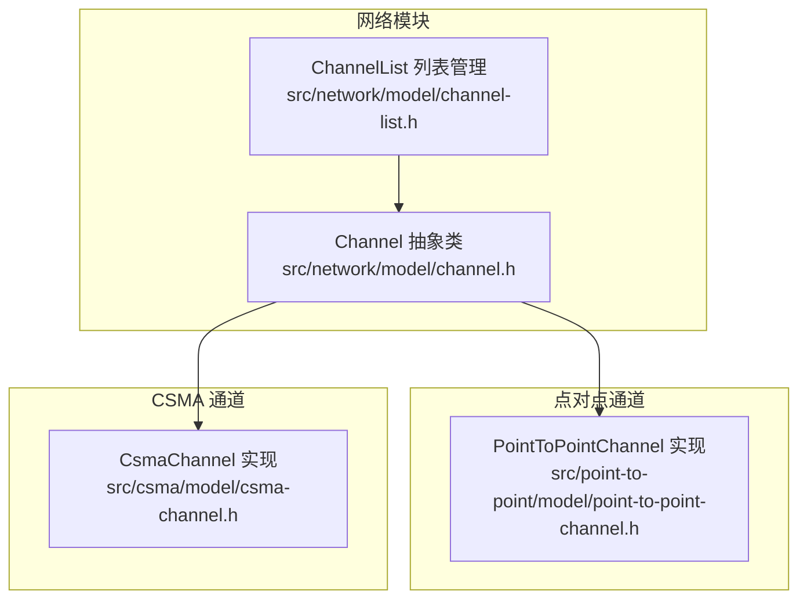
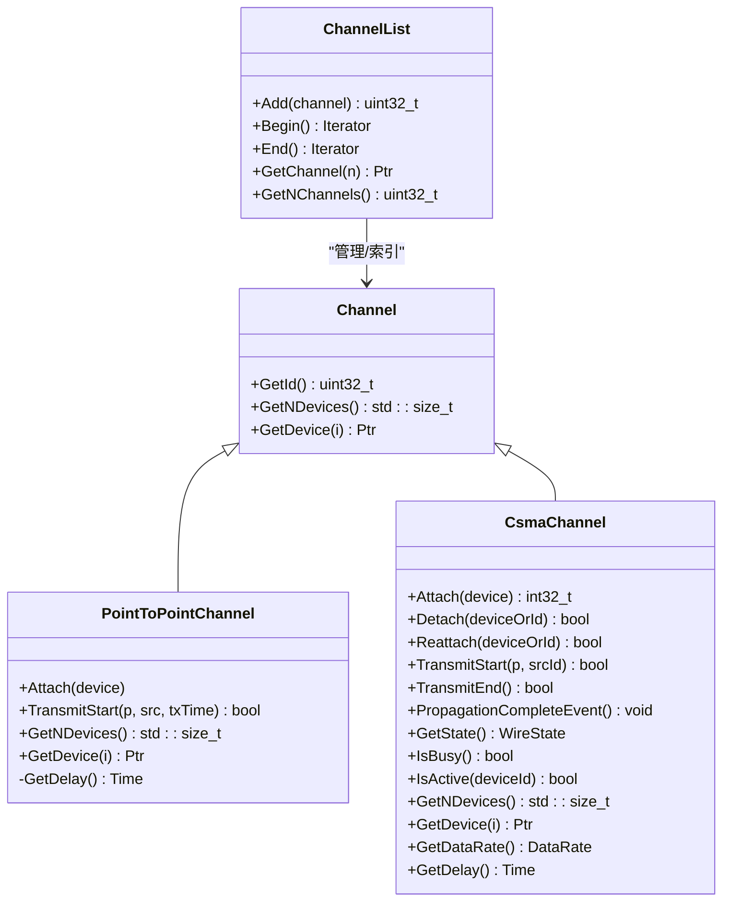
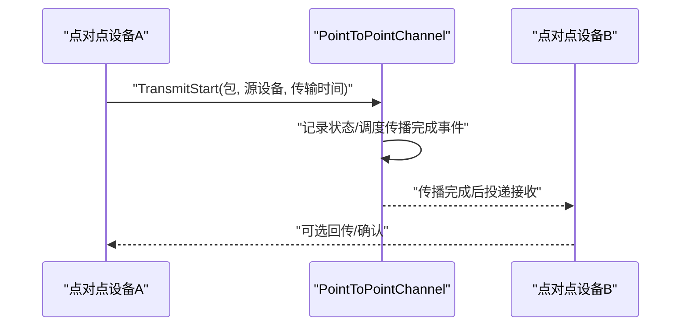
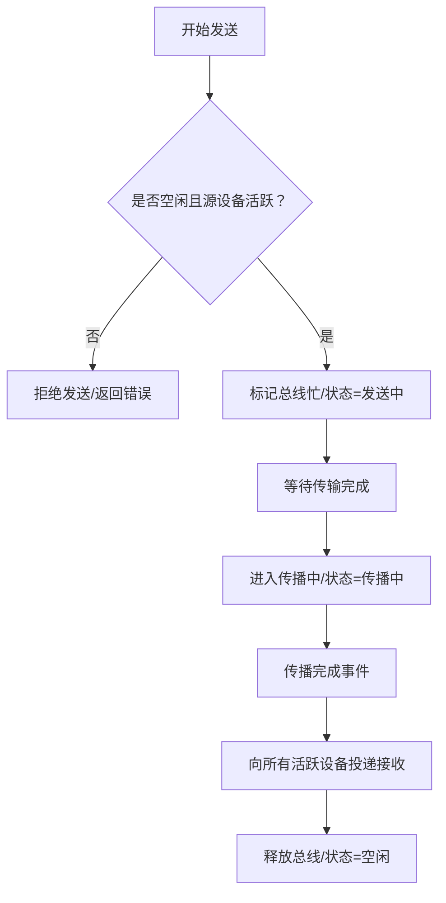
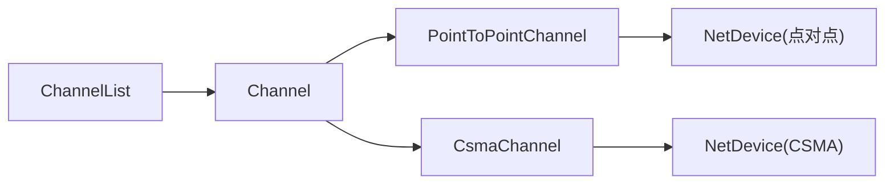

# 通道模型与连接

<cite>
**本文引用的文件**   
- [channel.h](file://src/network/model/channel.h)
- [channel-list.h](file://src/network/model/channel-list.h)
- [point-to-point-channel.h](file://src/point-to-point/model/point-to-point-channel.h)
- [csma-channel.h](file://src/csma/model/csma-channel.h)
- [tutorial-3.cc](file://examples/NPA-Course/tutorial-3.cc)
- [tutorial-4_5.cc](file://examples/NPA-Course/tutorial-4_5.cc)
- [dcn-congestion-control-simple.cc](file://examples/DCN-Course/dcn-congestion-control-simple.cc)
</cite>

## 目录
1. [引言](#引言)
2. [项目结构](#项目结构)
3. [核心组件](#核心组件)
4. [架构总览](#架构总览)
5. [详细组件分析](#详细组件分析)
6. [依赖关系分析](#依赖关系分析)
7. [性能考虑](#性能考虑)
8. [故障排查指南](#故障排查指南)
9. [结论](#结论)
10. [附录：实用示例路径](#附录实用示例路径)

## 引言
本文件系统化梳理NS-3网络层“通道（Channel）”模型，围绕抽象基类设计、设备连接管理、信号传播建模与多设备通信协调机制展开；同时详解通道列表（ChannelList）的设备管理与查找机制，并给出通道创建、设备挂载与连接建立的实用示例路径。最后对比不同通道类型（如点对点与CSMA）的特点与适用场景，并总结性能优化与故障处理策略。

## 项目结构
NS-3将通道模型置于network模块下，抽象类与通用设施位于network/model，具体通道实现分别在point-to-point与csma子模块中。通道列表作为全局容器统一管理所有已创建通道。

图示来源
- [channel.h:44-80](file://src/network/model/channel.h#L44-L80)
- [channel-list.h:38-71](file://src/network/model/channel-list.h#L38-L71)
- [point-to-point-channel.h:50-210](file://src/point-to-point/model/point-to-point-channel.h#L50-L210)
- [csma-channel.h:91-346](file://src/csma/model/csma-channel.h#L91-L346)

章节来源
- [channel.h:16-85](file://src/network/model/channel.h#L16-L85)
- [channel-list.h:18-76](file://src/network/model/channel-list.h#L18-L76)

## 核心组件
- Channel 抽象类
  - 设计目的：为所有物理/逻辑链路提供统一接口，屏蔽底层差异，向上提供设备枚举能力，向下由具体子类实现传输细节。
  - 关键职责：
    - 提供唯一ID（与ChannelList索引一致）
    - 设备数量查询与按索引获取设备指针（纯虚函数，子类必须实现）
  - 约束：子类必须通过仿真调度器的上下文调度方式正确更新事件上下文，确保时序一致性。

- ChannelList 通道列表
  - 设计目的：集中管理仿真中所有通道实例，提供添加、遍历、按索引访问与总数统计。
  - 关键接口：
    - 添加通道并返回其索引
    - 迭代器 Begin()/End()
    - 按索引获取通道 GetChannel(n)
    - 统计通道总数 GetNChannels()

章节来源
- [channel.h:30-80](file://src/network/model/channel.h#L30-L80)
- [channel-list.h:31-71](file://src/network/model/channel-list.h#L31-L71)

## 架构总览
通道体系采用“抽象基类 + 多态实现”的分层设计。上层对象（如设备）仅依赖Channel抽象接口；下层通过具体通道实现（如PointToPointChannel、CsmaChannel）完成设备挂载、状态机推进与数据包传播。

图示来源
- [channel.h:44-80](file://src/network/model/channel.h#L44-L80)
- [channel-list.h:38-71](file://src/network/model/channel-list.h#L38-L71)
- [point-to-point-channel.h:50-210](file://src/point-to-point/model/point-to-point-channel.h#L50-L210)
- [csma-channel.h:91-346](file://src/csma/model/csma-channel.h#L91-L346)

## 详细组件分析

### Channel 抽象类
- 接口规范
  - 唯一ID：用于与ChannelList索引对应，便于快速定位与调试。
  - 设备枚举：GetNDevices()与GetDevice(i)为纯虚函数，强制子类实现。
- 设计要点
  - 子类需保证事件调度的上下文正确性，避免跨节点/跨线程时序错乱。
  - 通过继承Object获得类型系统与属性机制支持。

章节来源
- [channel.h:30-80](file://src/network/model/channel.h#L30-L80)

### ChannelList 通道列表
- 职责边界
  - 自动注册：每个Channel构造时自动登记至列表，返回其索引作为ID。
  - 查询能力：支持顺序遍历、随机访问与总数统计。
- 使用建议
  - 遍历时优先使用迭代器，避免越界访问。
  - 通过GetChannel(n)与GetNChannels()进行批量操作或可视化输出。

章节来源
- [channel-list.h:31-71](file://src/network/model/channel-list.h#L31-L71)

### PointToPointChannel（点对点通道）
- 特点
  - 最大连接数为2，典型用于端到端直连链路。
  - 内置“线”状态机（空闲/发送中/传播中），传播延迟可配置。
  - 支持按索引获取设备与按索引获取点对点设备指针。
- 传播建模
  - 发送开始后根据配置的传播延迟安排接收完成事件，确保时序一致性。
- 适用场景
  - 简单拓扑、专线仿真、教学演示等。

图示来源
- [point-to-point-channel.h:72-101](file://src/point-to-point/model/point-to-point-channel.h#L72-L101)

章节来源
- [point-to-point-channel.h:34-210](file://src/point-to-point/model/point-to-point-channel.h#L34-L210)

### CsmaChannel（共享总线通道）
- 特点
  - 支持多设备挂载/分离/重挂载，内部维护设备记录列表。
  - 采用单一忙闲标志表示总线状态，传播阶段向所有活跃设备广播。
  - 提供数据速率与传播延迟参数，支持状态查询与设备数量统计。
- 传播建模
  - 发送开始：标记总线忙，进入“发送中”。
  - 发送结束：进入“传播中”，安排传播完成事件。
  - 传播完成：向所有活跃设备投递接收回调，释放总线。
- 适用场景
  - 多站点共享介质仿真、以太网类场景简化建模。

图示来源
- [csma-channel.h:177-216](file://src/csma/model/csma-channel.h#L177-L216)

章节来源
- [csma-channel.h:71-346](file://src/csma/model/csma-channel.h#L71-L346)

## 依赖关系分析
- 继承关系
  - PointToPointChannel 与 CsmaChannel 均继承自 Channel，复用统一的设备枚举接口与ID机制。
- 容器依赖
  - ChannelList 作为全局容器，持有所有Channel的智能指针，提供O(1)索引访问。
- 设备交互
  - 具体通道通过设备指针完成数据包的收发与状态同步，设备侧再通过通道回调与上层协议栈交互。

图示来源
- [channel-list.h:38-71](file://src/network/model/channel-list.h#L38-L71)
- [channel.h:44-80](file://src/network/model/channel.h#L44-L80)
- [point-to-point-channel.h:50-210](file://src/point-to-point/model/point-to-point-channel.h#L50-L210)
- [csma-channel.h:91-346](file://src/csma/model/csma-channel.h#L91-L346)

章节来源
- [channel-list.h:38-71](file://src/network/model/channel-list.h#L38-L71)
- [channel.h:44-80](file://src/network/model/channel.h#L44-L80)

## 性能考虑
- 传播延迟与带宽
  - 合理设置传播延迟与数据速率，避免过小延迟导致事件过于密集，或过大延迟造成仿真步进缓慢。
- 设备挂载策略
  - CSMA通道支持动态挂载/分离，频繁变更会增加查找与状态切换开销；应尽量减少不必要的Detach/Reattach。
- 事件调度
  - 子类必须遵循上下文调度约束，避免跨通道/跨设备的非确定性时序，降低仿真抖动。
- 并发与线程
  - 在多线程环境下，确保通道状态更新与事件调度的原子性，必要时引入锁或使用仿真线程安全接口。

## 故障排查指南
- 设备未连接
  - 现象：GetNDevices()为0或GetDevice(i)为空。
  - 排查：确认设备已调用Attach并处于活跃状态（CSMA）；点对点通道需确保双方均Attach。
- 传播无响应
  - 现象：TransmitStart返回成功但接收端未收到。
  - 排查：检查传播延迟配置、设备时钟同步、事件调度上下文；确认接收端设备处于活跃状态。
- 总线冲突误判
  - 现象：CSMA通道频繁拒绝发送。
  - 排查：检查是否已有设备正在发送；确认设备ID映射与IsActive状态；避免并发重复发送。
- 性能异常
  - 现象：仿真步进过慢或事件堆积。
  - 排查：降低传播延迟或提升带宽；合并相近时间窗口的事件；减少不必要的设备挂载/分离。

## 结论
NS-3通道模型通过抽象基类与列表管理实现了统一的设备连接与传播建模接口。PointToPointChannel适用于简单直连场景，CsmaChannel则覆盖多设备共享介质的典型行为。合理配置传播参数、遵循事件调度约束并结合动态挂载策略，可在保证仿真精度的同时提升性能与可维护性。

## 附录：实用示例路径
以下示例展示了通道创建、设备挂载与连接建立的关键步骤与常用属性设置（请参考相应文件路径以获取完整实现）：

- 点对点通道基础示例
  - [教程三：创建点对点链路与设备挂载](file://examples/NPA-Course/tutorial-3.cc)
  - [教程四（上半部分）：进一步配置与验证](file://examples/NPA-Course/tutorial-4_5.cc)

- 拥塞控制场景中的通道配置
  - [课程示例：拥塞控制与链路延迟设置](file://examples/DCN-Course/dcn-congestion-control-simple.cc)

- 属性设置参考（常见于示例）
  - 设置通道传播延迟：示例中通过SetChannelAttribute("Delay", ...)完成
  - 获取通道延迟：示例中通过GetDelay()读取当前配置

章节来源
- [tutorial-3.cc](file://examples/NPA-Course/tutorial-3.cc)
- [tutorial-4_5.cc](file://examples/NPA-Course/tutorial-4_5.cc)
- [dcn-congestion-control-simple.cc](file://examples/DCN-Course/dcn-congestion-control-simple.cc)