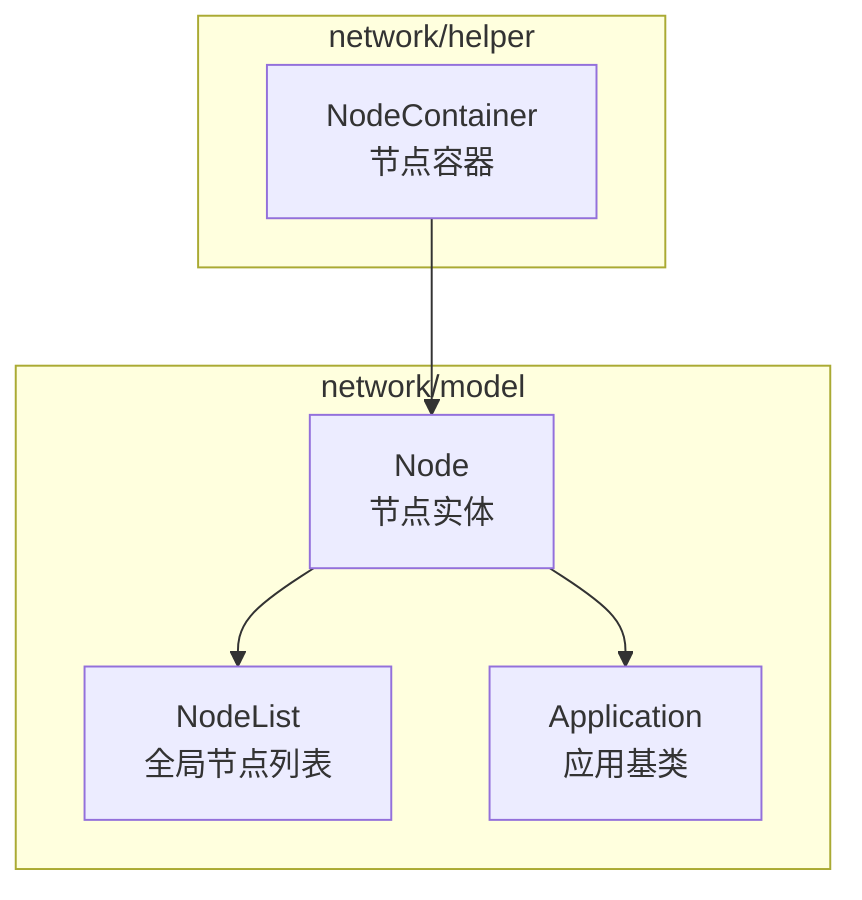
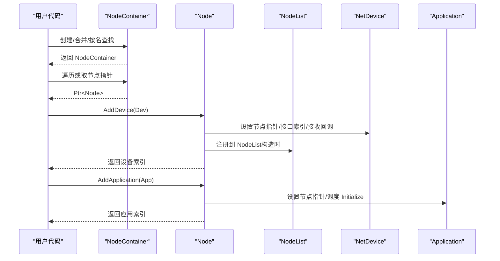
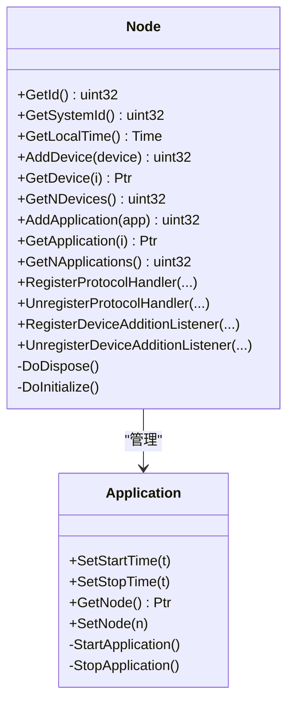
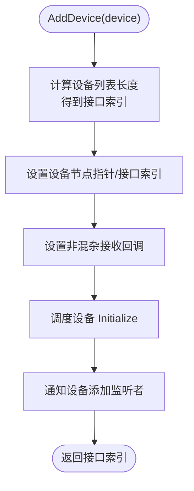
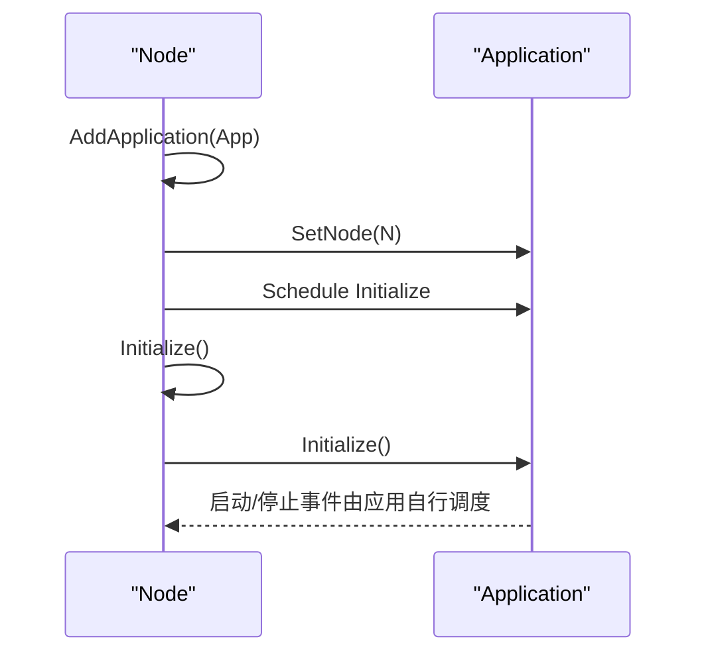
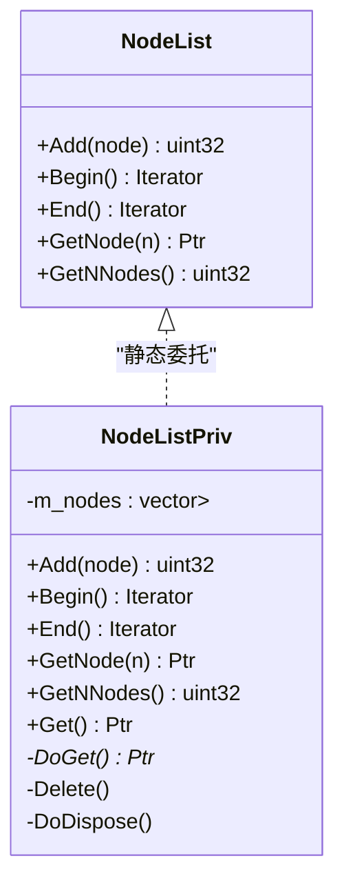
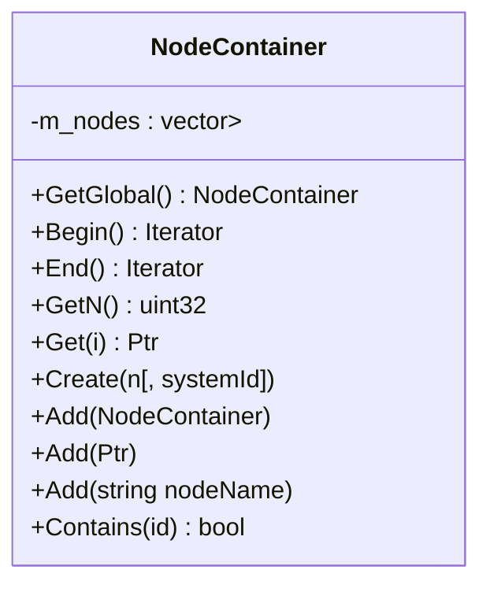
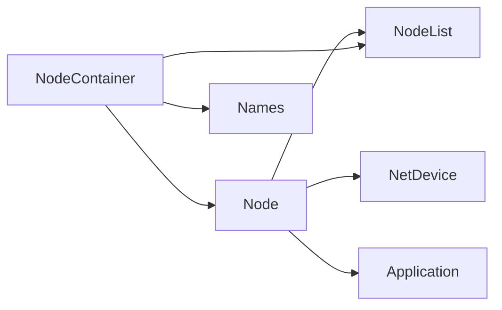

# 节点管理（Node Management）

<cite>
**本文引用的文件**
- [node.h](file://simulator/ns-3.39/src/network/model/node.h)
- [node.cc](file://simulator/ns-3.39/src/network/model/node.cc)
- [node-list.h](file://simulator/ns-3.39/src/network/model/node-list.h)
- [node-list.cc](file://simulator/ns-3.39/src/network/model/node-list.cc)
- [node-container.h](file://simulator/ns-3.39/src/network/helper/node-container.h)
- [node-container.cc](file://simulator/ns-3.39/src/network/helper/node-container.cc)
- [application.h](file://simulator/ns-3.39/src/network/model/application.h)
</cite>

## 目录
1. [简介](#简介)
2. [项目结构](#项目结构)
3. [核心组件](#核心组件)
4. [架构总览](#架构总览)
5. [组件详解](#组件详解)
6. [依赖关系分析](#依赖关系分析)
7. [性能考量](#性能考量)
8. [故障排查指南](#故障排查指南)
9. [结论](#结论)
10. [附录：常用API与用法示例路径](#附录常用api与用法示例路径)

## 简介
本文件系统化梳理 NS-3 的节点管理系统，围绕 Node 类的设计与生命周期、设备挂载机制、应用程序注册流程展开；同时详解 NodeList 全局管理器与 NodeContainer 批量容器的职责、接口与使用方式；并给出节点标识符分配策略、命名与查找机制、状态监控与资源统计、以及常见问题的诊断方法。文档面向不同层次读者，既提供高层概览，也包含代码级图示与定位到具体源码行的参考路径。

## 项目结构
NS-3 的节点管理相关实现主要分布在 network 模块的 model 与 helper 子目录中：
- model 层：Node、NodeList、Application 等核心对象定义与实现
- helper 层：NodeContainer、ApplicationContainer 等辅助容器与工具

图表来源
- [node.h:58-331](file://simulator/ns-3.39/src/network/model/node.h#L58-L331)
- [node-list.h:40-73](file://simulator/ns-3.39/src/network/model/node-list.h#L40-L73)
- [application.h:60-153](file://simulator/ns-3.39/src/network/model/application.h#L60-L153)
- [node-container.h:39-274](file://simulator/ns-3.39/src/network/helper/node-container.h#L39-L274)

章节来源
- [node.h:1-336](file://simulator/ns-3.39/src/network/model/node.h#L1-L336)
- [node-list.h:1-78](file://simulator/ns-3.39/src/network/model/node-list.h#L1-L78)
- [node-container.h:1-308](file://simulator/ns-3.39/src/network/helper/node-container.h#L1-L308)

## 核心组件
- Node：网络节点实体，维护设备列表与应用列表，负责协议处理回调注册、设备添加监听、本地时间查询等
- NodeList：全局节点管理器，提供节点注册、遍历、索引访问与数量统计
- NodeContainer：节点容器，支持批量创建、合并、按名称查找、遍历与包含性判断
- Application：应用基类，通过 Node 关联生命周期事件（初始化、启动、停止）

章节来源
- [node.h:58-331](file://simulator/ns-3.39/src/network/model/node.h#L58-L331)
- [node.cc:54-429](file://simulator/ns-3.39/src/network/model/node.cc#L54-L429)
- [node-list.h:40-73](file://simulator/ns-3.39/src/network/model/node-list.h#L40-L73)
- [node-list.cc:111-264](file://simulator/ns-3.39/src/network/model/node-list.cc#L111-L264)
- [node-container.h:39-274](file://simulator/ns-3.39/src/network/helper/node-container.h#L39-L274)
- [node-container.cc:27-136](file://simulator/ns-3.39/src/network/helper/node-container.cc#L27-L136)
- [application.h:60-153](file://simulator/ns-3.39/src/network/model/application.h#L60-L153)

## 架构总览
下图展示节点管理的关键交互：Node 在构造时自动注册到 NodeList；Node 维护设备与应用列表，并在设备添加时通知监听者；NodeContainer 提供批量节点操作入口。

图表来源
- [node.cc:104-149](file://simulator/ns-3.39/src/network/model/node.cc#L104-L149)
- [node.cc:168-177](file://simulator/ns-3.39/src/network/model/node.cc#L168-L177)
- [node-container.cc:83-99](file://simulator/ns-3.39/src/network/helper/node-container.cc#L83-L99)
- [node-list.cc:178-186](file://simulator/ns-3.39/src/network/model/node-list.cc#L178-L186)

## 组件详解

### Node 类设计与生命周期
- 设计要点
  - 继承自 Object，具备类型系统与属性反射能力
  - 内部持有设备列表与应用列表，分别通过 AddDevice/AddApplication 进行挂载
  - 协议处理回调通过 RegisterProtocolHandler/UnregisterProtocolHandler 注册
  - 设备添加监听通过 RegisterDeviceAdditionListener/UnregisterDeviceAdditionListener 管理
  - 构造时自动调用 NodeList::Add 完成注册，返回唯一节点 ID
- 生命周期
  - 构造：记录 systemId，调用 Construct 完成 NodeList 注册
  - 初始化：NodeList::Add 中调度 Node::Initialize，随后逐个初始化设备与应用
  - 销毁：DoDispose 清理监听器、处理器、设备与应用，再上抛至 Object::DoDispose

图表来源
- [node.h:58-331](file://simulator/ns-3.39/src/network/model/node.h#L58-L331)
- [application.h:60-153](file://simulator/ns-3.39/src/network/model/application.h#L60-L153)

章节来源
- [node.h:58-331](file://simulator/ns-3.39/src/network/model/node.h#L58-L331)
- [node.cc:88-135](file://simulator/ns-3.39/src/network/model/node.cc#L88-L135)
- [node.cc:204-247](file://simulator/ns-3.39/src/network/model/node.cc#L204-L247)

### 设备挂载机制
- AddDevice 流程
  - 记录当前设备列表长度为新设备分配接口索引
  - 设置设备的节点指针与接口索引
  - 为设备设置非混杂模式接收回调（指向 Node::NonPromiscReceiveFromDevice）
  - 立即调度设备 Initialize
  - 通知所有设备添加监听者
- 接收路径
  - 非混杂：从设备地址作为目标地址分发
  - 混杂：对所有设备启用回调，传入包类型与目的地址
  - 分发给匹配的协议处理器（协议号与是否混杂模式均需一致）

图表来源
- [node.cc:137-149](file://simulator/ns-3.39/src/network/model/node.cc#L137-L149)

章节来源
- [node.cc:137-149](file://simulator/ns-3.39/src/network/model/node.cc#L137-L149)
- [node.cc:250-295](file://simulator/ns-3.39/src/network/model/node.cc#L250-L295)
- [node.cc:306-369](file://simulator/ns-3.39/src/network/model/node.cc#L306-L369)

### 应用程序注册流程
- AddApplication
  - 将应用加入列表，设置其节点指针
  - 立即调度应用 Initialize
- 生命周期
  - NodeList::Add 中调度 Node::Initialize
  - Node::Initialize 依次初始化设备与应用
  - 应用可通过 SetStartTime/SetStopTime 控制自身启停事件

图表来源
- [node.cc:168-177](file://simulator/ns-3.39/src/network/model/node.cc#L168-L177)
- [node.cc:230-247](file://simulator/ns-3.39/src/network/model/node.cc#L230-L247)
- [application.h:82-95](file://simulator/ns-3.39/src/network/model/application.h#L82-L95)

章节来源
- [node.cc:168-177](file://simulator/ns-3.39/src/network/model/node.cc#L168-L177)
- [application.h:60-153](file://simulator/ns-3.39/src/network/model/application.h#L60-L153)

### NodeList 全局管理器
- 职责
  - 维护全局节点列表，提供迭代器、按索引访问、节点数量统计
  - 在 Node 构造时完成注册，返回节点 ID（即在 NodeList 中的索引）
- 实现要点
  - NodeListPriv 以根命名空间对象形式存在，仿真结束时销毁
  - NodeList::Add 在构造上下文中调度 Node::Initialize
  - NodeList::GetNode 与 NodeList::GetNNodes 提供 O(1) 访问与统计

图表来源
- [node-list.h:40-73](file://simulator/ns-3.39/src/network/model/node-list.h#L40-L73)
- [node-list.cc:40-176](file://simulator/ns-3.39/src/network/model/node-list.cc#L40-L176)
- [node-list.cc:229-264](file://simulator/ns-3.39/src/network/model/node-list.cc#L229-L264)

章节来源
- [node-list.h:40-73](file://simulator/ns-3.39/src/network/model/node-list.h#L40-L73)
- [node-list.cc:178-264](file://simulator/ns-3.39/src/network/model/node-list.cc#L178-L264)

### NodeContainer 容器与批量操作
- 功能
  - 支持直接创建指定数量节点（可带 systemId）
  - 支持按名称查找节点并加入容器
  - 支持多个容器合并、追加单个节点或节点名
  - 提供遍历、索引访问、数量统计与包含性判断
- 使用场景
  - 与设备/应用助手配合，对一组节点统一安装设备或应用
  - 获取全局节点集合进行批处理

图表来源
- [node-container.h:39-274](file://simulator/ns-3.39/src/network/helper/node-container.h#L39-L274)
- [node-container.cc:27-136](file://simulator/ns-3.39/src/network/helper/node-container.cc#L27-L136)

章节来源
- [node-container.h:39-274](file://simulator/ns-3.39/src/network/helper/node-container.h#L39-L274)
- [node-container.cc:27-136](file://simulator/ns-3.39/src/network/helper/node-container.cc#L27-L136)

### 节点标识符分配、命名规则与查找机制
- 节点 ID 分配
  - Node 构造时调用 NodeList::Add，返回当前 NodeList 大小作为新节点 ID
  - 因此节点 ID 与 NodeList 中的索引一致，且从 0 开始递增
- 命名与查找
  - NodeContainer 支持通过对象名称服务（Names）按名称查找节点并加入容器
  - NodeList 提供按索引访问接口
- 包含性判断
  - NodeContainer::Contains 可用于判断容器内是否包含某节点 ID

章节来源
- [node.cc:104-109](file://simulator/ns-3.39/src/network/model/node.cc#L104-L109)
- [node-list.cc:209-217](file://simulator/ns-3.39/src/network/model/node-list.cc#L209-L217)
- [node-container.cc:47-51](file://simulator/ns-3.39/src/network/helper/node-container.cc#L47-L51)
- [node-container.cc:123-134](file://simulator/ns-3.39/src/network/helper/node-container.cc#L123-L134)

### 节点状态监控、资源统计与故障诊断
- 状态监控
  - 通过 Application 的 Start/Stop 时间控制应用生命周期
  - 通过设备添加监听者观察设备动态
- 资源统计
  - GetNDevices()/GetNApplications() 提供数量统计
  - NodeList::GetNNodes() 提供全局节点数量
- 故障诊断
  - 接收路径断言：ReceiveFromDevice 对事件上下文进行断言，确保通道正确传递事件上下文
  - 设备/应用断言：GetDevice/GetApplication 在越界时触发断言
  - 日志：各关键路径包含日志输出，便于定位问题

章节来源
- [node.cc:151-159](file://simulator/ns-3.39/src/network/model/node.cc#L151-L159)
- [node.cc:187-195](file://simulator/ns-3.39/src/network/model/node.cc#L187-L195)
- [node.cc:345-348](file://simulator/ns-3.39/src/network/model/node.cc#L345-L348)
- [node-list.cc:212-217](file://simulator/ns-3.39/src/network/model/node-list.cc#L212-L217)

## 依赖关系分析
- Node 依赖
  - 依赖 NodeList（注册）、依赖 NetDevice（设备列表）、依赖 Application（应用列表）
- NodeList 依赖
  - 依赖 Node（存储指针），内部通过 Config 与 Simulator 协作
- NodeContainer 依赖
  - 依赖 NodeList（全局集合）、依赖 Names（按名查找）

图表来源
- [node-container.cc:21-22](file://simulator/ns-3.39/src/network/helper/node-container.cc#L21-L22)
- [node.cc:25-25](file://simulator/ns-3.39/src/network/model/node.cc#L25-L25)
- [node-list.cc:23-23](file://simulator/ns-3.39/src/network/model/node-list.cc#L23-L23)

章节来源
- [node-container.cc:21-22](file://simulator/ns-3.39/src/network/helper/node-container.cc#L21-L22)
- [node.cc:25-25](file://simulator/ns-3.39/src/network/model/node.cc#L25-L25)
- [node-list.cc:23-23](file://simulator/ns-3.39/src/network/model/node-list.cc#L23-L23)

## 性能考量
- 设备与应用初始化
  - NodeList::Add 与 Node::Initialize 均采用事件调度，避免阻塞主线程
- 列表访问
  - NodeList 与 Node 的列表均为 vector，随机访问为 O(1)，遍历线性开销
- 回调分发
  - 协议处理器列表线性扫描，建议在处理器数量较多时谨慎注册或按设备/协议过滤
- 并行与分布式
  - Node::GetSystemId 支持分布式场景下的系统 ID 标识

## 故障排查指南
- 现象：接收包时断言失败（事件上下文不匹配）
  - 可能原因：通道未正确更新事件上下文
  - 处理建议：检查通道实现，确保在事件转移时设置正确的上下文
  - 参考位置：[node.cc:345-348](file://simulator/ns-3.39/src/network/model/node.cc#L345-L348)
- 现象：访问设备或应用索引越界
  - 可能原因：索引超出设备/应用数量
  - 处理建议：先调用 GetNDevices/GetNApplications 获取上限，再访问
  - 参考位置：[node.cc:155-157](file://simulator/ns-3.39/src/network/model/node.cc#L155-L157), [node.cc:191-193](file://simulator/ns-3.39/src/network/model/node.cc#L191-L193)
- 现象：按名称查找节点失败
  - 可能原因：名称未注册或拼写错误
  - 处理建议：确认 Names::Add 的调用与名称一致性
  - 参考位置：[node-container.cc:47-51](file://simulator/ns-3.39/src/network/helper/node-container.cc#L47-L51)

章节来源
- [node.cc:345-348](file://simulator/ns-3.39/src/network/model/node.cc#L345-L348)
- [node.cc:155-157](file://simulator/ns-3.39/src/network/model/node.cc#L155-L157)
- [node.cc:191-193](file://simulator/ns-3.39/src/network/model/node.cc#L191-L193)
- [node-container.cc:47-51](file://simulator/ns-3.39/src/network/helper/node-container.cc#L47-L51)

## 结论
NS-3 的节点管理体系以 Node 为核心，借助 NodeList 提供全局注册与遍历，NodeContainer 提供批量节点操作入口。Node 通过设备与应用列表实现“网络接口 + 用户应用”的统一抽象，配合协议处理回调与设备添加监听，形成清晰的生命周期与数据通路。合理利用这些组件，可高效构建大规模网络仿真场景，并通过日志与断言快速定位问题。

## 附录：常用API与用法示例路径
- 创建节点
  - 批量创建：[node-container.cc:83-99](file://simulator/ns-3.39/src/network/helper/node-container.cc#L83-L99)
  - 按名称查找并加入容器：[node-container.cc:47-51](file://simulator/ns-3.39/src/network/helper/node-container.cc#L47-L51)
- 设备添加
  - 添加设备并获取索引：[node.cc:137-149](file://simulator/ns-3.39/src/network/model/node.cc#L137-L149)
  - 获取设备与数量：[node.cc:151-166](file://simulator/ns-3.39/src/network/model/node.cc#L151-L166)
- 应用程序绑定
  - 添加应用并获取索引：[node.cc:168-177](file://simulator/ns-3.39/src/network/model/node.cc#L168-L177)
  - 获取应用与数量：[node.cc:187-202](file://simulator/ns-3.39/src/network/model/node.cc#L187-L202)
- 协议处理回调
  - 注册/注销协议处理回调：[node.cc:250-295](file://simulator/ns-3.39/src/network/model/node.cc#L250-L295)
- 全局节点管理
  - 获取全局节点容器：[node-container.cc:27-36](file://simulator/ns-3.39/src/network/helper/node-container.cc#L27-L36)
  - 遍历与数量统计：[node-list.cc:188-207](file://simulator/ns-3.39/src/network/model/node-list.cc#L188-L207)
- 节点标识符与命名
  - 节点 ID 分配（构造时）：[node.cc:104-109](file://simulator/ns-3.39/src/network/model/node.cc#L104-L109)
  - 按名称查找节点：[node-container.cc:47-51](file://simulator/ns-3.39/src/network/helper/node-container.cc#L47-L51)
- 状态监控与资源统计
  - 设备/应用数量：[node.cc:151-166](file://simulator/ns-3.39/src/network/model/node.cc#L151-L166), [node.cc:187-202](file://simulator/ns-3.39/src/network/model/node.cc#L187-L202)
  - 全局节点数量：[node-list.cc:202-207](file://simulator/ns-3.39/src/network/model/node-list.cc#L202-L207)