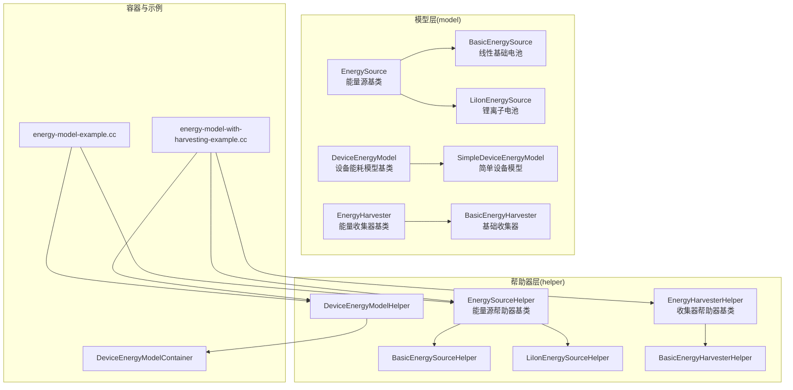
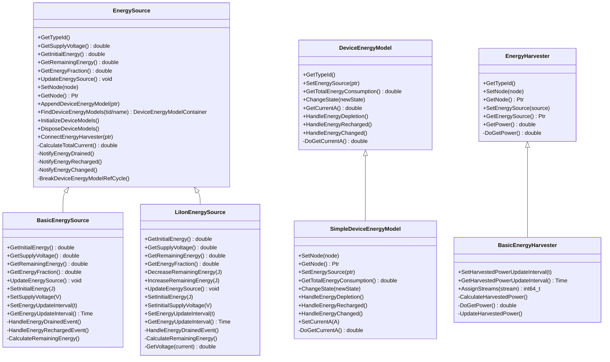
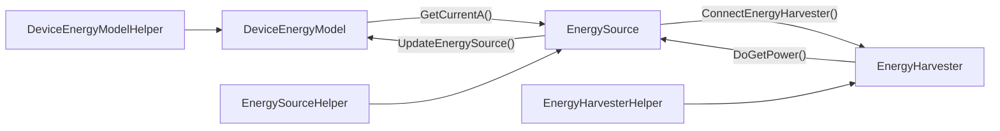
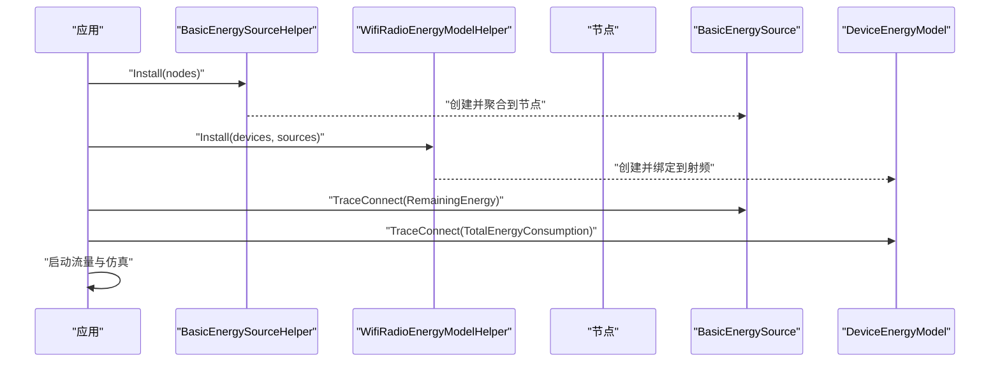
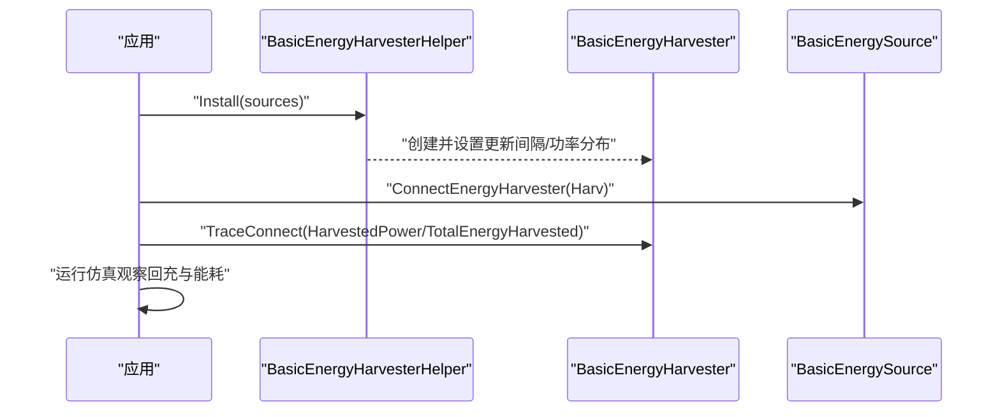

# 能量模块（Energy）

<cite>
**本文引用的文件**
- [energy-source.h](file://simulator/ns-3.39/src/energy/model/energy-source.h)
- [device-energy-model.h](file://simulator/ns-3.39/src/energy/model/device-energy-model.h)
- [li-ion-energy-source.h](file://simulator/ns-3.39/src/energy/model/li-ion-energy-source.h)
- [basic-energy-source.h](file://simulator/ns-3.39/src/energy/model/basic-energy-source.h)
- [energy-harvester.h](file://simulator/ns-3.39/src/energy/model/energy-harvester.h)
- [energy-model-helper.h](file://simulator/ns-3.39/src/energy/helper/energy-model-helper.h)
- [basic-energy-source-helper.h](file://simulator/ns-3.39/src/energy/helper/basic-energy-source-helper.h)
- [li-ion-energy-source-helper.h](file://simulator/ns-3.39/src/energy/helper/li-ion-energy-source-helper.h)
- [basic-energy-harvester.h](file://simulator/ns-3.39/src/energy/model/basic-energy-harvester.h)
- [basic-energy-harvester-helper.h](file://simulator/ns-3.39/src/energy/helper/basic-energy-harvester-helper.h)
- [device-energy-model-container.h](file://simulator/ns-3.39/src/energy/model/device-energy-model-container.h)
- [energy-model-example.cc](file://simulator/ns-3.39/examples/energy/energy-model-example.cc)
- [energy-model-with-harvesting-example.cc](file://simulator/ns-3.39/examples/energy/energy-model-with-harvesting-example.cc)
</cite>

## 目录
1. [简介](#简介)
2. [项目结构](#项目结构)
3. [核心组件](#核心组件)
4. [架构总览](#架构总览)
5. [组件详解](#组件详解)
6. [依赖关系分析](#依赖关系分析)
7. [性能与能效考量](#性能与能效考量)
8. [故障排查指南](#故障排查指南)
9. [结论](#结论)
10. [附录：使用示例与最佳实践](#附录使用示例与最佳实践)

## 简介
本文件系统化梳理 NS-3 能量模块的 API 设计与实现，覆盖能量源、设备能耗模型、能量收集器以及可再生能源收集等关键能力。重点解释：
- 电池模型（线性基础电池与非线性锂离子电池）
- 能量消耗计算与更新机制
- 能量效率优化策略（如按状态的电流建模、周期性更新）
- 可再生能源收集（光照/热能等）与智能休眠联动
- 在传感器网络、物联网设备与绿色通信场景中的应用
- 大规模无线传感器网络的能量高效仿真方法

## 项目结构
能量模块位于 NS-3 源码树的 energy 子目录，采用“模型 + 帮助器”的分层组织方式：
- model：核心抽象类与具体实现（能量源、设备能耗模型、能量收集器）
- helper：安装与配置辅助类（帮助器），用于在节点/设备上装配能量相关对象
- examples：端到端示例，演示基本能耗与带可再生收集的能耗场景

图表来源
- [energy-source.h:86-254](file://simulator/ns-3.39/src/energy/model/energy-source.h#L86-L254)
- [basic-energy-source.h:38-156](file://simulator/ns-3.39/src/energy/model/basic-energy-source.h#L38-L156)
- [li-ion-energy-source.h:74-209](file://simulator/ns-3.39/src/energy/model/li-ion-energy-source.h#L74-L209)
- [device-energy-model.h:43-122](file://simulator/ns-3.39/src/energy/model/device-energy-model.h#L43-L122)
- [simple-device-energy-model.h:38-141](file://simulator/ns-3.39/src/energy/model/simple-device-energy-model.h#L38-L141)
- [energy-harvester.h:44-131](file://simulator/ns-3.39/src/energy/model/energy-harvester.h#L44-L131)
- [basic-energy-harvester.h:49-130](file://simulator/ns-3.39/src/energy/model/basic-energy-harvester.h#L49-L130)
- [energy-model-helper.h:46-163](file://simulator/ns-3.39/src/energy/helper/energy-model-helper.h#L46-L163)
- [basic-energy-source-helper.h:35-48](file://simulator/ns-3.39/src/energy/helper/basic-energy-source-helper.h#L35-L48)
- [li-ion-energy-source-helper.h:37-50](file://simulator/ns-3.39/src/energy/helper/li-ion-energy-source-helper.h#L37-L50)
- [basic-energy-harvester-helper.h:36-49](file://simulator/ns-3.39/src/energy/helper/basic-energy-harvester-helper.h#L36-L49)
- [device-energy-model-container.h:44-174](file://simulator/ns-3.39/src/energy/model/device-energy-model-container.h#L44-L174)
- [energy-model-example.cc:229-243](file://simulator/ns-3.39/examples/energy/energy-model-example.cc#L229-L243)
- [energy-model-with-harvesting-example.cc:277-302](file://simulator/ns-3.39/examples/energy/energy-model-with-harvesting-example.cc#L277-L302)

章节来源
- [energy-source.h:36-254](file://simulator/ns-3.39/src/energy/model/energy-source.h#L36-L254)
- [energy-model-helper.h:46-163](file://simulator/ns-3.39/src/energy/helper/energy-model-helper.h#L46-L163)

## 核心组件
- 能量源基类（EnergySource）：统一管理剩余能量、通知设备能耗模型、连接能量收集器；提供直接（焦耳）与间接（安培电流）两种更新接口。
- 线性基础电池（BasicEnergySource）：线性耗电模型，按总电流×电压×时间更新剩余能量，支持低/高阈值触发“耗尽/回充”事件。
- 锂离子电池（LiIonEnergySource）：考虑非线性放电曲线与端电压随 SOC 和电流变化，更贴近真实电池行为。
- 设备能耗模型基类（DeviceEnergyModel）：基于状态机，通过 ChangeState 与 GetCurrentA 提供电流信息；处理“耗尽/回充/变更”回调。
- 能量收集器基类（EnergyHarvester）：向能量源注入功率，周期性更新可收集功率，支持随机变量建模。
- 基础收集器（BasicEnergyHarvester）：以随机变量生成每周期可收集功率，累计总收集能量。
- 容器与帮助器：DeviceEnergyModelContainer、EnergySourceHelper、DeviceEnergyModelHelper、EnergyHarvesterHelper 等，负责批量安装与配置。

章节来源
- [energy-source.h:86-254](file://simulator/ns-3.39/src/energy/model/energy-source.h#L86-L254)
- [basic-energy-source.h:38-156](file://simulator/ns-3.39/src/energy/model/basic-energy-source.h#L38-L156)
- [li-ion-energy-source.h:74-209](file://simulator/ns-3.39/src/energy/model/li-ion-energy-source.h#L74-L209)
- [device-energy-model.h:43-122](file://simulator/ns-3.39/src/energy/model/device-energy-model.h#L43-L122)
- [energy-harvester.h:44-131](file://simulator/ns-3.39/src/energy/model/energy-harvester.h#L44-L131)
- [basic-energy-harvester.h:49-130](file://simulator/ns-3.39/src/energy/model/basic-energy-harvester.h#L49-L130)
- [device-energy-model-container.h:44-174](file://simulator/ns-3.39/src/energy/model/device-energy-model-container.h#L44-L174)
- [energy-model-helper.h:46-163](file://simulator/ns-3.39/src/energy/helper/energy-model-helper.h#L46-L163)

## 架构总览
能量模块遵循“节点内聚合 + 设备外挂”的设计：能量源与设备能耗模型分别在节点层面进行生命周期管理，而设备能耗模型不直接聚合到节点，需通过能量源容器访问。

图表来源
- [energy-source.h:86-254](file://simulator/ns-3.39/src/energy/model/energy-source.h#L86-L254)
- [basic-energy-source.h:38-156](file://simulator/ns-3.39/src/energy/model/basic-energy-source.h#L38-L156)
- [li-ion-energy-source.h:74-209](file://simulator/ns-3.39/src/energy/model/li-ion-energy-source.h#L74-L209)
- [device-energy-model.h:43-122](file://simulator/ns-3.39/src/energy/model/device-energy-model.h#L43-L122)
- [simple-device-energy-model.h:38-141](file://simulator/ns-3.39/src/energy/model/simple-device-energy-model.h#L38-L141)
- [energy-harvester.h:44-131](file://simulator/ns-3.39/src/energy/model/energy-harvester.h#L44-L131)
- [basic-energy-harvester.h:49-130](file://simulator/ns-3.39/src/energy/model/basic-energy-harvester.h#L49-L130)

## 组件详解

### 能量源（EnergySource）
- 职责：维护剩余能量、记录初始容量、计算能量占比；汇总各设备模型电流，周期性更新；在耗尽/回充时通知设备模型。
- 接口要点：
  - 直接更新：DecreaseRemainingEnergy、IncreaseRemainingEnergy（焦耳）
  - 间接更新：UpdateEnergySource（由设备模型调用，内部汇总电流）
  - 查询：GetSupplyVoltage、GetInitialEnergy、GetRemainingEnergy、GetEnergyFraction
  - 连接：ConnectEnergyHarvester、AppendDeviceEnergyModel、FindDeviceEnergyModels
- 生命周期：SetNode/GetNode；InitializeDeviceModels/DisposeDeviceModels；DoDispose 中断开设备模型引用循环。

章节来源
- [energy-source.h:86-254](file://simulator/ns-3.39/src/energy/model/energy-source.h#L86-L254)

### 线性基础电池（BasicEnergySource）
- 特点：线性耗电模型，按 I×V×Δt 更新剩余能量；支持低/高阈值触发“耗尽/回充”事件；可配置更新间隔。
- 关键参数：初始能量、供电电压、低/高阈值、更新事件与时间戳。
- 行为：在每次 UpdateEnergySource 中计算总电流，按公式 ΔE = I_total × V × Δt 扣减剩余能量；当低于低阈值触发耗尽事件，高于高阈值触发回充事件。

章节来源
- [basic-energy-source.h:38-156](file://simulator/ns-3.39/src/energy/model/basic-energy-source.h#L38-L156)

### 锂离子电池（LiIonEnergySource）
- 特点：考虑非线性放电曲线与端电压随 SOC 与电流变化；通过多项参数拟合不同区域的电压特性；当端电压低于阈值判定耗尽。
- 关键参数：额定电压、标称电压、指数区电压、额定容量、标称容量、指数容量、内阻、典型电流、最小阈值电压等。
- 行为：UpdateEnergySource 计算总电流，结合电压模型得到实际端电压；按 ΔE = I×V×Δt 扣减能量；耗尽/回充事件通知设备模型。

章节来源
- [li-ion-energy-source.h:74-209](file://simulator/ns-3.39/src/energy/model/li-ion-energy-source.h#L74-L209)

### 设备能耗模型（DeviceEnergyModel）
- 特点：基于状态机，设备通过 ChangeState 通知模型状态切换；GetCurrentA 返回当前状态电流；处理耗尽/回充/变更事件。
- 实现建议：若已知各状态电流，重写 DoGetCurrentA；否则默认返回 0A，由能量源间接更新（通过总电流）。

章节来源
- [device-energy-model.h:43-122](file://simulator/ns-3.39/src/energy/model/device-energy-model.h#L43-L122)

### 简单设备模型（SimpleDeviceEnergyModel）
- 用途：便于测试与验证，允许用户直接设置固定电流。
- 关键点：SetCurrentA 设置电流；DoGetCurrentA 返回该电流；记录总能耗并可被跟踪。

章节来源
- [simple-device-energy-model.h:38-141](file://simulator/ns-3.39/src/energy/model/simple-device-energy-model.h#L38-L141)

### 能量收集器（EnergyHarvester）
- 职责：周期性产生功率注入能量源；DoGetPower 由能量源调用以获取当前功率。
- 随机性：可通过随机变量流生成每周期可收集功率；支持 AssignStreams 以复现实验。

章节来源
- [energy-harvester.h:44-131](file://simulator/ns-3.39/src/energy/model/energy-harvester.h#L44-L131)

### 基础收集器（BasicEnergyHarvester）
- 特点：以随机变量生成每周期可收集功率；累计总收集能量；可配置更新间隔。
- 参数：可收集功率分布（如均匀分布）、更新间隔、流编号。

章节来源
- [basic-energy-harvester.h:49-130](file://simulator/ns-3.39/src/energy/model/basic-energy-harvester.h#L49-L130)

### 容器与帮助器
- DeviceEnergyModelContainer：封装设备能耗模型指针集合，支持迭代、查找与拼接。
- EnergySourceHelper/DeviceEnergyModelHelper/EnergyHarvesterHelper：安装与配置工具，支持批量在节点或设备上装配能量相关对象，并设置属性。

章节来源
- [device-energy-model-container.h:44-174](file://simulator/ns-3.39/src/energy/model/device-energy-model-container.h#L44-L174)
- [energy-model-helper.h:46-163](file://simulator/ns-3.39/src/energy/helper/energy-model-helper.h#L46-L163)
- [basic-energy-source-helper.h:35-48](file://simulator/ns-3.39/src/energy/helper/basic-energy-source-helper.h#L35-L48)
- [li-ion-energy-source-helper.h:37-50](file://simulator/ns-3.39/src/energy/helper/li-ion-energy-source-helper.h#L37-L50)
- [basic-energy-harvester-helper.h:36-49](file://simulator/ns-3.39/src/energy/helper/basic-energy-harvester-helper.h#L36-L49)

## 依赖关系分析
- 组件耦合：
  - EnergySource 与 DeviceEnergyModel：通过 UpdateEnergySource/GetCurrentA 协作；设备模型不聚合到节点，需经能量源容器访问。
  - EnergySource 与 EnergyHarvester：通过 ConnectEnergyHarvester 建立连接，收集器提供功率注入。
  - 帮助器与模型：帮助器负责实例化与属性设置，最终在节点/设备上装配模型。
- 外部依赖：
  - 时间与事件系统（EventId、Time）用于周期性更新。
  - 随机变量流（RandomVariableStream）用于可再生收集的不确定性。
  - 追踪值（TracedValue）用于输出剩余能量、总能耗、总收集能量等。

图表来源
- [energy-source.h:125-130](file://simulator/ns-3.39/src/energy/model/energy-source.h#L125-L130)
- [device-energy-model.h:89-92](file://simulator/ns-3.39/src/energy/model/device-energy-model.h#L89-L92)
- [energy-harvester.h:95-114](file://simulator/ns-3.39/src/energy/model/energy-harvester.h#L95-L114)
- [energy-model-helper.h:46-163](file://simulator/ns-3.39/src/energy/helper/energy-model-helper.h#L46-L163)

## 性能与能效考量
- 更新频率与精度
  - 能源源更新间隔越短，能量变化越平滑但仿真开销越大。建议根据应用场景权衡（如传感器网络可适当增大间隔）。
- 电流建模与状态切换
  - 对于已知各状态电流的设备，重写 DoGetCurrentA 可减少间接计算误差；对于未知电流的设备，使用 UpdateEnergySource 的总电流汇总方式亦可。
- 锂离子电池非线性建模
  - LiIon 模型更贴近真实电池行为，适合对端电压敏感的应用（如水下/无人机等）；线性模型更适合快速仿真与对比。
- 可再生收集与负载匹配
  - 收集器功率应与负载需求相匹配，避免频繁“耗尽—回充”抖动；可通过调整随机变量分布与更新间隔优化稳定性。
- 智能休眠与状态迁移
  - 将设备进入低功耗状态作为状态切换的一种，配合能耗模型与收集器，可在保证服务等级的前提下降低能耗。
- 大规模网络仿真
  - 使用容器与帮助器批量安装模型，避免逐节点手工装配；合理设置更新事件与追踪回调，减少不必要的日志输出。

## 故障排查指南
- 常见问题
  - 设备模型未聚合到节点导致无法访问：确保通过 EnergySource 容器访问设备模型，或使用帮助器正确安装。
  - 能量耗尽后无响应：检查设备模型是否实现 HandleEnergyDepletion；确认能量源的耗尽/回充阈值设置。
  - 收集器未生效：确认已调用 ConnectEnergyHarvester 并设置正确的更新间隔与可收集功率分布。
  - 电流为 0A 导致能量不变化：若使用间接更新，请确保设备模型正确返回 GetCurrentA 或在状态切换中触发 ChangeState。
- 调试建议
  - 启用相关日志组件（如 EnergySource、DeviceEnergyModel、WifiRadioEnergyModel 等）观察事件与状态变化。
  - 使用追踪回调输出剩余能量、总能耗、总收集能量，定位异常波动。

章节来源
- [energy-source.h:167-179](file://simulator/ns-3.39/src/energy/model/energy-source.h#L167-L179)
- [device-energy-model.h:97-110](file://simulator/ns-3.39/src/energy/model/device-energy-model.h#L97-L110)
- [energy-harvester.h:78-87](file://simulator/ns-3.39/src/energy/model/energy-harvester.h#L78-L87)

## 结论
NS-3 能量模块通过清晰的抽象层次与灵活的帮助器体系，提供了从基础线性电池到非线性锂离子电池、从简单电流模型到可再生收集的完整能力。结合状态机与周期性更新机制，既能满足传感器网络与物联网的低功耗需求，也能支撑绿色通信与大规模无线网络的能效优化仿真。

## 附录：使用示例与最佳实践

### 示例一：基础能耗模型（WiFi 无线链路）
- 步骤概览
  - 创建两个节点与无线设备，配置 WiFi 标准与 MAC/PHY。
  - 安装 BasicEnergySource 并设置初始能量。
  - 安装设备能耗模型（如 WiFi 射频模型）并绑定到设备。
  - 连接追踪回调输出剩余能量与总能耗。
  - 启动流量并运行仿真，观察能耗与寿命。

图表来源
- [energy-model-example.cc:229-243](file://simulator/ns-3.39/examples/energy/energy-model-example.cc#L229-L243)
- [energy-model-helper.h:65-88](file://simulator/ns-3.39/src/energy/helper/energy-model-helper.h#L65-L88)

章节来源
- [energy-model-example.cc:134-306](file://simulator/ns-3.39/examples/energy/energy-model-example.cc#L134-L306)

### 示例二：带可再生收集的能耗模型
- 步骤概览
  - 在示例一基础上，增加 BasicEnergyHarvester 并设置周期性更新与可收集功率分布。
  - 将收集器连接到能量源，观察回充效果与总能耗变化。
  - 通过追踪回调输出收集功率与总收集能量。

图表来源
- [energy-model-with-harvesting-example.cc:293-302](file://simulator/ns-3.39/examples/energy/energy-model-with-harvesting-example.cc#L293-L302)
- [basic-energy-harvester-helper.h:36-49](file://simulator/ns-3.39/src/energy/helper/basic-energy-harvester-helper.h#L36-L49)
- [energy-harvester.h:78-87](file://simulator/ns-3.39/src/energy/model/energy-harvester.h#L78-L87)

章节来源
- [energy-model-with-harvesting-example.cc:189-371](file://simulator/ns-3.39/examples/energy/energy-model-with-harvesting-example.cc#L189-L371)

### 最佳实践清单
- 明确电池类型选择：真实度优先选 LiIon，速度优先选 Basic。
- 状态机设计：为设备定义明确的状态与电流，提升仿真精度。
- 更新策略：根据业务 SLA 调整更新间隔，避免过度追踪。
- 收集器建模：合理设置随机变量与更新周期，使收集与负载平衡。
- 规模化部署：使用帮助器与容器批量安装，统一配置与追踪。
- 能效优化：结合智能休眠与状态迁移，在保证性能前提下降低能耗。