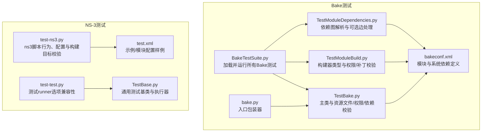
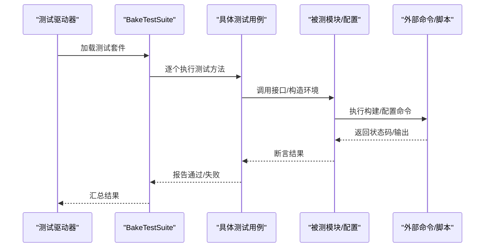
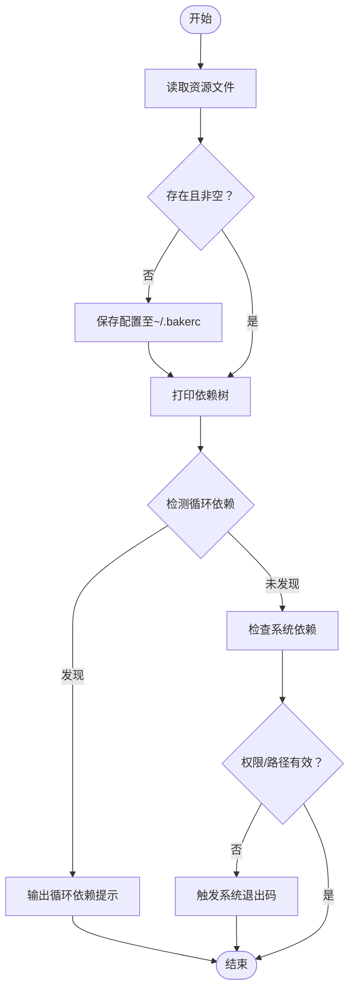
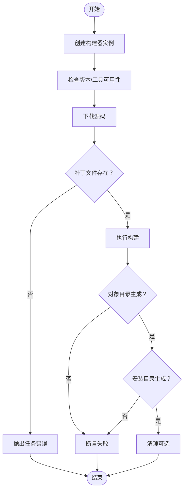
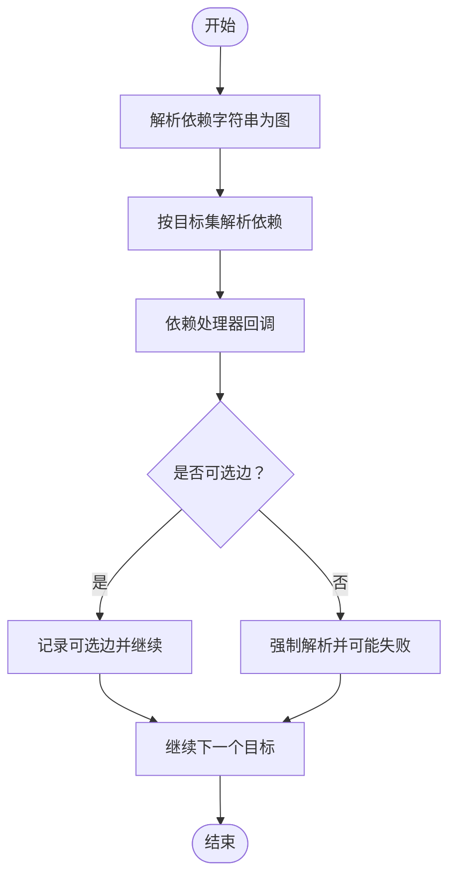
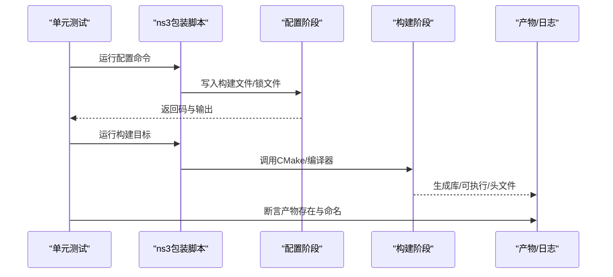
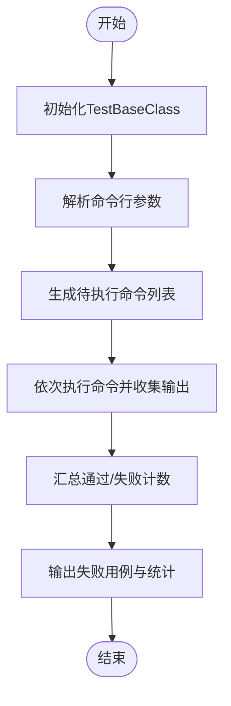
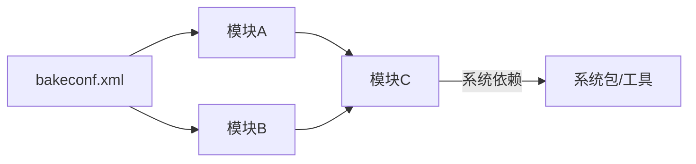

# 测试与验证

<cite>
**本文引用的文件**
- [BakeTestSuite.py](file://simulator/bake/test/BakeTestSuite.py)
- [TestBake.py](file://simulator/bake/test/TestBake.py)
- [TestModuleBuild.py](file://simulator/bake/test/TestModuleBuild.py)
- [TestModuleDependencies.py](file://simulator/bake/test/TestModuleDependencies.py)
- [bakeconf.xml](file://simulator/bake/bakeconf.xml)
- [bake.py](file://simulator/bake/bake.py)
- [test.xml](file://simulator/bake/test/test.xml)
- [TestBase.py](file://simulator/ns-3.39/utils/tests/TestBase.py)
- [test-test.py](file://simulator/ns-3.39/utils/tests/test-test.py)
- [test-ns3.py](file://simulator/ns-3.39/utils/tests/test-ns3.py)
</cite>

## 目录
1. [引言](#引言)
2. [项目结构](#项目结构)
3. [核心组件](#核心组件)
4. [架构总览](#架构总览)
5. [详细组件分析](#详细组件分析)
6. [依赖分析](#依赖分析)
7. [性能考虑](#性能考虑)
8. [故障排查指南](#故障排查指南)
9. [结论](#结论)
10. [附录](#附录)

## 引言
本指南面向在数据中心平台场景下对NS-3进行高质量测试与验证的工程团队，系统化阐述单元测试框架、测试用例设计、回归测试方法与验证方法学（实验设计、结果分析、统计检验、文献对比），并给出测试自动化、持续集成与质量保证的实践方案。文档以仓库中的Bake构建工具测试与NS-3测试套件为依据，结合实际可执行流程，帮助读者建立从模块到系统的端到端质量保障体系。

## 项目结构
本仓库包含两套测试与验证体系：
- Bake构建工具测试：覆盖主类、模块源、环境、依赖解析等关键路径，确保构建链路稳定可靠。
- NS-3测试套件：覆盖ns-3包装脚本行为、构建配置、示例与测试启用、风格检查、未使用源码检测等，保障核心仿真内核与模块生态的质量。

**图表来源**
- [BakeTestSuite.py:1-45](file://simulator/bake/test/BakeTestSuite.py#L1-L45)
- [TestBake.py:1-560](file://simulator/bake/test/TestBake.py#L1-L560)
- [TestModuleBuild.py:1-200](file://simulator/bake/test/TestModuleBuild.py#L1-L200)
- [TestModuleDependencies.py:1-172](file://simulator/bake/test/TestModuleDependencies.py#L1-L172)
- [bakeconf.xml:1-2737](file://simulator/bake/bakeconf.xml#L1-L2737)
- [bake.py:1-57](file://simulator/bake/bake.py#L1-L57)
- [test-ns3.py:1-800](file://simulator/ns-3.39/utils/tests/test-ns3.py#L1-L800)
- [test-test.py:1-121](file://simulator/ns-3.39/utils/tests/test-test.py#L1-L121)
- [TestBase.py:1-147](file://simulator/ns-3.39/utils/tests/TestBase.py#L1-L147)
- [test.xml:1-228](file://simulator/bake/test/test.xml#L1-L228)

**章节来源**
- [BakeTestSuite.py:1-45](file://simulator/bake/test/BakeTestSuite.py#L1-L45)
- [bakeconf.xml:1-2737](file://simulator/bake/bakeconf.xml#L1-L2737)
- [test-ns3.py:1-800](file://simulator/ns-3.39/utils/tests/test-ns3.py#L1-L800)

## 核心组件
- 单元测试框架与运行器
  - Bake测试通过统一入口聚合多个测试子模块，按顺序执行，便于回归与持续集成。
  - NS-3测试采用通用基类封装命令执行、输出收集与失败统计，支持多种报告格式与并行控制。
- 主要被测对象
  - Bake主类：资源文件读写、配置文件检查、源码与构建版本检查、依赖树打印与系统依赖提示。
  - 模块构建器：不同构建类型（如waf、python、make）的可用性、补丁应用、权限与清理能力。
  - 依赖解析：有向边与可选边的依赖图解析，循环依赖检测与错误传播。
  - NS-3包装脚本：配置、构建目标、构建后产物一致性、示例与测试启用开关、风格检查等。
- 配置与依赖声明
  - bakeconf.xml集中声明模块来源、构建方式、依赖关系与系统依赖项，是测试与构建的权威参考。
  - test.xml提供示例配置，展示如何组合模块与构建参数。

**章节来源**
- [BakeTestSuite.py:1-45](file://simulator/bake/test/BakeTestSuite.py#L1-L45)
- [TestBake.py:1-560](file://simulator/bake/test/TestBake.py#L1-L560)
- [TestModuleBuild.py:1-200](file://simulator/bake/test/TestModuleBuild.py#L1-L200)
- [TestModuleDependencies.py:1-172](file://simulator/bake/test/TestModuleDependencies.py#L1-L172)
- [bakeconf.xml:1-2737](file://simulator/bake/bakeconf.xml#L1-L2737)
- [test.xml:1-228](file://simulator/bake/test/test.xml#L1-L228)
- [TestBase.py:1-147](file://simulator/ns-3.39/utils/tests/TestBase.py#L1-L147)
- [test-test.py:1-121](file://simulator/ns-3.39/utils/tests/test-test.py#L1-L121)
- [test-ns3.py:1-800](file://simulator/ns-3.39/utils/tests/test-ns3.py#L1-L800)

## 架构总览
下图展示了测试与验证的整体交互：测试驱动器加载测试用例，调用被测模块接口，断言返回值或副作用；同时通过配置文件与外部命令（如ns3脚本、cmake）完成端到端验证。

**图表来源**
- [BakeTestSuite.py:1-45](file://simulator/bake/test/BakeTestSuite.py#L1-L45)
- [TestBake.py:1-560](file://simulator/bake/test/TestBake.py#L1-L560)
- [bake.py:1-57](file://simulator/bake/bake.py#L1-L57)
- [test-ns3.py:1-800](file://simulator/ns-3.39/utils/tests/test-ns3.py#L1-L800)

## 详细组件分析

### 组件A：Bake主类与资源/权限/依赖校验
- 设计要点
  - 资源文件读取与保存：覆盖默认配置、用户家目录配置文件移动与回滚，断言存在性与内容片段。
  - 权限与路径：对源码目录设置不可读权限，触发系统退出码；删除源码目录触发异常路径。
  - 依赖树与系统依赖：递归打印依赖树，检测自环与多层环，输出循环依赖提示；系统依赖缺失时抛出退出异常。
- 关键断言
  - 配置文件名检查：在不同重命名策略下返回预期文件名。
  - 系统返回值：下载/构建阶段的返回码与错误信息断言。
- 复杂度与风险
  - 依赖树遍历复杂度受模块数量与依赖深度影响；权限与路径异常需确保清理逻辑完备，避免残留污染后续测试。

**图表来源**
- [TestBake.py:1-560](file://simulator/bake/test/TestBake.py#L1-L560)

**章节来源**
- [TestBake.py:1-560](file://simulator/bake/test/TestBake.py#L1-L560)

### 组件B：模块构建器类型与补丁/权限校验
- 设计要点
  - 构建器类型：验证不同构建类型（如waf、python）的可用性与属性管理。
  - 补丁机制：存在性校验与不存在时的异常传播；补丁路径变更后的行为。
  - 权限与清理：目标目录不可写时触发任务错误；构建产物目录存在性断言。
- 关键断言
  - 构建器实例化与名称匹配。
  - 补丁文件不存在时的异常类型与错误信息。
  - 构建产物对象目录与安装目录均生成。

**图表来源**
- [TestModuleBuild.py:1-200](file://simulator/bake/test/TestModuleBuild.py#L1-L200)

**章节来源**
- [TestModuleBuild.py:1-200](file://simulator/bake/test/TestModuleBuild.py#L1-L200)

### 组件C：依赖解析与可选边处理
- 设计要点
  - 语法解析：支持“依赖”与“可选依赖”的语义，允许在处理过程中动态注入新边。
  - 解析器：将字符串描述转换为依赖图，记录可选边集合。
  - 处理器：根据目标集解析依赖序列，遇到失败目标时返回False并终止该分支。
- 关键断言
  - 单一目标与多目标解析顺序的一致性。
  - 可选依赖在上游失败时跳过解析。
  - 必需依赖缺失时抛出依赖未满足异常。

**图表来源**
- [TestModuleDependencies.py:1-172](file://simulator/bake/test/TestModuleDependencies.py#L1-L172)

**章节来源**
- [TestModuleDependencies.py:1-172](file://simulator/bake/test/TestModuleDependencies.py#L1-L172)

### 组件D：NS-3包装脚本与构建配置校验
- 设计要点
  - 命令执行：封装ns3脚本调用，支持生成器选择、环境变量传递、标准流捕获。
  - 配置与构建：检查不同构建配置（debug/release/optimized）与开关（启用/禁用tests/examples），断言目标产物命名后缀。
  - 产物与头文件：扫描库与头文件列表，断言构建产物存在性。
  - 风格与静态检查：调用cmake-format目标，比对仓库差异，确保CMake格式一致。
- 关键断言
  - 配置阶段输出包含期望的构建配置摘要。
  - 构建目标成功并产出命名符合预期的库文件。
  - 启用/禁用开关改变可执行程序与测试目标集合。

**图表来源**
- [test-ns3.py:1-800](file://simulator/ns-3.39/utils/tests/test-ns3.py#L1-L800)

**章节来源**
- [test-ns3.py:1-800](file://simulator/ns-3.39/utils/tests/test-ns3.py#L1-L800)

### 组件E：测试runner选项兼容性与通用基类
- 设计要点
  - 选项覆盖：通过命令行参数组合覆盖默认行为，验证runner在不同模式下的健壮性。
  - 通用基类：封装工作目录切换、环境变量注入、输出文件与静默模式、命令列表执行与失败统计。
- 关键断言
  - 不同选项组合下命令执行成功或按预期失败。
  - 输出文件包含详细结果，失败用例列表可定位。

**图表来源**
- [TestBase.py:1-147](file://simulator/ns-3.39/utils/tests/TestBase.py#L1-L147)
- [test-test.py:1-121](file://simulator/ns-3.39/utils/tests/test-test.py#L1-L121)

**章节来源**
- [TestBase.py:1-147](file://simulator/ns-3.39/utils/tests/TestBase.py#L1-L147)
- [test-test.py:1-121](file://simulator/ns-3.39/utils/tests/test-test.py#L1-L121)

## 依赖分析
- 模块间依赖
  - bakeconf.xml集中声明模块来源、构建类型与依赖关系，测试用例通过该配置驱动真实构建流程，确保依赖链正确。
  - 示例配置test.xml展示如何组合模块与构建参数，便于复现实验场景。
- 外部依赖
  - NS-3测试依赖ns3包装脚本、CMake生成器、构建工具链与系统依赖（如cmake-format、git等）。
- 循环依赖检测
  - 通过依赖解析器与依赖树打印，自动识别自环或多层环，并输出明确提示，避免构建死循环。

**图表来源**
- [bakeconf.xml:1-2737](file://simulator/bake/bakeconf.xml#L1-L2737)
- [test.xml:1-228](file://simulator/bake/test/test.xml#L1-L228)

**章节来源**
- [bakeconf.xml:1-2737](file://simulator/bake/bakeconf.xml#L1-L2737)
- [test.xml:1-228](file://simulator/bake/test/test.xml#L1-L228)

## 性能考虑
- 并行与资源利用
  - NS-3测试中根据CPU核心数计算并行线程数，减少等待时间；建议在CI中固定并行度以获得稳定结果。
- 构建缓存与增量构建
  - 在本地开发中优先使用增量构建与缓存，缩短迭代周期；在CI中开启缓存策略以提升吞吐。
- 日志与输出
  - 使用静默模式仅输出错误，减少I/O开销；在失败时再切换到详细模式定位问题。

## 故障排查指南
- 构建失败
  - 检查系统依赖是否满足（bakeconf.xml中声明的系统依赖项），必要时安装对应包。
  - 若出现权限问题，确认源码目录与构建目录的读写权限，清理后重试。
- 依赖解析异常
  - 对照依赖图，检查是否存在自环或多层环；修正配置后重新解析。
- NS-3配置/构建异常
  - 确认ns3脚本已正确配置并生成构建文件；检查构建目标命名与后缀是否符合预期。
  - 如启用/禁用开关无效，检查锁文件与生成器参数是否一致。
- 输出与报告
  - 使用TestBase基类的输出文件定位失败用例；在CI中保留详细日志以便回溯。

**章节来源**
- [TestBake.py:1-560](file://simulator/bake/test/TestBake.py#L1-L560)
- [TestModuleBuild.py:1-200](file://simulator/bake/test/TestModuleBuild.py#L1-L200)
- [TestModuleDependencies.py:1-172](file://simulator/bake/test/TestModuleDependencies.py#L1-L172)
- [test-ns3.py:1-800](file://simulator/ns-3.39/utils/tests/test-ns3.py#L1-L800)
- [TestBase.py:1-147](file://simulator/ns-3.39/utils/tests/TestBase.py#L1-L147)

## 结论
通过Bake与NS-3双轨测试体系，可以系统化地覆盖构建链路、模块依赖、配置开关与产物一致性等关键质量维度。结合自动化与持续集成，能够实现快速反馈与回归保障。建议在实际工程中：
- 将测试用例纳入CI流水线，按模块粒度分批执行；
- 以配置文件为单一事实来源，确保测试与构建一致性；
- 建立失败用例追踪与根因分析机制，持续优化测试矩阵与覆盖率。

## 附录
- 实验设计与验证方法学
  - 实验设计：对照不同构建配置（debug/release/optimized）、启用/禁用tests/examples，记录构建时长与产物大小。
  - 结果分析：比较不同环境与工具链下的构建稳定性与产物一致性。
  - 统计检验：对多次运行的时延与内存占用进行描述性统计与显著性检验。
  - 文献对比：与既有基准测试或论文设定保持一致的输入与评估指标，确保可比性。
- 测试自动化与持续集成
  - CI阶段：配置文件校验、依赖解析、最小化构建与核心测试、风格检查。
  - 回归测试：每日全量回归与PR触发的快速回归相结合。
  - 质量门禁：失败即阻断，失败率阈值与覆盖率阈值作为准入条件。