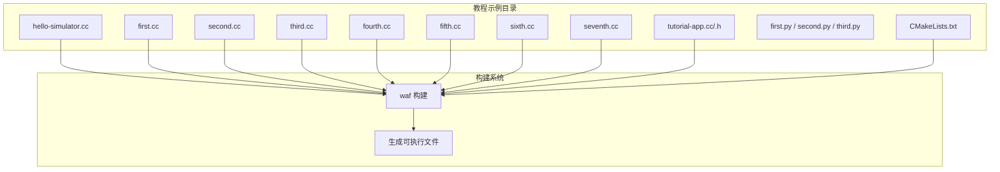
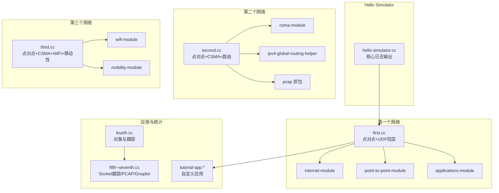
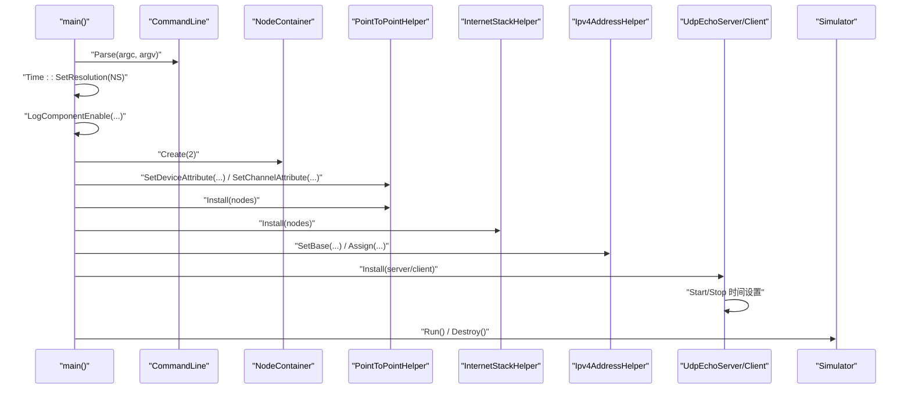
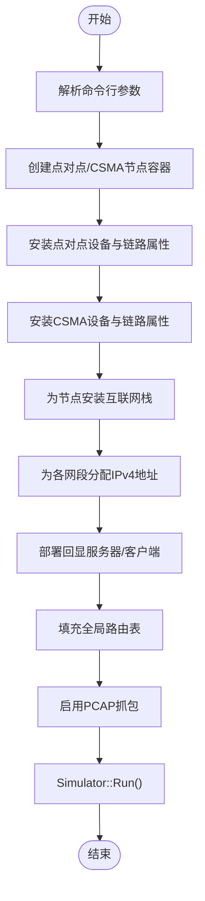
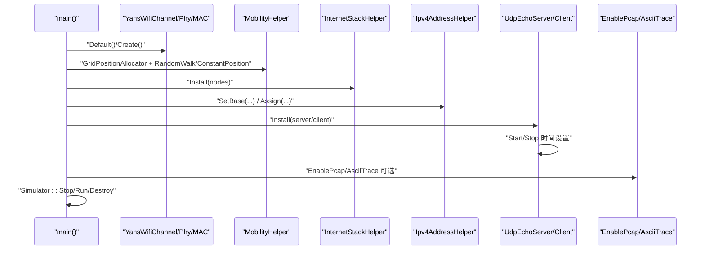
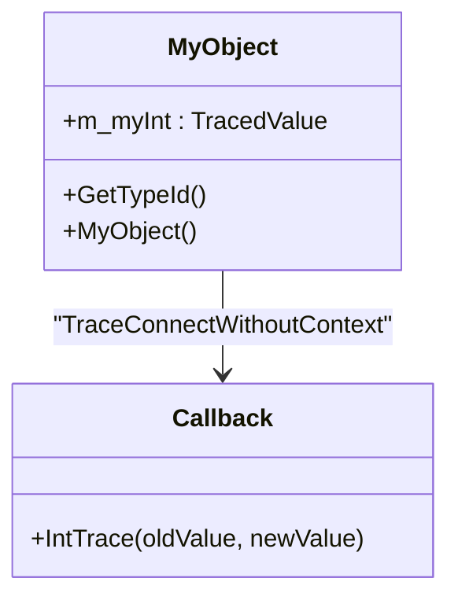
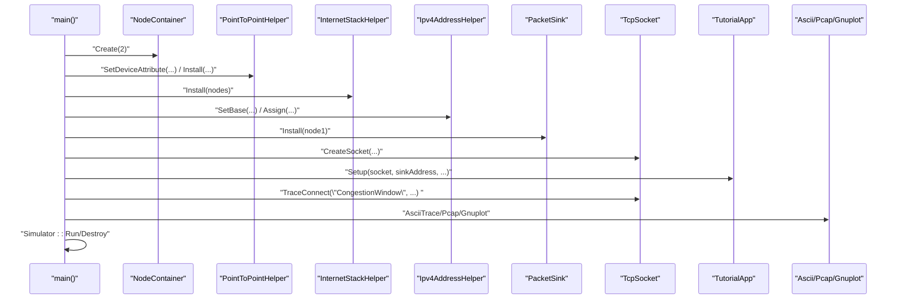
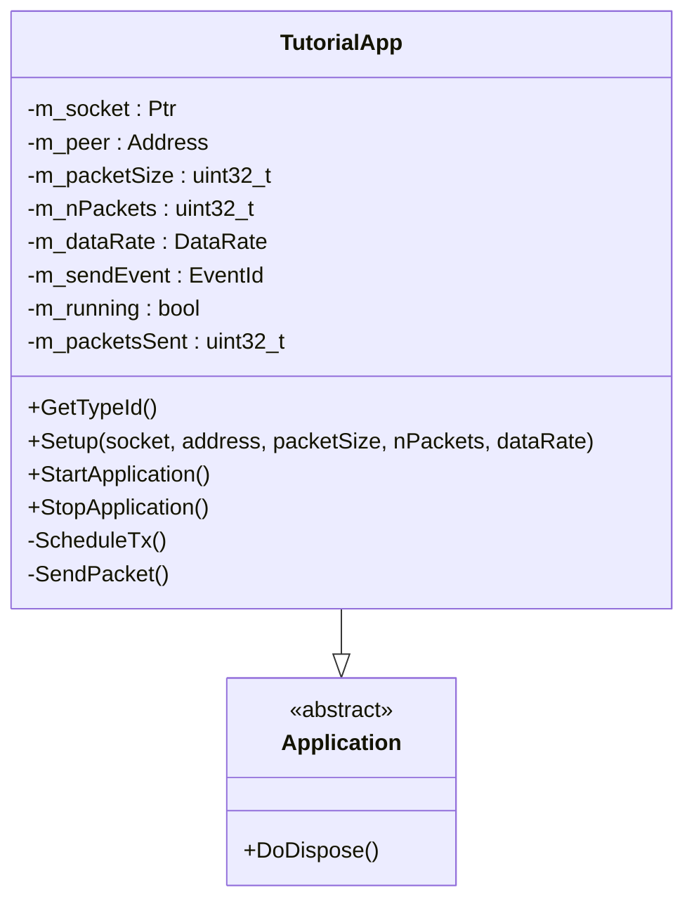
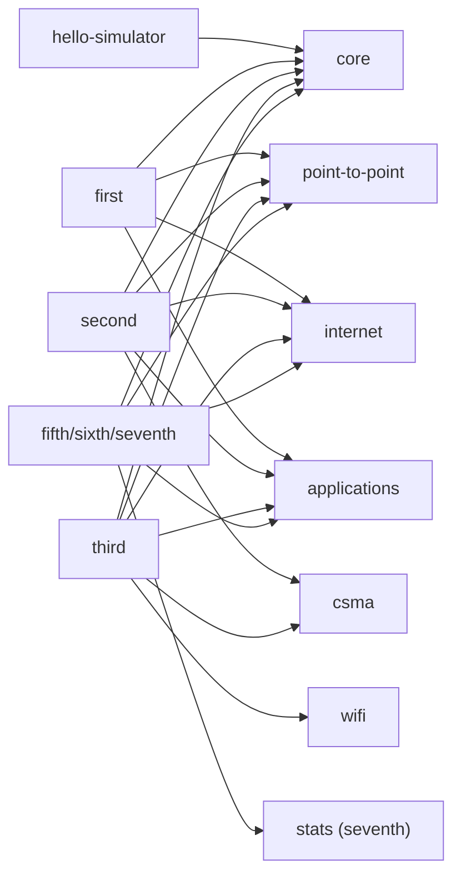

# 基础教程

<cite>
**本文引用的文件**   
- [hello-simulator.cc](file://simulator/ns-3.39/examples/tutorial/hello-simulator.cc)
- [first.cc](file://simulator/ns-3.39/examples/tutorial/first.cc)
- [second.cc](file://simulator/ns-3.39/examples/tutorial/second.cc)
- [third.cc](file://simulator/ns-3.39/examples/tutorial/third.cc)
- [fourth.cc](file://simulator/ns-3.39/examples/tutorial/fourth.cc)
- [fifth.cc](file://simulator/ns-3.39/examples/tutorial/fifth.cc)
- [sixth.cc](file://simulator/ns-3.39/examples/tutorial/sixth.cc)
- [seventh.cc](file://simulator/ns-3.39/examples/tutorial/seventh.cc)
- [tutorial-app.cc](file://simulator/ns-3.39/examples/tutorial/tutorial-app.cc)
- [tutorial-app.h](file://simulator/ns-3.39/examples/tutorial/tutorial-app.h)
- [first.py](file://simulator/ns-3.39/examples/tutorial/first.py)
- [second.py](file://simulator/ns-3.39/examples/tutorial/second.py)
- [third.py](file://simulator/ns-3.39/examples/tutorial/third.py)
- [CMakeLists.txt](file://simulator/ns-3.39/examples/tutorial/CMakeLists.txt)
</cite>

## 目录
1. [引言](#引言)
2. [项目结构](#项目结构)
3. [核心组件](#核心组件)
4. [架构总览](#架构总览)
5. [详细组件分析](#详细组件分析)
6. [依赖关系分析](#依赖关系分析)
7. [性能考虑](#性能考虑)
8. [故障排查指南](#故障排查指南)
9. [结论](#结论)
10. [附录](#附录)

## 引言
本教程面向初学者，系统讲解NS-3离散事件网络仿真器的基础使用方法。从“Hello Simulator”开始，逐步深入到第一个网络、第二个网络、第三个网络等经典示例，覆盖节点创建、设备配置、应用程序部署、路由与地址分配、仿真运行与销毁、数据采集与可视化等关键流程。同时给出参数配置说明、结果分析方法以及常见问题的解决方案，帮助读者建立对NS-3整体工作方式的理解。

## 项目结构
NS-3教程示例位于 examples/tutorial 目录中，包含多个循序渐进的示例程序，配套有CMake构建规则与Python脚本版本，便于对比学习。

**图示来源**
- [CMakeLists.txt:1-79](file://simulator/ns-3.39/examples/tutorial/CMakeLists.txt#L1-L79)

**章节来源**
- [CMakeLists.txt:1-79](file://simulator/ns-3.39/examples/tutorial/CMakeLists.txt#L1-L79)

## 核心组件
- 模拟器内核与日志：通过核心模块设置时间分辨率、启用组件日志，保证输出可读性与调试能力。
- 节点与容器：使用节点容器统一管理节点集合，支持批量创建与组合。
- 设备与链路：点对点与CSMA链路分别演示全双工链路与共享介质场景；WiFi示例引入无线PHY与MAC。
- 网络栈与地址：为节点安装互联网栈并进行IPv4/IPv6地址分配。
- 应用层：回显服务器/客户端、自定义应用（基于Socket）与流量源。
- 路由与抓包：全局路由表填充、PCAP抓包与ASCII跟踪。
- 统计与绘图：Gnuplot与文件聚合辅助结果分析。

**章节来源**
- [hello-simulator.cc:20-27](file://simulator/ns-3.39/examples/tutorial/hello-simulator.cc#L20-L27)
- [first.cc:36-41](file://simulator/ns-3.39/examples/tutorial/first.cc#L36-L41)
- [first.cc:43-59](file://simulator/ns-3.39/examples/tutorial/first.cc#L43-L59)
- [second.cc:39-54](file://simulator/ns-3.39/examples/tutorial/second.cc#L39-L54)
- [second.cc:56-88](file://simulator/ns-3.39/examples/tutorial/second.cc#L56-L88)
- [third.cc:44-71](file://simulator/ns-3.39/examples/tutorial/third.cc#L44-L71)
- [third.cc:98-113](file://simulator/ns-3.39/examples/tutorial/third.cc#L98-L113)
- [fifth.cc:105-124](file://simulator/ns-3.39/examples/tutorial/fifth.cc#L105-L124)
- [sixth.cc:99-118](file://simulator/ns-3.39/examples/tutorial/sixth.cc#L99-L118)
- [seventh.cc:106-147](file://simulator/ns-3.39/examples/tutorial/seventh.cc#L106-L147)

## 架构总览
下图展示了从“Hello Simulator”到“第三个网络”的演进路径，以及各示例涉及的关键模块与交互关系。

**图示来源**
- [hello-simulator.cc:20-27](file://simulator/ns-3.39/examples/tutorial/hello-simulator.cc#L20-L27)
- [first.cc:16-21](file://simulator/ns-3.39/examples/tutorial/first.cc#L16-L21)
- [second.cc:16-22](file://simulator/ns-3.39/examples/tutorial/second.cc#L16-L22)
- [third.cc:16-24](file://simulator/ns-3.39/examples/tutorial/third.cc#L16-L24)
- [tutorial-app.cc:16-21](file://simulator/ns-3.39/examples/tutorial/tutorial-app.cc#L16-L21)
- [fourth.cc:26-54](file://simulator/ns-3.39/examples/tutorial/fourth.cc#L26-L54)
- [fifth.cc:16-22](file://simulator/ns-3.39/examples/tutorial/fifth.cc#L16-L22)
- [sixth.cc:16-22](file://simulator/ns-3.39/examples/tutorial/sixth.cc#L16-L22)
- [seventh.cc:16-23](file://simulator/ns-3.39/examples/tutorial/seventh.cc#L16-L23)

## 详细组件分析

### Hello Simulator（入门）
- 目标：展示最简NS-3程序结构与日志输出。
- 关键点：包含核心模块头文件，定义日志组件，主函数直接输出信息并返回。
- 学习要点：理解命令行解析、日志级别控制与基本入口。

**章节来源**
- [hello-simulator.cc:16-27](file://simulator/ns-3.39/examples/tutorial/hello-simulator.cc#L16-L27)

### 第一个网络（点对点+UDP回显）
- 目标：创建两节点点对点链路，部署UDP回显服务与客户端，验证连通性。
- 关键步骤：
  - 解析命令行参数，设置时间分辨率与日志级别。
  - 创建节点容器并安装点对点设备与链路属性。
  - 安装互联网栈，分配IPv4地址。
  - 部署回显服务器与客户端应用，设置启动/停止时间。
  - 运行仿真并销毁。
- 参数与配置：
  - 数据率、链路延迟、最大包数、发送间隔、包大小。
- 结果分析：通过日志观察往返时延、吞吐量与丢包情况。

**图示来源**
- [first.cc:36-78](file://simulator/ns-3.39/examples/tutorial/first.cc#L36-L78)

**章节来源**
- [first.cc:36-78](file://simulator/ns-3.39/examples/tutorial/first.cc#L36-L78)

### 第二个网络（点对点+CSMA+路由）
- 目标：在点对点链路一端扩展CSMA局域网，演示多段拓扑与全局路由。
- 关键步骤：
  - 定义点对点与CSMA节点容器，分别安装设备与链路属性。
  - 分别安装互联网栈并对不同网段分配地址。
  - 部署回显服务器/客户端于CSMA侧，点对点一侧发起请求。
  - 填充全局路由表，启用PCAP抓包。
- 参数与配置：
  - CSMA数据率与延迟、节点数量、日志开关、抓包选项。
- 结果分析：结合PCAP与日志，观察跨段转发路径与队列行为。

**图示来源**
- [second.cc:39-112](file://simulator/ns-3.39/examples/tutorial/second.cc#L39-L112)

**章节来源**
- [second.cc:39-112](file://simulator/ns-3.39/examples/tutorial/second.cc#L39-L112)

### 第三个网络（点对点+CSMA+WiFi+移动性）
- 目标：在CSMA网段上接入无线STA与AP，引入移动模型，形成混合拓扑。
- 关键步骤：
  - 配置Yans WiFi通道与PHY，设置SSID与MAC类型。
  - 使用网格位置分配器与随机游走/固定位置移动模型。
  - 为所有节点安装互联网栈并分配地址。
  - 部署回显服务器/客户端，填充路由表，可选启用跟踪。
- 参数与配置：
  - WiFi MAC类型、SSID、网格布局参数、移动边界与模型。
- 结果分析：观察无线链路切换、吞吐变化与移动对路径的影响。

**图示来源**
- [third.cc:98-137](file://simulator/ns-3.39/examples/tutorial/third.cc#L98-L137)

**章节来源**
- [third.cc:98-137](file://simulator/ns-3.39/examples/tutorial/third.cc#L98-L137)

### 对象跟踪与回调（第四示例）
- 目标：演示如何在NS-3对象上注册跟踪源并连接回调，用于记录状态变化。
- 关键点：定义派生自Object的类，添加TracedValue类型的跟踪源，运行时连接回调。

**图示来源**
- [fourth.cc:29-54](file://simulator/ns-3.39/examples/tutorial/fourth.cc#L29-L54)

**章节来源**
- [fourth.cc:29-54](file://simulator/ns-3.39/examples/tutorial/fourth.cc#L29-L54)

### 自定义应用与Socket跟踪（第五/六/七示例）
- 目标：通过自定义应用与Socket跟踪，观测TCP拥塞窗口变化、丢包事件，并导出PCAP与ASCII数据。
- 关键步骤：
  - 配置默认TCP算法、初始拥塞窗口与恢复机制。
  - 在接收端安装数据包接收器，在发送端创建Socket并绑定跟踪。
  - 可选启用错误模型模拟丢包，或使用Gnuplot/FileHelper进行统计输出。
- 输出与分析：
  - ASCII文件记录拥塞窗口随时间变化。
  - PCAP文件记录物理层丢包事件。
  - Gnuplot图表展示字节计数等统计指标。

**图示来源**
- [fifth.cc:105-147](file://simulator/ns-3.39/examples/tutorial/fifth.cc#L105-L147)
- [sixth.cc:128-144](file://simulator/ns-3.39/examples/tutorial/sixth.cc#L128-L144)
- [seventh.cc:154-204](file://simulator/ns-3.39/examples/tutorial/seventh.cc#L154-L204)

**章节来源**
- [fifth.cc:105-147](file://simulator/ns-3.39/examples/tutorial/fifth.cc#L105-L147)
- [sixth.cc:128-144](file://simulator/ns-3.39/examples/tutorial/sixth.cc#L128-L144)
- [seventh.cc:154-204](file://simulator/ns-3.39/examples/tutorial/seventh.cc#L154-L204)

### 自定义应用类（TutorialApp）
- 目标：作为发送端应用的骨架，封装Socket初始化、连接、定时发送与停止逻辑。
- 关键接口：
  - Setup：配置Socket、目的地址、包大小、包数与速率。
  - StartApplication/StopApplication：生命周期管理。
  - ScheduleTx/SendPacket：基于事件调度的周期性发送。

**图示来源**
- [tutorial-app.h:31-74](file://simulator/ns-3.39/examples/tutorial/tutorial-app.h#L31-L74)
- [tutorial-app.cc:50-110](file://simulator/ns-3.39/examples/tutorial/tutorial-app.cc#L50-L110)

**章节来源**
- [tutorial-app.h:31-74](file://simulator/ns-3.39/examples/tutorial/tutorial-app.h#L31-L74)
- [tutorial-app.cc:50-110](file://simulator/ns-3.39/examples/tutorial/tutorial-app.cc#L50-L110)

## 依赖关系分析
- 示例程序通过CMakeLists.txt声明所需库，体现模块化依赖：
  - hello-simulator：仅核心模块。
  - first：核心、点对点、互联网、应用。
  - second：核心、点对点、CSMA、互联网、应用。
  - third：核心、点对点、CSMA、WiFi、互联网、应用。
  - fifth/sixth/seventh：核心、点对点、互联网、应用、统计（视示例而定）。
- Python脚本版本与C++版本功能一一对应，便于对比学习。

**图示来源**
- [CMakeLists.txt:1-79](file://simulator/ns-3.39/examples/tutorial/CMakeLists.txt#L1-L79)

**章节来源**
- [CMakeLists.txt:1-79](file://simulator/ns-3.39/examples/tutorial/CMakeLists.txt#L1-L79)

## 性能考虑
- 时间分辨率：建议在复杂场景前设置更高精度的时间单位，提升事件排序准确性。
- 日志级别：仅在调试阶段开启详细日志，避免影响仿真速度。
- 地址与路由：合理划分子网，减少路由计算开销；全局路由表仅在需要时填充。
- 抓包与跟踪：仅在必要时启用PCAP与ASCII跟踪，降低I/O开销。
- 应用速率：根据链路带宽与延迟设定合理的发送速率，避免过载导致队列积压。
- 移动性：无线移动模型会增加仿真开销，应按需选择模型与采样频率。

## 故障排查指南
- 无法找到可执行文件
  - 确认已正确配置与构建：先执行配置脚本，再执行构建命令。
  - 检查CMakeLists中库依赖是否齐全。
- 无日志输出
  - 检查日志组件名称与级别是否匹配。
  - 确保在main中调用了命令行解析与日志启用。
- 回显失败或不通
  - 核对IP地址与掩码分配是否在同一网段。
  - 确认应用启动/停止时间不冲突且覆盖完整。
  - 对于多网段场景，确认路由表已填充。
- WiFi节点无法关联
  - 检查SSID一致性和MAC类型设置。
  - 控制STA数量不超过网格布局限制。
- 跟踪文件为空
  - 确认跟踪启用条件满足（如tracing开关）。
  - 检查数据链路类型与接口索引是否正确。

**章节来源**
- [first.cc:36-41](file://simulator/ns-3.39/examples/tutorial/first.cc#L36-L41)
- [second.cc:105-108](file://simulator/ns-3.39/examples/tutorial/second.cc#L105-L108)
- [third.cc:60-65](file://simulator/ns-3.39/examples/tutorial/third.cc#L60-L65)
- [third.cc:177-183](file://simulator/ns-3.39/examples/tutorial/third.cc#L177-L183)

## 结论
通过本系列教程，读者可以掌握NS-3仿真的基本流程：从简单的日志输出，到点对点、CSMA与WiFi混合拓扑的搭建，再到应用部署、跟踪与统计分析。建议在理解每个示例的基础上，尝试修改参数、替换应用或添加新的跟踪项，以加深对离散事件仿真与网络行为建模的理解。

## 附录
- Python脚本版本
  - first.py、second.py、third.py 提供与C++示例等价的功能，便于对比与迁移。
- 常用命令
  - 配置：执行配置脚本后进行构建。
  - 运行：在构建产物目录中运行相应示例可执行文件。
- 参考路径
  - 各示例文件与头文件路径见“本文引用的文件”。

**章节来源**
- [first.py:25-64](file://simulator/ns-3.39/examples/tutorial/first.py#L25-L64)
- [second.py:38-95](file://simulator/ns-3.39/examples/tutorial/second.py#L38-L95)
- [third.py:54-149](file://simulator/ns-3.39/examples/tutorial/third.py#L54-L149)