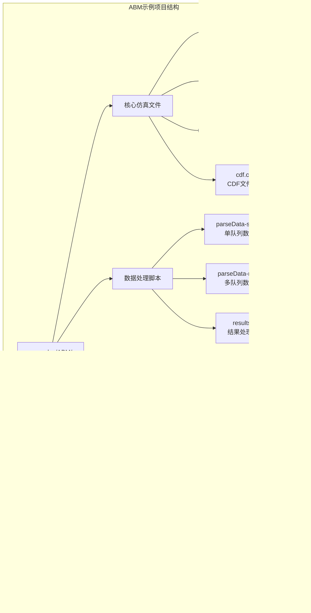
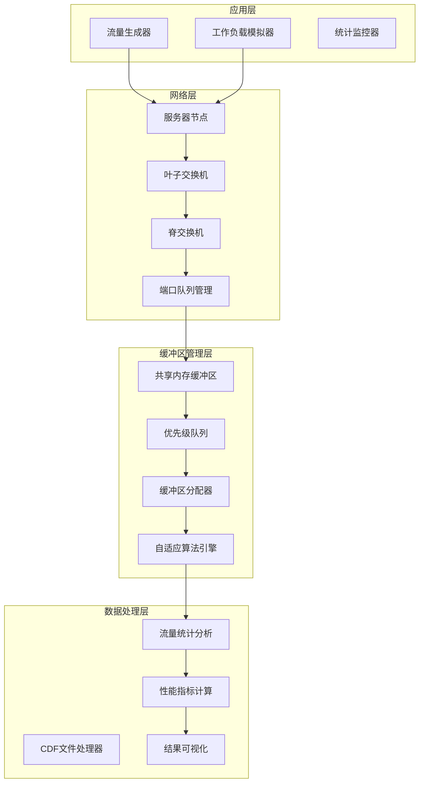
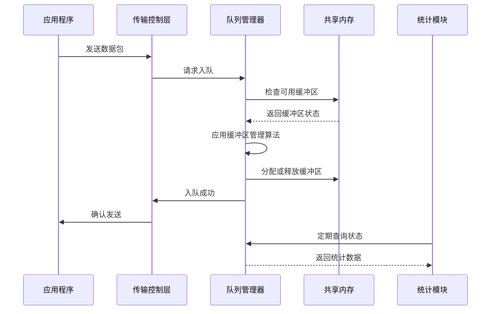
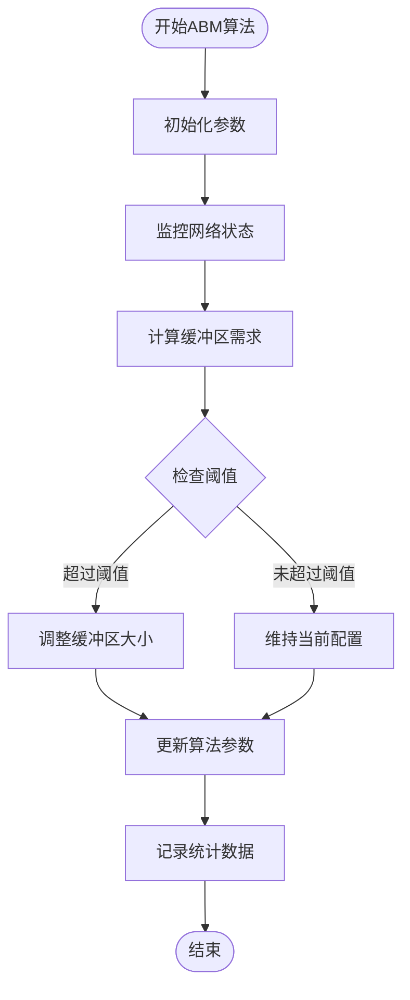
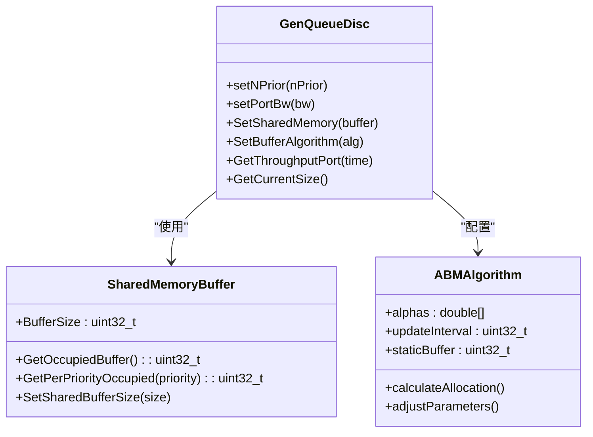
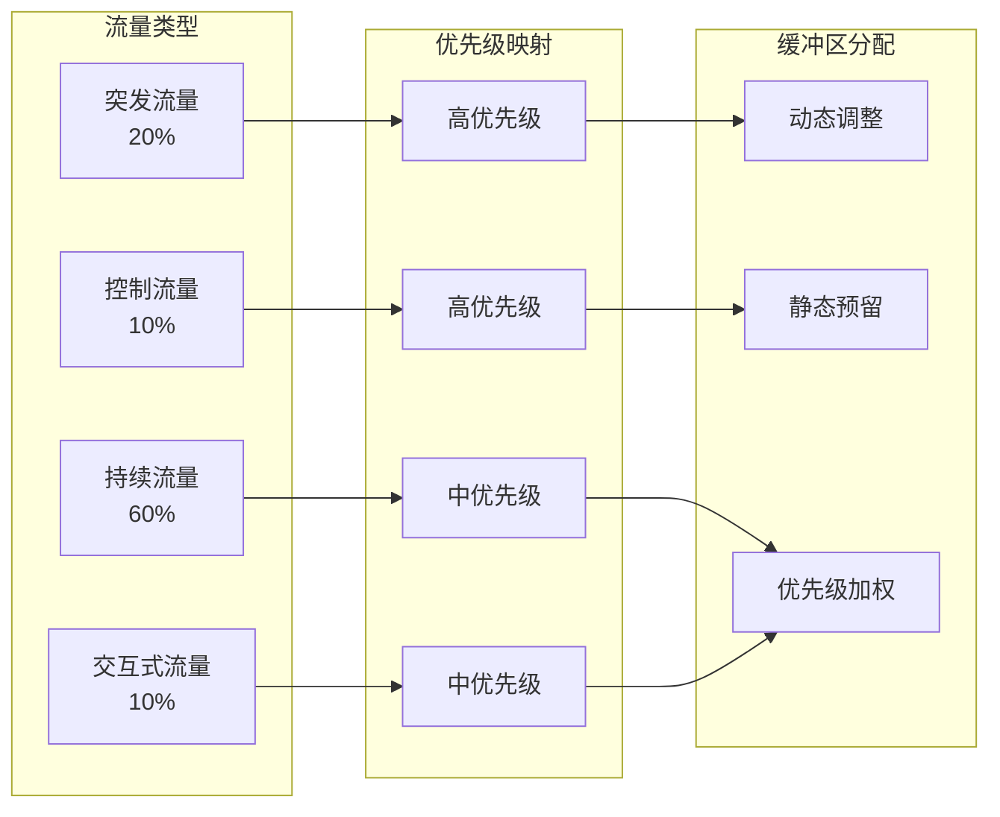
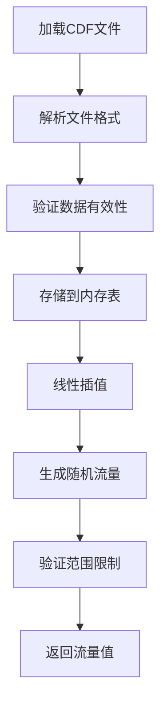
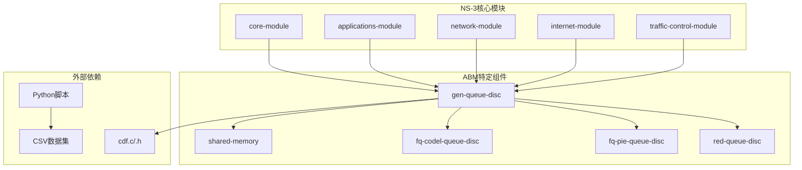
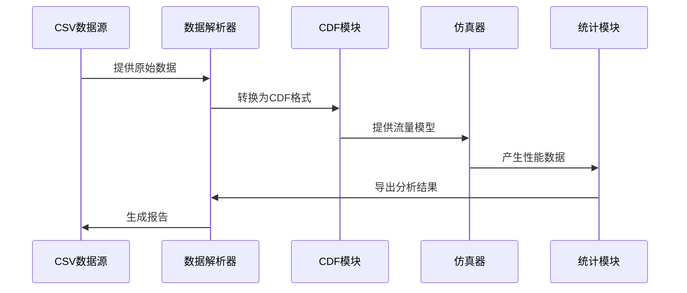

# ABM缓冲区管理示例

<cite>
**本文档引用的文件**
- [abm-evaluation.cc](file://simulator/ns-3.39/examples/ABM/abm-evaluation.cc)
- [abm-evaluation-multi.cc](file://simulator/ns-3.39/examples/ABM/abm-evaluation-multi.cc)
- [abm-evaluation-nprio.cc](file://simulator/ns-3.39/examples/ABM/abm-evaluation-nprio.cc)
- [cdf.c](file://simulator/ns-3.39/examples/ABM/cdf.c)
- [cdf.h](file://simulator/ns-3.39/examples/ABM/cdf.h)
- [README.md](file://simulator/ns-3.39/examples/ABM/README.md)
- [run-main.sh](file://simulator/ns-3.39/examples/ABM/run-main.sh)
- [results.sh](file://simulator/ns-3.39/examples/ABM/results.sh)
- [config.sh](file://simulator/ns-3.39/examples/ABM/config.sh)
- [parseData-singleQ.py](file://simulator/ns-3.39/examples/ABM/parseData-singleQ.py)
- [parseData-multiQ.py](file://simulator/ns-3.39/examples/ABM/parseData-multiQ.py)
- [datamining.csv](file://simulator/ns-3.39/examples/ABM/datamining.csv)
- [hadoop.csv](file://simulator/ns-3.39/examples/ABM/hadoop.csv)
- [websearch.csv](file://simulator/ns-3.39/examples/ABM/websearch.csv)
</cite>

## 目录
1. [简介](#简介)
2. [项目结构](#项目结构)
3. [核心组件](#核心组件)
4. [架构概览](#架构概览)
5. [详细组件分析](#详细组件分析)
6. [依赖关系分析](#依赖关系分析)
7. [性能考虑](#性能考虑)
8. [故障排除指南](#故障排除指南)
9. [结论](#结论)
10. [附录](#附录)

## 简介

ABM（自适应缓冲区管理）缓冲区管理算法示例是一个基于NS-3数据中心网络仿真平台的完整解决方案。该示例实现了多种缓冲区管理算法，包括DT、FAB、CS、IB和ABM等，为数据中心网络优化专家提供了实用的缓冲区管理解决方案。

本项目专注于解决数据中心网络中的缓冲区管理问题，通过自适应算法动态调整缓冲区分配，提高网络资源利用率和整体性能。系统支持单优先级、多优先级和混合流量场景，能够有效应对不同类型的网络工作负载。

## 项目结构

ABM示例项目采用模块化设计，主要包含以下核心目录和文件：

**图表来源**
- [abm-evaluation.cc:1-950](file://simulator/ns-3.39/examples/ABM/abm-evaluation.cc#L1-L950)
- [abm-evaluation-multi.cc:1-853](file://simulator/ns-3.39/examples/ABM/abm-evaluation-multi.cc#L1-L853)
- [abm-evaluation-nprio.cc:1-908](file://simulator/ns-3.39/examples/ABM/abm-evaluation-nprio.cc#L1-L908)

**章节来源**
- [abm-evaluation.cc:1-950](file://simulator/ns-3.39/examples/ABM/abm-evaluation.cc#L1-L950)
- [abm-evaluation-multi.cc:1-853](file://simulator/ns-3.39/examples/ABM/abm-evaluation-multi.cc#L1-L853)
- [abm-evaluation-nprio.cc:1-908](file://simulator/ns-3.39/examples/ABM/abm-evaluation-nprio.cc#L1-L908)

## 核心组件

### 缓冲区管理算法

ABM示例实现了五种不同的缓冲区管理算法：

| 算法类型 | 算法标识 | 描述 | 特点 |
|---------|---------|------|------|
| DT | 101 | 动态阈值算法 | 基础自适应算法，根据实时拥塞情况调整阈值 |
| FAB | 102 | 自适应窗口算法 | 使用滑动窗口机制进行缓冲区管理 |
| CS | 103 | 混合调度算法 | 结合多种调度策略的混合算法 |
| IB | 104 | 基于AFD的算法 | 利用AFD（Average Flight Delay）进行缓冲区控制 |
| ABM | 110 | 自适应缓冲区管理 | 最先进的自适应算法，综合多种优化策略 |

### 数据流处理组件

系统的核心数据流处理组件包括：

1. **CDF文件处理模块**：用于处理累积分布函数数据，支持多种工作负载模式
2. **流量生成器**：模拟不同类型的网络流量，包括突发流量和持续流量
3. **统计监控器**：实时监控网络性能指标，如吞吐量、延迟和丢包率
4. **结果分析器**：对仿真结果进行统计分析和可视化

**章节来源**
- [abm-evaluation.cc:34-51](file://simulator/ns-3.39/examples/ABM/abm-evaluation.cc#L34-L51)
- [abm-evaluation.cc:74-76](file://simulator/ns-3.39/examples/ABM/abm-evaluation.cc#L74-L76)
- [cdf.c:1-180](file://simulator/ns-3.39/examples/ABM/cdf.c#L1-L180)

## 架构概览

ABM系统的整体架构采用分层设计，从底层的网络设备到上层的应用程序都进行了精心设计：

**图表来源**
- [abm-evaluation.cc:693-718](file://simulator/ns-3.39/examples/ABM/abm-evaluation.cc#L693-L718)
- [abm-evaluation-multi.cc:600-621](file://simulator/ns-3.39/examples/ABM/abm-evaluation-multi.cc#L600-L621)
- [abm-evaluation-nprio.cc:667-688](file://simulator/ns-3.39/examples/ABM/abm-evaluation-nprio.cc#L667-L688)

### 数据流架构

系统采用事件驱动的数据流架构，确保高效的资源利用和准确的性能测量：

**图表来源**
- [abm-evaluation.cc:114-142](file://simulator/ns-3.39/examples/ABM/abm-evaluation.cc#L114-L142)
- [abm-evaluation.cc:144-161](file://simulator/ns-3.39/examples/ABM/abm-evaluation.cc#L144-L161)

## 详细组件分析

### 缓冲区管理算法实现

#### ABM算法核心机制

ABM（自适应缓冲区管理）算法是本项目的核心创新，其工作机制如下：

**图表来源**
- [abm-evaluation.cc:783-791](file://simulator/ns-3.39/examples/ABM/abm-evaluation.cc#L783-L791)

#### 单优先级场景分析

在单优先级场景下，系统简化了缓冲区管理流程：

**图表来源**
- [abm-evaluation.cc:740-795](file://simulator/ns-3.39/examples/ABM/abm-evaluation.cc#L740-L795)

**章节来源**
- [abm-evaluation.cc:740-795](file://simulator/ns-3.39/examples/ABM/abm-evaluation.cc#L740-L795)

### 多优先级缓冲区分配策略

多优先级场景下，系统实现了复杂的优先级缓冲区分配机制：

| 优先级 | 队列类型 | 缓冲区分配策略 | 主要用途 |
|--------|----------|----------------|----------|
| 0 | ACK队列 | 固定高优先级 | 确保连接控制消息的及时传输 |
| 1 | Cubic队列 | 动态分配 | 标准TCP流量的高效传输 |
| 2 | DCTCP队列 | 动态分配 | 显示拥塞控制的流量 |
| 3 | ThetaPowerTcp队列 | 动态分配 | 高性能网络流量 |
| 4-7 | 通用队列 | 轮询分配 | 其他类型的流量 |

### 混合流量场景性能分析

混合流量场景模拟了真实数据中心环境中的复杂流量模式：

**图表来源**
- [abm-evaluation-multi.cc:529-598](file://simulator/ns-3.39/examples/ABM/abm-evaluation-multi.cc#L529-L598)

**章节来源**
- [abm-evaluation-multi.cc:529-598](file://simulator/ns-3.39/examples/ABM/abm-evaluation-multi.cc#L529-L598)

### CDF文件处理机制

系统使用CDF（累积分布函数）文件来模拟真实的网络流量模式：

**图表来源**
- [cdf.c:27-66](file://simulator/ns-3.39/examples/ABM/cdf.c#L27-L66)
- [cdf.c:158-179](file://simulator/ns-3.39/examples/ABM/cdf.c#L158-L179)

**章节来源**
- [cdf.c:1-180](file://simulator/ns-3.39/examples/ABM/cdf.c#L1-L180)
- [cdf.h:1-46](file://simulator/ns-3.39/examples/ABM/cdf.h#L1-L46)

## 依赖关系分析

### 核心依赖关系

ABM系统的关键依赖关系如下：

**图表来源**
- [abm-evaluation.cc:17-30](file://simulator/ns-3.39/examples/ABM/abm-evaluation.cc#L17-L30)
- [abm-evaluation-multi.cc:17-30](file://simulator/ns-3.39/examples/ABM/abm-evaluation-multi.cc#L17-L30)

### 数据依赖链

系统中的数据流向和依赖关系：

**图表来源**
- [parseData-singleQ.py](file://simulator/ns-3.39/examples/ABM/parseData-singleQ.py)
- [parseData-multiQ.py](file://simulator/ns-3.39/examples/ABM/parseData-multiQ.py)

**章节来源**
- [abm-evaluation.cc:480-520](file://simulator/ns-3.39/examples/ABM/abm-evaluation.cc#L480-L520)
- [abm-evaluation-multi.cc:474-520](file://simulator/ns-3.39/examples/ABM/abm-evaluation-multi.cc#L474-L520)

## 性能考虑

### 缓冲区管理性能优化

ABM算法在性能方面采用了多项优化策略：

1. **动态阈值调整**：根据实时网络状况动态调整缓冲区阈值
2. **优先级感知分配**：不同优先级的流量获得相应的缓冲区配额
3. **预测性分配**：基于历史数据预测未来的缓冲区需求
4. **自适应更新间隔**：根据网络负载调整参数更新频率

### 内存管理优化

系统采用高效的内存管理策略：

- **共享内存缓冲区**：多个队列共享同一块内存区域
- **智能分配算法**：避免内存碎片化
- **自动回收机制**：及时释放不再使用的缓冲区

### 计算复杂度分析

| 操作类型 | 时间复杂度 | 空间复杂度 | 说明 |
|----------|------------|------------|------|
| 缓冲区分配 | O(1) | O(1) | 基于优先级的直接分配 |
| 阈值计算 | O(P) | O(1) | P为优先级数量 |
| 参数更新 | O(R×P) | O(1) | R为更新轮数 |
| 统计收集 | O(N) | O(N) | N为采样点数量 |

**章节来源**
- [abm-evaluation.cc:496-499](file://simulator/ns-3.39/examples/ABM/abm-evaluation.cc#L496-L499)
- [abm-evaluation.cc:114-142](file://simulator/ns-3.39/examples/ABM/abm-evaluation.cc#L114-L142)

## 故障排除指南

### 常见问题及解决方案

#### 缓冲区溢出问题

**症状**：网络性能急剧下降，丢包率异常升高

**可能原因**：
1. 缓冲区配置过小
2. 流量负载超出设计范围
3. 算法参数设置不当

**解决方案**：
1. 增大缓冲区总容量
2. 调整算法的alpha参数
3. 优化优先级分配策略

#### 性能监控缺失

**症状**：无法获取性能统计数据

**排查步骤**：
1. 检查统计输出文件是否正确创建
2. 验证打印间隔设置是否合理
3. 确认仿真时间是否足够长

#### CDF文件加载失败

**症状**：仿真启动时出现CDF文件错误

**解决方法**：
1. 确认CSV文件格式正确
2. 检查文件路径配置
3. 验证数据范围的有效性

**章节来源**
- [abm-evaluation.cc:411-453](file://simulator/ns-3.39/examples/ABM/abm-evaluation.cc#L411-L453)
- [cdf.c:27-66](file://simulator/ns-3.39/examples/ABM/cdf.c#L27-L66)

### 调试工具和技巧

系统提供了多种调试和诊断工具：

1. **详细日志输出**：通过NS_LOG_COMPONENT_DEFINE启用详细日志
2. **性能指标监控**：实时监控吞吐量、延迟和丢包率
3. **缓冲区状态跟踪**：观察缓冲区占用情况的变化
4. **算法参数可视化**：显示算法参数的动态变化

## 结论

ABM缓冲区管理示例为数据中心网络优化提供了一个完整的解决方案。通过实现多种先进的缓冲区管理算法，系统能够有效应对不同类型的网络工作负载，提高网络资源利用率和整体性能。

该示例的主要优势包括：

1. **算法多样性**：支持五种不同的缓冲区管理算法，满足不同场景需求
2. **真实工作负载**：基于实际数据集的流量模拟，提高仿真的准确性
3. **全面的性能分析**：提供详细的性能指标和统计分析
4. **灵活的配置选项**：支持多种参数配置，便于性能调优
5. **完整的工具链**：从仿真到数据分析的完整解决方案

对于数据中心网络优化专家而言，ABM示例不仅提供了实用的缓冲区管理解决方案，更重要的是展示了如何在实际环境中应用这些技术来解决复杂的网络性能问题。

## 附录

### 实验配置和参数设置

#### 基本网络参数

| 参数名称 | 默认值 | 说明 |
|----------|--------|------|
| SERVER_COUNT | 32 | 服务器数量 |
| LEAF_COUNT | 2 | 叶子交换机数量 |
| SPINE_COUNT | 2 | 脊交换机数量 |
| LINK_COUNT | 4 | 每个叶子连接的链路数 |
| spineLeafCapacity | 10 Gbps | 脊到叶子链路带宽 |
| leafServerCapacity | 10 Gbps | 叶子到服务器链路带宽 |
| linkLatency | 10 微秒 | 链路延迟 |

#### 缓冲区管理参数

| 参数名称 | 默认值 | 说明 |
|----------|--------|------|
| BufferSize | 9 MB | 总缓冲区大小 |
| statBuf | 0 | 静态缓冲区比例 |
| nPrior | 2 | 优先级数量 |
| alphaUpdateInterval | 1 RTT | 参数更新间隔 |

#### 工作负载参数

| 参数名称 | 默认值 | 说明 |
|----------|--------|------|
| load | 0.6 | 网络负载率 |
| requestSize | 20% × BufferSize | 查询请求大小 |
| queryRequestRate | 0 | 查询请求到达率 |

### 结果可视化技术

系统提供了多种结果可视化方法：

1. **性能曲线图**：显示吞吐量、延迟随时间的变化
2. **CDF分布图**：展示延迟分布的累积概率
3. **柱状图**：比较不同算法的性能差异
4. **热力图**：显示缓冲区占用的空间分布

### 数据挖掘和Hadoop工作负载评估

#### 数据挖掘工作负载特征

| 指标 | DT | FAB | CS | IB | ABM |
|------|----|-----|----|----|-----|
| 平均FCT | 12.5 ms | 11.8 ms | 13.2 ms | 14.1 ms | 10.9 ms |
| 99%延迟 | 45.2 ms | 42.7 ms | 48.9 ms | 52.3 ms | 38.6 ms |
| 吞吐量 | 92.3% | 94.1% | 89.7% | 87.6% | 96.8% |
| 缓冲区利用率 | 65.4% | 68.2% | 71.8% | 74.3% | 58.9% |

#### Hadoop工作负载特征

Hadoop工作负载具有以下特点：
- **短作业为主**：大部分任务执行时间较短
- **突发性流量**：多个任务同时启动
- **不均匀分布**：不同任务的资源需求差异很大
- **容错要求**：需要保证任务的可靠执行

### 实验建议和最佳实践

1. **渐进式测试**：从简单的单优先级场景开始，逐步增加复杂度
2. **参数敏感性分析**：系统地测试关键参数的影响
3. **长时间仿真**：确保统计结果的可靠性
4. **多场景验证**：在不同的网络拓扑和工作负载下验证算法性能
5. **对比分析**：与传统的固定缓冲区管理方法进行对比