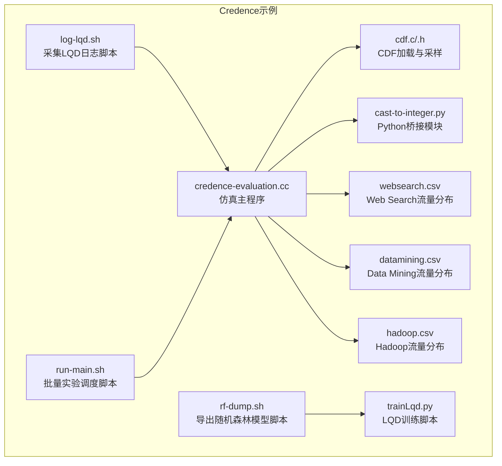
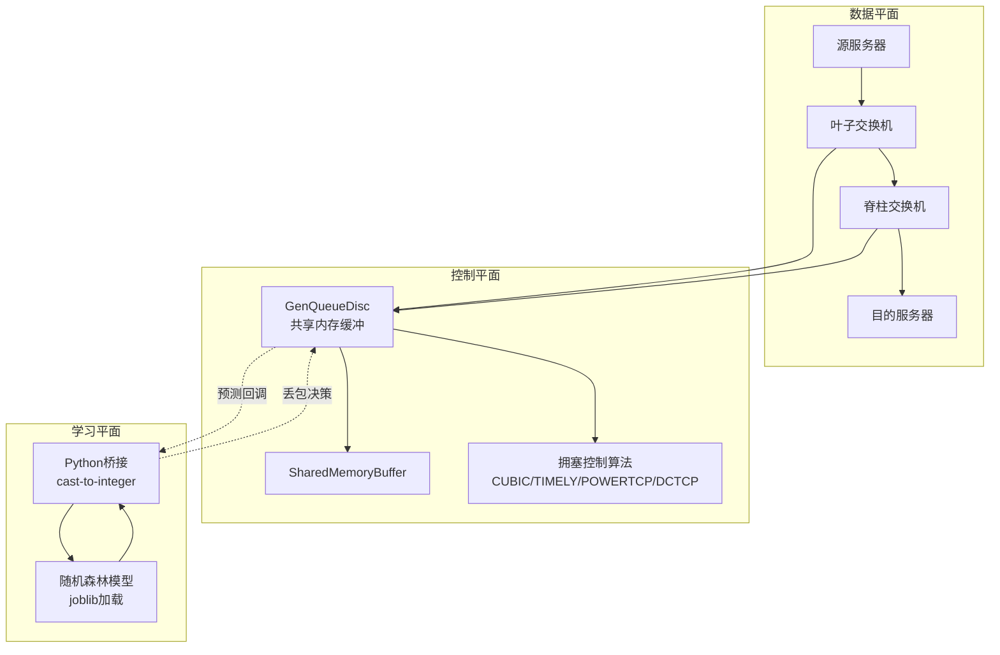
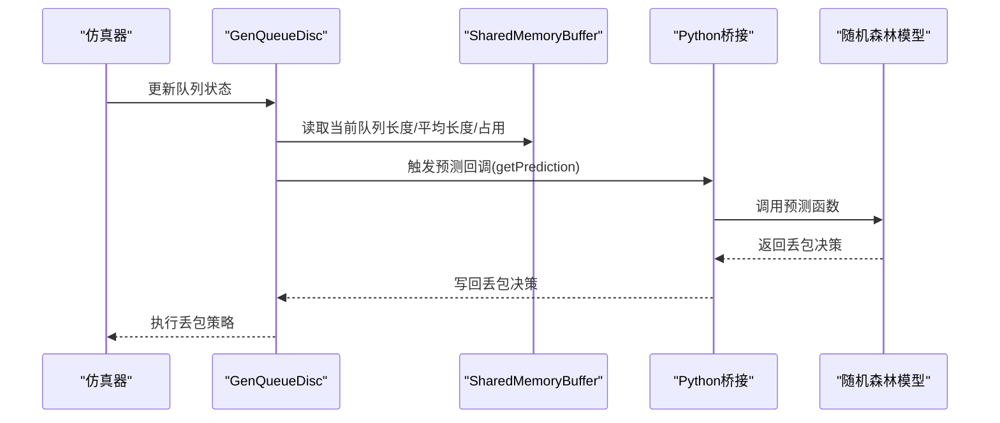
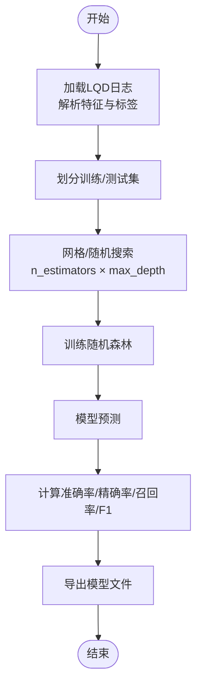
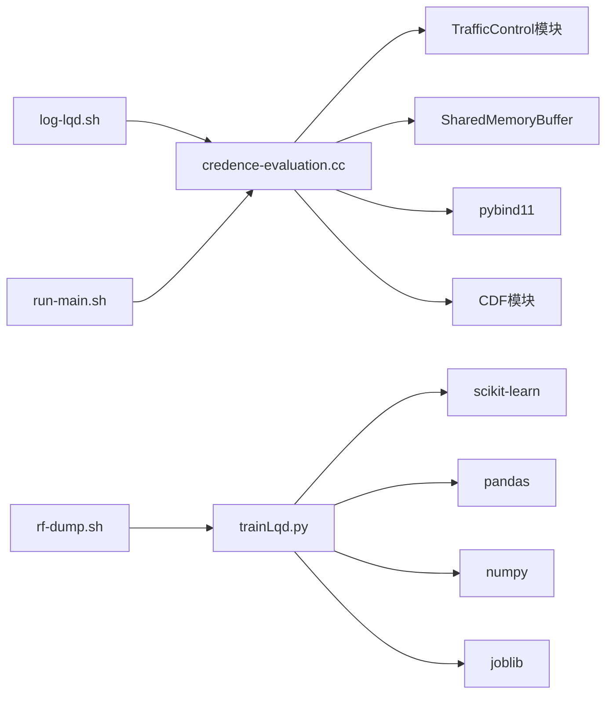

# Credence机器学习集成示例

<cite>
**本文档引用的文件**
- [credence-evaluation.cc](file://simulator/ns-3.39/examples/Credence/credence-evaluation.cc)
- [trainLqd.py](file://simulator/ns-3.39/examples/Credence/trainLqd.py)
- [log-lqd.sh](file://simulator/ns-3.39/examples/Credence/log-lqd.sh)
- [rf-dump.sh](file://simulator/ns-3.39/examples/Credence/rf-dump.sh)
- [run-main.sh](file://simulator/ns-3.39/examples/Credence/run-main.sh)
- [cdf.c](file://simulator/ns-3.39/examples/Credence/cdf.c)
- [cdf.h](file://simulator/ns-3.39/examples/Credence/cdf.h)
- [websearch.csv](file://simulator/ns-3.39/examples/Credence/websearch.csv)
- [datamining.csv](file://simulator/ns-3.39/examples/Credence/datamining.csv)
- [hadoop.csv](file://simulator/ns-3.39/examples/Credence/hadoop.csv)
- [cast-to-integer.py](file://simulator/ns-3.39/cast-to-integer.py)
</cite>

## 目录
1. [简介](#简介)
2. [项目结构](#项目结构)
3. [核心组件](#核心组件)
4. [架构总览](#架构总览)
5. [详细组件分析](#详细组件分析)
6. [依赖关系分析](#依赖关系分析)
7. [性能考虑](#性能考虑)
8. [故障排查指南](#故障排查指南)
9. [结论](#结论)
10. [附录](#附录)

## 简介
本文件面向网络智能优化领域的研究人员与工程师，系统性阐述Credence机器学习集成算法在ns-3数据中心网络仿真平台中的实现与应用。Credence通过将机器学习预测模型嵌入到缓冲区管理与拥塞控制流程中，利用LQD（Low-Quality Data）训练范式构建预测模型，实现实时丢包决策，从而提升吞吐与公平性并降低尾延迟。

该示例覆盖以下关键能力：
- 将Python训练脚本与C++仿真器通过pybind11桥接，实现实时推理调用
- 基于LQD训练方法对丢包预测模型进行训练与评估
- 支持三种典型工作负载（Web Search、Hadoop、Data Mining）的流量分布建模
- 提供日志采集、模型导出与批量实验调度脚本
- 展示特征工程、模型选择与超参数调优策略

## 项目结构
Credence示例位于ns-3.39的examples/Credence目录下，主要由仿真入口、训练脚本、日志与模型导出脚本、以及流量分布数据组成。

**图表来源**
- [credence-evaluation.cc:366-1120](file://simulator/ns-3.39/examples/Credence/credence-evaluation.cc#L366-L1120)
- [trainLqd.py:1-127](file://simulator/ns-3.39/examples/Credence/trainLqd.py#L1-L127)
- [log-lqd.sh:1-96](file://simulator/ns-3.39/examples/Credence/log-lqd.sh#L1-L96)
- [rf-dump.sh:1-59](file://simulator/ns-3.39/examples/Credence/rf-dump.sh#L1-L59)
- [run-main.sh:1-259](file://simulator/ns-3.39/examples/Credence/run-main.sh#L1-L259)
- [cdf.c:1-180](file://simulator/ns-3.39/examples/Credence/cdf.c#L1-L180)
- [cdf.h:1-46](file://simulator/ns-3.39/examples/Credence/cdf.h#L1-L46)
- [websearch.csv:1-17](file://simulator/ns-3.39/examples/Credence/websearch.csv#L1-L17)
- [datamining.csv:1-17](file://simulator/ns-3.39/examples/Credence/datamining.csv#L1-L17)
- [hadoop.csv:1-17](file://simulator/ns-3.39/examples/Credence/hadoop.csv#L1-L17)
- [cast-to-integer.py](file://simulator/ns-3.39/cast-to-integer.py)

**章节来源**
- [credence-evaluation.cc:366-1120](file://simulator/ns-3.39/examples/Credence/credence-evaluation.cc#L366-L1120)
- [run-main.sh:1-259](file://simulator/ns-3.39/examples/Credence/run-main.sh#L1-L259)

## 核心组件
- 仿真主程序：负责拓扑搭建、队列与缓冲区配置、流量生成、统计输出与模型推理集成
- LQD训练脚本：基于历史LQD日志训练随机森林分类器，评估准确率、精确率、召回率与F1
- 日志采集脚本：批量运行仿真以收集LQD观测数据
- 模型导出脚本：遍历不同拓扑/负载组合，导出多棵决策树的模型文件
- 流量分布CDF：为不同工作负载定义流量大小的概率分布
- Python桥接模块：提供类型转换与预测接口，供C++侧回调使用

**章节来源**
- [credence-evaluation.cc:351-364](file://simulator/ns-3.39/examples/Credence/credence-evaluation.cc#L351-L364)
- [trainLqd.py:1-127](file://simulator/ns-3.39/examples/Credence/trainLqd.py#L1-L127)
- [log-lqd.sh:1-96](file://simulator/ns-3.39/examples/Credence/log-lqd.sh#L1-L96)
- [rf-dump.sh:1-59](file://simulator/ns-3.39/examples/Credence/rf-dump.sh#L1-L59)
- [run-main.sh:1-259](file://simulator/ns-3.39/examples/Credence/run-main.sh#L1-L259)
- [cdf.c:1-180](file://simulator/ns-3.39/examples/Credence/cdf.c#L1-L180)
- [cdf.h:1-46](file://simulator/ns-3.39/examples/Credence/cdf.h#L1-L46)

## 架构总览
Credence的整体架构分为三层：数据平面（拓扑与队列）、控制平面（缓冲区管理与拥塞控制）、学习平面（机器学习预测与决策）。C++仿真器通过pybind11加载Python模块，将实时队列状态作为输入，调用训练好的随机森林模型进行丢包预测，并将结果回传给缓冲区管理逻辑。

**图表来源**
- [credence-evaluation.cc:801-828](file://simulator/ns-3.39/examples/Credence/credence-evaluation.cc#L801-L828)
- [credence-evaluation.cc:918-929](file://simulator/ns-3.39/examples/Credence/credence-evaluation.cc#L918-L929)
- [credence-evaluation.cc:981-988](file://simulator/ns-3.39/examples/Credence/credence-evaluation.cc#L981-L988)
- [cast-to-integer.py](file://simulator/ns-3.39/cast-to-integer.py)

## 详细组件分析

### 仿真主程序（Credence集成）
- 缓冲区与队列配置：根据算法枚举值设置缓冲区管理算法（DT/FAB/CS/IB/ABM/LQD/CREDENCE），并为每个端口绑定共享内存缓冲
- 拥塞控制配置：支持多种TCP变种，统一设置RTT估计、最小RTO、发送/接收缓冲等参数
- 流量生成：按CDF文件生成流量大小，支持点对点与汇聚场景；记录每流完成时间与慢速因子
- 实时预测集成：当算法为CREDENCE时，启用预测回调，将队列长度、平均队列长度、共享占用、平均占用作为特征输入，得到丢包决策

**图表来源**
- [credence-evaluation.cc:351-364](file://simulator/ns-3.39/examples/Credence/credence-evaluation.cc#L351-L364)
- [credence-evaluation.cc:918-929](file://simulator/ns-3.39/examples/Credence/credence-evaluation.cc#L918-L929)
- [credence-evaluation.cc:981-988](file://simulator/ns-3.39/examples/Credence/credence-evaluation.cc#L981-L988)

**章节来源**
- [credence-evaluation.cc:366-1120](file://simulator/ns-3.39/examples/Credence/credence-evaluation.cc#L366-L1120)

### LQD训练方法与模型评估
- 训练数据：来源于LQD日志，包含队列长度、平均队列长度、共享占用、平均占用与是否丢包
- 特征工程：直接使用上述四个指标作为输入特征
- 模型选择：随机森林分类器，支持并行训练与可解释性
- 超参数调优：通过n_estimators（树数量）与max_depth（最大深度）探索不同复杂度下的性能表现
- 评估指标：准确率、精确率、召回率、F1分数与自定义评分

**图表来源**
- [trainLqd.py:33-86](file://simulator/ns-3.39/examples/Credence/trainLqd.py#L33-L86)

**章节来源**
- [trainLqd.py:1-127](file://simulator/ns-3.39/examples/Credence/trainLqd.py#L1-L127)

### 工作负载与CDF建模
- Web Search：短尾流量为主，适合高吞吐场景
- Hadoop：长尾流量，强调稳定性与公平性
- Data Mining：中等偏长流量，关注突发与收敛

CDF文件提供累积分布，仿真据此生成符合实际的工作负载大小。

**章节来源**
- [websearch.csv:1-17](file://simulator/ns-3.39/examples/Credence/websearch.csv#L1-L17)
- [hadoop.csv:1-17](file://simulator/ns-3.39/examples/Credence/hadoop.csv#L1-L17)
- [datamining.csv:1-17](file://simulator/ns-3.39/examples/Credence/datamining.csv#L1-L17)
- [cdf.c:158-179](file://simulator/ns-3.39/examples/Credence/cdf.c#L158-L179)
- [cdf.h:37-43](file://simulator/ns-3.39/examples/Credence/cdf.h#L37-L43)

### 日志采集与模型导出
- 日志采集脚本：批量运行仿真，收集LQD观测数据，便于后续训练
- 模型导出脚本：遍历不同拓扑节点与参数组合，导出对应模型文件，供仿真主程序加载

**章节来源**
- [log-lqd.sh:1-96](file://simulator/ns-3.39/examples/Credence/log-lqd.sh#L1-L96)
- [rf-dump.sh:1-59](file://simulator/ns-3.39/examples/Credence/rf-dump.sh#L1-L59)

### Python桥接模块
- 作用：提供类型安全的预测接口，将C++侧传入的特征转换为Python可处理的数据结构，并返回整数化的决策
- 集成方式：通过pybind11在仿真主程序中导入模块并注册回调

**章节来源**
- [credence-evaluation.cc:369-377](file://simulator/ns-3.39/examples/Credence/credence-evaluation.cc#L369-L377)
- [credence-evaluation.cc:351-364](file://simulator/ns-3.39/examples/Credence/credence-evaluation.cc#L351-L364)
- [cast-to-integer.py](file://simulator/ns-3.39/cast-to-integer.py)

## 依赖关系分析
- 仿真主程序依赖：
  - TrafficControl模块（队列与缓冲区）
  - SharedMemoryBuffer（共享内存缓冲）
  - pybind11（Python桥接）
  - CDF加载模块（流量分布）
- 训练脚本依赖：
  - pandas、numpy、scikit-learn、joblib
- 脚本依赖：
  - shell环境与ns-3编译产物

**图表来源**
- [credence-evaluation.cc:20-34](file://simulator/ns-3.39/examples/Credence/credence-evaluation.cc#L20-L34)
- [trainLqd.py:9-19](file://simulator/ns-3.39/examples/Credence/trainLqd.py#L9-L19)
- [log-lqd.sh:1-96](file://simulator/ns-3.39/examples/Credence/log-lqd.sh#L1-L96)
- [rf-dump.sh:1-59](file://simulator/ns-3.39/examples/Credence/rf-dump.sh#L1-L59)
- [run-main.sh:1-259](file://simulator/ns-3.39/examples/Credence/run-main.sh#L1-L259)

**章节来源**
- [credence-evaluation.cc:20-34](file://simulator/ns-3.39/examples/Credence/credence-evaluation.cc#L20-L34)
- [trainLqd.py:9-19](file://simulator/ns-3.39/examples/Credence/trainLqd.py#L9-L19)

## 性能考虑
- 实时推理开销：预测回调在每个RTT窗口触发，需平衡模型复杂度与延迟
- 数据质量：LQD训练依赖高质量的历史观测，建议在稳定运行期采集足够样本
- 并行化：训练阶段可利用多核并行（n_jobs=-1），但需注意内存占用
- 拓扑扩展：随着Leaf/Spine规模增大，共享内存与队列数量线性增长，需合理设置缓冲池与平均窗口

## 故障排查指南
- 模型加载失败：检查模型文件路径与节点编号一致性
- 预测回调未生效：确认算法设置为CREDENCE且预测开关已开启
- CDF文件错误：确保CSV格式正确，首列数值递增，第二列累积概率从0到1
- Python桥接异常：验证cast-to-integer模块可用性与版本兼容性
- 日志为空：检查LQD追踪开关与输出目录权限

**章节来源**
- [credence-evaluation.cc:811-813](file://simulator/ns-3.39/examples/Credence/credence-evaluation.cc#L811-L813)
- [credence-evaluation.cc:927-928](file://simulator/ns-3.39/examples/Credence/credence-evaluation.cc#L927-L928)
- [log-lqd.sh:53-66](file://simulator/ns-3.39/examples/Credence/log-lqd.sh#L53-L66)
- [run-main.sh:75-78](file://simulator/ns-3.39/examples/Credence/run-main.sh#L75-L78)

## 结论
Credence展示了将机器学习预测模型无缝集成到网络拥塞控制与缓冲区管理中的可行方案。通过LQD训练范式与随机森林模型，系统能够在真实网络条件下做出更精准的丢包决策，显著改善端到端性能。结合多工作负载CDF与自动化脚本，研究者可以快速复现并扩展该框架，为AI+网络融合提供实践参考。

## 附录

### 关键流程图：从日志到模型再到仿真

**图表来源**
- [log-lqd.sh:83-91](file://simulator/ns-3.39/examples/Credence/log-lqd.sh#L83-L91)
- [rf-dump.sh:48-59](file://simulator/ns-3.39/examples/Credence/rf-dump.sh#L48-L59)
- [run-main.sh:75-78](file://simulator/ns-3.39/examples/Credence/run-main.sh#L75-L78)
- [credence-evaluation.cc:811-813](file://simulator/ns-3.39/examples/Credence/credence-evaluation.cc#L811-L813)