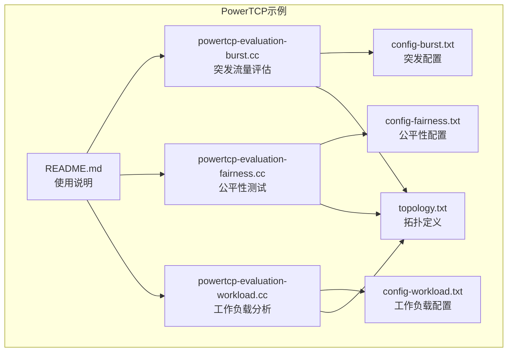
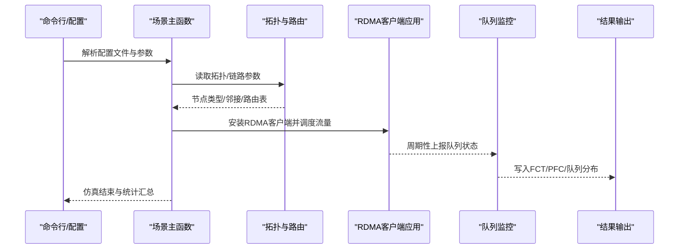
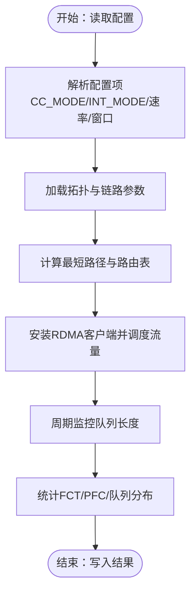
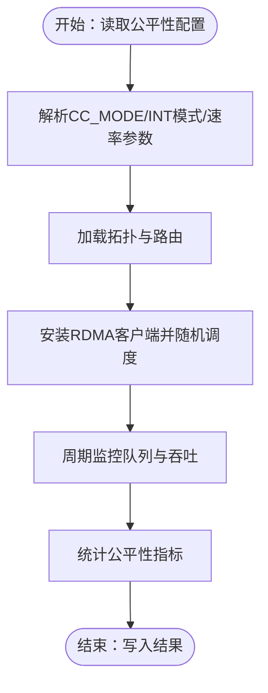
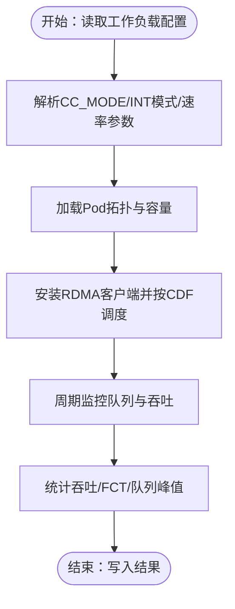
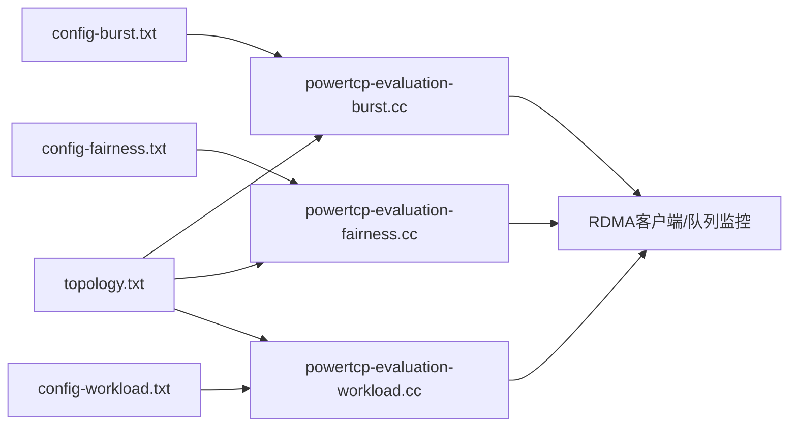

# PowerTCP算法示例

<cite>
**本文引用的文件**
- [README.md](file://simulator/ns-3.39/examples/PowerTCP/README.md)
- [powertcp-evaluation-burst.cc](file://simulator/ns-3.39/examples/PowerTCP/powertcp-evaluation-burst.cc)
- [powertcp-evaluation-fairness.cc](file://simulator/ns-3.39/examples/PowerTCP/powertcp-evaluation-fairness.cc)
- [powertcp-evaluation-workload.cc](file://simulator/ns-3.39/examples/PowerTCP/powertcp-evaluation-workload.cc)
- [config-burst.txt](file://simulator/ns-3.39/examples/PowerTCP/config-burst.txt)
- [config-fairness.txt](file://simulator/ns-3.39/examples/PowerTCP/config-fairness.txt)
- [config-workload.txt](file://simulator/ns-3.39/examples/PowerTCP/config-workload.txt)
- [topology.txt](file://simulator/ns-3.39/examples/PowerTCP/topology.txt)
</cite>

## 目录
1. [简介](#简介)
2. [项目结构](#项目结构)
3. [核心组件](#核心组件)
4. [架构总览](#架构总览)
5. [详细组件分析](#详细组件分析)
6. [依赖关系分析](#依赖关系分析)
7. [性能考量](#性能考量)
8. [故障排查指南](#故障排查指南)
9. [结论](#结论)
10. [附录](#附录)

## 简介
本文件围绕PowerTCP拥塞控制算法示例展开，系统化阐述其在数据中心网络中的核心原理与实现机制，并基于仓库中的三个主要实验场景（突发流量评估、公平性测试、工作负载分析）提供可复现的实验方案与深入的技术实现细节。文档同时覆盖配置文件解析、拓扑构建方法、参数调优策略、实验脚本使用指南、结果分析方法与性能对比分析，适合网络研究人员与工程师参考。

## 项目结构
PowerTCP示例位于ns-3.39的examples/PowerTCP目录下，包含三类核心文件：
- 场景执行入口：powertcp-evaluation-burst.cc、powertcp-evaluation-fairness.cc、powertcp-evaluation-workload.cc
- 配置文件：config-burst.txt、config-fairness.txt、config-workload.txt
- 拓扑与流量文件：topology.txt及各场景对应的flow文件（例如flow-burstExp-256.txt等）
- 使用说明：README.md

图表来源
- [README.md:1-34](file://simulator/ns-3.39/examples/PowerTCP/README.md#L1-L34)
- [powertcp-evaluation-burst.cc:402-714](file://simulator/ns-3.39/examples/PowerTCP/powertcp-evaluation-burst.cc#L402-L714)
- [powertcp-evaluation-fairness.cc:390-704](file://simulator/ns-3.39/examples/PowerTCP/powertcp-evaluation-fairness.cc#L390-L704)
- [powertcp-evaluation-workload.cc:547-700](file://simulator/ns-3.39/examples/PowerTCP/powertcp-evaluation-workload.cc#L547-L700)
- [config-burst.txt:1-59](file://simulator/ns-3.39/examples/PowerTCP/config-burst.txt#L1-L59)
- [config-fairness.txt:1-59](file://simulator/ns-3.39/examples/PowerTCP/config-fairness.txt#L1-L59)
- [config-workload.txt:1-59](file://simulator/ns-3.39/examples/PowerTCP/config-workload.txt#L1-L59)
- [topology.txt:1-147](file://simulator/ns-3.39/examples/PowerTCP/topology.txt#L1-L147)

章节来源
- [README.md:1-34](file://simulator/ns-3.39/examples/PowerTCP/README.md#L1-L34)

## 核心组件
- 场景驱动器（主函数与配置解析）
  - 三个场景均通过main函数解析命令行参数与配置文件，设置拥塞控制模式、队列管理参数、INT采样模式等关键变量，随后构建节点、链路与路由表，安装RDMA客户端应用并启动仿真。
- 拥塞控制与速率调节
  - 通过CC_MODE选择算法（如PowerTCP=3），设置速率增益、最小速率、速率下降间隔、窗口参数等；支持INT反馈（NORMAL/PINT/TS）以驱动速率调整。
- 拓扑与路由
  - 从拓扑文件读取节点类型（服务器=0，ToR=1，Spine=2），构建邻接关系与最短路径，生成下一跳表，支持链路故障模拟与重路由。
- 流量调度与监控
  - 依据flow文件逐流调度，为每条流分配源/目的端口，计算RTT/BDP并按需设置发送窗口；周期性监控队列长度分布，输出FCT/PFC等统计结果。

章节来源
- [powertcp-evaluation-burst.cc:402-714](file://simulator/ns-3.39/examples/PowerTCP/powertcp-evaluation-burst.cc#L402-L714)
- [powertcp-evaluation-fairness.cc:390-704](file://simulator/ns-3.39/examples/PowerTCP/powertcp-evaluation-fairness.cc#L390-L704)
- [powertcp-evaluation-workload.cc:547-700](file://simulator/ns-3.39/examples/PowerTCP/powertcp-evaluation-workload.cc#L547-L700)

## 架构总览
以下序列图展示典型场景（以突发流量为例）的端到端流程：配置解析→拓扑与路由→RDMA客户端安装→流量调度→队列监控→结果输出。

图表来源
- [powertcp-evaluation-burst.cc:402-714](file://simulator/ns-3.39/examples/PowerTCP/powertcp-evaluation-burst.cc#L402-L714)
- [powertcp-evaluation-fairness.cc:390-704](file://simulator/ns-3.39/examples/PowerTCP/powertcp-evaluation-fairness.cc#L390-L704)
- [powertcp-evaluation-workload.cc:547-700](file://simulator/ns-3.39/examples/PowerTCP/powertcp-evaluation-workload.cc#L547-L700)

## 详细组件分析

### 突发流量评估（Burst Evaluation）
- 实验目标
  - 在10:1突发场景下评估不同拥塞控制算法（PowerTCP、Theta-PowerTCP、HPCC、TIMELY、DCQCN）的吞吐、延迟与队列行为差异。
- 关键实现要点
  - 配置文件：启用QCN、设置INT模式（NORMAL）、速率参数、窗口与目标利用率等。
  - 拓扑与流量：使用256端口拓扑与对应flow文件，集中式突发注入。
  - 结果输出：记录每流FCT、PFC事件、队列长度分布。
- 参数调优建议
  - 提升EWMA_gain或降低MIN_RATE可增强响应速度；适当增大BUFFER_SIZE以抑制抖动。
  - 若出现高丢包，检查U_TARGET与INT_MULTI，确保反馈足够灵敏。

图表来源
- [config-burst.txt:1-59](file://simulator/ns-3.39/examples/PowerTCP/config-burst.txt#L1-L59)
- [powertcp-evaluation-burst.cc:402-714](file://simulator/ns-3.39/examples/PowerTCP/powertcp-evaluation-burst.cc#L402-L714)

章节来源
- [README.md:5-10](file://simulator/ns-3.39/examples/PowerTCP/README.md#L5-L10)
- [config-burst.txt:1-59](file://simulator/ns-3.39/examples/PowerTCP/config-burst.txt#L1-L59)
- [powertcp-evaluation-burst.cc:402-714](file://simulator/ns-3.39/examples/PowerTCP/powertcp-evaluation-burst.cc#L402-L714)

### 公平性测试（Fairness Test）
- 实验目标
  - 在多流公平竞争场景下比较各算法对带宽分配的公平性与稳定性。
- 关键实现要点
  - 配置文件：与突发场景类似，但仿真时长更长，便于观察长期公平性。
  - 流量模型：多源多目的随机连接，避免集中式突发。
  - 结果输出：关注各流吞吐差异与队列波动。
- 参数调优建议
  - 提高FAST_REACT与INT_MULTI可提升对拥塞的快速响应；合理设置U_TARGET平衡公平性与效率。

图表来源
- [config-fairness.txt:1-59](file://simulator/ns-3.39/examples/PowerTCP/config-fairness.txt#L1-L59)
- [powertcp-evaluation-fairness.cc:390-704](file://simulator/ns-3.39/examples/PowerTCP/powertcp-evaluation-fairness.cc#L390-L704)

章节来源
- [README.md:11-16](file://simulator/ns-3.39/examples/PowerTCP/README.md#L11-L16)
- [config-fairness.txt:1-59](file://simulator/ns-3.39/examples/PowerTCP/config-fairness.txt#L1-L59)
- [powertcp-evaluation-fairness.cc:390-704](file://simulator/ns-3.39/examples/PowerTCP/powertcp-evaluation-fairness.cc#L390-L704)

### 工作负载分析（Workload Test）
- 实验目标
  - 在多种工作负载条件下（可变负载、可变请求率、可变请求大小）评估算法性能，涵盖无突发与有突发两种情形。
- 关键实现要点
  - 配置文件：与公平性场景一致，但仿真时间更长，支持大量并发流。
  - 流量模型：基于CDF分布生成请求，支持查询式工作负载与随机访问模式。
  - 结果输出：关注吞吐、FCT分布、队列峰值与PFC事件。
- 参数调优建议
  - 针对高负载场景，适当提高缓冲区与INT_MULTI；针对突发场景，缩短RATE_DECREASE_INTERVAL以更快收敛。

图表来源
- [config-workload.txt:1-59](file://simulator/ns-3.39/examples/PowerTCP/config-workload.txt#L1-L59)
- [powertcp-evaluation-workload.cc:547-700](file://simulator/ns-3.39/examples/PowerTCP/powertcp-evaluation-workload.cc#L547-L700)

章节来源
- [README.md:17-26](file://simulator/ns-3.39/examples/PowerTCP/README.md#L17-L26)
- [config-workload.txt:1-59](file://simulator/ns-3.39/examples/PowerTCP/config-workload.txt#L1-L59)
- [powertcp-evaluation-workload.cc:547-700](file://simulator/ns-3.39/examples/PowerTCP/powertcp-evaluation-workload.cc#L547-L700)

## 依赖关系分析
- 场景与配置
  - 各场景主函数均依赖对应配置文件（config-burst.txt、config-fairness.txt、config-workload.txt）来设置CC_MODE、INT模式、速率参数、窗口与缓冲区等。
- 拓扑与路由
  - 所有场景从topology.txt读取节点数量、开关数量、ToR数量与链路列表，构建邻接关系与最短路径，生成路由表。
- RDMA与队列
  - 通过RDMA客户端帮助器安装应用，结合Qbb网卡与SwitchNode的MMU统计队列占用，用于队列监控与结果输出。

图表来源
- [config-burst.txt:1-59](file://simulator/ns-3.39/examples/PowerTCP/config-burst.txt#L1-L59)
- [config-fairness.txt:1-59](file://simulator/ns-3.39/examples/PowerTCP/config-fairness.txt#L1-L59)
- [config-workload.txt:1-59](file://simulator/ns-3.39/examples/PowerTCP/config-workload.txt#L1-L59)
- [topology.txt:1-147](file://simulator/ns-3.39/examples/PowerTCP/topology.txt#L1-L147)
- [powertcp-evaluation-burst.cc:743-796](file://simulator/ns-3.39/examples/PowerTCP/powertcp-evaluation-burst.cc#L743-L796)
- [powertcp-evaluation-fairness.cc:732-786](file://simulator/ns-3.39/examples/PowerTCP/powertcp-evaluation-fairness.cc#L732-L786)
- [powertcp-evaluation-workload.cc:732-786](file://simulator/ns-3.39/examples/PowerTCP/powertcp-evaluation-workload.cc#L732-L786)

章节来源
- [powertcp-evaluation-burst.cc:743-796](file://simulator/ns-3.39/examples/PowerTCP/powertcp-evaluation-burst.cc#L743-L796)
- [powertcp-evaluation-fairness.cc:732-786](file://simulator/ns-3.39/examples/PowerTCP/powertcp-evaluation-fairness.cc#L732-L786)
- [powertcp-evaluation-workload.cc:732-786](file://simulator/ns-3.39/examples/PowerTCP/powertcp-evaluation-workload.cc#L732-L786)

## 性能考量
- 速率控制参数
  - EWMA_GAIN、RATE_AI、RATE_HAI、MIN_RATE、RATE_DECREASE_INTERVAL直接影响算法响应速度与稳态性能。增大EWMA_GAIN可提升对瞬时拥塞的敏感度，但可能引入抖动。
- 队列与缓冲
  - BUFFER_SIZE与INT_MULTI影响队列监控粒度与反馈频率。在高负载场景建议适度增大缓冲以减少尾部丢包。
- INT模式选择
  - NORMAL模式适用于PowerTCP/HPCC；PINT模式提供概率采样；TS模式用于TIMELY。根据网络条件选择合适模式可提升公平性与稳定性。
- 并发与CPU限制
  - 工作负载场景默认并发较多，需根据CPU核数调整并行度，避免资源争用导致结果偏差。

## 故障排查指南
- 仿真未启动或过早停止
  - 检查SIMULATOR_STOP_TIME与FLOW_FILE中流的起始时间是否匹配；确认拓扑文件节点编号与链路定义正确。
- 队列监控数据缺失
  - 确认QLEN_MON_FILE路径存在且可写；检查QLEN_MON_START/END范围是否覆盖仿真时段。
- 公平性异常
  - 调整U_TARGET与INT_MULTI；检查是否存在单流长时间占满链路的情况。
- 结果解析与绘图
  - 参考README中脚本顺序：先运行结果解析脚本，再生成图表；若脚本路径不匹配，需在脚本中修正输出路径。

章节来源
- [README.md:27-34](file://simulator/ns-3.39/examples/PowerTCP/README.md#L27-L34)
- [config-burst.txt:55-59](file://simulator/ns-3.39/examples/PowerTCP/config-burst.txt#L55-L59)
- [config-fairness.txt:55-59](file://simulator/ns-3.39/examples/PowerTCP/config-fairness.txt#L55-L59)
- [config-workload.txt:55-59](file://simulator/ns-3.39/examples/PowerTCP/config-workload.txt#L55-L59)

## 结论
PowerTCP示例提供了在数据中心网络中进行拥塞控制评估的完整框架：从配置解析、拓扑构建、流量调度到队列监控与结果输出。通过突发流量、公平性与工作负载三大场景，用户可以系统地比较不同算法在吞吐、延迟与公平性方面的表现，并据此进行参数调优与性能优化。建议在实际部署前，结合具体网络条件与业务特征，对速率控制参数、INT模式与缓冲策略进行针对性优化。

## 附录

### 配置文件解析要点
- 必填项
  - ENABLE_QCN、TOPOLOGY_FILE、FLOW_FILE、SIMULATOR_STOP_TIME、CC_MODE、INT_MULTI、BUFFER_SIZE、QLEN_MON_*等。
- 关键参数
  - CC_MODE：选择算法（PowerTCP=3、HPCC=3、TIMELY=7、DCQCN等）
  - INT模式：NORMAL/PINT/TS
  - 速率参数：EWMA_GAIN、RATE_AI、RATE_HAI、MIN_RATE、RATE_DECREASE_INTERVAL
  - 窗口与目标：HAS_WIN、GLOBAL_T、VAR_WIN、U_TARGET、MI_THRESH
  - 反馈与采样：SAMPLE_FEEDBACK、PINT_LOG_BASE、PINT_PROB
  - 链路与缓冲：DATA_RATE、LINK_DELAY、L2_*、RATE_BOUND、ACK_HIGH_PRIO

章节来源
- [config-burst.txt:1-59](file://simulator/ns-3.39/examples/PowerTCP/config-burst.txt#L1-L59)
- [config-fairness.txt:1-59](file://simulator/ns-3.39/examples/PowerTCP/config-fairness.txt#L1-L59)
- [config-workload.txt:1-59](file://simulator/ns-3.39/examples/PowerTCP/config-workload.txt#L1-L59)

### 拓扑构建方法
- 输入格式
  - 第一行：节点总数、交换机数、ToR数、链路总数
  - 接下来若干行：每个节点的邻居、带宽、延迟、链路状态
- 节点类型
  - 服务器：节点类型=0；ToR：节点类型=1；Spine：节点类型=2
- 路由计算
  - 使用广度优先搜索（BFS）计算最短路径与下一跳表，仅允许通过交换机中转。

章节来源
- [topology.txt:1-147](file://simulator/ns-3.39/examples/PowerTCP/topology.txt#L1-L147)
- [powertcp-evaluation-burst.cc:235-291](file://simulator/ns-3.39/examples/PowerTCP/powertcp-evaluation-burst.cc#L235-L291)
- [powertcp-evaluation-fairness.cc:235-288](file://simulator/ns-3.39/examples/PowerTCP/powertcp-evaluation-fairness.cc#L235-L288)
- [powertcp-evaluation-workload.cc:256-309](file://simulator/ns-3.39/examples/PowerTCP/powertcp-evaluation-workload.cc#L256-L309)

### 实验脚本使用指南
- 突发流量
  - 运行脚本：./script-burst.sh yes no
  - 解析结果：./results-burst.sh
  - 绘图：python3 plot-burst.py（需修改脚本内路径）
- 公平性测试
  - 运行脚本：./script-fairness.sh
  - 解析结果：./results-fairness.sh
  - 绘图：python3 plot-fairness.py
- 工作负载
  - 运行脚本：./script-workload.sh
  - 解析结果：./results-workload.sh
  - 绘图：python3 plot-workload.py
- 注意事项
  - 工作负载脚本默认并发38个进程，可根据CPU核数调整等待逻辑。

章节来源
- [README.md:5-26](file://simulator/ns-3.39/examples/PowerTCP/README.md#L5-L26)