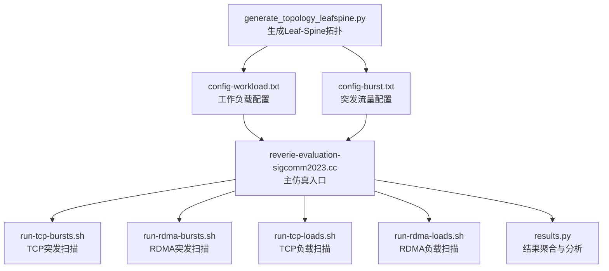
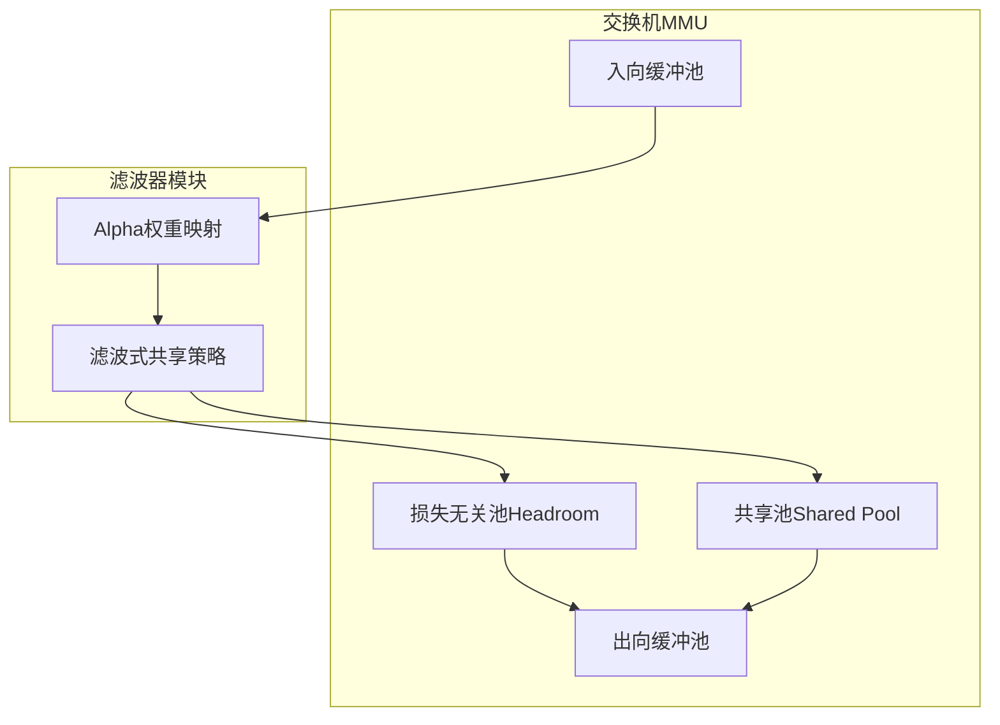
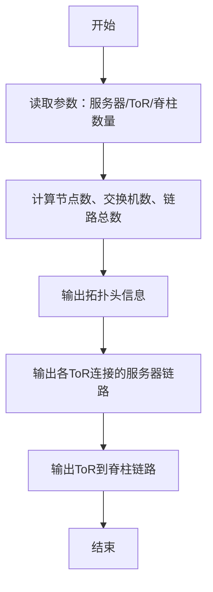
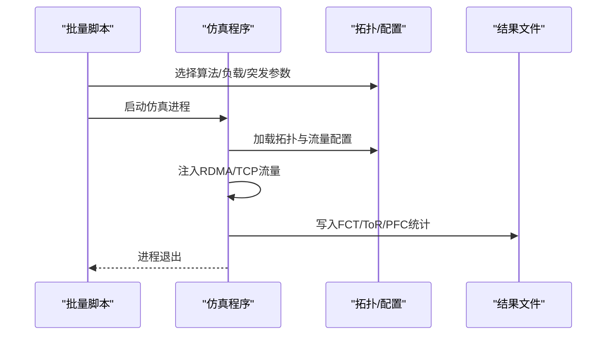
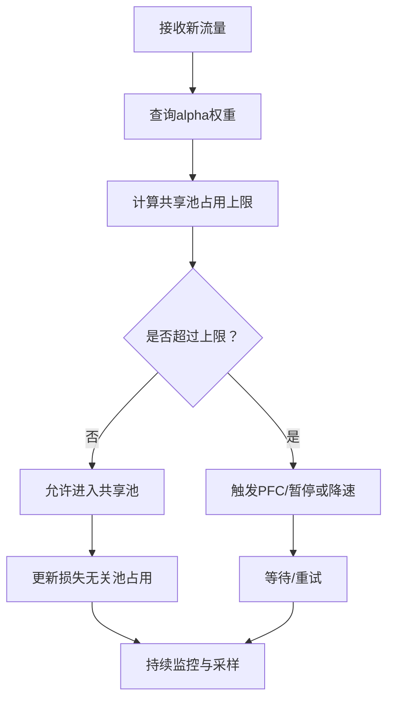
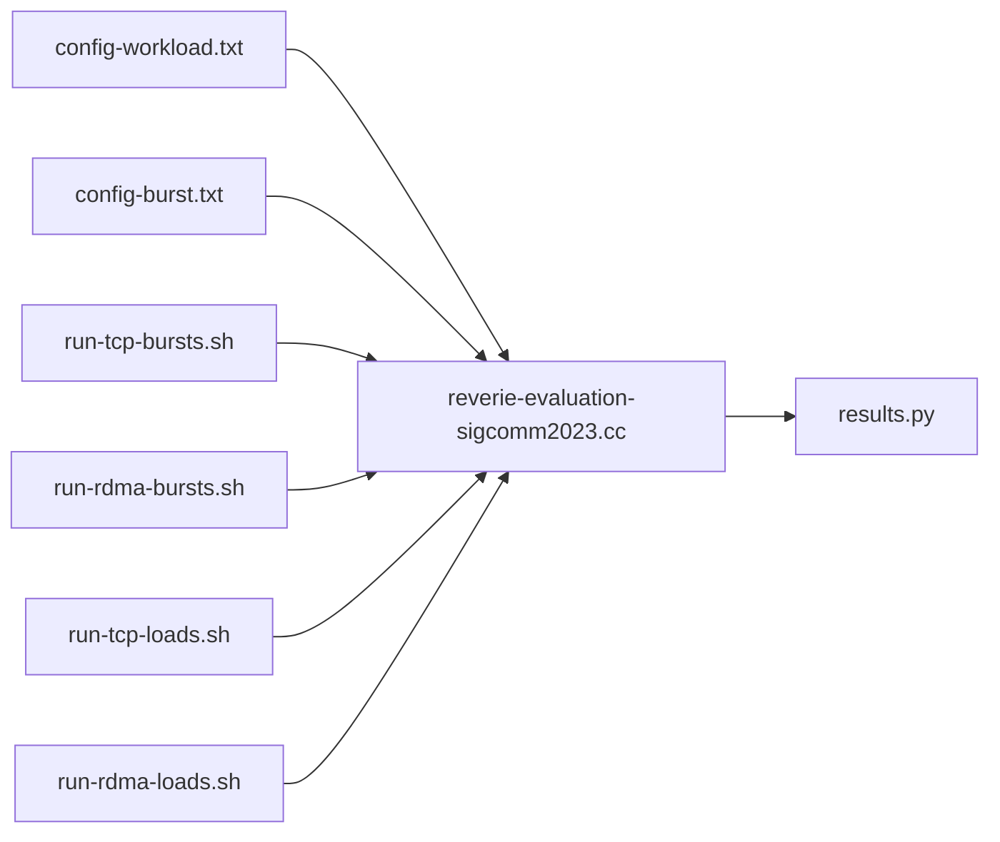

# Reverie滤波器算法示例

<cite>
**本文档引用的文件**
- [reverie-evaluation-sigcomm2023.cc](file://simulator/ns-3.39/examples/Reverie/reverie-evaluation-sigcomm2023.cc)
- [test-mixed.cc](file://simulator/ns-3.39/examples/Reverie/test-mixed.cc)
- [generate_topology_leafspine.py](file://simulator/ns-3.39/examples/Reverie/generate_topology_leafspine.py)
- [config-burst.txt](file://simulator/ns-3.39/examples/Reverie/config-burst.txt)
- [config-workload.txt](file://simulator/ns-3.39/examples/Reverie/config-workload.txt)
- [run-tcp-bursts.sh](file://simulator/ns-3.39/examples/Reverie/run-tcp-bursts.sh)
- [run-rdma-bursts.sh](file://simulator/ns-3.39/examples/Reverie/run-rdma-bursts.sh)
- [run-tcp-loads.sh](file://simulator/ns-3.39/examples/Reverie/run-tcp-loads.sh)
- [run-rdma-loads.sh](file://simulator/ns-3.39/examples/Reverie/run-rdma-loads.sh)
- [results.py](file://simulator/ns-3.39/examples/Reverie/results.py)
</cite>

## 目录
1. [引言](#引言)
2. [项目结构](#项目结构)
3. [核心组件](#核心组件)
4. [架构总览](#架构总览)
5. [详细组件分析](#详细组件分析)
6. [依赖关系分析](#依赖关系分析)
7. [性能考量](#性能考量)
8. [故障排查指南](#故障排查指南)
9. [结论](#结论)
10. [附录](#附录)

## 引言
本技术文档围绕Reverie滤波器算法在Leaf-Spine拓扑中的仿真与实验展开，系统阐述其滤波器设计理念、缓冲区共享机制与混合流量（RDMA与TCP）处理能力。文档基于SIGCOMM 2023会议论文的实验设置，提供从拓扑生成、流量注入、参数配置到结果分析与可视化的完整流程，帮助读者快速复现并扩展相关研究。

## 项目结构
Reverie示例位于ns-3.39的examples/Reverie目录下，主要由以下几类文件组成：
- 核心仿真程序：reverie-evaluation-sigcomm2023.cc、test-mixed.cc
- 拓扑生成脚本：generate_topology_leafspine.py
- 配置文件：config-burst.txt、config-workload.txt
- 批量运行脚本：run-tcp-bursts.sh、run-rdma-bursts.sh、run-tcp-loads.sh、run-rdma-loads.sh
- 结果分析与可视化：results.py

图表来源
- [generate_topology_leafspine.py:1-40](file://simulator/ns-3.39/examples/Reverie/generate_topology_leafspine.py#L1-L40)
- [config-workload.txt:1-57](file://simulator/ns-3.39/examples/Reverie/config-workload.txt#L1-L57)
- [config-burst.txt:1-59](file://simulator/ns-3.39/examples/Reverie/config-burst.txt#L1-L59)
- [reverie-evaluation-sigcomm2023.cc:642-800](file://simulator/ns-3.39/examples/Reverie/reverie-evaluation-sigcomm2023.cc#L642-L800)
- [run-tcp-bursts.sh:1-90](file://simulator/ns-3.39/examples/Reverie/run-tcp-bursts.sh#L1-L90)
- [run-rdma-bursts.sh:1-90](file://simulator/ns-3.39/examples/Reverie/run-rdma-bursts.sh#L1-L90)
- [run-tcp-loads.sh:1-88](file://simulator/ns-3.39/examples/Reverie/run-tcp-loads.sh#L1-L88)
- [run-rdma-loads.sh:1-88](file://simulator/ns-3.39/examples/Reverie/run-rdma-loads.sh#L1-L88)
- [results.py:1-481](file://simulator/ns-3.39/examples/Reverie/results.py#L1-L481)

章节来源
- [generate_topology_leafspine.py:1-40](file://simulator/ns-3.39/examples/Reverie/generate_topology_leafspine.py#L1-L40)
- [config-workload.txt:1-57](file://simulator/ns-3.39/examples/Reverie/config-workload.txt#L1-L57)
- [config-burst.txt:1-59](file://simulator/ns-3.39/examples/Reverie/config-burst.txt#L1-L59)
- [reverie-evaluation-sigcomm2023.cc:642-800](file://simulator/ns-3.39/examples/Reverie/reverie-evaluation-sigcomm2023.cc#L642-L800)
- [run-tcp-bursts.sh:1-90](file://simulator/ns-3.39/examples/Reverie/run-tcp-bursts.sh#L1-L90)
- [run-rdma-bursts.sh:1-90](file://simulator/ns-3.39/examples/Reverie/run-rdma-bursts.sh#L1-L90)
- [run-tcp-loads.sh:1-88](file://simulator/ns-3.39/examples/Reverie/run-tcp-loads.sh#L1-L88)
- [run-rdma-loads.sh:1-88](file://simulator/ns-3.39/examples/Reverie/run-rdma-loads.sh#L1-L88)
- [results.py:1-481](file://simulator/ns-3.39/examples/Reverie/results.py#L1-L481)

## 核心组件
- 主仿真入口与调度
  - 主函数解析命令行参数，初始化输出文件（FCT、ToR统计、PFC事件），加载alpha权重，构建Leaf-Spine拓扑并注入RDMA/TCP流量。
  - 关键参数包括：缓冲区模型（Sonic或Reverie）、入/出缓冲算法（DT/ABM/Reverie）、RDMA/TCP拥塞控制模式、突发大小与负载等。
- 流量注入与路由
  - 提供RDMA突发（incast）与工作负载（permutation demand matrix）两种注入方式；支持TCP BulkSend与Sink应用。
  - 基于BFS计算最短路径与下一跳表，动态更新交换机转发表。
- 缓冲区监控
  - 定时打印交换机MMU占用情况（总占用、损失无关/有占用、共享池占用等），用于后续分析与可视化。
- 结果输出
  - 记录每条流的完成时间（FCT）、基线FCT、慢化因子、RTT等指标；记录ToR端口缓冲占用百分比与PFC事件。

章节来源
- [reverie-evaluation-sigcomm2023.cc:642-800](file://simulator/ns-3.39/examples/Reverie/reverie-evaluation-sigcomm2023.cc#L642-L800)
- [reverie-evaluation-sigcomm2023.cc:170-195](file://simulator/ns-3.39/examples/Reverie/reverie-evaluation-sigcomm2023.cc#L170-L195)
- [reverie-evaluation-sigcomm2023.cc:261-314](file://simulator/ns-3.39/examples/Reverie/reverie-evaluation-sigcomm2023.cc#L261-L314)
- [reverie-evaluation-sigcomm2023.cc:619-637](file://simulator/ns-3.39/examples/Reverie/reverie-evaluation-sigcomm2023.cc#L619-L637)

## 架构总览
Reverie滤波器在交换机MMU中通过“损失无关池”和“共享池”的协同管理，实现对不同优先级/流量类型的差异化缓冲策略。Reverie的核心思想是利用alpha权重对不同队列进行滤波式共享，降低高优先级突发对低优先级队列的影响，从而提升整体吞吐与公平性。

图表来源
- [reverie-evaluation-sigcomm2023.cc:109-112](file://simulator/ns-3.39/examples/Reverie/reverie-evaluation-sigcomm2023.cc#L109-L112)
- [reverie-evaluation-sigcomm2023.cc:619-637](file://simulator/ns-3.39/examples/Reverie/reverie-evaluation-sigcomm2023.cc#L619-L637)

## 详细组件分析

### Leaf-Spine拓扑生成
- 脚本根据服务器每ToR数量、ToR数量与脊柱交换机数量生成节点/链路信息，输出拓扑头部、邻接列表及链路属性（带宽、延迟、误码率）。
- 该拓扑为SIGCOMM 2023实验提供标准网络结构，便于RDMA与TCP混合流量的公平比较。

图表来源
- [generate_topology_leafspine.py:1-40](file://simulator/ns-3.39/examples/Reverie/generate_topology_leafspine.py#L1-L40)

章节来源
- [generate_topology_leafspine.py:1-40](file://simulator/ns-3.39/examples/Reverie/generate_topology_leafspine.py#L1-L40)

### TCP突发与RDMA突发测试场景
- TCP突发场景：以固定突发大小（如1.25MB、500KB、1MB等）在多个负载点（0.2~0.8）上运行，观察短流慢化因子与ToR缓冲占用。
- RDMA突发场景：以固定负载（如0.8）与不同突发大小（0~2.5MB）运行，观察长流慢化因子与PFC事件次数。
- 工作负载场景：采用置换需求矩阵，模拟多对多流量分布，评估不同缓冲算法在稳定期的表现。

图表来源
- [run-tcp-bursts.sh:63-87](file://simulator/ns-3.39/examples/Reverie/run-tcp-bursts.sh#L63-L87)
- [run-rdma-bursts.sh:63-87](file://simulator/ns-3.39/examples/Reverie/run-rdma-bursts.sh#L63-L87)
- [run-tcp-loads.sh:63-85](file://simulator/ns-3.39/examples/Reverie/run-tcp-loads.sh#L63-L85)
- [run-rdma-loads.sh:63-85](file://simulator/ns-3.39/examples/Reverie/run-rdma-loads.sh#L63-L85)

章节来源
- [run-tcp-bursts.sh:1-90](file://simulator/ns-3.39/examples/Reverie/run-tcp-bursts.sh#L1-L90)
- [run-rdma-bursts.sh:1-90](file://simulator/ns-3.39/examples/Reverie/run-rdma-bursts.sh#L1-L90)
- [run-tcp-loads.sh:1-88](file://simulator/ns-3.39/examples/Reverie/run-tcp-loads.sh#L1-L88)
- [run-rdma-loads.sh:1-88](file://simulator/ns-3.39/examples/Reverie/run-rdma-loads.sh#L1-L88)

### 滤波器与缓冲区共享机制
- Alpha权重映射：通过alphas文件为不同优先级/速率设定alpha值，决定共享池占用上限与恢复阈值。
- 共享池策略：Reverie在共享池中按alpha权重进行滤波式分配，避免高优先级突发挤占低优先级队列空间。
- ToR缓冲监控：定时采样并记录损失无关池、共享池与总占用，用于评估Reverie在不同gamma（收敛系数）下的表现。

图表来源
- [reverie-evaluation-sigcomm2023.cc:109-112](file://simulator/ns-3.39/examples/Reverie/reverie-evaluation-sigcomm2023.cc#L109-L112)
- [reverie-evaluation-sigcomm2023.cc:619-637](file://simulator/ns-3.39/examples/Reverie/reverie-evaluation-sigcomm2023.cc#L619-L637)

章节来源
- [reverie-evaluation-sigcomm2023.cc:109-112](file://simulator/ns-3.39/examples/Reverie/reverie-evaluation-sigcomm2023.cc#L109-L112)
- [reverie-evaluation-sigcomm2023.cc:619-637](file://simulator/ns-3.39/examples/Reverie/reverie-evaluation-sigcomm2023.cc#L619-L637)

### 混合流量处理能力
- RDMA与TCP共存：仿真同时注入RDMA突发（高优先级）与TCP工作负载（低优先级），通过不同的拥塞控制模式（如DCQCN、INTCC、Cubic、DCTCP）与缓冲算法组合，评估公平性与稳定性。
- 端到端性能：记录短流（<100KB）、中流（100KB~1MB）、长流（>1MB）的慢化因子分布，以及PFC事件次数与ToR缓冲占用。

章节来源
- [reverie-evaluation-sigcomm2023.cc:383-482](file://simulator/ns-3.39/examples/Reverie/reverie-evaluation-sigcomm2023.cc#L383-L482)
- [reverie-evaluation-sigcomm2023.cc:485-614](file://simulator/ns-3.39/examples/Reverie/reverie-evaluation-sigcomm2023.cc#L485-L614)

### 性能评估与实验设计
- 实验维度：算法（DT/ABM/Reverie）、负载（0.2~0.8）、突发大小（0~2.5MB）、拥塞控制（DCQCN/INTCC/Cubic/DCTCP）、gamma（收敛系数）。
- 指标体系：短流/中流/长流慢化因子（均值、P95/P99/P999）、PFC事件计数、ToR缓冲占用百分比（损失无关/共享/总）。
- 可重复性：通过批量脚本统一参数与命名规范，确保不同实验间的可比性。

章节来源
- [run-tcp-bursts.sh:36-87](file://simulator/ns-3.39/examples/Reverie/run-tcp-bursts.sh#L36-L87)
- [run-rdma-bursts.sh:36-87](file://simulator/ns-3.39/examples/Reverie/run-rdma-bursts.sh#L36-L87)
- [run-tcp-loads.sh:38-85](file://simulator/ns-3.39/examples/Reverie/run-tcp-loads.sh#L38-L85)
- [run-rdma-loads.sh:38-85](file://simulator/ns-3.39/examples/Reverie/run-rdma-loads.sh#L38-L85)

## 依赖关系分析
- 配置文件驱动仿真行为：config-workload.txt与config-burst.txt分别定义拓扑、流量、CC模式、缓冲大小与监控窗口等。
- 批量脚本串联实验：run-*.sh根据实验目标自动拼装命令行参数，调用仿真程序并输出标准化文件名。
- 结果分析脚本：results.py按实验文件命名规则读取FCT/ToR/PFC文件，计算统计指标并生成可视化图表。

图表来源
- [config-workload.txt:1-57](file://simulator/ns-3.39/examples/Reverie/config-workload.txt#L1-L57)
- [config-burst.txt:1-59](file://simulator/ns-3.39/examples/Reverie/config-burst.txt#L1-L59)
- [reverie-evaluation-sigcomm2023.cc:642-800](file://simulator/ns-3.39/examples/Reverie/reverie-evaluation-sigcomm2023.cc#L642-L800)
- [run-tcp-bursts.sh:1-90](file://simulator/ns-3.39/examples/Reverie/run-tcp-bursts.sh#L1-L90)
- [run-rdma-bursts.sh:1-90](file://simulator/ns-3.39/examples/Reverie/run-rdma-bursts.sh#L1-L90)
- [run-tcp-loads.sh:1-88](file://simulator/ns-3.39/examples/Reverie/run-tcp-loads.sh#L1-L88)
- [run-rdma-loads.sh:1-88](file://simulator/ns-3.39/examples/Reverie/run-rdma-loads.sh#L1-L88)
- [results.py:1-481](file://simulator/ns-3.39/examples/Reverie/results.py#L1-L481)

章节来源
- [config-workload.txt:1-57](file://simulator/ns-3.39/examples/Reverie/config-workload.txt#L1-L57)
- [config-burst.txt:1-59](file://simulator/ns-3.39/examples/Reverie/config-burst.txt#L1-L59)
- [reverie-evaluation-sigcomm2023.cc:642-800](file://simulator/ns-3.39/examples/Reverie/reverie-evaluation-sigcomm2023.cc#L642-L800)
- [run-tcp-bursts.sh:1-90](file://simulator/ns-3.39/examples/Reverie/run-tcp-bursts.sh#L1-L90)
- [run-rdma-bursts.sh:1-90](file://simulator/ns-3.39/examples/Reverie/run-rdma-bursts.sh#L1-L90)
- [run-tcp-loads.sh:1-88](file://simulator/ns-3.39/examples/Reverie/run-tcp-loads.sh#L1-L88)
- [run-rdma-loads.sh:1-88](file://simulator/ns-3.39/examples/Reverie/run-rdma-loads.sh#L1-L88)
- [results.py:1-481](file://simulator/ns-3.39/examples/Reverie/results.py#L1-L481)

## 性能考量
- 缓冲区模型选择：Sonic与Reverie在共享池与损失无关池的划分策略不同，Reverie通过alpha权重实现更精细的滤波式共享。
- 收敛系数gamma：gamma越高，Reverie对突发的抑制越强，但可能影响吞吐；需结合负载与突发大小权衡。
- 拥塞控制模式：RDMA使用DCQCN/INTCC，TCP使用Cubic/DCTCP，不同组合对公平性与稳定性影响显著。
- 监控窗口与采样频率：合理设置ToR缓冲采样间隔与监控窗口，确保统计指标的代表性与可重复性。

## 故障排查指南
- 拓扑文件格式错误：确认generate_topology_leafspine.py输出的拓扑头与邻接信息与config-*中一致。
- 流量配置不匹配：检查config-*中的FLOW_FILE与实际流量文件字段顺序与数值范围。
- 参数未生效：确认批量脚本传入的命令行参数覆盖了config-*中的默认值（如缓冲算法、负载、突发大小）。
- 结果文件缺失：核对run-*.sh中输出文件路径与results.py读取规则是否一致。

章节来源
- [generate_topology_leafspine.py:1-40](file://simulator/ns-3.39/examples/Reverie/generate_topology_leafspine.py#L1-L40)
- [config-workload.txt:6-13](file://simulator/ns-3.39/examples/Reverie/config-workload.txt#L6-L13)
- [config-burst.txt:6-13](file://simulator/ns-3.39/examples/Reverie/config-burst.txt#L6-L13)
- [results.py:105-108](file://simulator/ns-3.39/examples/Reverie/results.py#L105-L108)

## 结论
Reverie滤波器通过在交换机MMU中引入alpha权重与滤波式共享策略，在Leaf-Spine拓扑下有效缓解了RDMA突发对TCP短流的冲击，提升了整体网络的公平性与稳定性。结合SIGCOMM 2023的实验设置与批量脚本，研究人员可以快速复现实验并进一步探索不同参数组合对性能的影响。

## 附录
- 复现实验步骤建议
  - 使用generate_topology_leafspine.py生成拓扑文件
  - 准备config-workload.txt或config-burst.txt
  - 通过run-*.sh启动批量实验，收集FCT/ToR/PFC输出
  - 使用results.py进行结果汇总与可视化
- 关键参数参考
  - 缓冲算法：DT（101）、ABM（110）、Reverie（111）
  - 拥塞控制：DCQCN（1）、INTCC（3）、Cubic（2）、DCTCP（4）
  - gamma（收敛系数）：常见取值0.99、0.999、0.999999
  - 负载与突发：0.2~0.8、0~2.5MB