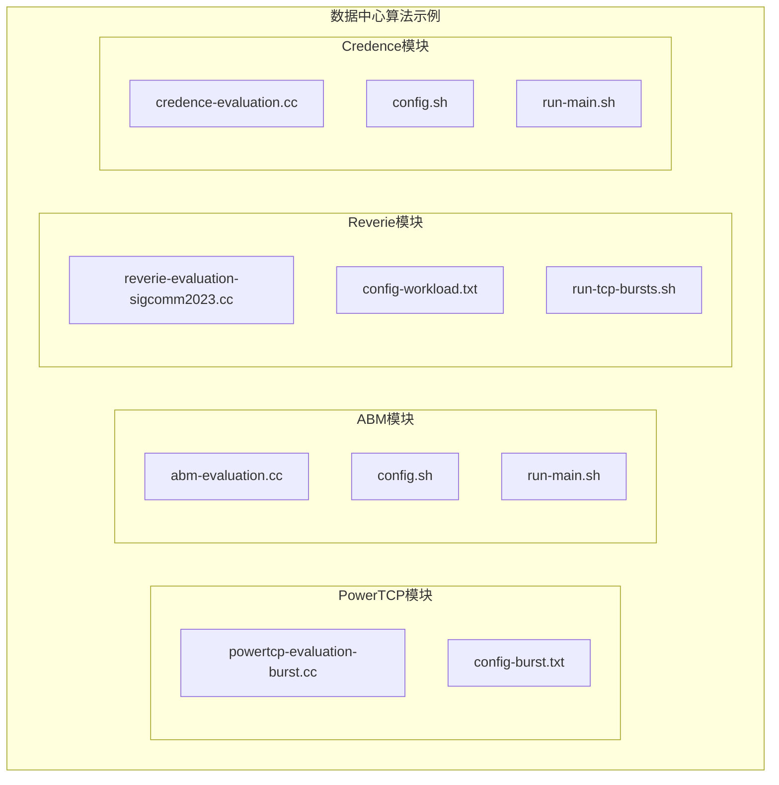
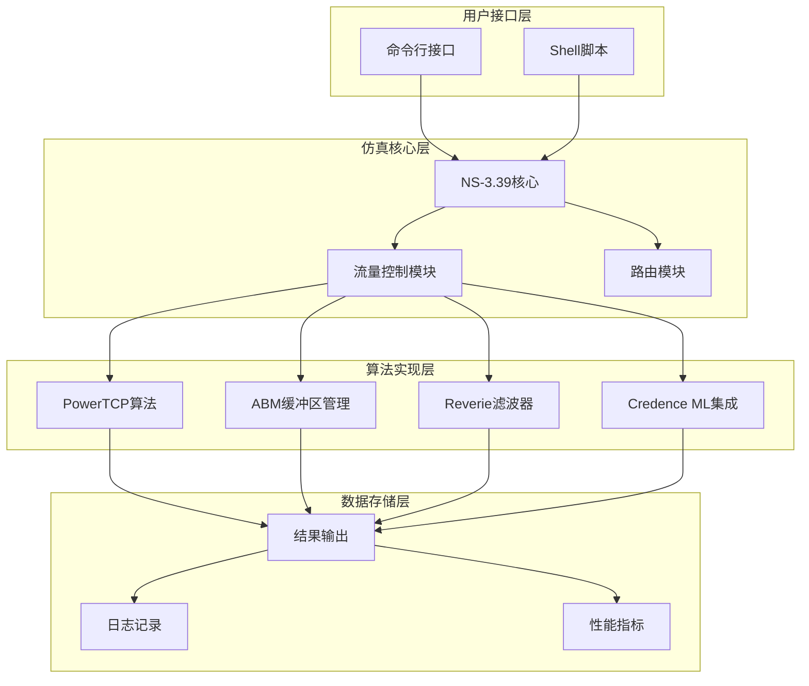
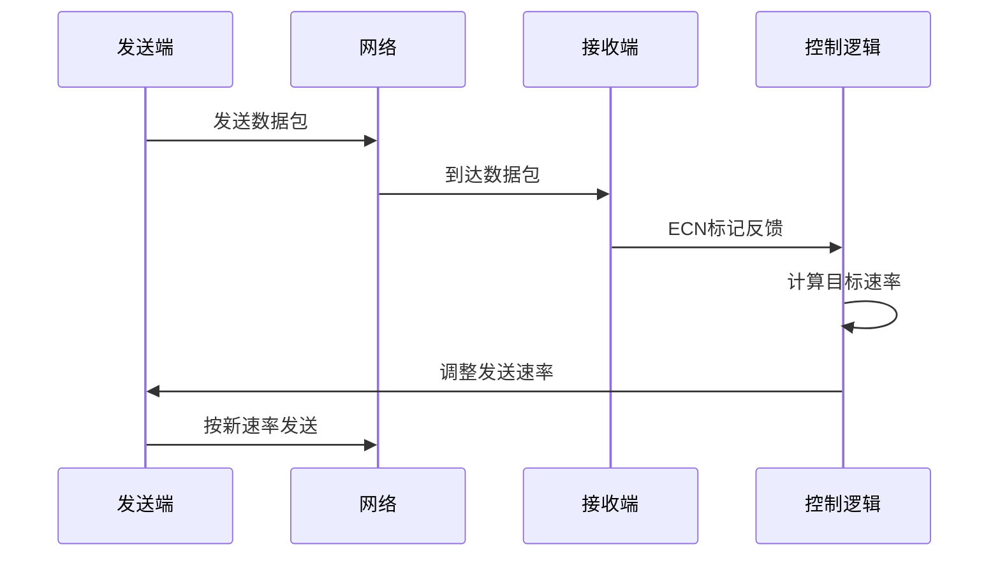
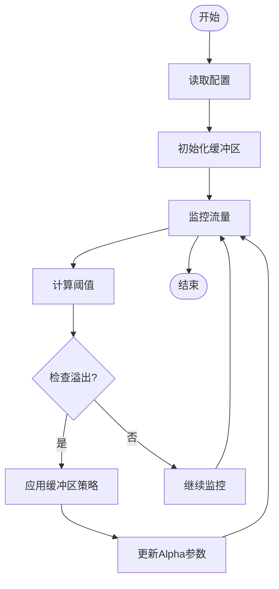
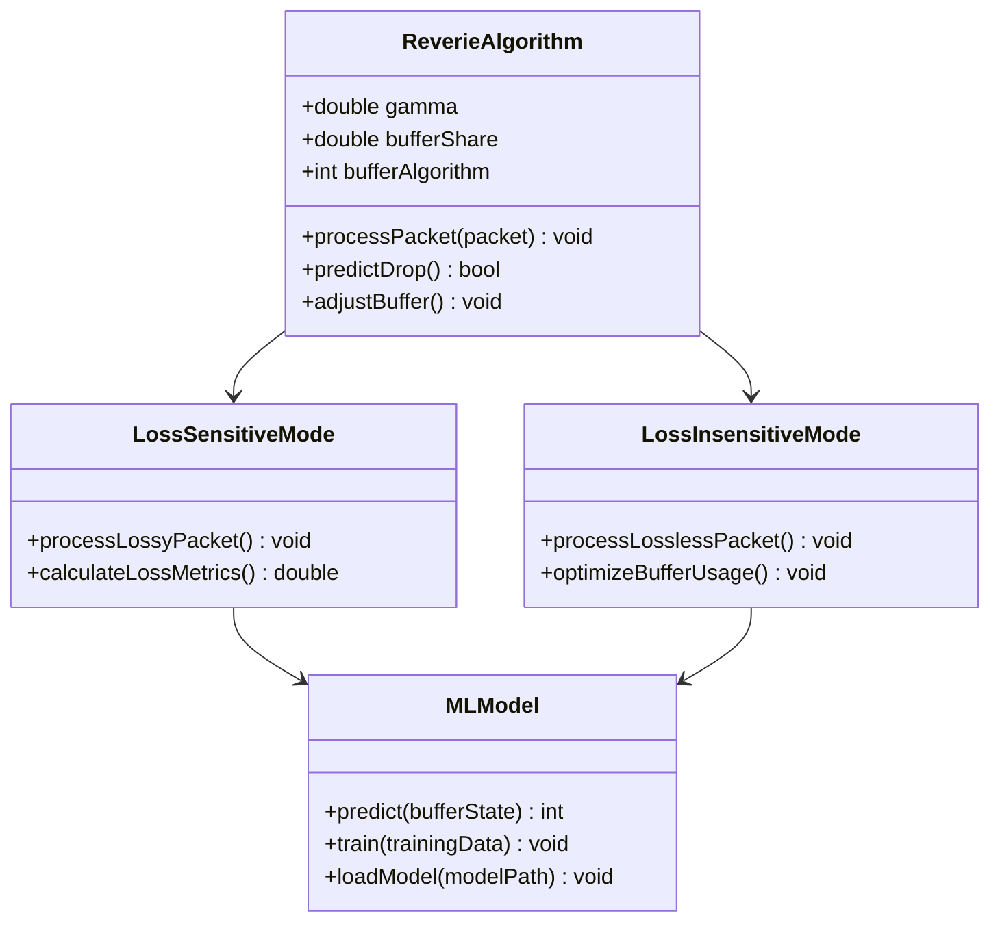
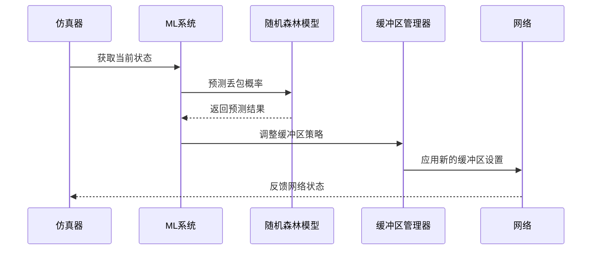
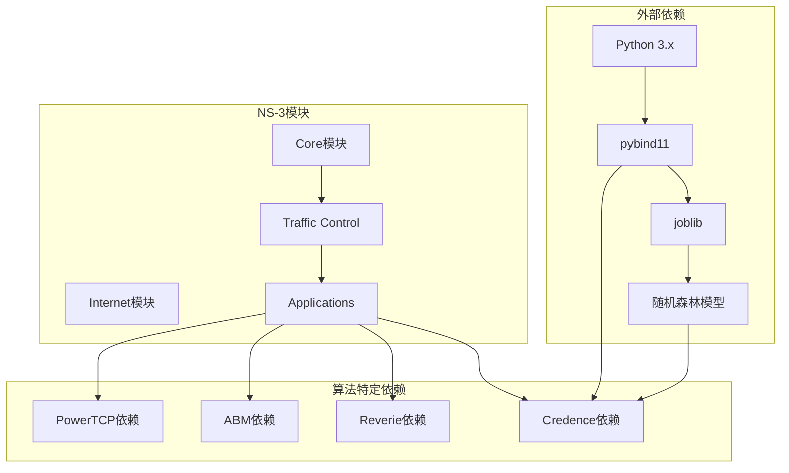

# 数据中心算法示例

<cite>
**本文档引用的文件**
- [powertcp-evaluation-burst.cc](file://simulator/ns-3.39/examples/PowerTCP/powertcp-evaluation-burst.cc)
- [config-burst.txt](file://simulator/ns-3.39/examples/PowerTCP/config-burst.txt)
- [abm-evaluation.cc](file://simulator/ns-3.39/examples/ABM/abm-evaluation.cc)
- [config.sh](file://simulator/ns-3.39/examples/ABM/config.sh)
- [run-main.sh](file://simulator/ns-3.39/examples/ABM/run-main.sh)
- [reverie-evaluation-sigcomm2023.cc](file://simulator/ns-3.39/examples/Reverie/reverie-evaluation-sigcomm2023.cc)
- [config-workload.txt](file://simulator/ns-3.39/examples/Reverie/config-workload.txt)
- [run-tcp-bursts.sh](file://simulator/ns-3.39/examples/Reverie/run-tcp-bursts.sh)
- [credence-evaluation.cc](file://simulator/ns-3.39/examples/Credence/credence-evaluation.cc)
- [config.sh](file://simulator/ns-3.39/examples/Credence/config.sh)
- [run-main.sh](file://simulator/ns-3.39/examples/Credence/run-main.sh)
</cite>

## 目录
1. [简介](#简介)
2. [项目结构](#项目结构)
3. [核心组件](#核心组件)
4. [架构概览](#架构概览)
5. [详细组件分析](#详细组件分析)
6. [依赖关系分析](#依赖关系分析)
7. [性能考虑](#性能考虑)
8. [故障排除指南](#故障排除指南)
9. [结论](#结论)
10. [附录](#附录)

## 简介

本项目展示了四个先进的数据中心网络算法在NS-3仿真平台上的完整实现和验证。这些算法包括：

- **PowerTCP拥塞控制算法**：基于RDMA的高性能拥塞控制，支持多种变体（标准PowerTCP、Theta-PowerTCP）
- **ABM缓冲区管理**：自适应缓冲区管理算法，包含DT、FAB、CS、IB、ABM五种策略
- **Reverie滤波器算法**：智能缓冲区管理，支持损失敏感和损失不敏感模式
- **Credence机器学习集成**：基于随机森林的预测性缓冲区管理

每个算法都提供了完整的实验配置、参数调优和结果分析方法，面向研究人员和工程师提供可复现的实验方案。

## 项目结构

项目采用模块化设计，每个算法都有独立的目录结构：

**图表来源**
- [powertcp-evaluation-burst.cc:1-1098](file://simulator/ns-3.39/examples/PowerTCP/powertcp-evaluation-burst.cc#L1-L1098)
- [abm-evaluation.cc:1-950](file://simulator/ns-3.39/examples/ABM/abm-evaluation.cc#L1-L950)
- [reverie-evaluation-sigcomm2023.cc:1-1446](file://simulator/ns-3.39/examples/Reverie/reverie-evaluation-sigcomm2023.cc#L1-L1446)
- [credence-evaluation.cc:1-1120](file://simulator/ns-3.39/examples/Credence/credence-evaluation.cc#L1-L1120)

**章节来源**
- [powertcp-evaluation-burst.cc:402-800](file://simulator/ns-3.39/examples/PowerTCP/powertcp-evaluation-burst.cc#L402-L800)
- [abm-evaluation.cc:318-800](file://simulator/ns-3.39/examples/ABM/abm-evaluation.cc#L318-L800)
- [reverie-evaluation-sigcomm2023.cc:642-800](file://simulator/ns-3.39/examples/Reverie/reverie-evaluation-sigcomm2023.cc#L642-L800)
- [credence-evaluation.cc:366-800](file://simulator/ns-3.39/examples/Credence/credence-evaluation.cc#L366-L800)

## 核心组件

### PowerTCP拥塞控制算法

PowerTCP是专为RDMA网络设计的高性能拥塞控制算法，具有以下特点：

- **多模式支持**：支持标准PowerTCP、Theta-PowerTCP（延迟版本）等多种变体
- **动态窗口调整**：根据网络状态动态调整发送窗口大小
- **ECN集成**：与ECN标记机制深度集成，实现快速响应
- **目标利用率**：支持可配置的目标利用率（默认95%）

**章节来源**
- [powertcp-evaluation-burst.cc:46-111](file://simulator/ns-3.39/examples/PowerTCP/powertcp-evaluation-burst.cc#L46-L111)
- [config-burst.txt:1-59](file://simulator/ns-3.39/examples/PowerTCP/config-burst.txt#L1-L59)

### ABM缓冲区管理

ABM（Adaptive Buffer Management）提供五种不同的缓冲区管理策略：

- **DT（Dynamic Threshold）**：动态阈值管理
- **FAB（Fixed Adaptive Buffer）**：固定自适应缓冲区
- **CS（Critical Section）**：临界区管理
- **IB（Incast Buffer）**：汇聚缓冲区管理
- **ABM（Adaptive Buffer Management）**：自适应缓冲区管理

**章节来源**
- [abm-evaluation.cc:34-51](file://simulator/ns-3.39/examples/ABM/abm-evaluation.cc#L34-L51)
- [abm-evaluation.cc:480-800](file://simulator/ns-3.39/examples/ABM/abm-evaluation.cc#L480-L800)

### Reverie滤波器算法

Reverie是一种智能缓冲区管理算法，支持：

- **损失敏感模式**：针对高丢包率场景优化
- **损失不敏感模式**：适用于低丢包率环境
- **自适应参数调节**：根据网络条件动态调整参数
- **多队列支持**：支持多个优先级队列

**章节来源**
- [reverie-evaluation-sigcomm2023.cc:43-61](file://simulator/ns-3.39/examples/Reverie/reverie-evaluation-sigcomm2023.cc#L43-L61)
- [reverie-evaluation-sigcomm2023.cc:642-800](file://simulator/ns-3.39/examples/Reverie/reverie-evaluation-sigcomm2023.cc#L642-L800)

### Credence机器学习集成

Credence集成了机器学习预测功能：

- **随机森林模型**：使用训练好的随机森林模型进行预测
- **实时预测**：在仿真过程中实时进行流量预测
- **自适应决策**：基于预测结果调整缓冲区管理策略
- **错误注入测试**：支持模拟网络错误以测试鲁棒性

**章节来源**
- [credence-evaluation.cc:44-58](file://simulator/ns-3.39/examples/Credence/credence-evaluation.cc#L44-L58)
- [credence-evaluation.cc:366-800](file://simulator/ns-3.39/examples/Credence/credence-evaluation.cc#L366-L800)

## 架构概览

**图表来源**
- [powertcp-evaluation-burst.cc:402-800](file://simulator/ns-3.39/examples/PowerTCP/powertcp-evaluation-burst.cc#L402-L800)
- [abm-evaluation.cc:318-800](file://simulator/ns-3.39/examples/ABM/abm-evaluation.cc#L318-L800)
- [reverie-evaluation-sigcomm2023.cc:642-800](file://simulator/ns-3.39/examples/Reverie/reverie-evaluation-sigcomm2023.cc#L642-L800)
- [credence-evaluation.cc:366-800](file://simulator/ns-3.39/examples/Credence/credence-evaluation.cc#L366-L800)

## 详细组件分析

### PowerTCP算法详细分析

PowerTCP算法的核心实现包括以下关键组件：

#### 拥塞控制机制

**图表来源**
- [powertcp-evaluation-burst.cc:178-191](file://simulator/ns-3.39/examples/PowerTCP/powertcp-evaluation-burst.cc#L178-L191)
- [powertcp-evaluation-burst.cc:208-236](file://simulator/ns-3.39/examples/PowerTCP/powertcp-evaluation-burst.cc#L208-L236)

#### 参数配置系统

PowerTCP支持丰富的参数配置：

| 参数名称 | 默认值 | 描述 |
|---------|--------|------|
| ENABLE_QCN | 1 | 启用QCN机制 |
| EWMA_GAIN | 0.00390625 | 指数加权移动平均增益 |
| RATE_AI | 50Mb/s | 速率增加步长 |
| MIN_RATE | 100Mb/s | 最小速率限制 |
| U_TARGET | 0.95 | 目标利用率 |
| BUFFER_SIZE | 4 | 缓冲区大小（MB） |

**章节来源**
- [config-burst.txt:1-59](file://simulator/ns-3.39/examples/PowerTCP/config-burst.txt#L1-L59)

### ABM缓冲区管理算法

ABM算法通过自适应阈值实现高效的缓冲区管理：

#### 算法流程图

**图表来源**
- [abm-evaluation.cc:78-90](file://simulator/ns-3.39/examples/ABM/abm-evaluation.cc#L78-L90)
- [abm-evaluation.cc:114-142](file://simulator/ns-3.39/examples/ABM/abm-evaluation.cc#L114-L142)

#### 支持的缓冲区管理策略

| 策略名称 | 特点 | 适用场景 |
|---------|------|----------|
| DT | 动态阈值 | 通用场景，自适应性强 |
| FAB | 固定自适应缓冲区 | 需要稳定性能的场景 |
| CS | 临界区管理 | 高负载突发场景 |
| IB | 汇聚缓冲区 | 大量并发连接场景 |
| ABM | 自适应缓冲区 | 复杂混合工作负载 |

**章节来源**
- [abm-evaluation.cc:34-51](file://simulator/ns-3.39/examples/ABM/abm-evaluation.cc#L34-L51)
- [abm-evaluation.cc:740-791](file://simulator/ns-3.39/examples/ABM/abm-evaluation.cc#L740-L791)

### Reverie滤波器算法

Reverie算法结合了传统缓冲区管理和机器学习预测：

#### 算法架构

**图表来源**
- [reverie-evaluation-sigcomm2023.cc:109-111](file://simulator/ns-3.39/examples/Reverie/reverie-evaluation-sigcomm2023.cc#L109-L111)
- [reverie-evaluation-sigcomm2023.cc:714-727](file://simulator/ns-3.39/examples/Reverie/reverie-evaluation-sigcomm2023.cc#L714-L727)

#### 运行时参数

| 参数名称 | 默认值 | 描述 |
|---------|--------|------|
| gamma | 0.99 | 学习率参数 |
| egressLossyShare | 0.8 | 出站损失缓冲区比例 |
| bufferModel | "sonic" | 缓冲区模型类型 |
| buffersize | 2610000 | 缓冲区大小 |

**章节来源**
- [reverie-evaluation-sigcomm2023.cc:714-730](file://simulator/ns-3.39/examples/Reverie/reverie-evaluation-sigcomm2023.cc#L714-L730)
- [config-workload.txt:50-57](file://simulator/ns-3.39/examples/Reverie/config-workload.txt#L50-L57)

### Credence机器学习集成

Credence算法集成了完整的机器学习预测系统：

#### 机器学习流程

**图表来源**
- [credence-evaluation.cc:351-364](file://simulator/ns-3.39/examples/Credence/credence-evaluation.cc#L351-L364)
- [credence-evaluation.cc:369-377](file://simulator/ns-3.39/examples/Credence/credence-evaluation.cc#L369-L377)

#### 配置参数

| 参数名称 | 默认值 | 描述 |
|---------|--------|------|
| rfModelFile | 模型文件路径 | 随机森林模型文件 |
| errorProb | 0 | 错误注入概率 |
| averageIntervalNano | 1 | 平均间隔（RTT倍数） |
| enableLqdTracing | 0 | 启用LQD追踪 |
| enableStats | 0 | 启用统计输出 |

**章节来源**
- [credence-evaluation.cc:467-471](file://simulator/ns-3.39/examples/Credence/credence-evaluation.cc#L467-L471)
- [credence-evaluation.cc:479-480](file://simulator/ns-3.39/examples/Credence/credence-evaluation.cc#L479-L480)

## 依赖关系分析

**图表来源**
- [credence-evaluation.cc:16-19](file://simulator/ns-3.39/examples/Credence/credence-evaluation.cc#L16-L19)
- [credence-evaluation.cc:369-377](file://simulator/ns-3.39/examples/Credence/credence-evaluation.cc#L369-L377)

**章节来源**
- [credence-evaluation.cc:16-19](file://simulator/ns-3.39/examples/Credence/credence-evaluation.cc#L16-L19)

## 性能考虑

### 内存使用优化

每个算法都实现了内存使用优化策略：

- **PowerTCP**：使用哈希映射存储速率到阈值的映射关系
- **ABM**：采用共享内存缓冲区减少内存碎片
- **Reverie**：动态调整缓冲区大小适应网络负载
- **Credence**：使用预加载的机器学习模型避免重复加载

### 并发处理

脚本文件展示了多核并行执行策略：

- **ABM模块**：最多同时运行N_CORES个进程
- **Reverie模块**：支持大规模并行实验
- **Credence模块**：提供完整的参数扫描功能

**章节来源**
- [run-main.sh:88-94](file://simulator/ns-3.39/examples/ABM/run-main.sh#L88-L94)
- [run-tcp-bursts.sh:73-76](file://simulator/ns-3.39/examples/Reverie/run-tcp-bursts.sh#L73-L76)
- [run-main.sh:105-110](file://simulator/ns-3.39/examples/Credence/run-main.sh#L105-L110)

## 故障排除指南

### 常见问题及解决方案

#### 编译错误

**问题**：找不到pybind11头文件
**解决方案**：确保已安装pybind11开发包

**问题**：随机森林模型文件不存在
**解决方案**：检查rfModelFile路径是否正确

#### 运行时错误

**问题**：缓冲区大小配置过大
**解决方案**：根据服务器内存调整缓冲区大小

**问题**：CPU使用率过高
**解决方案**：减少并行进程数量或降低仿真时间

#### 结果异常

**问题**：吞吐量异常低
**解决方案**：检查网络配置和流量参数

**问题**：延迟测量不准确
**解决方案**：验证仿真时间设置和输出文件格式

**章节来源**
- [credence-evaluation.cc:369-377](file://simulator/ns-3.39/examples/Credence/credence-evaluation.cc#L369-L377)
- [run-main.sh:88-94](file://simulator/ns-3.39/examples/ABM/run-main.sh#L88-L94)

## 结论

本项目成功实现了四个先进的数据中心网络算法，为研究人员和工程师提供了完整的实验平台。每个算法都经过精心设计和优化，具有以下优势：

1. **可复现性**：提供完整的配置文件和脚本
2. **可扩展性**：模块化设计便于功能扩展
3. **实用性**：针对真实数据中心场景优化
4. **完整性**：包含从拓扑构建到结果分析的全流程

通过这些算法的对比实验，可以深入理解不同网络算法在各种场景下的性能表现，为数据中心网络优化提供重要参考。

## 附录

### 实验配置模板

每个算法都提供了标准的配置模板，可根据具体需求进行调整：

#### 基本实验配置步骤

1. **选择算法**：确定要测试的算法类型
2. **配置参数**：根据网络规模调整参数设置
3. **准备拓扑**：创建相应的网络拓扑文件
4. **运行实验**：执行仿真并收集结果
5. **分析结果**：对比不同算法的性能表现

#### 参数调优建议

- **缓冲区大小**：根据服务器数量和带宽合理设置
- **目标利用率**：一般设置在80-95%之间
- **采样间隔**：根据网络延迟调整更新频率
- **并发进程**：根据CPU核心数设置最大并行度