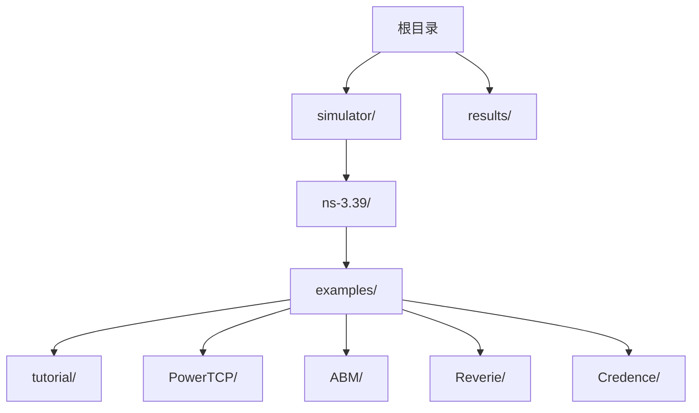
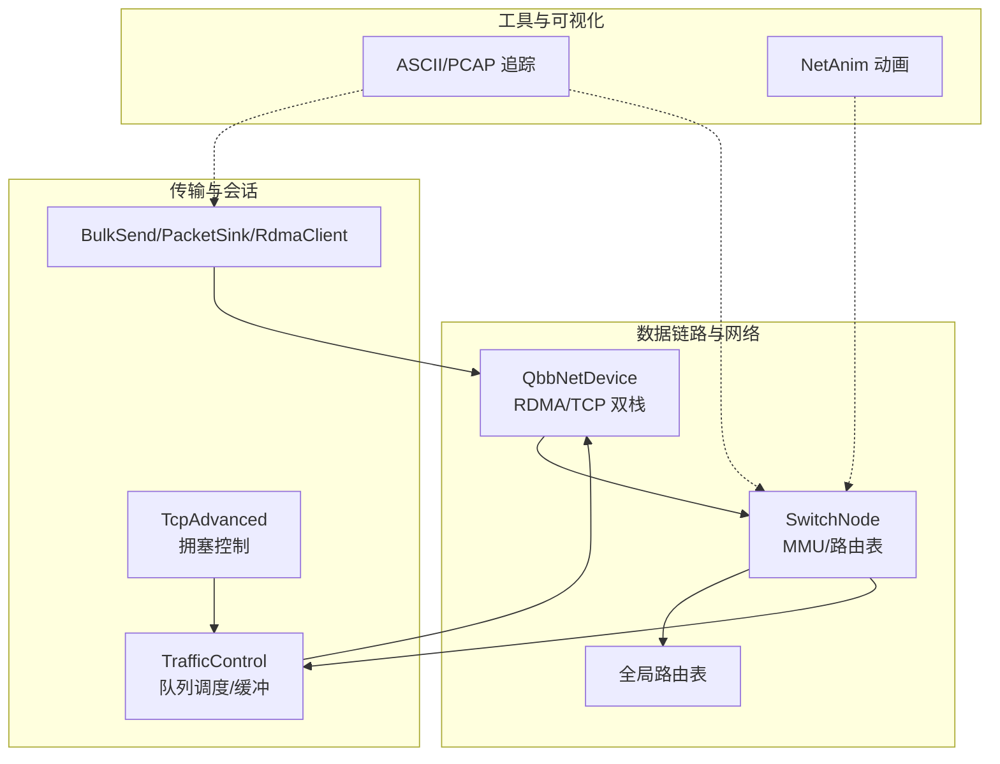
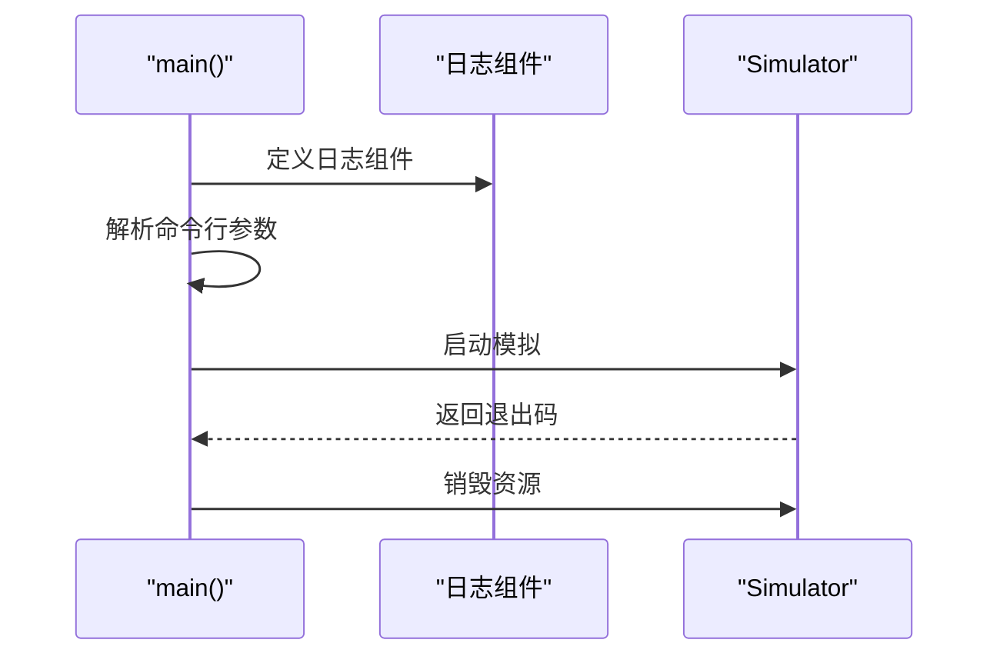
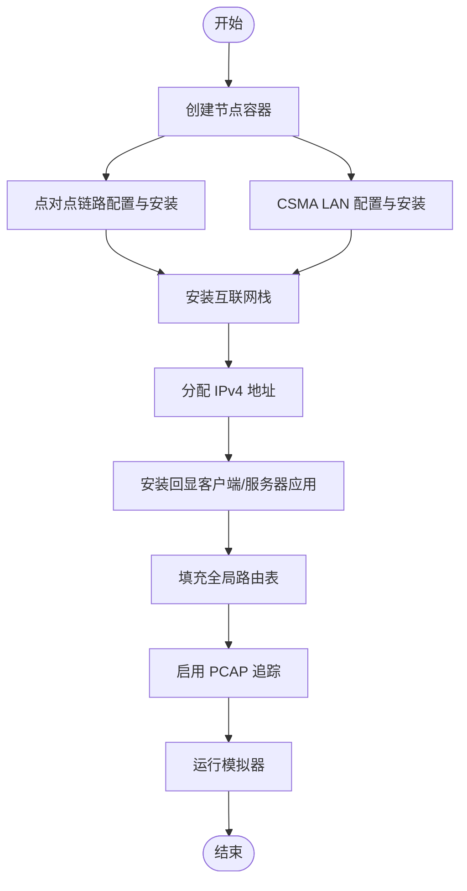
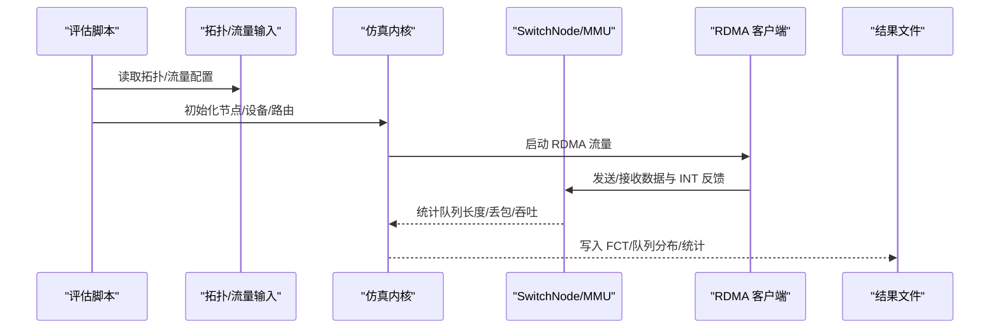
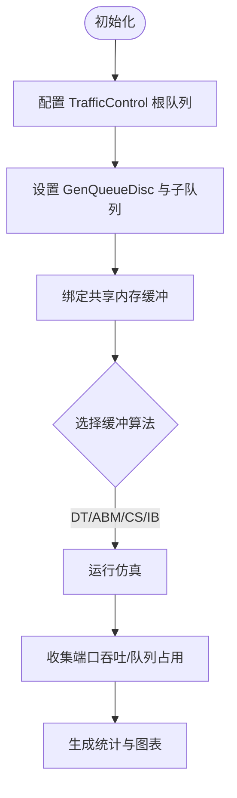
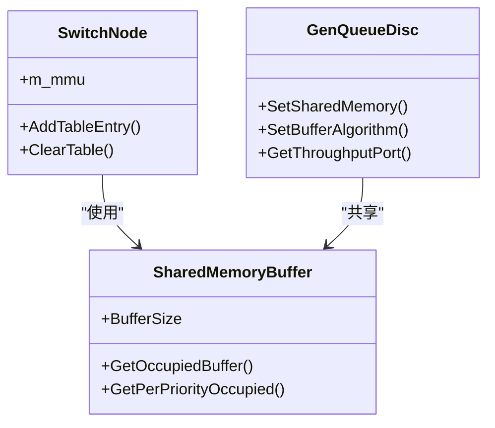
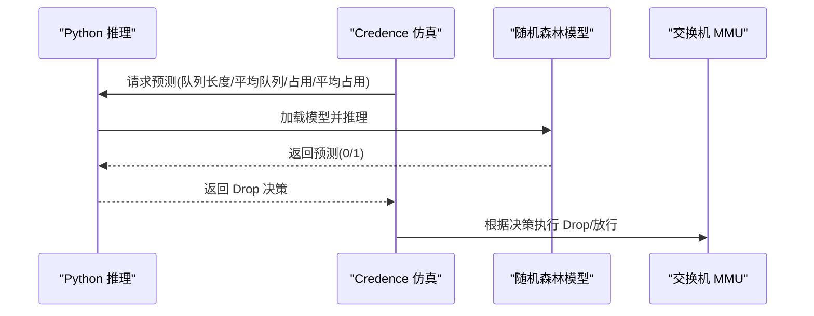
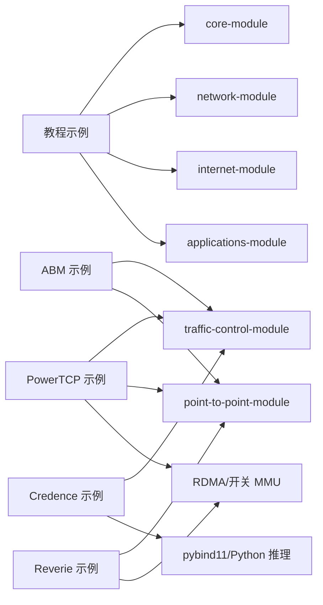

# 示例与教程

<cite>
**本文引用的文件**
- [README.md](file://README.md)
- [simulator/README.md](file://simulator/README.md)
- [hello-simulator.cc](file://simulator/ns-3.39/examples/tutorial/hello-simulator.cc)
- [first.cc](file://simulator/ns-3.39/examples/tutorial/first.cc)
- [second.cc](file://simulator/ns-3.39/examples/tutorial/second.cc)
- [third.cc](file://simulator/ns-3.39/examples/tutorial/third.cc)
- [powertcp-evaluation-burst.cc](file://simulator/ns-3.39/examples/PowerTCP/powertcp-evaluation-burst.cc)
- [README.md](file://simulator/ns-3.39/examples/PowerTCP/README.md)
- [abm-evaluation.cc](file://simulator/ns-3.39/examples/ABM/abm-evaluation.cc)
- [README.md](file://simulator/ns-3.39/examples/ABM/README.md)
- [reverie-evaluation-sigcomm2023.cc](file://simulator/ns-3.39/examples/Reverie/reverie-evaluation-sigcomm2023.cc)
- [credence-evaluation.cc](file://simulator/ns-3.39/examples/Credence/credence-evaluation.cc)
</cite>

## 目录
1. [简介](#简介)
2. [项目结构](#项目结构)
3. [核心组件](#核心组件)
4. [架构总览](#架构总览)
5. [详细组件分析](#详细组件分析)
6. [依赖关系分析](#依赖关系分析)
7. [性能考虑](#性能考虑)
8. [故障排查指南](#故障排查指南)
9. [结论](#结论)
10. [附录](#附录)

## 简介
本文件为 NS-3 数据中心平台的示例与教程集合，覆盖从入门到高级的完整学习路径。内容基于仓库中的官方示例与论文扩展实现，围绕以下主题展开：
- 基础入门：Hello Simulator、第一个网络拓扑
- 数据中心拥塞控制与缓冲管理：PowerTCP、ABM、Reverie、Credence
- 实验设计、结果解析与性能评估方法
- 常见问题与调试技巧

目标是帮助不同层次的读者循序渐进地掌握 NS-3 在数据中心场景下的建模、仿真与分析。

## 项目结构
仓库采用模块化组织方式，核心目录与用途如下：
- simulator/ns-3.39/examples/tutorial：NS-3 官方教程示例（Hello、第一个网络等）
- simulator/ns-3.39/examples/PowerTCP：PowerTCP 及相关变体（Theta-PowerTCP）在 RDMA/TCP 场景下的评估脚本与示例
- simulator/ns-3.39/examples/ABM：Active Buffer Management 的多场景评估
- simulator/ns-3.39/examples/Reverie：低通滤波器型交换机缓冲共享模型
- simulator/ns-3.39/examples/Credence：结合机器学习预测的缓冲管理增强方案
- results：存放历史或中间结果（如需使用可在此目录下组织输出）

图表来源
- [README.md](file://README.md)
- [simulator/README.md](file://simulator/README.md)

章节来源
- [README.md](file://README.md)
- [simulator/README.md](file://simulator/README.md)

## 核心组件
- 教程示例（tutorial）：提供 Hello Simulator 与“第一个网络”等基础示例，帮助快速上手 NS-3 模块与运行流程。
- PowerTCP 示例：支持 RDMA 与 TCP/IP 双栈流量，包含突发、公平性与工作负载三类评估脚本。
- ABM 示例：在 TCP/IP 栈中实现动态阈值（DT）、活跃缓冲管理（ABM）等算法，支持优先级队列与共享内存缓冲。
- Reverie 示例：在交换机 MMU 中引入低通滤波器思想，支持入/出方向缓冲策略与 ECN/PFC 行为跟踪。
- Credence 示例：结合 scikit-learn 预测模型，通过 pybind11 将 Python 推理集成到 C++ 仿真中，实现 LQD/FollowLQD 与 Credence 等算法。

章节来源
- [hello-simulator.cc](file://simulator/ns-3.39/examples/tutorial/hello-simulator.cc)
- [first.cc](file://simulator/ns-3.39/examples/tutorial/first.cc)
- [powertcp-evaluation-burst.cc](file://simulator/ns-3.39/examples/PowerTCP/powertcp-evaluation-burst.cc)
- [abm-evaluation.cc](file://simulator/ns-3.39/examples/ABM/abm-evaluation.cc)
- [reverie-evaluation-sigcomm2023.cc](file://simulator/ns-3.39/examples/Reverie/reverie-evaluation-sigcomm2023.cc)
- [credence-evaluation.cc](file://simulator/ns-3.39/examples/Credence/credence-evaluation.cc)

## 架构总览
数据中心平台在 NS-3 中的关键扩展包括：
- 交换机 MMU：支持 SONIC/Reverie 等模型，提供入/出方向共享池与头阻（headroom）管理
- RDMA 支持：在 QbbNetDevice 与 SwitchNode 上扩展，支持 RDMA 流量与 INT（In-band Network Telemetry）反馈
- 拥塞控制与缓冲管理：在 TCP/IP 栈（TcpAdvanced）与流量控制层（GenQueueDisc）分别实现多种算法
- 应用层：BulkSendApplication、PacketSink、RdmaClient 等，配合 Python 脚本进行大规模并行实验

图表来源
- [README.md](file://README.md)
- [powertcp-evaluation-burst.cc](file://simulator/ns-3.39/examples/PowerTCP/powertcp-evaluation-burst.cc)
- [abm-evaluation.cc](file://simulator/ns-3.39/examples/ABM/abm-evaluation.cc)
- [reverie-evaluation-sigcomm2023.cc](file://simulator/ns-3.39/examples/Reverie/reverie-evaluation-sigcomm2023.cc)
- [credence-evaluation.cc](file://simulator/ns-3.39/examples/Credence/credence-evaluation.cc)

## 详细组件分析

### 教程：Hello Simulator
- 目标：展示 NS-3 日志系统与最小化主程序结构
- 关键点：包含日志组件定义、命令行参数解析、模拟器启动与销毁
- 扩展建议：添加节点、设备、应用与路由，逐步构建更复杂的拓扑

图表来源
- [hello-simulator.cc](file://simulator/ns-3.39/examples/tutorial/hello-simulator.cc)

章节来源
- [hello-simulator.cc](file://simulator/ns-3.39/examples/tutorial/hello-simulator.cc)

### 教程：第一个网络（点对点 + CSMA/LAN）
- 目标：构建包含点对点链路与 CSMA LAN 的混合拓扑，部署 UDP 回显应用
- 关键点：节点容器、设备安装、IP 分配、应用安装、路由表填充、PCAP 追踪
- 扩展建议：增加无线（WiFi）节点；切换到更复杂拓扑（树形/Fat Tree）

图表来源
- [first.cc](file://simulator/ns-3.39/examples/tutorial/first.cc)
- [second.cc](file://simulator/ns-3.39/examples/tutorial/second.cc)
- [third.cc](file://simulator/ns-3.39/examples/tutorial/third.cc)

章节来源
- [first.cc](file://simulator/ns-3.39/examples/tutorial/first.cc)
- [second.cc](file://simulator/ns-3.39/examples/tutorial/second.cc)
- [third.cc](file://simulator/ns-3.39/examples/tutorial/third.cc)

### PowerTCP：突发、公平性与工作负载评估
- 目标：在 RDMA 与 TCP/IP 双栈下评估 PowerTCP/Theta-PowerTCP/HPCC/TIMELY/DCQCN 的吞吐、公平性与尾时延
- 关键点：RDMA 客户端、INT 反馈、队列监控、拓扑/流量文件驱动、结果解析与绘图脚本
- 实验设计：突发场景（10:1 入向）、公平性测试、工作负载（不同负载/请求率/请求大小）
- 结果分析：FCT、慢速下降（slowdown）、吞吐、缓冲占用分布

图表来源
- [powertcp-evaluation-burst.cc](file://simulator/ns-3.39/examples/PowerTCP/powertcp-evaluation-burst.cc)
- [README.md](file://simulator/ns-3.39/examples/PowerTCP/README.md)

章节来源
- [powertcp-evaluation-burst.cc](file://simulator/ns-3.39/examples/PowerTCP/powertcp-evaluation-burst.cc)
- [README.md](file://simulator/ns-3.39/examples/PowerTCP/README.md)

### ABM：动态阈值与活跃缓冲管理
- 目标：在 TCP/IP 栈中实现 DT、ABM、CS、IB 等缓冲管理算法，支持多优先级队列与共享内存缓冲
- 关键点：GenQueueDisc 根队列、子队列（Fifo/RED/FQ-CoDel 等）、共享内存缓冲、ALPHA 参数文件
- 实验设计：缓冲大小扫描、更新间隔、优先级数变化、混合流量场景
- 结果分析：端口级吞吐、队列占用分布、慢速下降、端口级统计

图表来源
- [abm-evaluation.cc](file://simulator/ns-3.39/examples/ABM/abm-evaluation.cc)
- [README.md](file://simulator/ns-3.39/examples/ABM/README.md)

章节来源
- [abm-evaluation.cc](file://simulator/ns-3.39/examples/ABM/abm-evaluation.cc)
- [README.md](file://simulator/ns-3.39/examples/ABM/README.md)

### Reverie：低通滤波器型缓冲共享
- 目标：在交换机 MMU 中实现入/出方向缓冲共享与头阻管理，支持 ECN/PFC 行为追踪
- 关键点：入方向 DT/ABM 与出方向 DT/ABM 组合、共享池比例、gamma 参数、队列监控
- 实验设计：RDMA/TCP 混合流量、入向突发、不同共享池比例
- 结果分析：交换机各池占用、端口吞吐、PFC/Pause 事件

图表来源
- [reverie-evaluation-sigcomm2023.cc](file://simulator/ns-3.39/examples/Reverie/reverie-evaluation-sigcomm2023.cc)

章节来源
- [reverie-evaluation-sigcomm2023.cc](file://simulator/ns-3.39/examples/Reverie/reverie-evaluation-sigcomm2023.cc)

### Credence：机器学习增强的缓冲管理
- 目标：将 scikit-learn 预测模型嵌入仿真，通过 pybind11 获取 Drop 决策，提升 LQD/FollowLQD/Credence 性能
- 关键点：Python 推理接口、随机森林模型加载、缓冲事件追踪、预测决策注入
- 实验设计：不同模型文件、预测触发时机、错误概率注入
- 结果分析：队列长度/占用与 Drop 决策的关系、吞吐与公平性指标

图表来源
- [credence-evaluation.cc](file://simulator/ns-3.39/examples/Credence/credence-evaluation.cc)

章节来源
- [credence-evaluation.cc](file://simulator/ns-3.39/examples/Credence/credence-evaluation.cc)

## 依赖关系分析
- 模块依赖：教程示例依赖 core、network、internet、applications、point-to-point、csma 等模块；数据中心扩展示例依赖 traffic-control、point-to-point、internet、applications 以及自定义的 RDMA/开关 MMU 组件
- 外部依赖：PowerTCP/Reverie/Credence 示例涉及 Python/脚本（plot/*.py、results/*.sh），用于结果解析与绘图
- 并行与资源：ABM/PowerTCP 工作负载脚本支持并行运行，需根据 CPU 核心数调整并发度

图表来源
- [README.md](file://README.md)
- [first.cc](file://simulator/ns-3.39/examples/tutorial/first.cc)
- [powertcp-evaluation-burst.cc](file://simulator/ns-3.39/examples/PowerTCP/powertcp-evaluation-burst.cc)
- [abm-evaluation.cc](file://simulator/ns-3.39/examples/ABM/abm-evaluation.cc)
- [reverie-evaluation-sigcomm2023.cc](file://simulator/ns-3.39/examples/Reverie/reverie-evaluation-sigcomm2023.cc)
- [credence-evaluation.cc](file://simulator/ns-3.39/examples/Credence/credence-evaluation.cc)

章节来源
- [README.md](file://README.md)

## 性能考虑
- 拓扑规模与并行：ABM/PowerTCP 工作负载脚本默认以较高并发运行，建议根据 CPU 核心数适当降低并发度，避免 I/O 与内存瓶颈
- 队列与缓冲：合理设置队列最大尺寸、共享缓冲大小与 ALPHA 更新间隔，平衡延迟与吞吐
- 负载与窗口：RDMA/TCP 流量的窗口大小、RTT 估计与拥塞控制参数直接影响吞吐与公平性
- 追踪开销：启用大量 ASCII/PCAP 追踪会显著增加 IO 开销，建议仅在必要时开启

## 故障排查指南
- 编译与构建
  - 确认已正确配置与编译 NS-3（参考根目录 README 的构建说明）
  - 若缺少依赖库，按提示安装对应系统依赖后重新构建
- 示例运行
  - PowerTCP/ABM/Reverie/Credence 示例均提供脚本（如 script-*.sh、results-*.sh、plot-*.py），请先阅读对应 README 的使用说明
  - 注意脚本中的并发限制与路径配置，确保环境变量与绝对路径正确
- 日志与调试
  - 使用 NS_LOG 组件输出关键信息，逐步缩小问题范围
  - 对 RDMA 流量，检查 RDMA 客户端/驱动与队列对端口映射是否一致
- 结果异常
  - 若吞吐异常低：检查链路带宽/延迟设置、队列阈值与 ECN/PFC 行为
  - 若公平性差：调整拥塞控制算法、窗口大小与优先级权重
  - 若队列持续增长：增大缓冲或调整缓冲算法（ABM/Reverie/Credence）

章节来源
- [README.md](file://README.md)
- [README.md](file://simulator/ns-3.39/examples/PowerTCP/README.md)
- [README.md](file://simulator/ns-3.39/examples/ABM/README.md)

## 结论
本教程集合提供了从入门到高级的数据中心仿真实践路径，涵盖 NS-3 基础示例与 PowerTCP、ABM、Reverie、Credence 等前沿算法的实际应用。通过规范的实验设计、结果解析与性能评估方法，读者可以系统掌握数据中心网络的建模与优化技术，并在此基础上开展进一步研究与扩展。

## 附录
- 学习路径建议
  - 入门：完成 tutorial 中的 Hello 与第一个网络示例，熟悉 NS-3 模块与运行流程
  - 进阶：尝试 ABM/PowerTCP 示例，理解队列与缓冲管理在 TCP/IP 栈中的作用
  - 高级：探索 Reverie/Credence 示例，掌握交换机 MMU 与机器学习预测的融合
- 实验模板
  - 以 ABM 示例为模板，修改缓冲算法、优先级数与负载参数，对比不同策略的吞吐与公平性
  - 以 PowerTCP 示例为模板，切换 RDMA/TCP 流量类型与拥塞控制算法，观察队列与 FCT 变化
- 结果可视化
  - 使用示例脚本生成结果文件，再用 plot-*.py 生成图表，便于论文与报告呈现