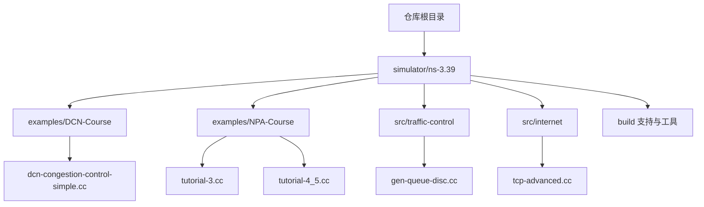
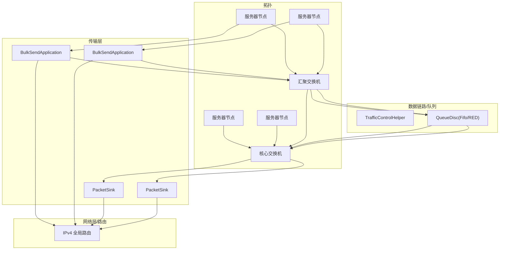
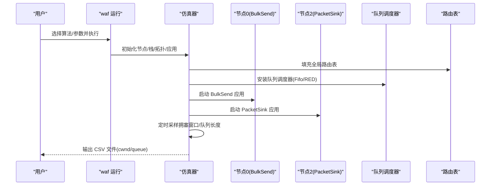
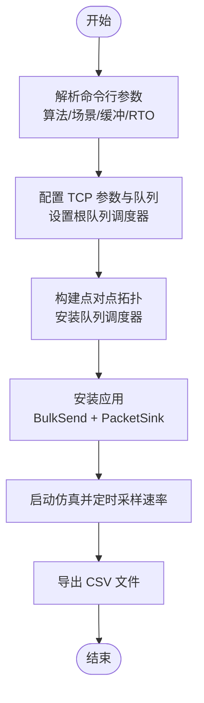
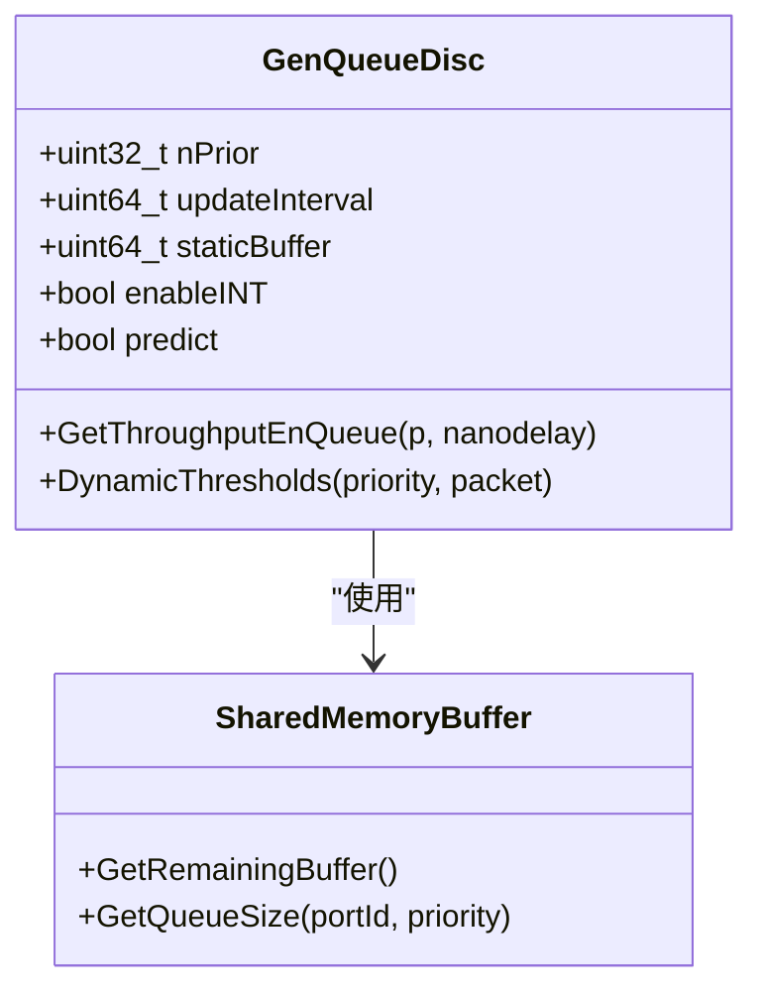
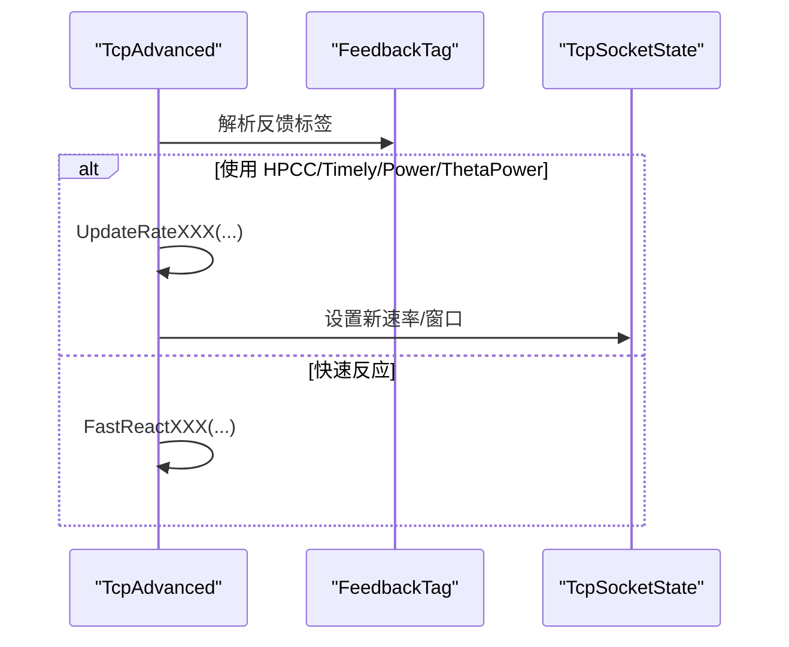
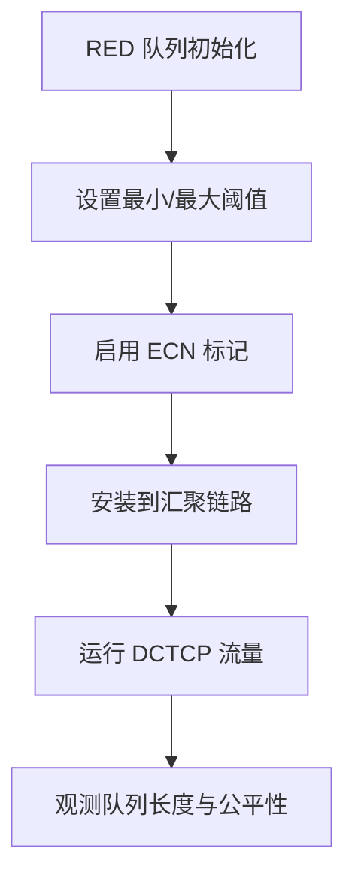
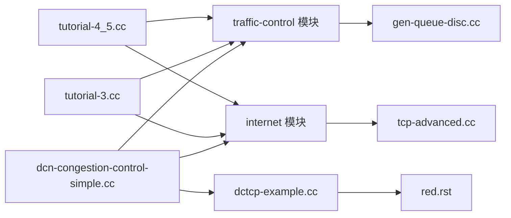

# 课程材料

<cite>
**本文引用的文件**
- [README.md](file://README.md)
- [dcn-congestion-control-simple.cc](file://simulator/ns-3.39/examples/DCN-Course/dcn-congestion-control-simple.cc)
- [tutorial-4_5.cc](file://simulator/ns-3.39/examples/NPA-Course/tutorial-4_5.cc)
- [tutorial-3.cc](file://simulator/ns-3.39/examples/NPA-Course/tutorial-3.cc)
- [config.sh](file://simulator/ns-3.39/examples/DCN-Course/config.sh)
- [tutorial-4_5.sh](file://simulator/ns-3.39/examples/NPA-Course/tutorial-4_5.sh)
- [gen-queue-disc.cc](file://simulator/ns-3.39/src/traffic-control/model/gen-queue-disc.cc)
- [tcp-advanced.cc](file://simulator/ns-3.39/src/internet/model/tcp-advanced.cc)
- [dctcp-example.cc](file://simulator/ns-3.39/examples/tcp/dctcp-example.cc)
- [red.rst](file://simulator/ns-3.39/src/traffic-control/doc/red.rst)
- [tcp.rst](file://simulator/ns-3.39/src/internet/doc/tcp.rst)
</cite>

## 目录
1. [引言](#引言)
2. [项目结构](#项目结构)
3. [核心组件](#核心组件)
4. [架构总览](#架构总览)
5. [详细组件分析](#详细组件分析)
6. [依赖关系分析](#依赖关系分析)
7. [性能考量](#性能考量)
8. [故障排查指南](#故障排查指南)
9. [结论](#结论)
10. [附录](#附录)

## 引言
本课程围绕数据中心网络（DCN）与网络协议分析展开，结合 ns-3.39 拓展版本中的课程示例与高级模块，提供从基础到进阶的系统化学习路径。课程目标包括：
- 理解数据中心网络拓扑与队列调度模型
- 掌握拥塞控制算法在不同场景下的行为差异
- 学会使用 ns-3 的流量控制与 TCP 扩展模块进行仿真实验
- 基于 CSV 输出与可视化工具进行数据分析与报告撰写

课程配套示例覆盖：
- 数据中心拥塞控制对比（Reno/Cubic/DCTCP 等）
- 多流与单流场景下的吞吐与窗口变化分析
- 队列管理与共享缓冲区策略（含 ABM/Reverie/Credence 等思想）

## 项目结构
仓库包含 ns-3.39 核心、扩展模块与课程示例。课程相关目录与文件如下：
- 示例：DCN-Course、NPA-Course
- 源码：traffic-control、internet 等模块的扩展实现
- 工具：构建脚本、运行脚本与输出解析脚本

图示来源
- [README.md:66-110](file://README.md#L66-L110)
- [dcn-congestion-control-simple.cc:72-355](file://simulator/ns-3.39/examples/DCN-Course/dcn-congestion-control-simple.cc#L72-L355)
- [tutorial-3.cc:54-275](file://simulator/ns-3.39/examples/NPA-Course/tutorial-3.cc#L54-L275)
- [tutorial-4_5.cc:56-293](file://simulator/ns-3.39/examples/NPA-Course/tutorial-4_5.cc#L56-L293)
- [gen-queue-disc.cc:1-200](file://simulator/ns-3.39/src/traffic-control/model/gen-queue-disc.cc#L1-L200)
- [tcp-advanced.cc:1-200](file://simulator/ns-3.39/src/internet/model/tcp-advanced.cc#L1-L200)

章节来源
- [README.md:66-110](file://README.md#L66-L110)

## 核心组件
- 数据中心拥塞控制示例（DCN-Course）
  - 支持 Reno、Cubic、DCTCP、Timely、HPCC、PowerTCP 等算法
  - 可配置链路带宽、延迟、缓冲大小、初始拥塞窗口、RTO 等参数
  - 输出每节点拥塞窗口与瓶颈队列长度 CSV 文件
- 网络协议分析示例（NPA-Course）
  - 单流/双流场景下比较 Reno、Cubic、Vegas、BBR
  - 记录每节点发送速率（PacingRate）CSV 文件
- 流量控制与队列管理
  - 通用队列调度器 GenQueueDisc 支持多优先级与多种缓冲管理策略
  - 共享内存缓冲模型与端口级统计接口
- TCP 扩展实现
  - 高级 TCP 控制器（如 PowerTCP、Timely、HPCC 等）在 TCP/IP 栈中的实现

章节来源
- [dcn-congestion-control-simple.cc:72-355](file://simulator/ns-3.39/examples/DCN-Course/dcn-congestion-control-simple.cc#L72-L355)
- [tutorial-3.cc:54-275](file://simulator/ns-3.39/examples/NPA-Course/tutorial-3.cc#L54-L275)
- [tutorial-4_5.cc:56-293](file://simulator/ns-3.39/examples/NPA-Course/tutorial-4_5.cc#L56-L293)
- [gen-queue-disc.cc:40-131](file://simulator/ns-3.39/src/traffic-control/model/gen-queue-disc.cc#L40-L131)
- [tcp-advanced.cc:18-39](file://simulator/ns-3.39/src/internet/model/tcp-advanced.cc#L18-L39)

## 架构总览
课程示例通过 ns-3 的模块化接口搭建典型 DCN 拓扑（服务器—汇聚交换机—核心交换机），并在链路端安装队列调度器，运行 TCP 应用生成流量，采集拥塞窗口、队列长度与速率等指标。

图示来源
- [dcn-congestion-control-simple.cc:200-355](file://simulator/ns-3.39/examples/DCN-Course/dcn-congestion-control-simple.cc#L200-L355)
- [tutorial-3.cc:142-275](file://simulator/ns-3.39/examples/NPA-Course/tutorial-3.cc#L142-L275)
- [tutorial-4_5.cc:157-293](file://simulator/ns-3.39/examples/NPA-Course/tutorial-4_5.cc#L157-L293)

## 详细组件分析

### 组件A：数据中心拥塞控制对比（DCN-Course）
- 设计思路
  - 使用点对点链路搭建两汇聚、两核心的简单 DCN 拓扑
  - 在汇聚链路安装队列调度器（Fifo 或 RED），启用 ECN 以支持 DCTCP
  - 启动两个长流量（BulkSend）分别从节点 0→2 与 1→3，记录每节点拥塞窗口与瓶颈队列长度
- 关键参数
  - 链路带宽、延迟、缓冲大小、初始拥塞窗口、RTO、ECN 最小/最大阈值
- 实践意义
  - 对比不同拥塞控制算法在浅缓冲与深缓冲下的窗口变化与公平性
  - 分析 ECN 在 DCTCP 中的作用与与传统 TCP 的共存问题

图示来源
- [dcn-congestion-control-simple.cc:72-355](file://simulator/ns-3.39/examples/DCN-Course/dcn-congestion-control-simple.cc#L72-L355)

章节来源
- [dcn-congestion-control-simple.cc:72-355](file://simulator/ns-3.39/examples/DCN-Course/dcn-congestion-control-simple.cc#L72-L355)

### 组件B：网络协议分析（NPA-Course）
- 设计思路
  - 提供单流与双流两种场景，比较 Reno、Cubic、Vegas、BBR 四种算法
  - 记录每节点发送速率（PacingRate）用于吞吐分析
- 关键参数
  - 链路带宽、延迟、缓冲大小、初始慢启动阈值、RTO、Pacing 等
- 实践意义
  - 理解不同算法的启动特性、稳态行为与抗拥塞能力
  - 掌握 CSV 输出与后续绘图/统计分析流程

图示来源
- [tutorial-3.cc:54-275](file://simulator/ns-3.39/examples/NPA-Course/tutorial-3.cc#L54-L275)
- [tutorial-4_5.cc:56-293](file://simulator/ns-3.39/examples/NPA-Course/tutorial-4_5.cc#L56-L293)

章节来源
- [tutorial-3.cc:54-275](file://simulator/ns-3.39/examples/NPA-Course/tutorial-3.cc#L54-L275)
- [tutorial-4_5.cc:56-293](file://simulator/ns-3.39/examples/NPA-Course/tutorial-4_5.cc#L56-L293)

### 组件C：流量控制与队列管理（GenQueueDisc）
- 设计思路
  - 通用队列调度器支持多优先级、动态阈值、INT 遥测与预测集成
  - 提供端口级吞吐统计与事件回调，便于监控与分析
- 关键属性
  - 优先级数、更新间隔、静态缓冲、是否启用 INT、预测开关等
- 实践意义
  - 理解共享缓冲与按优先级分配的机制
  - 为后续 ABM/Reverie/Credence 等缓冲管理策略提供基础

图示来源
- [gen-queue-disc.cc:40-131](file://simulator/ns-3.39/src/traffic-control/model/gen-queue-disc.cc#L40-L131)
- [gen-queue-disc.cc:183-199](file://simulator/ns-3.39/src/traffic-control/model/gen-queue-disc.cc#L183-L199)

章节来源
- [gen-queue-disc.cc:40-131](file://simulator/ns-3.39/src/traffic-control/model/gen-queue-disc.cc#L40-L131)
- [gen-queue-disc.cc:183-199](file://simulator/ns-3.39/src/traffic-control/model/gen-queue-disc.cc#L183-L199)

### 组件D：TCP 扩展与数据中心算法（tcp-advanced）
- 设计思路
  - 在 TCP/IP 栈中实现高级拥塞控制（如 PowerTCP、Timely、HPCC、Theta-PowerTCP）
  - 通过反馈标签与速率回调实现精细控制
- 关键方法
  - 初始化、速率更新、快速反应逻辑、Pacing 调度
- 实践意义
  - 理解数据中心专用算法如何在主机侧优化吞吐与延迟

图示来源
- [tcp-advanced.cc:143-200](file://simulator/ns-3.39/src/internet/model/tcp-advanced.cc#L143-L200)

章节来源
- [tcp-advanced.cc:18-39](file://simulator/ns-3.39/src/internet/model/tcp-advanced.cc#L18-L39)
- [tcp-advanced.cc:143-200](file://simulator/ns-3.39/src/internet/model/tcp-advanced.cc#L143-L200)

### 组件E：DCTCP 示例与 RED 队列
- 设计思路
  - 使用 RED 队列在汇聚设备上实现 ECN 标记，验证 DCTCP 在浅缓冲下的性能
- 关键属性
  - 最小/最大阈值、队列权重、是否启用 ECN、硬丢弃模式等
- 实践意义
  - 理解 ECN 在数据中心网络中的作用与与其他 TCP 的共存问题

图示来源
- [dctcp-example.cc:398-426](file://simulator/ns-3.39/examples/tcp/dctcp-example.cc#L398-L426)
- [red.rst:87-120](file://simulator/ns-3.39/src/traffic-control/doc/red.rst#L87-L120)

章节来源
- [dctcp-example.cc:398-426](file://simulator/ns-3.39/examples/tcp/dctcp-example.cc#L398-L426)
- [red.rst:87-120](file://simulator/ns-3.39/src/traffic-control/doc/red.rst#L87-L120)
- [tcp.rst:914-933](file://simulator/ns-3.39/src/internet/doc/tcp.rst#L914-L933)

## 依赖关系分析
- 示例与模块耦合
  - DCN/NPA 示例依赖 traffic-control 与 internet 模块；GenQueueDisc 与 tcp-advanced 为底层支撑
  - DCTCP 示例依赖 RED 队列与 TCP 扩展实现
- 外部依赖
  - Python 脚本用于批量运行与结果收集（如 tutorial-4_5.sh）
  - CSV 输出用于后续分析与可视化

图示来源
- [dcn-congestion-control-simple.cc:17-25](file://simulator/ns-3.39/examples/DCN-Course/dcn-congestion-control-simple.cc#L17-L25)
- [tutorial-3.cc:17-25](file://simulator/ns-3.39/examples/NPA-Course/tutorial-3.cc#L17-L25)
- [tutorial-4_5.cc:17-25](file://simulator/ns-3.39/examples/NPA-Course/tutorial-4_5.cc#L17-L25)
- [gen-queue-disc.cc:25-39](file://simulator/ns-3.39/src/traffic-control/model/gen-queue-disc.cc#L25-L39)
- [tcp-advanced.cc:9-12](file://simulator/ns-3.39/src/internet/model/tcp-advanced.cc#L9-L12)
- [dctcp-example.cc:24-38](file://simulator/ns-3.39/examples/tcp/dctcp-example.cc#L24-L38)
- [red.rst:87-120](file://simulator/ns-3.39/src/traffic-control/doc/red.rst#L87-L120)

章节来源
- [README.md:97-110](file://README.md#L97-L110)

## 性能考量
- 缓冲与延迟
  - 浅缓冲有利于降低排队延迟，但易引发 ECN 标记或硬丢弃，需配合合适的拥塞控制算法
- 拥塞控制算法选择
  - 高吞吐/低延迟需求下可考虑 DCTCP/BBR/Vegas；需要与传统 TCP 共存时需谨慎
- 队列管理策略
  - 动态阈值与优先级调度可提升公平性与资源利用率
- 仿真时间与采样频率
  - 合理设置采样间隔与仿真停止时间，确保统计量稳定

## 故障排查指南
- 常见问题
  - 参数非法：检查命令行参数范围（如缓冲大小、算法编号）
  - 队列未安装：确认在正确端口安装了队列调度器
  - ECN 不生效：检查 RED 队列的 ECN 开关与阈值设置
  - CSV 未生成：确认输出文件路径存在且有写权限
- 调试建议
  - 使用较小仿真时长与简单拓扑先验证流程
  - 逐步调整参数，观察拥塞窗口与队列长度趋势
  - 结合教程脚本批量运行，对比不同算法与缓冲配置

章节来源
- [tutorial-4_5.sh:1-27](file://simulator/ns-3.39/examples/NPA-Course/tutorial-4_5.sh#L1-L27)
- [config.sh:1-2](file://simulator/ns-3.39/examples/DCN-Course/config.sh#L1-L2)

## 结论
本课程通过 ns-3.39 的 DCN 与 NPA 示例，系统展示了数据中心网络与网络协议分析的关键技术点。学生可在掌握基础拓扑与参数配置后，深入理解拥塞控制算法、队列管理策略与遥测反馈机制，并具备独立设计与分析仿真实验的能力。

## 附录

### 课程目标
- 理解数据中心网络拓扑与队列调度模型
- 掌握拥塞控制算法在不同场景下的行为差异
- 学会使用 ns-3 的流量控制与 TCP 扩展模块进行仿真实验
- 基于 CSV 输出与可视化工具进行数据分析与报告撰写

### 实验要求
- 完成以下示例的运行与结果分析：
  - DCN-Course：不同算法在浅/深缓冲下的窗口与队列变化
  - NPA-Course：单流/双流场景下不同算法的速率变化
- 编写实验报告，包含：
  - 实验设置与参数说明
  - 关键图表与趋势分析
  - 算法优缺点总结与改进建议

### 评分标准（示例）
- 实验完成度（30%）：按时提交所有实验与脚本
- 报告质量（40%）：图表清晰、分析合理、结论明确
- 创新与深度（20%）：尝试不同参数组合与算法对比
- 课堂参与（10%）：讨论与答疑表现

### 进度安排（建议）
- 第1周：环境搭建与基础示例运行
- 第2周：DCN 拥塞控制对比实验
- 第3周：NPA 协议分析实验
- 第4周：队列管理与缓冲策略研究
- 第5周：综合实验与报告撰写

### 课程作业
- 作业1：基于 DCN 示例，分析不同缓冲大小对 DCTCP 公平性的影响
- 作业2：基于 NPA 示例，绘制并对比四种算法的速率曲线
- 作业3：设计一个小型 DCN 拓扑，评估 GenQueueDisc 的动态阈值策略

### 项目开发
- 项目主题：设计并实现一种面向数据中心的队列管理策略
- 要求：在现有 GenQueueDisc 基础上扩展或改进，提交仿真脚本与实验报告

### 期末考试准备
- 理论：TCP 拥塞控制、ECN、RED 队列、队列管理策略
- 实践：根据示例文件与脚本，复现关键实验并解释结果
- 工具：掌握 CSV 导出、Python 脚本批处理与基本绘图