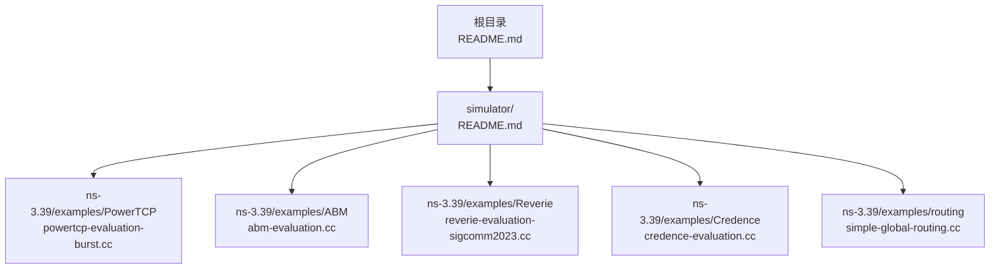
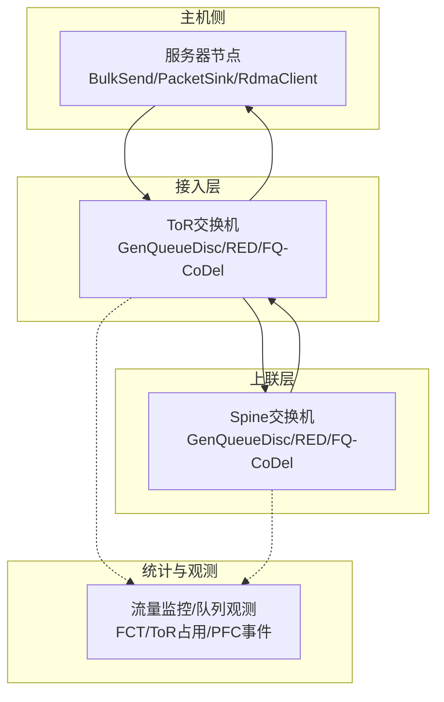
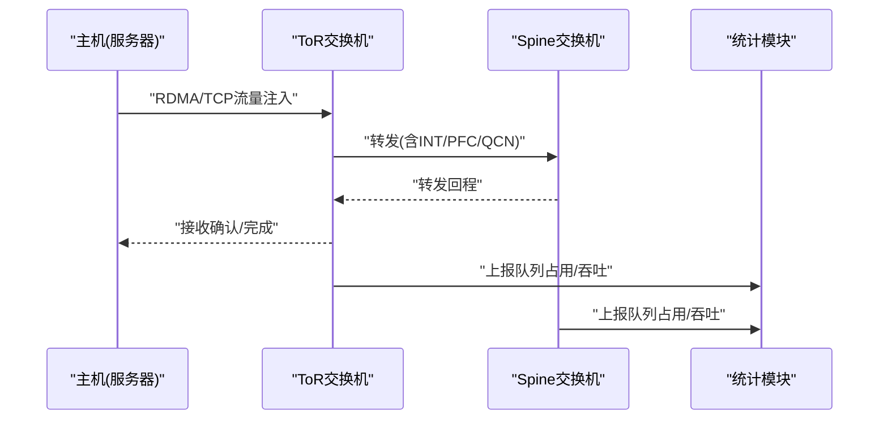
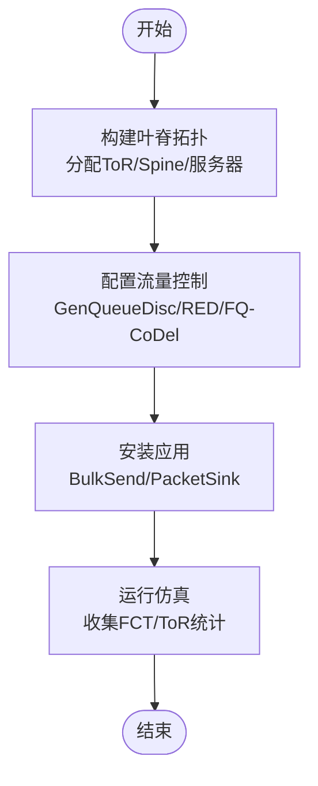
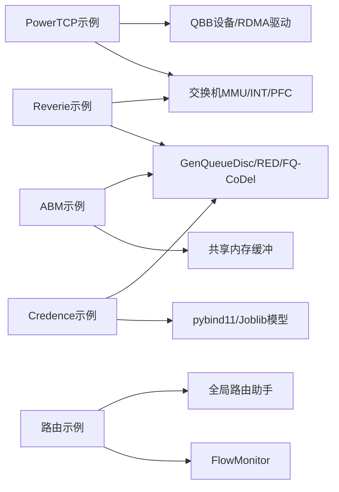

# 高级示例集合

<cite>
**本文档引用的文件**
- [README.md](file://README.md)
- [simulator/README.md](file://simulator/README.md)
- [powertcp-evaluation-burst.cc](file://simulator/ns-3.39/examples/PowerTCP/powertcp-evaluation-burst.cc)
- [abm-evaluation.cc](file://simulator/ns-3.39/examples/ABM/abm-evaluation.cc)
- [reverie-evaluation-sigcomm2023.cc](file://simulator/ns-3.39/examples/Reverie/reverie-evaluation-sigcomm2023.cc)
- [credence-evaluation.cc](file://simulator/ns-3.39/examples/Credence/credence-evaluation.cc)
- [simple-global-routing.cc](file://simulator/ns-3.39/examples/routing/simple-global-routing.cc)
</cite>

## 目录
1. [简介](#简介)
2. [项目结构](#项目结构)
3. [核心组件](#核心组件)
4. [架构总览](#架构总览)
5. [详细组件分析](#详细组件分析)
6. [依赖关系分析](#依赖关系分析)
7. [性能考虑](#性能考虑)
8. [故障排查指南](#故障排查指南)
9. [结论](#结论)
10. [附录](#附录)

## 简介
本文件系统化梳理仓库中的“高级示例集合”，覆盖数据中心网络与高性能仿真场景，重点包括：
- 路由协议：全局静态路由与动态路由基础示例
- 无线网络：未在当前仓库中发现专用无线示例
- TCP传输：多种拥塞控制算法（含PowerTCP、HPCC、Timely等）与RDMA混合栈支持
- 交通控制：多优先级队列、共享内存缓冲管理（ABM、Reverie、Credence）
- 统计分析：端到端时延（FCT）、慢启动、吞吐量、队列占用率等指标输出
- 高级主题：大规模仿真实验、并行与分布式仿真实践建议

本集合以NS-3.39为核心，扩展了点对点链路、RDMA驱动、交换机MMU与流量控制模块，支撑从单机到数据中心级拓扑的复杂场景。

## 项目结构
仓库采用分层组织方式：
- 根目录包含总体说明与版本信息
- simulator/ns-3.39/examples 下按主题划分示例：PowerTCP、ABM、Reverie、Credence、routing、wireless等
- 各示例通过命令行参数与配置文件驱动，便于批量实验与结果对比

图表来源
- [README.md:1-241](file://README.md#L1-L241)
- [simulator/README.md:1-33](file://simulator/README.md#L1-L33)

章节来源
- [README.md:1-241](file://README.md#L1-L241)
- [simulator/README.md:1-33](file://simulator/README.md#L1-L33)

## 核心组件
- 点对点与QBB设备：支持RDMA与TCP/IP双栈共存，提供队列监控与PFC事件记录
- 交换机节点与MMU：实现入/出站缓冲模型（SONIC、Reverie），支持多算法（DT、ABM、FAB、CS、IB、LQD、Credence）
- 流量控制与队列调度：GenQueueDisc、RED、FQ-CoDel等，支持多优先级队列与共享内存
- 应用层：BulkSendApplication、PacketSink、RdmaClient等，支持突发与工作负载注入
- 统计输出：FCT、ToR占用率、PFC事件、队列长度分布等

章节来源
- [README.md:97-110](file://README.md#L97-L110)
- [abm-evaluation.cc:38-68](file://simulator/ns-3.39/examples/ABM/abm-evaluation.cc#L38-L68)
- [reverie-evaluation-sigcomm2023.cc:47-62](file://simulator/ns-3.39/examples/Reverie/reverie-evaluation-sigcomm2023.cc#L47-L62)
- [credence-evaluation.cc:38-68](file://simulator/ns-3.39/examples/Credence/credence-evaluation.cc#L38-L68)

## 架构总览
下图展示典型数据中心拓扑与关键模块交互：主机（服务器）通过ToR接入Spine，交换机侧集成MMU与队列管理，应用层产生TCP/RDMA流量，统计模块输出观测指标。

图表来源
- [abm-evaluation.cc:669-800](file://simulator/ns-3.39/examples/ABM/abm-evaluation.cc#L669-L800)
- [reverie-evaluation-sigcomm2023.cc:642-800](file://simulator/ns-3.39/examples/Reverie/reverie-evaluation-sigcomm2023.cc#L642-L800)
- [credence-evaluation.cc:763-800](file://simulator/ns-3.39/examples/Credence/credence-evaluation.cc#L763-L800)

## 详细组件分析

### PowerTCP 示例（RDMA与TCP混合）
- 场景目标：验证PowerTCP/Theta-PowerTCP在RDMA与TCP/IP混合栈下的吞吐与时延表现
- 关键特性：
  - 支持QCN/PFC、INT头部、PINT模式
  - 动态窗口、速率边界、反馈采样等参数可配置
  - 拓扑读取、路由重算、链路故障模拟
- 输出指标：FCT、PFC事件、队列长度分布、ToR端口吞吐

图表来源
- [powertcp-evaluation-burst.cc:402-750](file://simulator/ns-3.39/examples/PowerTCP/powertcp-evaluation-burst.cc#L402-L750)
- [reverie-evaluation-sigcomm2023.cc:619-637](file://simulator/ns-3.39/examples/Reverie/reverie-evaluation-sigcomm2023.cc#L619-L637)

章节来源
- [powertcp-evaluation-burst.cc:402-750](file://simulator/ns-3.39/examples/PowerTCP/powertcp-evaluation-burst.cc#L402-L750)
- [README.md:83-96](file://README.md#L83-L96)

### ABM 示例（Active Buffer Management）
- 场景目标：评估ABM、DT、FAB、CS、IB等缓冲管理算法在多优先级队列下的性能
- 关键特性：
  - 共享内存缓冲池、每端口队列、优先级调度
  - 可配置alpha更新周期、静态缓冲比例、ECN启用
  - ToR端口级吞吐与队列占用率统计
- 输出指标：FCT、慢启动比、各优先级占用率、端口级吞吐

图表来源
- [abm-evaluation.cc:318-800](file://simulator/ns-3.39/examples/ABM/abm-evaluation.cc#L318-L800)

章节来源
- [abm-evaluation.cc:318-800](file://simulator/ns-3.39/examples/ABM/abm-evaluation.cc#L318-L800)

### Reverie 示例（低通滤波开关缓冲共享）
- 场景目标：验证Reverie模型在混合RDMA/TCP流量下的缓冲共享策略
- 关键特性：
  - 入/出站缓冲模型选择（SONIC/Reverie）
  - 入/出站缓冲算法可独立配置（DT/FAB/CS/IB/ABM/Reverie）
  - PFC事件与队列占用率实时输出
- 输出指标：FCT、慢启动、队列占用、PFC事件序列

章节来源
- [reverie-evaluation-sigcomm2023.cc:642-800](file://simulator/ns-3.39/examples/Reverie/reverie-evaluation-sigcomm2023.cc#L642-L800)
- [README.md:94-96](file://README.md#L94-L96)

### Credence 示例（基于ML预测的缓冲管理）
- 场景目标：将机器学习预测集成到缓冲丢弃决策中，提升高负载稳定性
- 关键特性：
  - 使用pybind11加载scikit-learn模型进行预测
  - 基于队列长度与共享占用率决定丢弃策略
  - LQD/FollowLQD等缓冲算法与预测结合
- 输出指标：FCT、慢启动、队列长度与占用率、预测丢弃事件

章节来源
- [credence-evaluation.cc:366-800](file://simulator/ns-3.39/examples/Credence/credence-evaluation.cc#L366-L800)
- [README.md:91-93](file://README.md#L91-L93)

### 路由示例（全局静态路由）
- 场景目标：演示NS-3中全局静态路由表的生成与应用
- 关键特性：
  - 四节点拓扑，不同带宽/延迟链路
  - UDP与TCP流量注入，支持FlowMonitor
- 输出指标：路由表、流量监控XML、ASCII跟踪

章节来源
- [simple-global-routing.cc:53-169](file://simulator/ns-3.39/examples/routing/simple-global-routing.cc#L53-L169)

## 依赖关系分析
- 示例与模块耦合：
  - PowerTCP/Reverie：依赖QBB设备、RDMA驱动、交换机MMU与INT/PFC机制
  - ABM/Credence：依赖GenQueueDisc、RED/FQ-CoDel、共享内存缓冲
  - 路由示例：依赖全局路由助手与FlowMonitor
- 外部依赖：
  - Python/Joblib用于Credence的模型加载
  - pybind11用于嵌入Python环境

图表来源
- [powertcp-evaluation-burst.cc:20-40](file://simulator/ns-3.39/examples/PowerTCP/powertcp-evaluation-burst.cc#L20-L40)
- [abm-evaluation.cc:17-30](file://simulator/ns-3.39/examples/ABM/abm-evaluation.cc#L17-L30)
- [reverie-evaluation-sigcomm2023.cc:11-26](file://simulator/ns-3.39/examples/Reverie/reverie-evaluation-sigcomm2023.cc#L11-L26)
- [credence-evaluation.cc:16-34](file://simulator/ns-3.39/examples/Credence/credence-evaluation.cc#L16-L34)
- [simple-global-routing.cc:36-42](file://simulator/ns-3.39/examples/routing/simple-global-routing.cc#L36-L42)

章节来源
- [powertcp-evaluation-burst.cc:20-40](file://simulator/ns-3.39/examples/PowerTCP/powertcp-evaluation-burst.cc#L20-L40)
- [abm-evaluation.cc:17-30](file://simulator/ns-3.39/examples/ABM/abm-evaluation.cc#L17-L30)
- [reverie-evaluation-sigcomm2023.cc:11-26](file://simulator/ns-3.39/examples/Reverie/reverie-evaluation-sigcomm23.cc#L11-L26)
- [credence-evaluation.cc:16-34](file://simulator/ns-3.39/examples/Credence/credence-evaluation.cc#L16-L34)
- [simple-global-routing.cc:36-42](file://simulator/ns-3.39/examples/routing/simple-global-routing.cc#L36-L42)

## 性能考虑
- 拓扑规模与并行：
  - 使用脚本批量运行不同拓扑/负载组合，结合多进程并行加速
  - 对大规模拓扑建议使用分布式仿真框架（如MPI模块）或外部调度器
- 缓冲与队列：
  - 合理设置静态缓冲比例与alpha更新间隔，避免过早饱和
  - 在高负载场景启用ECN/PFC，降低尾部丢弃
- 传输层优化：
  - 根据场景选择合适拥塞控制（CUBIC/DCTCP/HPCC/PowerTCP/Timely/Theta-PowerTCP）
  - 调整RTT估计、RTO、初始窗口与分段大小
- 观测与采样：
  - 定期采样ToR端口吞吐与队列占用，避免高频采样带来的开销
  - 使用FlowMonitor与自定义跟踪文件分离大流量与小流量观测

## 故障排查指南
- 常见问题与定位：
  - 队列溢出/频繁PFC：检查缓冲总量、静态缓冲比例、alpha更新间隔；必要时启用ECN
  - FCT异常偏大：核查拥塞控制参数、RTT估计、链路带宽与延迟配置
  - 路由不通：确认全局路由表是否正确生成，接口地址分配是否一致
  - 模型加载失败（Credence）：检查pybind11与Joblib路径及模型文件完整性
- 实用建议：
  - 使用最小可行拓扑复现问题，逐步扩大规模
  - 开启ASCII/PCAP跟踪，配合FlowMonitor导出XML进行离线分析
  - 记录命令行参数与配置文件差异，形成可重复的实验清单

章节来源
- [abm-evaluation.cc:496-667](file://simulator/ns-3.39/examples/ABM/abm-evaluation.cc#L496-L667)
- [credence-evaluation.cc:369-483](file://simulator/ns-3.39/examples/Credence/credence-evaluation.cc#L369-L483)
- [simple-global-routing.cc:149-164](file://simulator/ns-3.39/examples/routing/simple-global-routing.cc#L149-L164)

## 结论
本高级示例集合围绕数据中心网络的关键挑战，提供了从路由、传输、队列到统计的全栈实践方案。通过PowerTCP、ABM、Reverie与Credence等算法的对比实验，能够有效评估不同缓冲管理策略在混合流量下的性能与稳定性。建议在实际工程中结合本文档的参数调优与故障排查流程，构建可重复、可观测、可扩展的大规模仿真平台。

## 附录
- 快速开始
  - 配置与编译：参考根目录README中的配置与构建步骤
  - 运行示例：进入对应示例目录，使用命令行参数调整拓扑、负载与算法
- 扩展建议
  - 将脚本化批处理与外部调度器（如SLURM）结合，实现大规模并行实验
  - 引入分布式仿真（MPI模块）以突破单机资源限制
  - 结合可视化工具（NetAnim）与统计脚本（Python/Gnuplot）进行结果呈现

章节来源
- [README.md:66-82](file://README.md#L66-L82)
- [simulator/README.md:10-18](file://simulator/README.md#L10-L18)