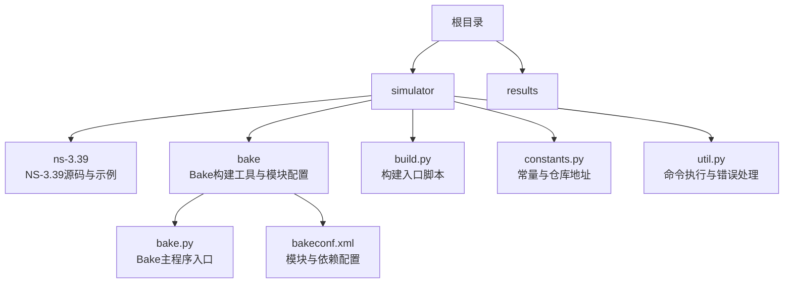
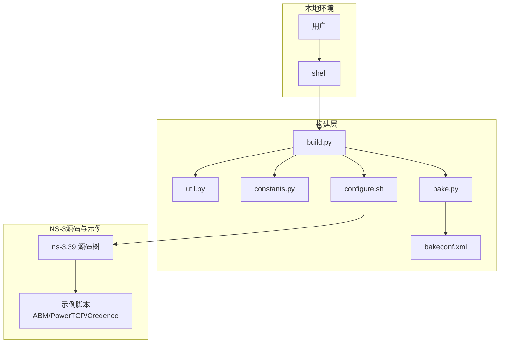
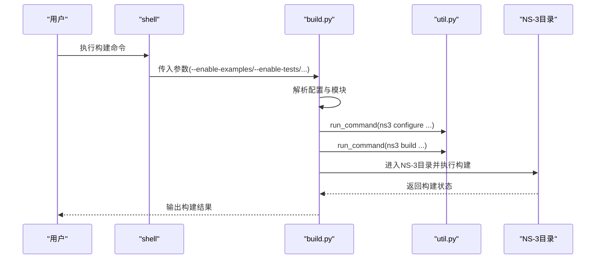
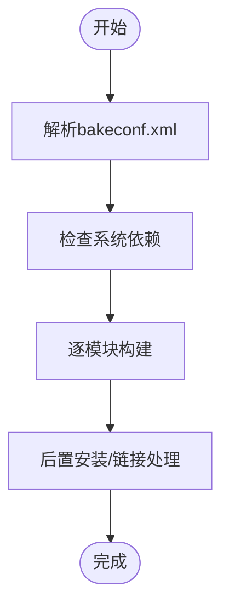
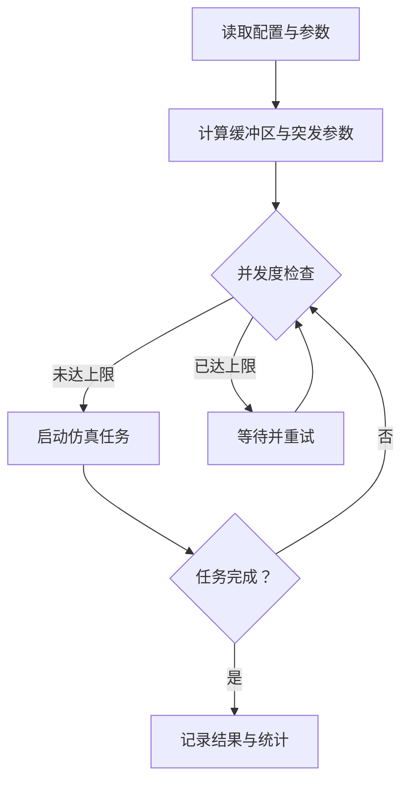
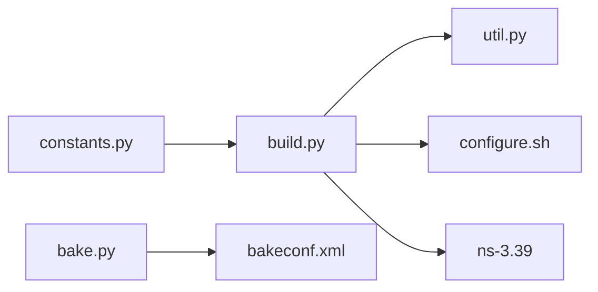

# 部署与运维

<cite>
**本文引用的文件**   
- [README.md](file://README.md)
- [simulator/README.md](file://simulator/README.md)
- [simulator/build.py](file://simulator/build.py)
- [simulator/constants.py](file://simulator/constants.py)
- [simulator/util.py](file://simulator/util.py)
- [simulator/bake/bake.py](file://simulator/bake/bake.py)
- [simulator/bake/bakeconf.xml](file://simulator/bake/bakeconf.xml)
- [simulator/ns-3.39/configure.sh](file://simulator/ns-3.39/configure.sh)
- [simulator/ns-3.39/examples/ABM/run-main.sh](file://simulator/ns-3.39/examples/ABM/run-main.sh)
- [simulator/ns-3.39/examples/PowerTCP/script-workload.sh](file://simulator/ns-3.39/examples/PowerTCP/script-workload.sh)
- [simulator/ns-3.39/examples/Credence/run-main.sh](file://simulator/ns-3.39/examples/Credence/run-main.sh)
</cite>

## 目录
1. [简介](#简介)
2. [项目结构](#项目结构)
3. [核心组件](#核心组件)
4. [架构总览](#架构总览)
5. [详细组件分析](#详细组件分析)
6. [依赖分析](#依赖分析)
7. [性能考量](#性能考量)
8. [故障排除指南](#故障排除指南)
9. [结论](#结论)
10. [附录](#附录)

## 简介
本指南面向需要在生产环境中长期维护与大规模部署NS-3数据中心平台的团队，提供从系统配置、构建流程、运行与监控到故障排除的完整运维方案。文档聚焦以下目标：
- 生产环境部署：系统配置、编译优化、可重复构建与版本化。
- 运维自动化：批量运行、资源调度、并发控制与结果收集。
- 性能监控与日志管理：实验输出组织、统计指标采集与可视化脚本。
- 分布式仿真支持：MPI集成与多节点扩展（概念性说明）。
- 版本控制与环境管理：基于仓库与构建脚本的可追溯性。

## 项目结构
该仓库包含NS-3源码扩展与示例脚本，核心目录如下：
- simulator：构建与打包脚本、Bake模块配置、NS-3源码与示例。
- simulator/ns-3.39：NS-3.39源码树及示例，包含数据中心相关算法与模型。
- simulator/bake：Bake构建工具及其模块配置，用于扩展组件的统一构建与安装。
- results：实验结果输出目录（预留）。

**图表来源**
- [simulator/README.md:1-33](file://simulator/README.md#L1-L33)
- [simulator/build.py:1-148](file://simulator/build.py#L1-L148)
- [simulator/constants.py:1-12](file://simulator/constants.py#L1-L12)
- [simulator/util.py:1-26](file://simulator/util.py#L1-L26)
- [simulator/bake/bake.py:1-57](file://simulator/bake/bake.py#L1-L57)
- [simulator/bake/bakeconf.xml:1-800](file://simulator/bake/bakeconf.xml#L1-L800)

**章节来源**
- [README.md:66-110](file://README.md#L66-L110)
- [simulator/README.md:1-33](file://simulator/README.md#L1-L33)

## 核心组件
- 构建与打包
  - build.py：统一构建入口，支持启用示例与测试、传递构建选项、调用NS-3配置与构建。
  - constants.py：定义NS-3、NetAnim、Bake等仓库地址，便于下载与构建。
  - util.py：封装命令执行与错误处理，统一异常类型。
- Bake构建工具
  - bake.py：Bake主程序入口，负责定位配置并执行构建。
  - bakeconf.xml：模块依赖与构建参数配置，涵盖系统依赖、内核模拟库、路由工具等。
- NS-3配置与构建
  - configure.sh：优化构建配置，启用示例、Python绑定、禁用警告与错误放宽，提升构建稳定性。
- 示例与批量运行
  - ABM/PowerTCP/Credence示例脚本：提供批量运行、并发控制、资源限制与结果落盘的实践。

**章节来源**
- [simulator/build.py:48-59](file://simulator/build.py#L48-L59)
- [simulator/constants.py:2-12](file://simulator/constants.py#L2-L12)
- [simulator/util.py:5-26](file://simulator/util.py#L5-L26)
- [simulator/bake/bake.py:29-57](file://simulator/bake/bake.py#L29-L57)
- [simulator/bake/bakeconf.xml:1-800](file://simulator/bake/bakeconf.xml#L1-L800)
- [simulator/ns-3.39/configure.sh:1-2](file://simulator/ns-3.39/configure.sh#L1-L2)

## 架构总览
下图展示从仓库到可执行仿真的端到端流程，包括构建、模块装配与运行阶段。

**图表来源**
- [simulator/build.py:48-59](file://simulator/build.py#L48-L59)
- [simulator/util.py:12-26](file://simulator/util.py#L12-L26)
- [simulator/constants.py:2-12](file://simulator/constants.py#L2-L12)
- [simulator/bake/bake.py:29-57](file://simulator/bake/bake.py#L29-L57)
- [simulator/bake/bakeconf.xml:1-800](file://simulator/bake/bakeconf.xml#L1-L800)
- [simulator/ns-3.39/configure.sh:1-2](file://simulator/ns-3.39/configure.sh#L1-L2)

## 详细组件分析

### 组件A：构建与打包（build.py）
- 功能要点
  - 解析命令行参数，支持启用示例与测试、传递构建选项。
  - 读取配置文件，按模块顺序构建；支持跳过NetAnim或指定qmake路径。
  - 调用NS-3配置与构建命令，统一输出与错误处理。
- 关键流程
  - 读取“.config”并解析模块配置。
  - 条件构建NetAnim（若可用）。
  - 切换至NS-3目录，执行“ns3 configure”与“ns3 build”。

**图表来源**
- [simulator/build.py:48-59](file://simulator/build.py#L48-L59)
- [simulator/util.py:12-26](file://simulator/util.py#L12-L26)

**章节来源**
- [simulator/build.py:61-148](file://simulator/build.py#L61-L148)
- [simulator/util.py:12-26](file://simulator/util.py#L12-L26)

### 组件B：Bake构建工具（bake.py 与 bakeconf.xml）
- 功能要点
  - bake.py：作为Bake主入口，定位配置并执行构建。
  - bakeconf.xml：集中定义模块依赖、系统依赖与构建参数，覆盖Linux发行版包依赖、内核模拟库、路由工具与协议栈扩展。
- 关键流程
  - 解析模块配置，检查系统依赖。
  - 按模块顺序执行构建，支持条件安装与后置处理。

**图表来源**
- [simulator/bake/bake.py:29-57](file://simulator/bake/bake.py#L29-L57)
- [simulator/bake/bakeconf.xml:1-800](file://simulator/bake/bakeconf.xml#L1-L800)

**章节来源**
- [simulator/bake/bake.py:1-57](file://simulator/bake/bake.py#L1-L57)
- [simulator/bake/bakeconf.xml:1-800](file://simulator/bake/bakeconf.xml#L1-L800)

### 组件C：NS-3配置与构建（configure.sh）
- 功能要点
  - 使用优化构建配置，启用示例与Python绑定，禁用严格警告与错误，提升构建稳定性。
- 建议
  - 在CI/CD中固定构建参数，确保可重复性。
  - 结合build.py统一入口，避免直接绕过配置流程。

**章节来源**
- [simulator/ns-3.39/configure.sh:1-2](file://simulator/ns-3.39/configure.sh#L1-L2)

### 组件D：示例批量运行（ABM/PowerTCP/Credence）
- 功能要点
  - 提供多场景批量运行脚本，包含并发控制、资源使用限制、结果落盘与统计文件命名规范。
  - 通过进程计数与sleep策略控制并发度，避免资源争用。
- 关键流程
  - 读取配置与拓扑参数。
  - 计算缓冲区大小与突发请求参数。
  - 并发启动多个仿真任务，等待完成并输出汇总信息。

**图表来源**
- [simulator/ns-3.39/examples/ABM/run-main.sh:83-96](file://simulator/ns-3.39/examples/ABM/run-main.sh#L83-L96)
- [simulator/ns-3.39/examples/PowerTCP/script-workload.sh:67-82](file://simulator/ns-3.39/examples/PowerTCP/script-workload.sh#L67-L82)
- [simulator/ns-3.39/examples/Credence/run-main.sh:104-114](file://simulator/ns-3.39/examples/Credence/run-main.sh#L104-L114)

**章节来源**
- [simulator/ns-3.39/examples/ABM/run-main.sh:1-193](file://simulator/ns-3.39/examples/ABM/run-main.sh#L1-L193)
- [simulator/ns-3.39/examples/PowerTCP/script-workload.sh:1-203](file://simulator/ns-3.39/examples/PowerTCP/script-workload.sh#L1-L203)
- [simulator/ns-3.39/examples/Credence/run-main.sh:1-259](file://simulator/ns-3.39/examples/Credence/run-main.sh#L1-L259)

## 依赖分析
- 外部依赖
  - 系统工具与库：qmake/qmake-qt5、libpcap、libexpat、bison、flex、libssl、lksctp、libsysfs、bc、libxml2等。
  - 内核与网络栈：net-next-sim系列、iproute2、quagga、click等。
- 模块耦合
  - build.py依赖util.py进行命令执行与错误处理。
  - bake.py依赖bakeconf.xml进行模块装配与依赖解析。
  - configure.sh为NS-3提供统一构建配置入口。

**图表来源**
- [simulator/constants.py:2-12](file://simulator/constants.py#L2-L12)
- [simulator/build.py:48-59](file://simulator/build.py#L48-L59)
- [simulator/util.py:12-26](file://simulator/util.py#L12-L26)
- [simulator/bake/bake.py:29-57](file://simulator/bake/bake.py#L29-L57)
- [simulator/bake/bakeconf.xml:1-800](file://simulator/bake/bakeconf.xml#L1-L800)
- [simulator/ns-3.39/configure.sh:1-2](file://simulator/ns-3.39/configure.sh#L1-L2)

**章节来源**
- [simulator/constants.py:2-12](file://simulator/constants.py#L2-L12)
- [simulator/bake/bakeconf.xml:1-800](file://simulator/bake/bakeconf.xml#L1-L800)

## 性能考量
- 构建性能
  - 使用优化构建配置与并行构建参数，减少编译时间。
  - 在CI/CD中缓存依赖与中间产物，缩短构建链路。
- 运行性能
  - 通过示例脚本中的并发控制与资源限制，避免CPU与内存峰值导致的任务失败。
  - 将结果输出与统计文件分目录存储，便于后续批处理与可视化。
- 可靠性
  - 统一异常处理与返回码检查，确保构建与运行失败时及时告警。
  - 固定构建参数与依赖版本，降低环境漂移带来的不确定性。

[本节为通用建议，无需具体文件分析]

## 故障排除指南
- 构建失败
  - 缺少系统依赖：根据bakeconf.xml提示安装对应包（如libpcap、bison、flex、libssl等）。
  - qmake不可用：使用build.py的--qmake-path参数指定qmake或qmake-qt5路径。
  - 命令执行异常：util.py提供统一异常类型与错误输出，检查命令返回码与标准错误。
- 运行失败
  - 并发度过高：示例脚本通过进程计数与sleep策略控制并发，适当降低N_CORES或增加等待间隔。
  - 资源不足：监控CPU与内存使用，必要时调整仿真参数或分批运行。
- 日志与结果
  - 结果文件命名规范：参考示例脚本中的输出文件命名规则，便于自动化处理与归档。
  - 统计文件：关注仿真输出中的统计字段，结合可视化脚本生成报告。

**章节来源**
- [simulator/build.py:12-46](file://simulator/build.py#L12-L46)
- [simulator/util.py:5-26](file://simulator/util.py#L5-L26)
- [simulator/ns-3.39/examples/ABM/run-main.sh:88-96](file://simulator/ns-3.39/examples/ABM/run-main.sh#L88-L96)
- [simulator/ns-3.39/examples/PowerTCP/script-workload.sh:67-82](file://simulator/ns-3.39/examples/PowerTCP/script-workload.sh#L67-L82)
- [simulator/ns-3.39/examples/Credence/run-main.sh:104-114](file://simulator/ns-3.39/examples/Credence/run-main.sh#L104-L114)

## 结论
本指南提供了NS-3数据中心平台在生产环境中的部署与运维实践，涵盖构建流程、模块装配、批量运行与故障排除。通过统一的构建入口、明确的并发控制与结果落盘策略，团队可以高效地开展大规模仿真实验，并在长期维护中保持可重复性与可追溯性。

[本节为总结，无需具体文件分析]

## 附录

### A. 生产环境部署清单
- 系统依赖安装：参考bakeconf.xml中的系统依赖项，确保在目标机器上可用。
- 构建步骤
  - 进入NS-3目录，执行优化配置脚本。
  - 使用build.py统一构建，启用示例与测试（可选）。
  - 如需扩展模块，使用bake.py加载bakeconf.xml进行装配。
- 运行与监控
  - 使用示例脚本进行批量运行，设置合理的并发度与资源限制。
  - 定期归档结果文件与统计日志，建立索引以便检索。

**章节来源**
- [simulator/ns-3.39/configure.sh:1-2](file://simulator/ns-3.39/configure.sh#L1-L2)
- [simulator/build.py:61-148](file://simulator/build.py#L61-L148)
- [simulator/bake/bake.py:29-57](file://simulator/bake/bake.py#L29-L57)
- [simulator/bake/bakeconf.xml:1-800](file://simulator/bake/bakeconf.xml#L1-L800)

### B. 分布式仿真与MPI集成（概念性说明）
- 当前仓库未包含MPI集成的具体实现细节，但可基于以下思路扩展：
  - 使用NS-3的多节点仿真框架，结合外部MPI运行器（如mpirun）启动多个仿真实例。
  - 通过共享拓扑与参数文件协调各节点的启动与停止。
  - 使用轻量级消息队列或共享存储进行数据同步与结果聚合。
- 注意事项
  - 确保各节点间网络连通与时间同步。
  - 对关键数据（如统计文件）采用原子写入与锁机制，避免竞态。

[本节为概念性内容，无需具体文件分析]