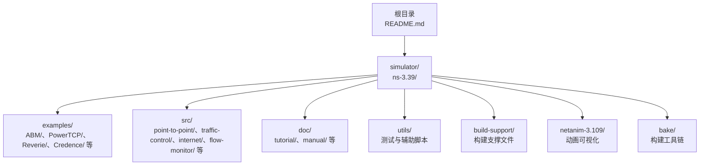
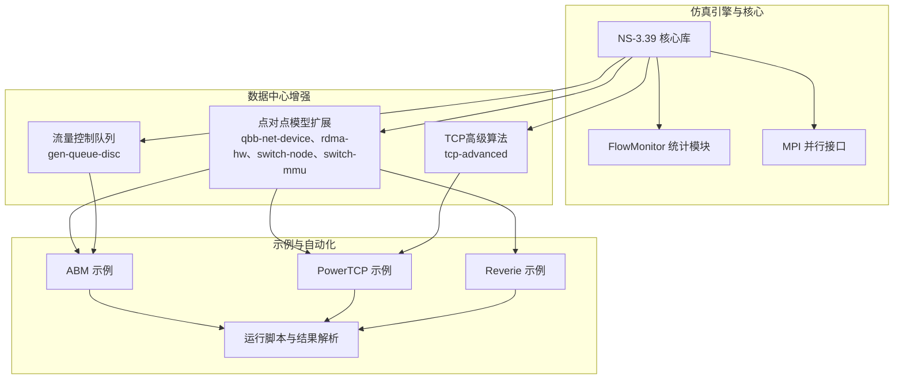
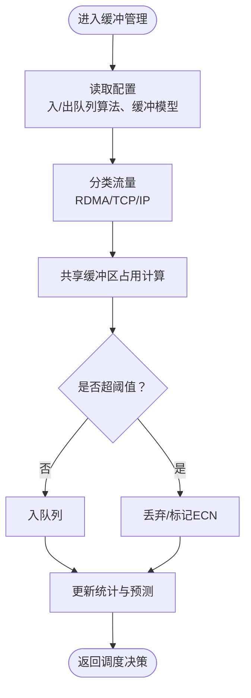
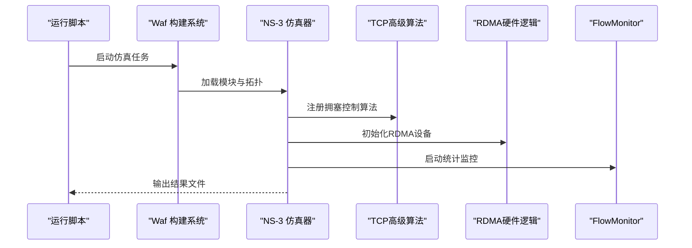
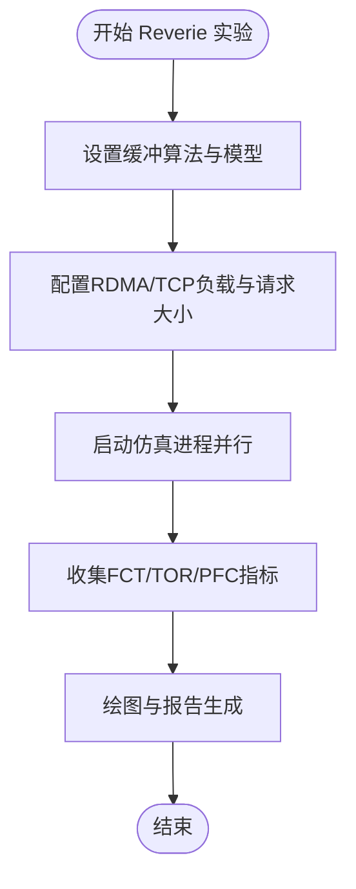
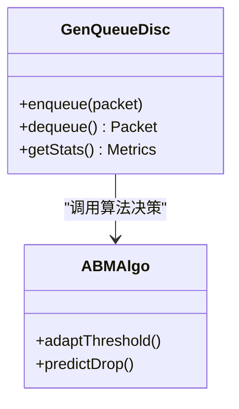
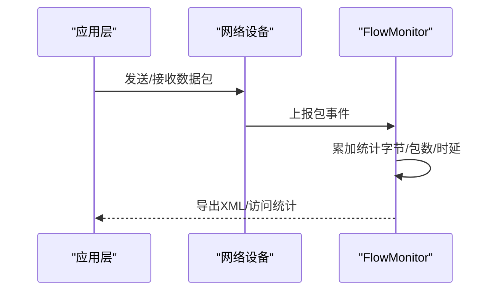
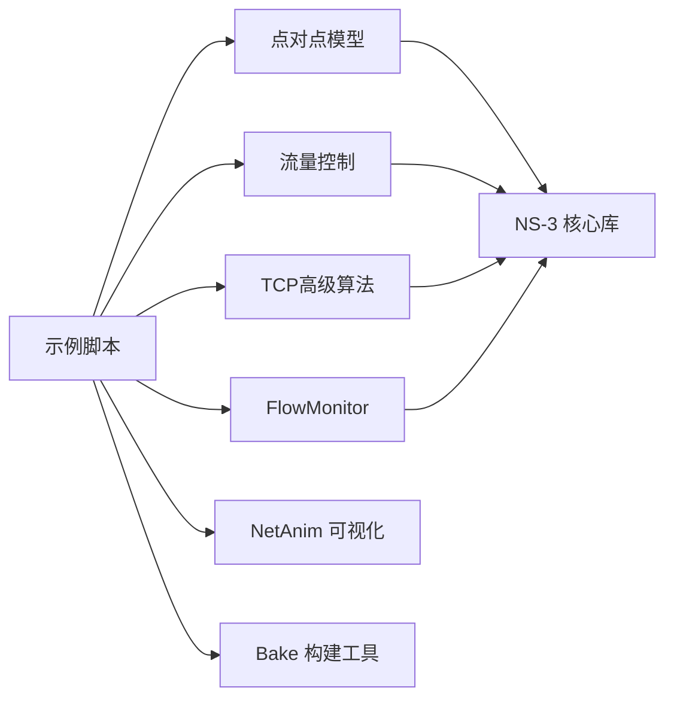

# 应用场景与价值

<cite>
**本文引用的文件**   
- [README.md](file://README.md)
- [ns-3.39/README.md](file://simulator/ns-3.39/README.md)
- [ABM/README.md](file://simulator/ns-3.39/examples/ABM/README.md)
- [PowerTCP/README.md](file://simulator/ns-3.39/examples/PowerTCP/README.md)
- [Reverie/reverie-evaluation-workload-lakewood.sh](file://simulator/ns-3.39/examples/Reverie/reverie-evaluation-workload-lakewood.sh)
- [src/point-to-point/model/switch-mmu.cc](file://simulator/ns-3.39/src/point-to-point/model/switch-mmu.cc)
- [src/traffic-control/model/gen-queue-disc.cc](file://simulator/ns-3.39/src/traffic-control/model/gen-queue-disc.cc)
- [src/internet/model/tcp-advanced.cc](file://simulator/ns-3.39/src/internet/model/tcp-advanced.cc)
- [src/flow-monitor/model/flow-monitor.cc](file://simulator/ns-3.39/src/flow-monitor/model/flow-monitor.cc)
- [src/flow-monitor/doc/flow-monitor.rst](file://simulator/ns-3.39/src/flow-monitor/doc/flow-monitor.rst)
- [src/mpi/examples/nms-p2p-nix-distributed.cc](file://simulator/ns-3.39/src/mpi/examples/nms-p2p-nix-distributed.cc)
- [doc/tutorial/source/introduction.rst](file://simulator/ns-3.39/doc/tutorial/source/introduction.rst)
- [doc/tutorial/source/building-topologies.rst](file://simulator/ns-3.39/doc/tutorial/source/building-topologies.rst)
- [util.py](file://simulator/util.py)
- [constants.py](file://simulator/constants.py)
</cite>

## 目录
1. [引言](#引言)
2. [项目结构](#项目结构)
3. [核心组件](#核心组件)
4. [架构总览](#架构总览)
5. [详细组件分析](#详细组件分析)
6. [依赖关系分析](#依赖关系分析)
7. [性能考量](#性能考量)
8. [故障排查指南](#故障排查指南)
9. [结论](#结论)
10. [附录](#附录)

## 引言
本文件面向NS-3数据中心网络仿真平台的应用场景与价值，聚焦以下四大领域：学术研究（网络算法验证与性能评估）、工业应用（网络设计优化与故障诊断）、教育培训（网络课程实践与实验教学）、产品开发（新协议与新算法的快速验证）。平台基于NS-3.39扩展，集成多种数据中心前沿技术，包括PowerTCP、ABM、Reverie、Credence等，支持TCP/IP与RDMA混合栈仿真，并提供丰富的示例脚本与自动化运行流程，便于大规模参数扫描与结果解析。

平台的独特价值在于：
- 面向数据中心的专用增强：支持RDMA与TCP/IP混合流量、先进拥塞控制与缓冲管理算法。
- 可复现性与标准化：提供完整的构建、运行、结果解析脚本，覆盖多场景（突发、公平性、工作负载）。
- 多语言与多规模：既支持C++原生仿真，也支持Python绑定；支持单机与MPI分布式并行仿真。
- 开放生态：依托NS-3社区与相关模块（如NetAnim、Bake），便于可视化与构建集成。

## 项目结构
仓库采用分层组织方式：
- 根目录：平台总体说明与参考文献
- simulator/ns-3.39：NS-3源码与扩展模块、示例、文档
- simulator/bake：构建与打包工具链
- results：存放历史或中间结果（按需使用）

数据中心相关示例与模块集中在ns-3.39/examples与src中，涵盖ABM、PowerTCP、Reverie、Credence等专题仿真，以及点对点模型、流量控制队列、互联网协议栈、流监控等基础设施。

图示来源
- [README.md:1-241](file://README.md#L1-L241)
- [ns-3.39/README.md:1-175](file://simulator/ns-3.39/README.md#L1-L175)

章节来源
- [README.md:1-241](file://README.md#L1-L241)
- [ns-3.39/README.md:1-175](file://simulator/ns-3.39/README.md#L1-L175)

## 核心组件
- 数据中心缓冲管理与交换机MMU：支持动态阈值（DT）与主动缓冲管理（ABM），并提供Reverie模型配置选项，适配RDMA与TCP/IP共享缓冲场景。
- 拥塞控制算法实现：在TCP/IP栈内实现PowerTCP等高级算法，在点对点设备层实现RDMA硬件逻辑，支持混合栈下的吞吐、延迟与公平性评估。
- 流量控制队列：提供通用队列调度器，用于在TCP/IP栈上进行ABM等算法的对照实验。
- 流监控与统计：提供端到端吞吐、时延、抖动、丢包等指标采集与XML输出能力，支持大规模参数扫描后的数据解析。
- 并行与分布式仿真：支持MPI并行与分布式仿真，提升大规模拓扑与长时仿真的执行效率。
- 示例与自动化：提供Incass、公平性、工作负载等场景的完整脚本链路，覆盖模拟、结果解析与绘图。

章节来源
- [README.md:97-109](file://README.md#L97-L109)
- [src/point-to-point/model/switch-mmu.cc](file://simulator/ns-3.39/src/point-to-point/model/switch-mmu.cc)
- [src/traffic-control/model/gen-queue-disc.cc](file://simulator/ns-3.39/src/traffic-control/model/gen-queue-disc.cc)
- [src/internet/model/tcp-advanced.cc](file://simulator/ns-3.39/src/internet/model/tcp-advanced.cc)
- [src/flow-monitor/model/flow-monitor.cc](file://simulator/ns-3.39/src/flow-monitor/model/flow-monitor.cc)
- [src/mpi/examples/nms-p2p-nix-distributed.cc](file://simulator/ns-3.39/src/mpi/examples/nms-p2p-nix-distributed.cc)

## 架构总览
数据中心网络仿真平台以NS-3为核心，通过扩展点对点模型、流量控制与互联网协议栈，实现RDMA与TCP/IP混合仿真。示例脚本负责场景配置、并行调度与结果后处理，流监控模块提供统一的度量输出，MPI接口支持大规模并行。

图示来源
- [README.md:97-109](file://README.md#L97-L109)
- [src/point-to-point/model/switch-mmu.cc](file://simulator/ns-3.39/src/point-to-point/model/switch-mmu.cc)
- [src/traffic-control/model/gen-queue-disc.cc](file://simulator/ns-3.39/src/traffic-control/model/gen-queue-disc.cc)
- [src/internet/model/tcp-advanced.cc](file://simulator/ns-3.39/src/internet/model/tcp-advanced.cc)
- [src/flow-monitor/model/flow-monitor.cc](file://simulator/ns-3.39/src/flow-monitor/model/flow-monitor.cc)
- [src/mpi/examples/nms-p2p-nix-distributed.cc](file://simulator/ns-3.39/src/mpi/examples/nms-p2p-nix-distributed.cc)

## 详细组件分析

### 组件A：ABM缓冲管理与交换机MMU
- 功能概述：实现动态阈值（DT）与主动缓冲管理（ABM），支持在RDMA与TCP/IP共享缓冲场景下进行队列调度与拥塞预测。
- 关键文件路径：[switch-mmu.cc](file://simulator/ns-3.39/src/point-to-point/model/switch-mmu.cc)
- 典型用法：在混合栈拓扑中配置入/出队列缓冲策略，结合流量控制层队列调度器进行对比实验。
- 性能与复杂度：缓冲管理策略直接影响队列延迟与丢包率，ABM通过自适应阈值降低尾延迟，复杂度与队列数量线性相关。

图示来源
- [README.md:105-106](file://README.md#L105-L106)
- [src/point-to-point/model/switch-mmu.cc](file://simulator/ns-3.39/src/point-to-point/model/switch-mmu.cc)

章节来源
- [README.md:105-106](file://README.md#L105-L106)
- [src/point-to-point/model/switch-mmu.cc](file://simulator/ns-3.39/src/point-to-point/model/switch-mmu.cc)

### 组件B：PowerTCP拥塞控制与RDMA硬件逻辑
- 功能概述：在TCP/IP栈内实现PowerTCP等高级算法，在点对点设备层实现RDMA硬件逻辑，支持混合栈下的吞吐与公平性评估。
- 关键文件路径：[tcp-advanced.cc](file://simulator/ns-3.39/src/internet/model/tcp-advanced.cc)、[rdma-hw.cc](file://simulator/ns-3.39/src/point-to-point/model/rdma-hw.cc)
- 典型用法：在10:1突发场景、公平性测试与工作负载评估中，切换不同CC算法，记录吞吐、时延与公平性指标。

图示来源
- [README.md:83-96](file://README.md#L83-L96)
- [PowerTCP/README.md:1-34](file://simulator/ns-3.39/examples/PowerTCP/README.md#L1-L34)
- [src/internet/model/tcp-advanced.cc](file://simulator/ns-3.39/src/internet/model/tcp-advanced.cc)
- [src/point-to-point/model/rdma-hw.cc](file://simulator/ns-3.39/src/point-to-point/model/rdma-hw.cc)
- [src/flow-monitor/model/flow-monitor.cc](file://simulator/ns-3.39/src/flow-monitor/model/flow-monitor.cc)

章节来源
- [README.md:83-96](file://README.md#L83-L96)
- [PowerTCP/README.md:1-34](file://simulator/ns-3.39/examples/PowerTCP/README.md#L1-L34)
- [src/internet/model/tcp-advanced.cc](file://simulator/ns-3.39/src/internet/model/tcp-advanced.cc)
- [src/point-to-point/model/rdma-hw.cc](file://simulator/ns-3.39/src/point-to-point/model/rdma-hw.cc)
- [src/flow-monitor/model/flow-monitor.cc](file://simulator/ns-3.39/src/flow-monitor/model/flow-monitor.cc)

### 组件C：Reverie低通滤波与缓冲共享
- 功能概述：基于低通滤波的交换机缓冲共享策略，支持SONIC与Reverie两种缓冲模型，适用于纯RDMA与混合流量场景。
- 关键文件路径：[reverie-evaluation-workload-lakewood.sh](file://simulator/ns-3.39/examples/Reverie/reverie-evaluation-workload-lakewood.sh)
- 典型用法：通过脚本批量运行不同缓冲算法、RDMA/TCP负载组合，生成FCT、TOR、PFC等指标文件，再由绘图脚本生成图表。

图示来源
- [README.md:94-96](file://README.md#L94-L96)
- [Reverie/reverie-evaluation-workload-lakewood.sh](file://simulator/ns-3.39/examples/Reverie/reverie-evaluation-workload-lakewood.sh)

章节来源
- [README.md:94-96](file://README.md#L94-L96)
- [Reverie/reverie-evaluation-workload-lakewood.sh](file://simulator/ns-3.39/examples/Reverie/reverie-evaluation-workload-lakewood.sh)

### 组件D：流量控制队列与ABM算法
- 功能概述：在流量控制层实现通用队列调度器，支持ABM等算法在TCP/IP栈上的对照实验。
- 关键文件路径：[gen-queue-disc.cc](file://simulator/ns-3.39/src/traffic-control/model/gen-queue-disc.cc)
- 典型用法：与ABM示例配合，进行单队列与多队列、不同alpha参数下的吞吐与延迟对比。

图示来源
- [README.md:107-109](file://README.md#L107-L109)
- [src/traffic-control/model/gen-queue-disc.cc](file://simulator/ns-3.39/src/traffic-control/model/gen-queue-disc.cc)

章节来源
- [README.md:107-109](file://README.md#L107-L109)
- [src/traffic-control/model/gen-queue-disc.cc](file://simulator/ns-3.39/src/traffic-control/model/gen-queue-disc.cc)

### 组件E：流监控与统计
- 功能概述：提供端到端吞吐、时延、抖动、丢包等指标采集，支持XML输出与后续解析。
- 关键文件路径：[flow-monitor.cc](file://simulator/ns-3.39/src/flow-monitor/model/flow-monitor.cc)、[flow-monitor.rst](file://simulator/ns-3.39/src/flow-monitor/doc/flow-monitor.rst)
- 典型用法：在PowerTCP、ABM、Reverie等示例中自动采集并保存统计结果，供脚本解析与绘图。

图示来源
- [src/flow-monitor/model/flow-monitor.cc](file://simulator/ns-3.39/src/flow-monitor/model/flow-monitor.cc)
- [src/flow-monitor/doc/flow-monitor.rst](file://simulator/ns-3.39/src/flow-monitor/doc/flow-monitor.rst)

章节来源
- [src/flow-monitor/model/flow-monitor.cc](file://simulator/ns-3.39/src/flow-monitor/model/flow-monitor.cc)
- [src/flow-monitor/doc/flow-monitor.rst](file://simulator/ns-3.39/src/flow-monitor/doc/flow-monitor.rst)

### 组件F：并行与分布式仿真
- 功能概述：支持MPI并行与分布式仿真，提升大规模拓扑与长时间仿真的执行效率。
- 关键文件路径：[nms-p2p-nix-distributed.cc](file://simulator/ns-3.39/src/mpi/examples/nms-p2p-nix-distributed.cc)
- 典型用法：在多节点集群上运行大型校园网仿真，缩短实验周期。

章节来源
- [src/mpi/examples/nms-p2p-nix-distributed.cc](file://simulator/ns-3.39/src/mpi/examples/nms-p2p-nix-distributed.cc)

## 依赖关系分析
- 组件耦合与内聚：示例脚本依赖NS-3核心库与扩展模块；流量控制与缓冲管理在点对点模型与流量控制层之间形成清晰边界；流监控作为横切关注点贯穿各示例。
- 直接与间接依赖：示例直接依赖点对点模型与流量控制模块；间接依赖NS-3基础库（核心、网络、应用等）。
- 外部依赖与集成：平台与NS-3生态集成良好，支持NetAnim可视化与Bake构建工具链；通过Python绑定支持脚本化运行。

图示来源
- [README.md:97-109](file://README.md#L97-L109)
- [constants.py:1-12](file://simulator/constants.py#L1-L12)

章节来源
- [README.md:97-109](file://README.md#L97-L109)
- [constants.py:1-12](file://simulator/constants.py#L1-L12)

## 性能考量
- 并行与分布式：通过MPI并行减少大规模仿真时间；合理设置并行度与任务粒度，避免I/O瓶颈。
- 缓冲与队列：ABM与Reverie在共享缓冲场景下显著降低尾延迟；需根据流量特征调整alpha与缓冲模型。
- 脚本与自动化：示例脚本支持批量运行与结果解析，建议根据CPU核数调整并发度，避免资源争用。
- 统计精度：注意FlowMonitor在仿真结束时可能“丢失”部分队列中的包，应预留足够停机时间或忽略少量统计无关丢失。

## 故障排查指南
- 命令执行错误：工具函数封装了命令执行与错误处理，若子进程返回非零退出码，会抛出异常并终止流程。
- 构建与运行：确保先配置再构建；示例脚本要求设置环境变量指向当前目录；并行运行时注意CPU核数限制。
- 统计缺失：若FlowMonitor报告“丢失包”，请检查仿真停止时机与应用停机时间，必要时延长仿真时间或提前停止应用。

章节来源
- [util.py:1-26](file://simulator/util.py#L1-L26)
- [PowerTCP/README.md:27-34](file://simulator/ns-3.39/examples/PowerTCP/README.md#L27-L34)
- [src/flow-monitor/doc/flow-monitor.rst:92-115](file://simulator/ns-3.39/src/flow-monitor/doc/flow-monitor.rst#L92-L115)

## 结论
NS-3数据中心网络仿真平台通过在NS-3.39基础上引入RDMA与TCP/IP混合栈、PowerTCP、ABM、Reverie、Credence等前沿技术，形成了覆盖学术研究、工业应用、教育培训与产品开发的全场景仿真体系。平台强调可复现性与标准化，提供从构建、运行到结果解析的完整流水线，并支持并行与分布式执行，适合在数据中心网络算法验证、性能评估与工程优化中发挥重要作用。

## 附录
- 用户反馈与社区评价：平台在SIGCOMM、NSDI等顶级会议论文中得到应用与验证，体现了其在学术界的认可度与影响力。
- 标准化与可重复性：平台提供明确的构建步骤、示例脚本与统计输出格式，便于他人复现实验；同时遵循NS-3社区规范，具备良好的可维护性与扩展性。

章节来源
- [README.md:4-64](file://README.md#L4-L64)
- [ns-3.39/README.md:20-38](file://simulator/ns-3.39/README.md#L20-L38)
- [doc/tutorial/source/introduction.rst:38-54](file://simulator/ns-3.39/doc/tutorial/source/introduction.rst#L38-L54)
- [doc/tutorial/source/building-topologies.rst:707-721](file://simulator/ns-3.39/doc/tutorial/source/building-topologies.rst#L707-L721)