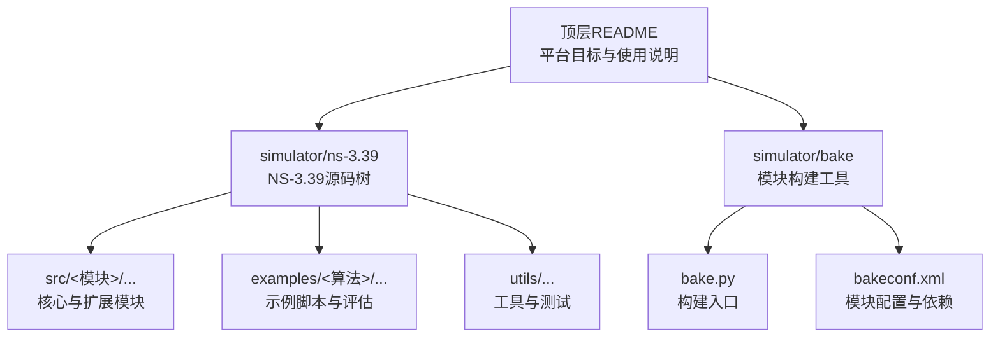
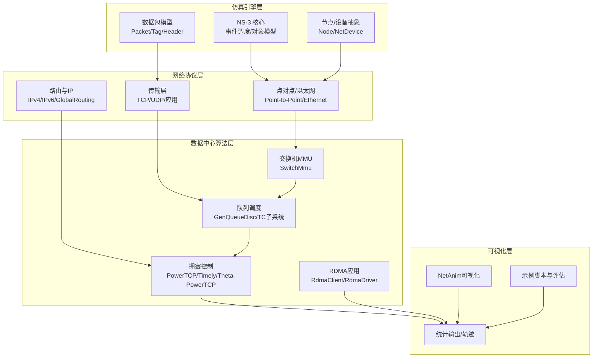
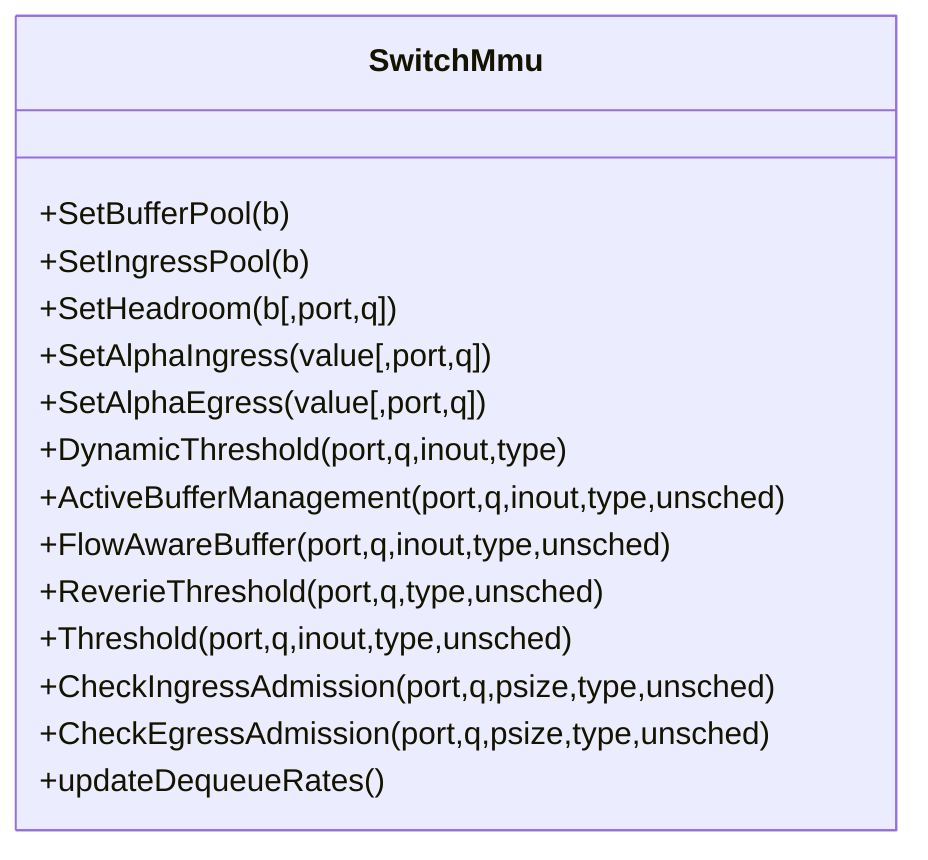
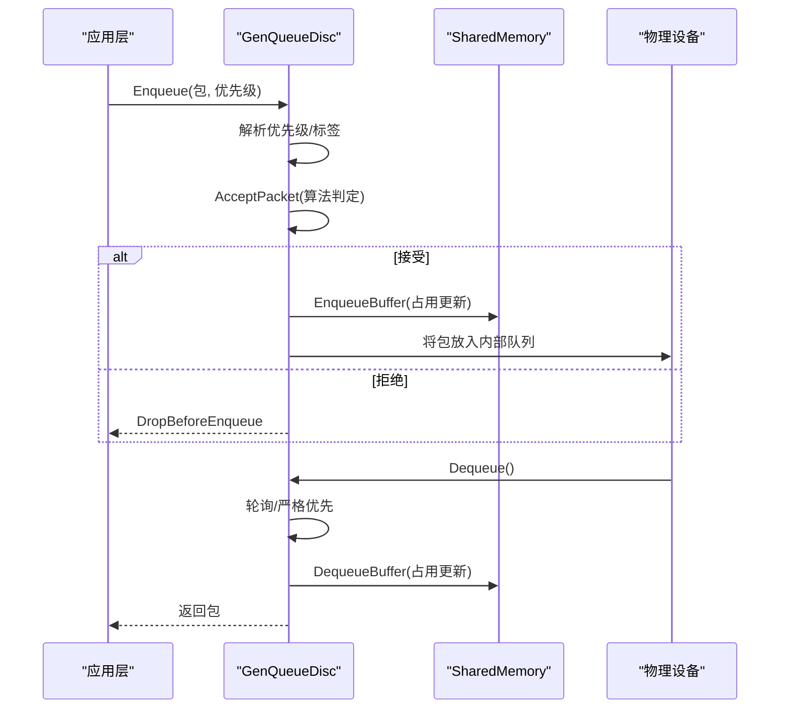
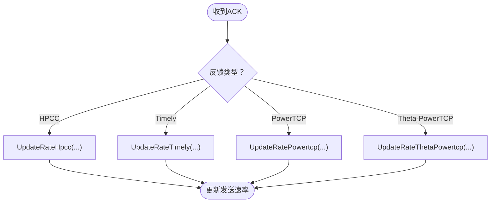
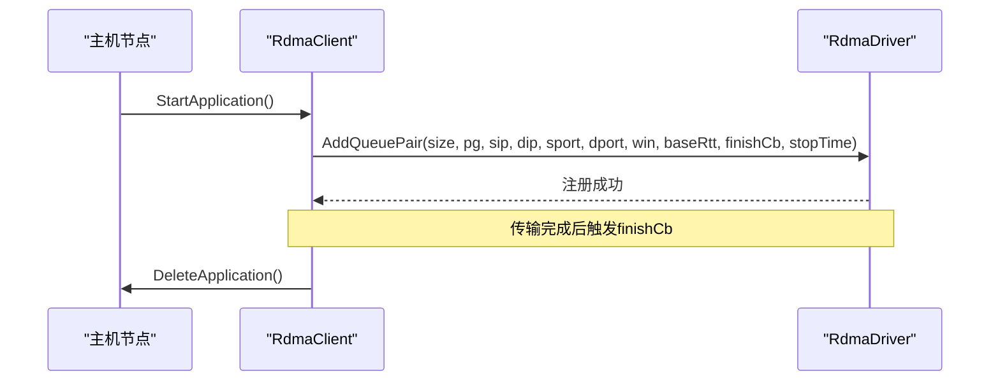
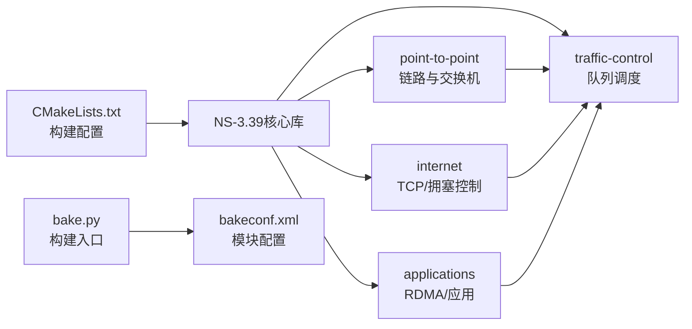

# 技术架构总览

<cite>
**本文档引用的文件**
- [README.md](file://README.md)
- [ns-3.39/README.md](file://simulator/ns-3.39/README.md)
- [CMakeLists.txt](file://simulator/ns-3.39/CMakeLists.txt)
- [configure.sh](file://simulator/ns-3.39/configure.sh)
- [bake.py](file://simulator/bake/bake.py)
- [bakeconf.xml](file://simulator/bake/bakeconf.xml)
- [switch-mmu.cc](file://simulator/ns-3.39/src/point-to-point/model/switch-mmu.cc)
- [gen-queue-disc.cc](file://simulator/ns-3.39/src/traffic-control/model/gen-queue-disc.cc)
- [tcp-advanced.cc](file://simulator/ns-3.39/src/internet/model/tcp-advanced.cc)
- [rdma-client.cc](file://simulator/ns-3.39/src/applications/model/rdma-client.cc)
- [powertcp-evaluation-workload.cc](file://simulator/ns-3.39/examples/PowerTCP/powertcp-evaluation-workload.cc)
- [abm-evaluation.cc](file://simulator/ns-3.39/examples/ABM/abm-evaluation.cc)
</cite>

## 目录
1. [引言](#引言)
2. [项目结构](#项目结构)
3. [核心组件](#核心组件)
4. [架构总览](#架构总览)
5. [详细组件分析](#详细组件分析)
6. [依赖关系分析](#依赖关系分析)
7. [性能考虑](#性能考虑)
8. [故障排除指南](#故障排除指南)
9. [结论](#结论)
10. [附录](#附录)

## 引言
本文件面向NS-3数据中心网络仿真平台，系统性梳理基于NS-3.39的扩展架构与模块化设计，重点阐述仿真引擎层、网络协议层、数据中心算法层与可视化层的职责划分与交互关系；同时给出扩展机制的设计思路（在保持向后兼容的前提下新增算法与功能）、技术选型与架构决策依据，并通过架构图与组件交互图帮助读者快速把握系统全貌。

## 项目结构
仓库采用“顶层README + simulator/ns-3.39（NS-3.39源码）+ simulator/bake（模块构建工具）”的组织方式：
- 顶层README：介绍平台目标、支持的数据中心拥塞控制与缓冲管理算法、构建与运行指引以及重要文件清单
- simulator/ns-3.39：NS-3.39源码树，包含核心库、模块、示例与工具
- simulator/bake：模块化构建与依赖管理工具，用于协调NS-3模块与第三方依赖

图表来源
- [README.md:1-241](file://README.md#L1-L241)
- [CMakeLists.txt:1-171](file://simulator/ns-3.39/CMakeLists.txt#L1-L171)
- [bake.py:1-57](file://simulator/bake/bake.py#L1-L57)
- [bakeconf.xml:1-800](file://simulator/bake/bakeconf.xml#L1-L800)

章节来源
- [README.md:1-241](file://README.md#L1-L241)
- [ns-3.39/README.md:1-175](file://simulator/ns-3.39/README.md#L1-L175)
- [CMakeLists.txt:1-171](file://simulator/ns-3.39/CMakeLists.txt#L1-L171)
- [bake.py:1-57](file://simulator/bake/bake.py#L1-L57)
- [bakeconf.xml:1-800](file://simulator/bake/bakeconf.xml#L1-L800)

## 核心组件
围绕数据中心网络仿真的核心组件包括：
- 交换机MMU与缓冲管理：实现共享内存模型、动态阈值（DT）、主动缓冲管理（ABM）、流感知缓冲（FAB）、Reverie低通滤波等策略
- 传输控制队列调度：在TCP/IP栈上实现多种缓冲管理算法（DT、ABM、FAB、CS、IB、LQD、Credence），并支持INT遥测与预测集成
- 数据中心拥塞控制：在TCP/IP栈中实现PowerTCP、Theta-PowerTCP、Timely等数据中心专用拥塞控制算法
- RDMA应用与驱动：提供RDMA客户端应用、队列对管理与驱动接口，支撑RDMA与TCP/IP混合场景
- 示例与评估：PowerTCP、ABM、Reverie、Credence等算法的完整评估脚本与拓扑生成器

章节来源
- [switch-mmu.cc:1-1054](file://simulator/ns-3.39/src/point-to-point/model/switch-mmu.cc#L1-L1054)
- [gen-queue-disc.cc:1-878](file://simulator/ns-3.39/src/traffic-control/model/gen-queue-disc.cc#L1-L878)
- [tcp-advanced.cc:1-607](file://simulator/ns-3.39/src/internet/model/tcp-advanced.cc#L1-L607)
- [rdma-client.cc:1-157](file://simulator/ns-3.39/src/applications/model/rdma-client.cc#L1-L157)
- [powertcp-evaluation-workload.cc:1-1345](file://simulator/ns-3.39/examples/PowerTCP/powertcp-evaluation-workload.cc#L1-L1345)
- [abm-evaluation.cc:1-950](file://simulator/ns-3.39/examples/ABM/abm-evaluation.cc#L1-L950)

## 架构总览
数据中心网络仿真平台采用分层架构：
- 仿真引擎层：NS-3核心事件调度、节点/设备抽象、数据包生命周期管理
- 网络协议层：点对点链路、以太网设备、路由与IP协议栈、TCP/UDP/TLS等传输层
- 数据中心算法层：交换机MMU与缓冲管理、传输队列调度、数据中心拥塞控制、RDMA应用与驱动
- 可视化层：NetAnim可视化、统计跟踪与输出、示例脚本与结果分析

图表来源
- [README.md:111-241](file://README.md#L111-L241)
- [ns-3.39/README.md:1-175](file://simulator/ns-3.39/README.md#L1-L175)
- [switch-mmu.cc:1-1054](file://simulator/ns-3.39/src/point-to-point/model/switch-mmu.cc#L1-L1054)
- [gen-queue-disc.cc:1-878](file://simulator/ns-3.39/src/traffic-control/model/gen-queue-disc.cc#L1-L878)
- [tcp-advanced.cc:1-607](file://simulator/ns-3.39/src/internet/model/tcp-advanced.cc#L1-L607)
- [rdma-client.cc:1-157](file://simulator/ns-3.39/src/applications/model/rdma-client.cc#L1-L157)

## 详细组件分析

### 交换机MMU与缓冲管理（SwitchMmu）
- 设计要点
  - 共享内存池模型：包含全局ASIC缓冲池、入口池、出口池与头房（headroom），支持SONiC与Reverie两种缓冲模型
  - 多算法阈值：支持DT（动态阈值）、ABM（主动缓冲管理）、FAB（流感知缓冲）、Reverie（低通滤波）
  - 运行时状态：队列占用、饱和度、去队速率、LPF统计等，周期性更新
- 关键流程
  - 入口/出口准入检查：根据当前剩余缓冲与算法阈值决定是否允许入队
  - 阈值计算：DT按剩余空间比例、ABM结合去队速率与并发队列数、Reverie使用共享池与LPF统计
- 扩展点
  - 新增算法：在阈值选择分支中注册新算法常量并在Threshold函数中接入
  - 缓冲模型：通过SetBufferModel切换不同模型，或在CheckIngressAdmission/CheckEgressAdmission中扩展

图表来源
- [switch-mmu.cc:1-1054](file://simulator/ns-3.39/src/point-to-point/model/switch-mmu.cc#L1-L1054)

章节来源
- [switch-mmu.cc:1-1054](file://simulator/ns-3.39/src/point-to-point/model/switch-mmu.cc#L1-L1054)

### 传输控制队列调度（GenQueueDisc）
- 设计要点
  - 多优先级队列：支持nPrior条队列，可配置严格优先或轮询调度
  - 多算法接入：DT、ABM、FAB、CS、IB、LQD、Credence等
  - INT遥测：在Dequeue时注入队列长度、时间戳、带宽等遥测信息
  - 预测集成：Credence模式下可接入外部预测模块，带误差注入
- 关键流程
  - 入队：解析优先级与标签，调用AcceptPacket进行准入判断，更新共享缓冲占用
  - 出队：轮询或严格优先调度，更新去队速率与NofP统计，注入遥测
- 扩展点
  - 新算法：在AcceptPacket中新增case并实现准入逻辑
  - 统计与追踪：通过TraceSources扩展观测维度

图表来源
- [gen-queue-disc.cc:1-878](file://simulator/ns-3.39/src/traffic-control/model/gen-queue-disc.cc#L1-L878)

章节来源
- [gen-queue-disc.cc:1-878](file://simulator/ns-3.39/src/traffic-control/model/gen-queue-disc.cc#L1-L878)

### 数据中心拥塞控制（TCP-Advanced）
- 设计要点
  - 基于TcpNewReno扩展，支持PowerTCP、Theta-PowerTCP、Timely等多种数据中心算法
  - 通过FeedbackTag携带遥测信息，按算法类型在ACK处理中更新发送速率
  - 支持HPCC、Timely等高级特性，如多跳速率估计、快速反应
- 关键流程
  - 初始化：设置初始窗口、最大发送速率与基础RTT
  - ACK处理：根据反馈类型调用相应更新函数，调整发送速率与节拍定时器
- 扩展点
  - 新算法：在ProcessDcAck中新增分支，实现对应的UpdateRate*与FastReact*函数

图表来源
- [tcp-advanced.cc:1-607](file://simulator/ns-3.39/src/internet/model/tcp-advanced.cc#L1-L607)

章节来源
- [tcp-advanced.cc:1-607](file://simulator/ns-3.39/src/internet/model/tcp-advanced.cc#L1-L607)

### RDMA应用与驱动（RdmaClient）
- 设计要点
  - 提供RDMA客户端应用，支持指定写大小、优先级组、窗口与基RTT
  - 通过RdmaDriver在节点侧管理队列对（Queue Pair），完成端到端RDMA传输
- 关键流程
  - StartApplication：从节点获取RdmaDriver并注册队列对
  - Finish回调：在传输完成后删除应用实例
- 扩展点
  - 新流量类型：在RdmaClient中增加参数与行为，或扩展RdmaDriver接口

图表来源
- [rdma-client.cc:1-157](file://simulator/ns-3.39/src/applications/model/rdma-client.cc#L1-L157)

章节来源
- [rdma-client.cc:1-157](file://simulator/ns-3.39/src/applications/model/rdma-client.cc#L1-L157)

### 示例与评估（PowerTCP/ABM）
- PowerTCP工作负载评估：提供完整的拓扑生成、流量调度、RDMA/TCP混合场景与结果收集脚本
- ABM评估：展示在TCP/IP栈上的缓冲管理算法对比，含统计输出与可视化脚本
- 扩展点
  - 新算法：在对应示例目录下新增脚本，复用现有模块与工具链
  - 拓扑与流量：通过输入文件与生成器脚本扩展

章节来源
- [powertcp-evaluation-workload.cc:1-1345](file://simulator/ns-3.39/examples/PowerTCP/powertcp-evaluation-workload.cc#L1-L1345)
- [abm-evaluation.cc:1-950](file://simulator/ns-3.39/examples/ABM/abm-evaluation.cc#L1-L950)

## 依赖关系分析
- 构建系统
  - NS-3.39采用CMake构建，通过CMakeLists.txt启用/禁用模块与选项
  - bake工具负责模块化依赖与安装，bakeconf.xml定义模块来源与构建参数
- 模块耦合
  - 交换机MMU与队列调度通过SharedMemory接口耦合，实现共享缓冲占用与阈值计算
  - 拥塞控制与队列调度通过INT遥测标签协同，形成闭环反馈
  - RDMA应用与驱动解耦，便于在TCP/IP与RDMA之间灵活切换

图表来源
- [CMakeLists.txt:1-171](file://simulator/ns-3.39/CMakeLists.txt#L1-L171)
- [bake.py:1-57](file://simulator/bake/bake.py#L1-L57)
- [bakeconf.xml:1-800](file://simulator/bake/bakeconf.xml#L1-L800)

章节来源
- [CMakeLists.txt:1-171](file://simulator/ns-3.39/CMakeLists.txt#L1-L171)
- [bake.py:1-57](file://simulator/bake/bake.py#L1-L57)
- [bakeconf.xml:1-800](file://simulator/bake/bakeconf.xml#L1-L800)

## 性能考虑
- 更新频率与开销
  - SwitchMmu与GenQueueDisc均采用周期性更新（如每25μs或自定义间隔）计算去队速率与NofP，平衡精度与性能
- 共享缓冲与阈值
  - 使用SharedMemory统一管理占用与阈值，避免重复计算与竞态
- 遥测与预测
  - INT遥测提供高分辨率队列状态，Credence可引入预测模块，需注意预测误差注入与吞吐影响
- 构建优化
  - CMake选项支持编译缓存、预编译头、链接器优化等，缩短迭代时间

## 故障排除指南
- 构建问题
  - 确认已执行configure.sh中的配置命令，启用示例与Python绑定
  - 若依赖缺失，参考bakeconf.xml中模块依赖声明，确保系统满足要求
- 运行问题
  - 检查示例脚本中的拓扑与流量参数，确保端口范围、地址与停止时间合理
  - 对于RDMA场景，确认RdmaDriver正确注册与队列对参数设置
- 调试建议
  - 启用日志组件（如TcpAdvanced、GenQueueDisc、SwitchMmu）以定位算法行为
  - 使用NetAnim可视化观察队列长度与丢包趋势

章节来源
- [configure.sh:1-2](file://simulator/ns-3.39/configure.sh#L1-L2)
- [ns-3.39/README.md:74-134](file://simulator/ns-3.39/README.md#L74-L134)
- [README.md:66-96](file://README.md#L66-L96)

## 结论
本平台以NS-3.39为核心，围绕数据中心网络的关键挑战（拥塞控制、缓冲管理、RDMA与TCP/IP混合）进行了系统性扩展。通过清晰的分层架构与模块化设计，既保证了向后兼容，又为后续新增算法与功能提供了稳定扩展面。建议在新算法开发中遵循现有模块接口与统计/遥测规范，确保与现有工具链无缝集成。

## 附录
- 技术选型与架构决策
  - 选择NS-3.39作为基础：成熟稳定的离散事件仿真框架，丰富的网络模块生态
  - 采用CMake与bake：统一构建与模块化依赖管理，便于扩展与维护
  - 分层设计：将交换机MMU、队列调度、拥塞控制与应用解耦，提升可测试性与可演进性
  - 可视化与评估：内置NetAnim与示例脚本，降低用户上手成本