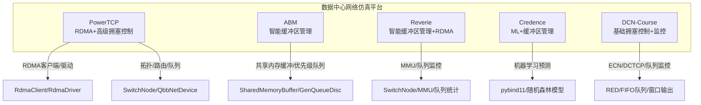
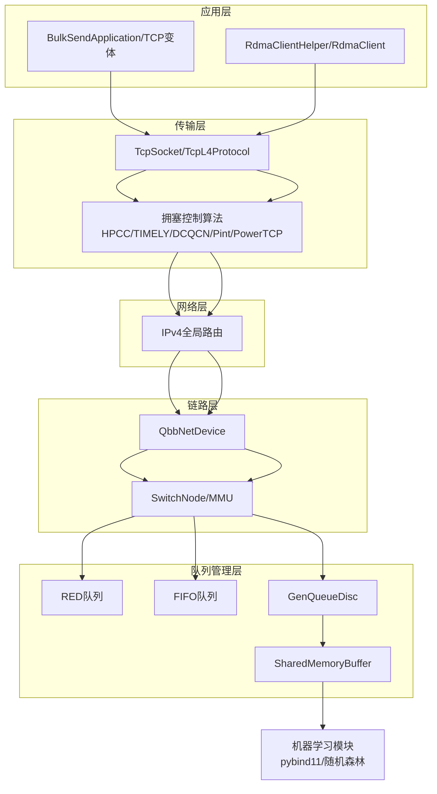
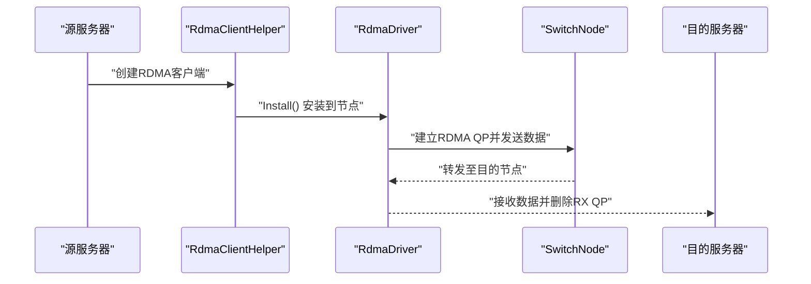
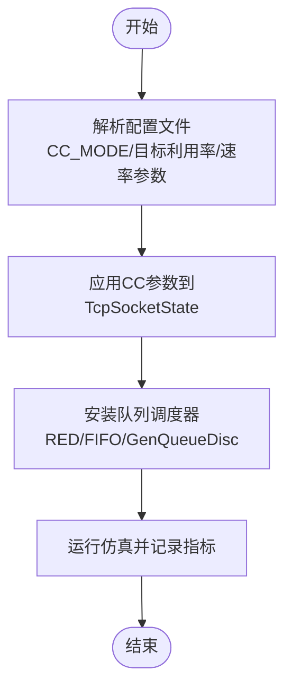
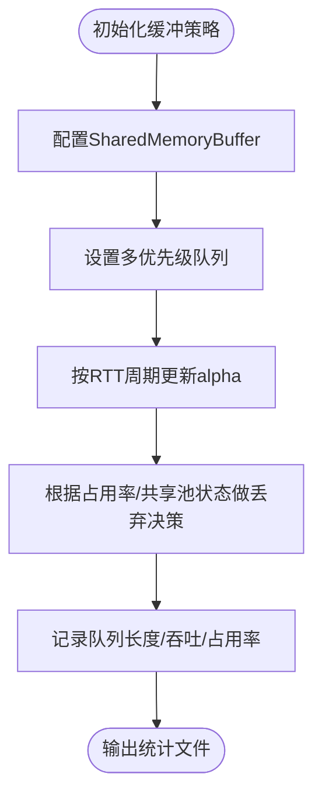
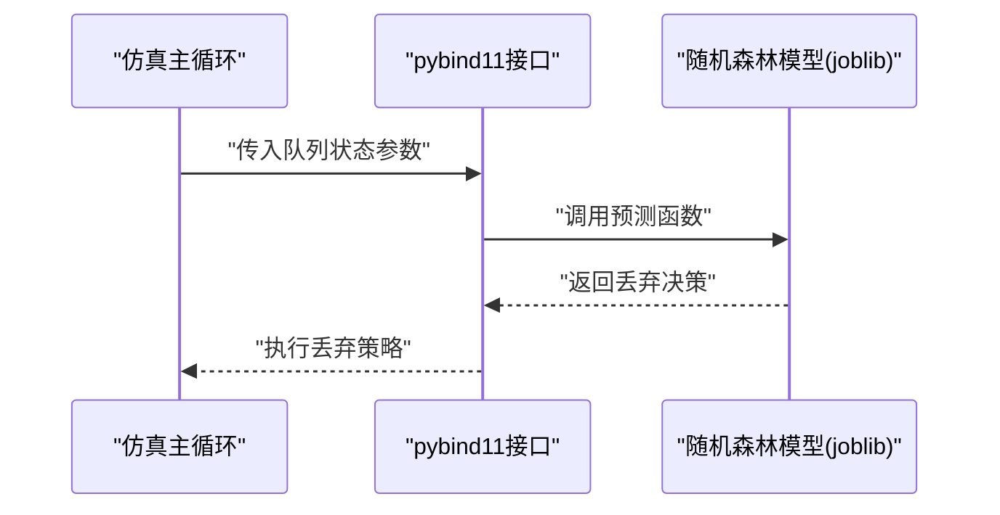
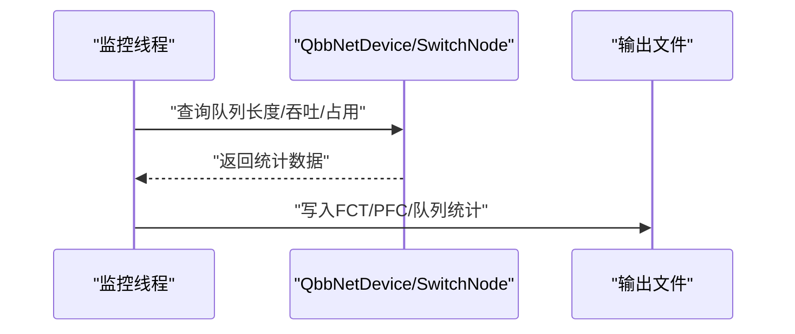
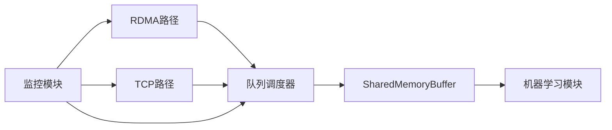

# 核心功能特性

<cite>
**本文档引用的文件**
- [powertcp-evaluation-burst.cc](file://simulator/ns-3.39/examples/PowerTCP/powertcp-evaluation-burst.cc)
- [README.md](file://simulator/ns-3.39/examples/PowerTCP/README.md)
- [config-burst.txt](file://simulator/ns-3.39/examples/PowerTCP/config-burst.txt)
- [abm-evaluation.cc](file://simulator/ns-3.39/examples/ABM/abm-evaluation.cc)
- [README.md](file://simulator/ns-3.39/examples/ABM/README.md)
- [config.sh](file://simulator/ns-3.39/examples/ABM/config.sh)
- [reverie-evaluation-sigcomm2023.cc](file://simulator/ns-3.39/examples/Reverie/reverie-evaluation-sigcomm2023.cc)
- [README.md](file://simulator/ns-3.39/examples/Reverie/README.md)
- [config-workload.txt](file://simulator/ns-3.39/examples/Reverie/config-workload.txt)
- [credence-evaluation.cc](file://simulator/ns-3.39/examples/Credence/credence-evaluation.cc)
- [README.md](file://simulator/ns-3.39/examples/Credence/README.md)
- [config.sh](file://simulator/ns-3.39/examples/Credence/config.sh)
- [dcn-congestion-control-simple.cc](file://simulator/ns-3.39/examples/DCN-Course/dcn-congestion-control-simple.cc)
- [README.md](file://simulator/ns-3.39/README.md)
</cite>

## 目录
1. [简介](#简介)
2. [项目结构](#项目结构)
3. [核心组件](#核心组件)
4. [架构总览](#架构总览)
5. [详细组件分析](#详细组件分析)
6. [依赖分析](#依赖分析)
7. [性能考虑](#性能考虑)
8. [故障排除指南](#故障排除指南)
9. [结论](#结论)
10. [附录](#附录)

## 简介
本文件面向NS-3数据中心网络仿真平台，系统化梳理并深入解析平台的核心功能特性，涵盖以下五大方面：
1) 多协议支持（TCP/IP与RDMA）
2) 先进的拥塞控制算法（PowerTCP等）
3) 智能缓冲区管理（ABM、Reverie、Credence）
4) 机器学习集成（Credence中的随机森林预测）
5) 高精度网络监控（队列长度、FCT、PFC事件等）

通过对典型示例脚本与配置文件的代码级分析，本文提供功能特点、优势、适用场景、功能对比表以及模块间协作关系与数据流图，帮助读者快速理解并高效使用该平台。

## 项目结构
平台以NS-3为核心框架，围绕数据中心网络场景提供了多个示例目录，每个目录聚焦特定技术方向：
- PowerTCP：RDMA与高级拥塞控制（HPCC/TIMELY/DCQCN/Pint等）评估
- ABM：先进缓冲区管理算法（ABM等）评估
- Reverie：智能缓冲区管理与RDMA工作负载评估
- Credence：结合机器学习的缓冲区管理（LQD/FollowLQD/Credence）
- DCN-Course：基础拥塞控制演示与监控输出

图表来源
- [powertcp-evaluation-burst.cc:1-120](file://simulator/ns-3.39/examples/PowerTCP/powertcp-evaluation-burst.cc#L1-L120)
- [abm-evaluation.cc:700-820](file://simulator/ns-3.39/examples/ABM/abm-evaluation.cc#L700-L820)
- [reverie-evaluation-sigcomm2023.cc:640-760](file://simulator/ns-3.39/examples/Reverie/reverie-evaluation-sigcomm2023.cc#L640-L760)
- [credence-evaluation.cc:360-520](file://simulator/ns-3.39/examples/Credence/credence-evaluation.cc#L360-L520)
- [dcn-congestion-control-simple.cc:140-200](file://simulator/ns-3.39/examples/DCN-Course/dcn-congestion-control-simple.cc#L140-L200)

章节来源
- [README.md:1-175](file://simulator/ns-3.39/README.md#L1-L175)

## 核心组件
- 多协议支持（TCP/IP与RDMA）
  - RDMA路径：通过RdmaClientHelper/RdmaClient/RdmaDriver实现RDMA流量生成与接收，支持队列对（QP）生命周期管理与完成时间（FCT）统计。
  - TCP/IP路径：基于BulkSendApplication/PacketSink与TCP变体（Cubic/DCTCP/Timely/PowerTCP等），配合RED/FIFO队列进行拥塞控制与队列管理。
- 先进的拥塞控制算法（PowerTCP等）
  - 支持HPCC、TIMELY、DCQCN、Pint等多种CC模式，通过配置文件参数控制目标利用率、速率增减、反馈采样等。
- 智能缓冲区管理（ABM、Reverie、Credence）
  - ABM：基于共享内存缓冲与优先级队列的自适应阈值管理。
  - Reverie：引入gamma参数与入/出队缓冲池分离策略，支持RDMA与TCP混合场景。
  - Credence：在LQD基础上引入机器学习预测丢弃决策，结合pybind11加载训练好的随机森林模型。
- 机器学习集成（Credence）
  - 使用pybind11嵌入Python环境，加载joblib保存的随机森林模型，实时预测丢弃概率并调整丢弃策略。
- 高精度网络监控
  - 输出FCT、PFC事件、队列长度分布、端口吞吐、共享内存占用等指标，便于性能分析与可视化。

章节来源
- [powertcp-evaluation-burst.cc:1-120](file://simulator/ns-3.39/examples/PowerTCP/powertcp-evaluation-burst.cc#L1-L120)
- [abm-evaluation.cc:480-620](file://simulator/ns-3.39/examples/ABM/abm-evaluation.cc#L480-L620)
- [reverie-evaluation-sigcomm2023.cc:640-760](file://simulator/ns-3.39/examples/Reverie/reverie-evaluation-sigcomm2023.cc#L640-L760)
- [credence-evaluation.cc:350-470](file://simulator/ns-3.39/examples/Credence/credence-evaluation.cc#L350-L470)
- [dcn-congestion-control-simple.cc:40-120](file://simulator/ns-3.39/examples/DCN-Course/dcn-congestion-control-simple.cc#L40-L120)

## 架构总览
数据中心网络仿真采用分层架构：应用层（BulkSend/TCP变体/RDMA）、传输层（TCP Socket/CC）、网络层（IPv4路由）、链路层（QbbNetDevice/SwitchNode/MMU）、队列管理层（RED/FIFO/GenQueueDisc/SharedMemoryBuffer）。

图表来源
- [powertcp-evaluation-burst.cc:1-120](file://simulator/ns-3.39/examples/PowerTCP/powertcp-evaluation-burst.cc#L1-L120)
- [abm-evaluation.cc:700-820](file://simulator/ns-3.39/examples/ABM/abm-evaluation.cc#L700-L820)
- [credence-evaluation.cc:360-520](file://simulator/ns-3.39/examples/Credence/credence-evaluation.cc#L360-L520)

## 详细组件分析

### 组件A：多协议支持（TCP/IP与RDMA）
- 功能特点
  - RDMA路径：通过RdmaClientHelper安装到源节点，建立RDMA QP，统计FCT并清理接收端QP。
  - TCP/IP路径：支持多种CC（Cubic/DCTCP/Timely/PowerTCP），可配置ECN、RED队列与窗口大小。
- 优势
  - 同时覆盖RDMA与传统TCP/IP场景，便于对比不同协议在数据中心网络中的表现。
- 适用场景
  - 超大规模数据中心、高性能计算（HPC）、分布式存储与机器学习训练。
- 关键流程（RDMA）

图表来源
- [powertcp-evaluation-burst.cc:170-195](file://simulator/ns-3.39/examples/PowerTCP/powertcp-evaluation-burst.cc#L170-L195)
- [reverie-evaluation-sigcomm2023.cc:420-430](file://simulator/ns-3.39/examples/Reverie/reverie-evaluation-sigcomm2023.cc#L420-L430)

章节来源
- [powertcp-evaluation-burst.cc:140-200](file://simulator/ns-3.39/examples/PowerTCP/powertcp-evaluation-burst.cc#L140-L200)
- [reverie-evaluation-sigcomm2023.cc:380-480](file://simulator/ns-3.39/examples/Reverie/reverie-evaluation-sigcomm2023.cc#L380-L480)

### 组件B：先进的拥塞控制算法（PowerTCP等）
- 功能特点
  - 支持HPCC、TIMELY、DCQCN、Pint等CC模式，通过配置文件设置目标利用率、速率增益、反馈采样等。
  - 可选启用QCN/PFC动态阈值、速率边界、ACK高优先级等机制。
- 优势
  - 提供多种CC策略对比，便于研究不同CC在突发/公平性/工作负载下的性能差异。
- 适用场景
  - 对延迟敏感的应用（如Web搜索、在线服务）、大规模批量任务（如数据分析）。
- 关键流程（CC配置与调度）

图表来源
- [config-burst.txt:15-59](file://simulator/ns-3.39/examples/PowerTCP/config-burst.txt#L15-L59)
- [abm-evaluation.cc:614-761](file://simulator/ns-3.39/examples/ABM/abm-evaluation.cc#L614-L761)
- [dcn-congestion-control-simple.cc:168-196](file://simulator/ns-3.39/examples/DCN-Course/dcn-congestion-control-simple.cc#L168-L196)

章节来源
- [README.md:1-34](file://simulator/ns-3.39/examples/PowerTCP/README.md#L1-L34)
- [config-burst.txt:1-59](file://simulator/ns-3.39/examples/PowerTCP/config-burst.txt#L1-L59)
- [abm-evaluation.cc:614-761](file://simulator/ns-3.39/examples/ABM/abm-evaluation.cc#L614-L761)
- [dcn-congestion-control-simple.cc:168-196](file://simulator/ns-3.39/examples/DCN-Course/dcn-congestion-control-simple.cc#L168-L196)

### 组件C：智能缓冲区管理（ABM、Reverie、Credence）
- ABM（Adaptive Buffer Management）
  - 特点：共享内存缓冲、多优先级队列、自适应alpha更新、静态缓冲预留。
  - 优势：在高并发下保持稳定吞吐与低尾延迟。
  - 适用场景：大规模多租户数据中心、混合流量场景。
- Reverie
  - 特点：入/出队缓冲池分离、gamma参数调节、RDMA与TCP混合工作负载。
  - 优势：降低头部阻塞，提升RDMA吞吐稳定性。
  - 适用场景：RDMA密集型应用（如分布式训练、存储后端）。
- Credence
  - 特点：在LQD基础上引入机器学习预测丢弃，pybind11加载随机森林模型。
  - 优势：更精准的丢弃决策，进一步降低尾延迟与丢包率。
  - 适用场景：对尾延迟敏感的交互式应用与实时系统。
- 关键流程（ABM/Reverie/Credence）

图表来源
- [abm-evaluation.cc:480-620](file://simulator/ns-3.39/examples/ABM/abm-evaluation.cc#L480-L620)
- [reverie-evaluation-sigcomm2023.cc:640-760](file://simulator/ns-3.39/examples/Reverie/reverie-evaluation-sigcomm2023.cc#L640-L760)
- [credence-evaluation.cc:350-470](file://simulator/ns-3.39/examples/Credence/credence-evaluation.cc#L350-L470)

章节来源
- [abm-evaluation.cc:480-620](file://simulator/ns-3.39/examples/ABM/abm-evaluation.cc#L480-L620)
- [README.md:1-17](file://simulator/ns-3.39/examples/ABM/README.md#L1-L17)
- [reverie-evaluation-sigcomm2023.cc:640-760](file://simulator/ns-3.39/examples/Reverie/reverie-evaluation-sigcomm2023.cc#L640-L760)
- [README.md:1-57](file://simulator/ns-3.39/examples/Reverie/README.md#L1-L57)
- [credence-evaluation.cc:350-470](file://simulator/ns-3.39/examples/Credence/credence-evaluation.cc#L350-L470)
- [README.md:1-2](file://simulator/ns-3.39/examples/Credence/README.md#L1-L2)

### 组件D：机器学习集成（Credence）
- 功能特点
  - 使用pybind11嵌入Python解释器，加载joblib保存的随机森林模型。
  - 在仿真运行期调用预测函数，根据队列长度、平均队列长度、共享占用率等输入输出丢弃决策。
- 优势
  - 将机器学习引入缓冲区管理，提高丢弃决策的准确性与时效性。
- 适用场景
  - 对尾延迟与丢包率有严格要求的数据中心应用。
- 关键流程（ML预测）

图表来源
- [credence-evaluation.cc:350-370](file://simulator/ns-3.39/examples/Credence/credence-evaluation.cc#L350-L370)
- [credence-evaluation.cc:467-468](file://simulator/ns-3.39/examples/Credence/credence-evaluation.cc#L467-L468)

章节来源
- [credence-evaluation.cc:350-370](file://simulator/ns-3.39/examples/Credence/credence-evaluation.cc#L350-L370)
- [credence-evaluation.cc:467-468](file://simulator/ns-3.39/examples/Credence/credence-evaluation.cc#L467-L468)

### 组件E：高精度网络监控
- 功能特点
  - 输出FCT（完成时间）、PFC（优先级流量控制）事件、队列长度分布、端口吞吐、共享内存占用等。
  - 支持周期性打印ToR统计、RDMA QP完成回调、队列占用监控。
- 优势
  - 提供细粒度的网络行为观测，便于性能分析与算法优化。
- 适用场景
  - 网络性能评估、算法对比、运维监控与容量规划。
- 关键流程（监控输出）

图表来源
- [powertcp-evaluation-burst.cc:208-236](file://simulator/ns-3.39/examples/PowerTCP/powertcp-evaluation-burst.cc#L208-L236)
- [reverie-evaluation-sigcomm2023.cc:619-637](file://simulator/ns-3.39/examples/Reverie/reverie-evaluation-sigcomm2023.cc#L619-L637)
- [dcn-congestion-control-simple.cc:46-70](file://simulator/ns-3.39/examples/DCN-Course/dcn-congestion-control-simple.cc#L46-L70)

章节来源
- [powertcp-evaluation-burst.cc:208-236](file://simulator/ns-3.39/examples/PowerTCP/powertcp-evaluation-burst.cc#L208-L236)
- [reverie-evaluation-sigcomm2023.cc:619-637](file://simulator/ns-3.39/examples/Reverie/reverie-evaluation-sigcomm2023.cc#L619-L637)
- [dcn-congestion-control-simple.cc:46-70](file://simulator/ns-3.39/examples/DCN-Course/dcn-congestion-control-simple.cc#L46-L70)

## 依赖分析
- 组件耦合关系
  - RDMA路径依赖RdmaClientHelper/RdmaDriver与SwitchNode/MMU；TCP路径依赖TcpSocket/TcpL4Protocol与RED/FIFO队列。
  - 智能缓冲区管理（ABM/Reverie/Credence）均依赖SharedMemoryBuffer与GenQueueDisc，其中Credence额外依赖pybind11与joblib。
  - 监控模块贯穿所有路径，通过ASCII跟踪与回调函数输出指标。
- 外部依赖
  - Python与pybind11用于Credence的机器学习预测。
  - joblib用于加载随机森林模型。
- 潜在环依赖
  - 示例脚本之间无直接环依赖，但可能共享公共配置文件与工具函数。

图表来源
- [abm-evaluation.cc:700-820](file://simulator/ns-3.39/examples/ABM/abm-evaluation.cc#L700-L820)
- [credence-evaluation.cc:360-520](file://simulator/ns-3.39/examples/Credence/credence-evaluation.cc#L360-L520)

章节来源
- [credence-evaluation.cc:360-520](file://simulator/ns-3.39/examples/Credence/credence-evaluation.cc#L360-L520)

## 性能考虑
- 队列与缓冲
  - 合理设置缓冲大小与静态缓冲比例，避免过小导致丢包、过大导致排队延迟。
  - 多优先级队列与alpha更新周期需与RTT匹配，避免过度抖动。
- 拥塞控制
  - 目标利用率（u_target）与速率增益（ewma_gain）影响收敛速度与稳定性。
  - ECN与RED参数需与链路带宽/延迟匹配，防止误判与过度丢弃。
- RDMA与TCP混合
  - Reverie的入/出队缓冲分离策略可显著降低RDMA头部阻塞。
  - 混合场景下建议启用QCN/PFC动态阈值，确保RDMA优先级。
- 机器学习
  - 模型加载与预测开销需在仿真精度与性能间权衡，建议在关键节点启用。

## 故障排除指南
- 常见问题
  - 配置文件路径错误：检查config.sh中NS3路径与示例脚本中的相对路径是否一致。
  - 并发脚本过多导致CPU资源不足：调整config.sh中的N_CORES或脚本中的并行数量。
  - Python/ML模块缺失：确认已安装pybind11与joblib，且模型文件路径正确。
  - 队列溢出/频繁丢包：检查RED参数、缓冲大小与流量负载。
- 排查步骤
  - 逐步注释掉复杂配置，定位问题来源。
  - 查看输出文件（fct.txt/pfc.txt/队列统计）以确认瓶颈位置。
  - 使用DCN-Course示例验证基础拥塞控制与监控功能。

章节来源
- [README.md:1-17](file://simulator/ns-3.39/examples/ABM/README.md#L1-L17)
- [README.md:27-34](file://simulator/ns-3.39/examples/PowerTCP/README.md#L27-L34)
- [README.md:1-2](file://simulator/ns-3.39/examples/Credence/README.md#L1-L2)
- [config.sh:1-2](file://simulator/ns-3.39/examples/ABM/config.sh#L1-L2)
- [config.sh:1-2](file://simulator/ns-3.39/examples/Credence/config.sh#L1-L2)

## 结论
NS-3数据中心网络仿真平台通过多协议支持、先进拥塞控制、智能缓冲区管理、机器学习集成与高精度监控，构建了从理论到实践的完整评估体系。各组件协同工作，既保证了仿真精度，又提供了丰富的可扩展性，适用于数据中心网络的广泛研究与工程验证场景。

## 附录

### 功能对比表
- 多协议支持
  - TCP/IP：BulkSend/TCP变体（Cubic/DCTCP/Timely/PowerTCP）
  - RDMA：RdmaClientHelper/RdmaDriver/QP管理
- 拥塞控制
  - HPCC、TIMELY、DCQCN、Pint、PowerTCP等
- 缓冲区管理
  - ABM、Reverie、Credence（含ML预测）
- 机器学习
  - Credence：pybind11+joblib+随机森林
- 监控能力
  - FCT、PFC、队列长度、端口吞吐、共享内存占用

章节来源
- [abm-evaluation.cc:480-620](file://simulator/ns-3.39/examples/ABM/abm-evaluation.cc#L480-L620)
- [reverie-evaluation-sigcomm2023.cc:640-760](file://simulator/ns-3.39/examples/Reverie/reverie-evaluation-sigcomm2023.cc#L640-L760)
- [credence-evaluation.cc:350-470](file://simulator/ns-3.39/examples/Credence/credence-evaluation.cc#L350-L470)
- [dcn-congestion-control-simple.cc:168-196](file://simulator/ns-3.39/examples/DCN-Course/dcn-congestion-control-simple.cc#L168-L196)