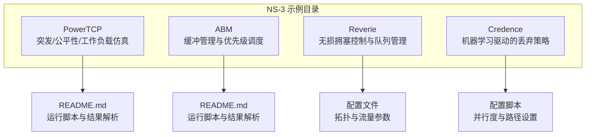
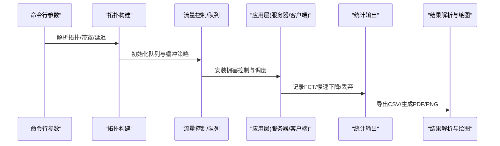
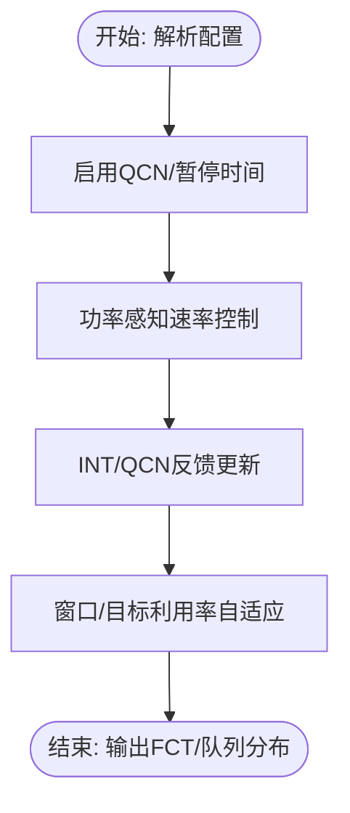
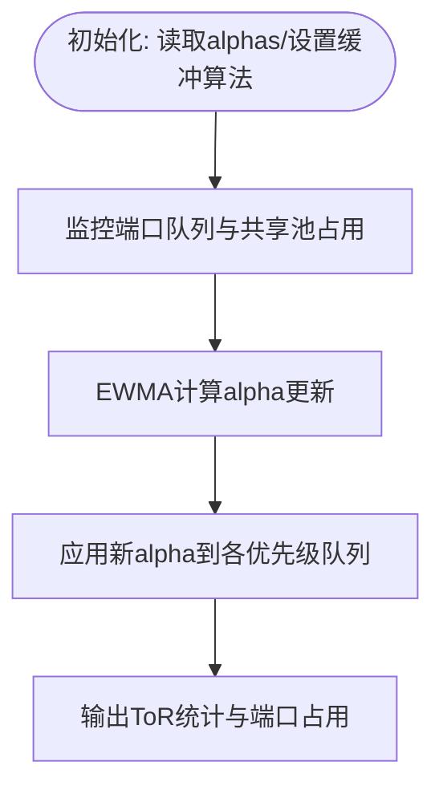
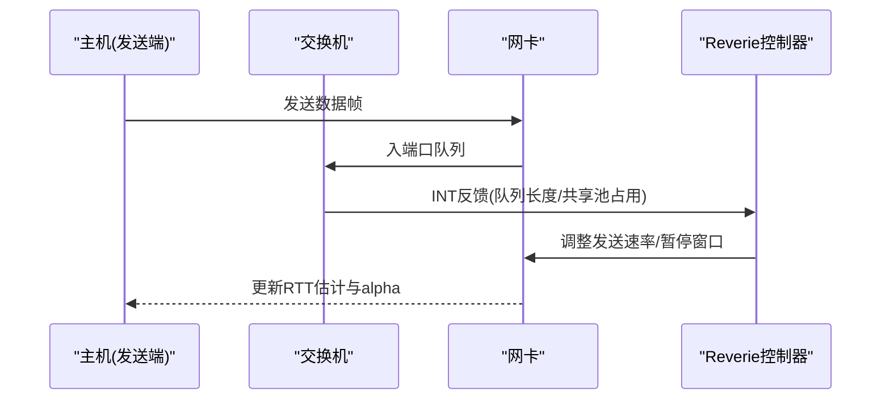
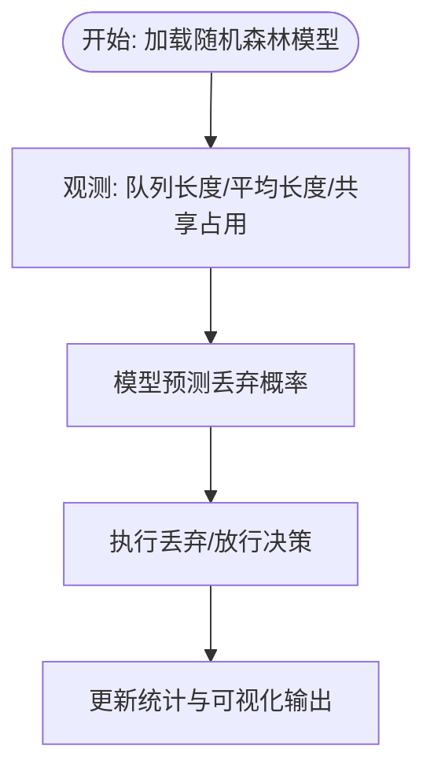
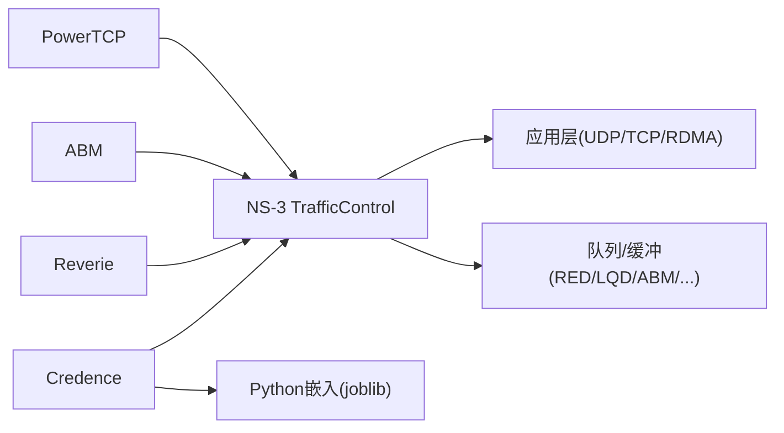

# 研究算法介绍

<cite>
**本文档引用的文件**
- [PowerTCP README](file://simulator/ns-3.39/examples/PowerTCP/README.md)
- [ABM README](file://simulator/ns-3.39/examples/ABM/README.md)
- [Reverie 主仿真脚本](file://simulator/ns-3.39/examples/Reverie/reverie-evaluation-sigcomm2023.cc)
- [Credence 主仿真脚本](file://simulator/ns-3.39/examples/Credence/credence-evaluation.cc)
- [PowerTCP 突发场景仿真](file://simulator/ns-3.39/examples/PowerTCP/powertcp-evaluation-burst.cc)
- [ABM 主仿真脚本](file://simulator/ns-3.39/examples/ABM/abm-evaluation.cc)
- [Reverie 工作负载配置](file://simulator/ns-3.39/examples/Reverie/config-workload.txt)
- [Credence 配置脚本](file://simulator/ns-3.39/examples/Credence/config.sh)
</cite>

## 目录
1. [引言](#引言)
2. [项目结构](#项目结构)
3. [核心组件](#核心组件)
4. [架构总览](#架构总览)
5. [详细组件分析](#详细组件分析)
6. [依赖关系分析](#依赖关系分析)
7. [性能考虑](#性能考虑)
8. [故障排除指南](#故障排除指南)
9. [结论](#结论)

## 引言
本文件面向研究人员与开发者，系统梳理NS-3数据中心网络仿真平台中四个前沿研究算法：PowerTCP（NSDI 2022）、ABM（SIGCOMM 2022）、Reverie（NSDI 2024）与Credence（NSDI 2024）。文档从理论基础、技术创新点、实现细节、应用场景与性能优势出发，结合仓库中的示例脚本与配置文件，给出可操作的运行流程、数据采集与可视化路径，并提供算法原理图与实现架构图，帮助读者快速理解与复现这些算法。

## 项目结构
四个算法均位于NS-3源码树的examples目录下，采用“按算法分目录”的组织方式，每个算法目录包含：
- 主仿真入口脚本（如credence-evaluation.cc）
- README或配置说明文件（如README.md、config.sh）
- 运行脚本与结果解析脚本（如run-*.sh、results.sh、plot-*.py）
- 拓扑与流量配置文件（如leaf-spine.txt、flow-test.txt、websearch.csv）

**图表来源**
- [PowerTCP README:1-34](file://simulator/ns-3.39/examples/PowerTCP/README.md#L1-L34)
- [ABM README:1-17](file://simulator/ns-3.39/examples/ABM/README.md#L1-L17)
- [Reverie 主仿真脚本:642-800](file://simulator/ns-3.39/examples/Reverie/reverie-evaluation-sigcomm2023.cc#L642-L800)
- [Credence 主仿真脚本:366-580](file://simulator/ns-3.39/examples/Credence/credence-evaluation.cc#L366-L580)

**章节来源**
- [PowerTCP README:1-34](file://simulator/ns-3.39/examples/PowerTCP/README.md#L1-L34)
- [ABM README:1-17](file://simulator/ns-3.39/examples/ABM/README.md#L1-L17)

## 核心组件
- 数据中心拓扑构建器：负责生成叶脊（Leaf-Spine）等典型拓扑，连接服务器、ToR交换机与上联交换机。
- 流量生成器：支持突发流量（Incast）、混合工作负载（WebSearch、Hadoop等），以及RDMA/UDP/TCP应用。
- 队列与缓冲管理：集成多种队列调度与共享内存缓冲策略（如DT/FAB/CS/IB/ABM/LQD等）。
- 拥塞控制与无损机制：集成HPCC、TIMELY、PowerTCP、Theta-PowerTCP、DCQCN、INT等。
- 统计输出与可视化：记录FCT、慢速下降因子、ToR占用率、丢弃事件等指标，配套Python脚本绘图。

**章节来源**
- [Reverie 主仿真脚本:642-800](file://simulator/ns-3.39/examples/Reverie/reverie-evaluation-sigcomm2023.cc#L642-L800)
- [Credence 主仿真脚本:366-580](file://simulator/ns-3.39/examples/Credence/credence-evaluation.cc#L366-L580)
- [ABM 主仿真脚本:318-410](file://simulator/ns-3.39/examples/ABM/abm-evaluation.cc#L318-L410)

## 架构总览
四个算法在NS-3中的运行流程大致相同：命令行参数解析 → 拓扑与节点初始化 → 队列与缓冲配置 → 应用安装与启动 → 统计输出 → 结果解析与绘图。

[此图为概念性流程示意，不直接映射具体源文件，故无图表来源]

## 详细组件分析

### PowerTCP（NSDI 2022）
- 理论基础：基于功率感知的速率控制，通过动态调整发送速率以降低突发拥塞下的排队延迟与慢速下降。
- 技术创新点：
  - 支持Theta版本（延迟感知版本）与标准PowerTCP。
  - 引入QCN（Quantized Congestion Notification）与INT（In-band Network Telemetry）反馈。
  - 动态目标利用率与窗口自适应。
- 实现细节：
  - 通过配置文件控制启用QCN、暂停时间、速率增减间隔等。
  - 支持RDMA与TCP两种传输模式的对比实验。
  - 提供突发、公平性与工作负载三类场景的脚本与结果解析。
- 应用场景：大规模数据中心Incast场景、高并发查询服务。
- 性能优势：显著降低长尾FCT，提升吞吐稳定性。

**图表来源**
- [PowerTCP 突发场景仿真:402-720](file://simulator/ns-3.39/examples/PowerTCP/powertcp-evaluation-burst.cc#L402-L720)

**章节来源**
- [PowerTCP README:1-34](file://simulator/ns-3.39/examples/PowerTCP/README.md#L1-L34)
- [PowerTCP 突发场景仿真:402-720](file://simulator/ns-3.39/examples/PowerTCP/powertcp-evaluation-burst.cc#L402-L720)

### ABM（SIGCOMM 2022）
- 理论基础：自适应缓冲管理（Adaptive Buffer Management），根据端口队列长度与共享池占用动态调整alpha权重，优化多优先级队列的公平性与稳定性。
- 技术创新点：
  - 基于EWMA的alpha值更新机制。
  - 支持DT/FAB/CS/IB/ABM五种缓冲算法。
  - 将ToR端口队列状态与上联链路容量解耦，提升跨节点公平性。
- 实现细节：
  - 通过命令行参数选择算法与优先级数，配置静态缓冲与更新周期。
  - 记录每端口队列占用与吞吐，支持逐端口与聚合统计。
- 应用场景：多租户、多优先级、高并发短流与长流混合的工作负载。
- 性能优势：降低高优先级饿死风险，提升整体公平性与稳定性。

**图表来源**
- [ABM 主仿真脚本:318-410](file://simulator/ns-3.39/examples/ABM/abm-evaluation.cc#L318-L410)

**章节来源**
- [ABM README:1-17](file://simulator/ns-3.39/examples/ABM/README.md#L1-L17)
- [ABM 主仿真脚本:318-410](file://simulator/ns-3.39/examples/ABM/abm-evaluation.cc#L318-L410)

### Reverie（NSDI 2024）
- 理论基础：面向数据中心的无损拥塞控制框架，结合ECN、PFC与动态阈值，利用INT反馈进行精细速率调节。
- 技术创新点：
  - 动态PFC阈值与QCN参数联动。
  - 基于RTT的alpha更新周期，支持不同优先级的差异化控制。
  - 支持RDMA与TCP混合场景的统一调度。
- 实现细节：
  - 通过配置文件集中管理CC模式、INT模式、速率增益、缓冲大小等。
  - 提供突发与工作负载两类场景脚本，支持RDMA/UDP/TCP对比。
- 应用场景：超低时延、高可靠性的RDMA与混合流量。
- 性能优势：显著降低突发拥塞下的队列波动，提升端到端时延稳定性。

**图表来源**
- [Reverie 主仿真脚本:642-800](file://simulator/ns-3.39/examples/Reverie/reverie-evaluation-sigcomm2023.cc#L642-L800)
- [Reverie 工作负载配置:1-57](file://simulator/ns-3.39/examples/Reverie/config-workload.txt#L1-L57)

**章节来源**
- [Reverie 主仿真脚本:642-800](file://simulator/ns-3.39/examples/Reverie/reverie-evaluation-sigcomm2023.cc#L642-L800)
- [Reverie 工作负载配置:1-57](file://simulator/ns-3.39/examples/Reverie/config-workload.txt#L1-L57)

### Credence（NSDI 2024）
- 理论基础：将机器学习（随机森林）引入丢弃决策，基于端口队列长度、平均队列长度、共享池占用与平均占用等特征预测最优丢弃策略。
- 技术创新点：
  - 使用预训练模型对丢弃概率进行在线预测。
  - 与传统RED/LQD等队列算法结合，形成“智能丢弃”机制。
  - 支持逐交换机索引的模型文件加载。
- 实现细节：
  - 通过命令行参数指定模型文件前缀与丢弃开关。
  - 集成Python嵌入接口调用模型预测函数。
- 应用场景：高负载、长尾敏感的数据中心网络。
- 性能优势：在保持高吞吐的同时，有效抑制长尾时延。

**图表来源**
- [Credence 主仿真脚本:366-470](file://simulator/ns-3.39/examples/Credence/credence-evaluation.cc#L366-L470)

**章节来源**
- [Credence 主仿真脚本:366-470](file://simulator/ns-3.39/examples/Credence/credence-evaluation.cc#L366-L470)
- [Credence 配置脚本:1-2](file://simulator/ns-3.39/examples/Credence/config.sh#L1-L2)

## 依赖关系分析
- 算法间依赖：四者均依赖NS-3的TrafficControl模块、队列与缓冲组件、应用层（BulkSend/UDP/RDMA）与路由栈。
- 外部工具：Credence使用Python嵌入与joblib加载模型；ABM/Reverie/PowerTCP使用命令行参数与配置文件驱动。
- 并行化：ABM与PowerTCP的工作负载脚本支持多核并行，需根据CPU核心数调整并发度。

**图表来源**
- [Credence 主仿真脚本:1-70](file://simulator/ns-3.39/examples/Credence/credence-evaluation.cc#L1-L70)
- [ABM 主仿真脚本:17-30](file://simulator/ns-3.39/examples/ABM/abm-evaluation.cc#L17-L30)
- [Reverie 主仿真脚本:11-26](file://simulator/ns-3.39/examples/Reverie/reverie-evaluation-sigcomm2023.cc#L11-L26)

**章节来源**
- [Credence 主仿真脚本:1-70](file://simulator/ns-3.39/examples/Credence/credence-evaluation.cc#L1-L70)
- [ABM 主仿真脚本:17-30](file://simulator/ns-3.39/examples/ABM/abm-evaluation.cc#L17-L30)
- [Reverie 主仿真脚本:11-26](file://simulator/ns-3.39/examples/Reverie/reverie-evaluation-sigcomm2023.cc#L11-L26)

## 性能考虑
- 并发度与资源：ABM与PowerTCP工作负载脚本默认并行38个仿真，建议根据CPU核心数适当下调，避免I/O与内存瓶颈。
- 缓冲与队列：合理设置静态缓冲比例与更新周期，避免过度保守导致高延迟，或过度激进引发抖动。
- 模型推理：Credence的模型加载与预测会带来额外开销，建议在长时间仿真中评估其对整体性能的影响。
- 可视化与存储：大量统计输出会占用磁盘空间，建议在大规模实验中定期归档与压缩中间结果。

[本节为通用指导，无需章节来源]

## 故障排除指南
- 并发阻塞：若发现脚本长时间等待CPU空闲，请检查并行度设置与系统负载，适当减少同时运行的仿真数量。
- 路径错误：确保config.sh中NS3路径正确，且所有脚本与数据文件路径一致。
- 内存不足：在高并发或大拓扑场景下，适当降低仿真时长或减少端口数/优先级数。
- Python模型缺失：确认Credence的模型文件路径存在且命名符合预期，否则将无法进行预测。

**章节来源**
- [PowerTCP README:27-34](file://simulator/ns-3.39/examples/PowerTCP/README.md#L27-L34)
- [ABM README:3-6](file://simulator/ns-3.39/examples/ABM/README.md#L3-L6)
- [Credence 配置脚本:1-2](file://simulator/ns-3.39/examples/Credence/config.sh#L1-L2)

## 结论
本文档基于NS-3代码库中的实际实现，系统介绍了PowerTCP、ABM、Reverie与Credence四个算法的理论基础、技术创新点与实现细节。通过命令行参数、配置文件与Python脚本的组合，读者可以快速搭建并运行这些算法的仿真实验，获得FCT、慢速下降、队列占用与丢弃等关键指标，从而深入理解它们在数据中心网络中的性能表现与适用场景。