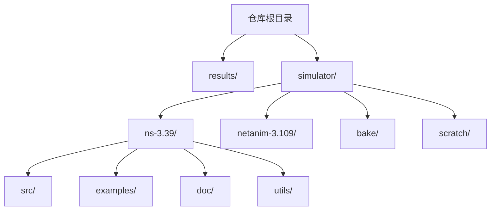
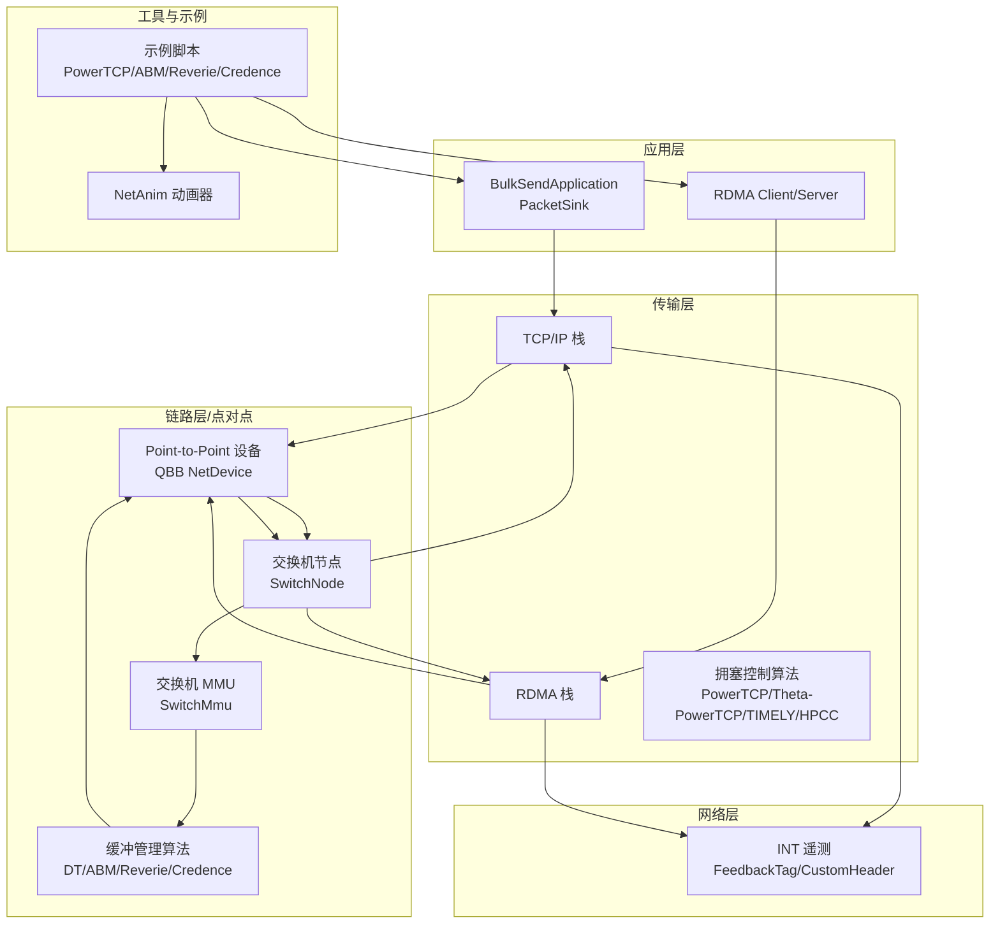
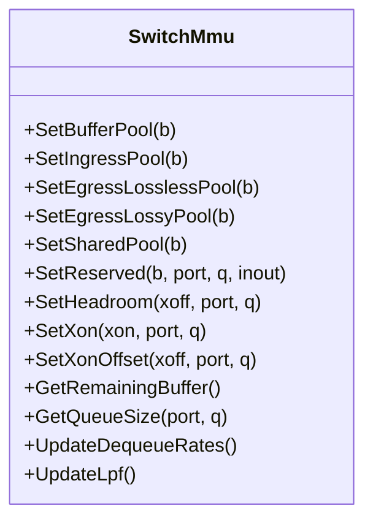
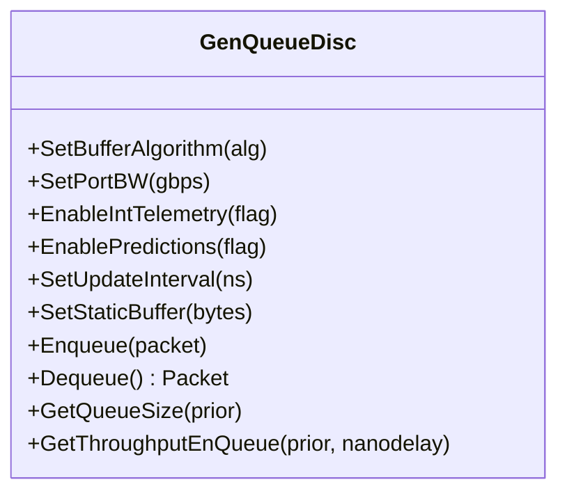
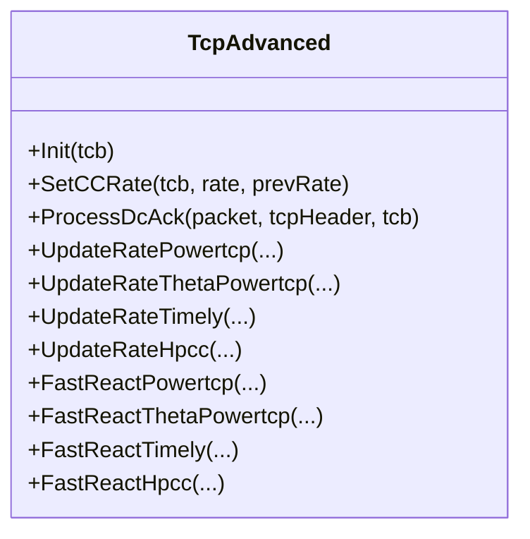
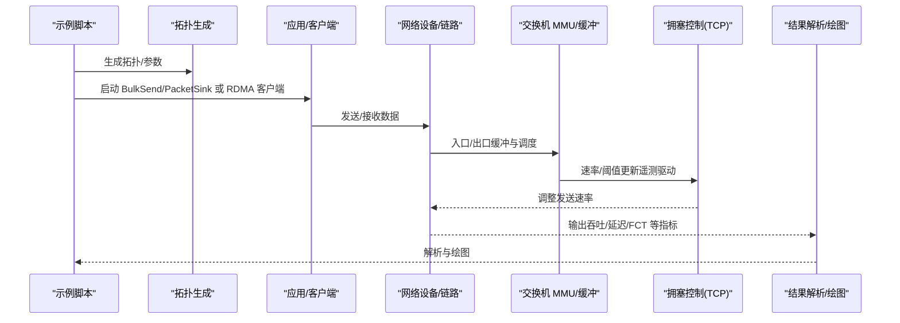
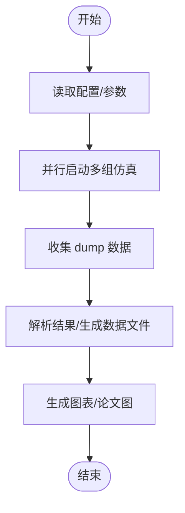
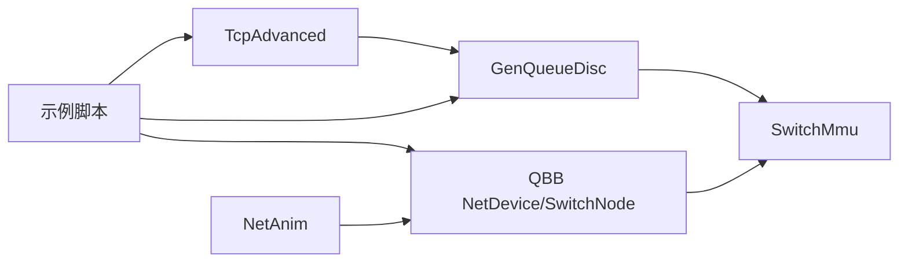

# 项目概述

<cite>
**本文档引用的文件**
- [README.md](file://README.md)
- [simulator/README.md](file://simulator/README.md)
- [ns-3.39/README.md](file://simulator/ns-3.39/README.md)
- [ns-3.39/RELEASE_NOTES.md](file://simulator/ns-3.39/RELEASE_NOTES.md)
- [ns-3.39/examples/PowerTCP/README.md](file://simulator/ns-3.39/examples/PowerTCP/README.md)
- [ns-3.39/examples/ABM/README.md](file://simulator/ns-3.39/examples/ABM/README.md)
- [ns-3.39/src/point-to-point/model/switch-mmu.cc](file://simulator/ns-3.39/src/point-to-point/model/switch-mmu.cc)
- [ns-3.39/src/traffic-control/model/gen-queue-disc.cc](file://simulator/ns-3.39/src/traffic-control/model/gen-queue-disc.cc)
- [ns-3.39/src/internet/model/tcp-advanced.cc](file://simulator/ns-3.39/src/internet/model/tcp-advanced.cc)
</cite>

## 目录
1. [引言](#引言)
2. [项目结构](#项目结构)
3. [核心组件](#核心组件)
4. [架构总览](#架构总览)
5. [详细组件分析](#详细组件分析)
6. [依赖关系分析](#依赖关系分析)
7. [性能考量](#性能考量)
8. [故障排查指南](#故障排查指南)
9. [结论](#结论)
10. [附录](#附录)

## 引言
本项目是在 NS-3.39 基础上扩展的数据中心网络仿真平台，聚焦于最新数据中心拥塞控制与缓冲管理算法的可复现研究。平台围绕以下四项代表性工作进行实现与验证：PowerTCP（NSDI 2022）、ABM（SIGCOMM 2022）、Reverie（NSDI 2024）与 Credence（NSDI 2024）。其核心目标是：
- 在同一仿真框架中统一支持 TCP/IP 与 RDMA 双栈场景下的数据包传输；
- 提供可配置的交换机 MMU 模型（基于 SONiC 理解与 Reverie 模型），并集成多种缓冲管理策略（动态阈值 DT、Active Buffer Management ABM、Reverie 低通滤波模型、Credence 机器学习增强预测）；
- 支持在流量控制层与传输层分别实现拥塞控制算法，便于对比评估；
- 通过示例脚本与可视化工具，降低研究门槛，提升结果可复现性。

平台同时强调“可构建、可运行、可扩展”的工程化设计，既适合初学者快速入门，也为研究人员提供了深入定制与扩展的空间。

## 项目结构
仓库采用分层组织方式，核心目录与职责如下：
- results：实验结果输出与归档目录（预留）
- simulator：包含 ns-3.39 核心、NetAnim 动画器、Bake 构建工具等子模块
  - ns-3.39：NS-3 官方源码与扩展模块，包含大量模型与示例
  - netanim-3.109：网络动画器，用于仿真可视化
  - bake：ns-3 扩展生态的构建工具
  - scratch：临时测试与原型开发目录
- 顶层 README.md：项目总体说明、论文引用、使用指南与重要文件清单

项目结构示意（概念性）：

章节来源
- [README.md:1-241](file://README.md#L1-L241)
- [simulator/README.md:1-33](file://simulator/README.md#L1-L33)

## 核心组件
平台围绕“交换机 MMU”“缓冲管理算法”“拥塞控制算法”“示例与脚本”四大类组件展开，具体如下：
- 交换机 MMU（Switch MMU）
  - 支持基于 SONiC 的共享内存模型与 Reverie 的单共享池模型
  - 提供入口/出口池、保留区、头部缓冲（headroom）、PFC 控制等机制
  - 集成 ABM 与 Reverie 的队列调度与更新逻辑
- 缓冲管理算法（Traffic Control 层）
  - 实现 DT、ABM、Reverie、Credence 等算法
  - 支持多优先级队列、INT 遥测、预测注入（Credence）
- 拥塞控制算法（传输层）
  - 在 TCP/IP 栈内实现 PowerTCP、Theta-PowerTCP、TIMELY、HPCC 等
  - 通过反馈标签与速率回调实现自适应调速
- 示例与脚本
  - PowerTCP：突发、公平性、工作负载三类场景的完整流水线
  - ABM：论文复现实验脚本集合，含并行调度与结果解析
  - Reverie：混合流量（RDMA+TCP）与拓扑生成脚本
  - Credence：机器学习预测集成示例（待完善）

章节来源
- [README.md:10-16](file://README.md#L10-L16)
- [README.md:83-95](file://README.md#L83-L95)
- [ns-3.39/examples/PowerTCP/README.md:1-34](file://simulator/ns-3.39/examples/PowerTCP/README.md#L1-L34)
- [ns-3.39/examples/ABM/README.md:1-17](file://simulator/ns-3.39/examples/ABM/README.md#L1-L17)

## 架构总览
下图展示了数据中心网络仿真的整体架构与关键交互路径。平台在 NS-3.39 的基础上，新增了 RDMA/TCP 双栈支持、交换机 MMU、流量控制与传输层拥塞控制模块，并通过示例脚本串联起从拓扑生成、流量注入到结果统计与可视化的完整流程。

图表来源
- [README.md:83-110](file://README.md#L83-L110)
- [ns-3.39/src/point-to-point/model/switch-mmu.cc:1-200](file://simulator/ns-3.39/src/point-to-point/model/switch-mmu.cc#L1-L200)
- [ns-3.39/src/traffic-control/model/gen-queue-disc.cc:1-200](file://simulator/ns-3.39/src/traffic-control/model/gen-queue-disc.cc#L1-L200)
- [ns-3.39/src/internet/model/tcp-advanced.cc:1-200](file://simulator/ns-3.39/src/internet/model/tcp-advanced.cc#L1-L200)

## 详细组件分析

### 交换机 MMU 组件
- 设计要点
  - 共享内存池划分：入口池（共享给无损/有损）、出口池（无损/有损分离或单共享池，取决于模型）
  - 头部缓冲（headroom）与 PFC 控制：按端口/队列配置上限，溢出时触发暂停
  - 算法选择：入口/出口可配置为 DT、ABM、Reverie 等
  - 运行时指标：队列占用、已用缓冲、去队速率、LPF 更新等
- 关键接口
  - 设置缓冲池大小、入口/出口池、共享池
  - 设置保留区、头部缓冲上限、PFC 恢复参数
  - 获取剩余缓冲、队列占用、去队速率等

图表来源
- [ns-3.39/src/point-to-point/model/switch-mmu.cc:149-200](file://simulator/ns-3.39/src/point-to-point/model/switch-mmu.cc#L149-L200)

章节来源
- [ns-3.39/src/point-to-point/model/switch-mmu.cc:1-200](file://simulator/ns-3.39/src/point-to-point/model/switch-mmu.cc#L1-L200)

### 流量控制缓冲管理组件
- 设计要点
  - 支持 DT、ABM、Reverie、Credence 等算法
  - 多优先级队列与 INT 遥测开关
  - 去队速率更新间隔、静态缓冲、严格优先级/轮询调度
  - Credence：启用预测注入，支持误差概率等属性
- 关键接口
  - 设置算法类型、端口带宽、饱和检测阈值
  - 启用/禁用 INT、DPP 队列、预测
  - 查询队列大小、吞吐、丢弃字节等

图表来源
- [ns-3.39/src/traffic-control/model/gen-queue-disc.cc:55-131](file://simulator/ns-3.39/src/traffic-control/model/gen-queue-disc.cc#L55-L131)

章节来源
- [ns-3.39/src/traffic-control/model/gen-queue-disc.cc:1-200](file://simulator/ns-3.39/src/traffic-control/model/gen-queue-disc.cc#L1-L200)

### 传输层拥塞控制组件
- 设计要点
  - 在 TCP/IP 栈内实现 PowerTCP、Theta-PowerTCP、TIMELY、HPCC 等
  - 通过 FeedbackTag 获取遥测信息，结合 RTT、速率回调实现自适应调速
  - 初始化窗口、基础 RTT、最小 RTT 等参数设置
- 关键接口
  - 初始化拥塞控制状态
  - 处理 ACK 与反馈，更新发送速率
  - Fork 新连接拥塞控制实例

图表来源
- [ns-3.39/src/internet/model/tcp-advanced.cc:18-98](file://simulator/ns-3.39/src/internet/model/tcp-advanced.cc#L18-L98)

章节来源
- [ns-3.39/src/internet/model/tcp-advanced.cc:1-200](file://simulator/ns-3.39/src/internet/model/tcp-advanced.cc#L1-L200)

### PowerTCP 场景执行流程
下图展示 PowerTCP 在突发、公平性与工作负载三类场景中的典型执行序列：脚本启动仿真、拓扑与流量生成、数据采集、结果解析与绘图。

图表来源
- [README.md:83-95](file://README.md#L83-L95)
- [ns-3.39/examples/PowerTCP/README.md:1-34](file://simulator/ns-3.39/examples/PowerTCP/README.md#L1-L34)

章节来源
- [README.md:83-95](file://README.md#L83-L95)
- [ns-3.39/examples/PowerTCP/README.md:1-34](file://simulator/ns-3.39/examples/PowerTCP/README.md#L1-L34)

### ABM 场景执行流程
ABM 场景侧重在 TCP/IP 栈内的多队列与缓冲管理策略对比，脚本负责并行调度与结果汇总。

图表来源
- [README.md:87-90](file://README.md#L87-L90)
- [ns-3.39/examples/ABM/README.md:1-17](file://simulator/ns-3.39/examples/ABM/README.md#L1-L17)

章节来源
- [README.md:87-90](file://README.md#L87-L90)
- [ns-3.39/examples/ABM/README.md:1-17](file://simulator/ns-3.39/examples/ABM/README.md#L1-L17)

## 依赖关系分析
- 内部耦合
  - 交换机 MMU 与缓冲管理算法紧密协作：MMU 提供剩余缓冲与队列占用，缓冲算法据此决定入队/丢弃与阈值调整
  - 传输层拥塞控制依赖 INT 遥测反馈；遥测由网络层标签携带，链路层/点对点设备负责转发
- 外部依赖
  - 构建系统：基于 NS-3.39 的 CMake/Waf 工具链
  - 可视化：NetAnim 动画器
  - 示例脚本：Python 脚本用于结果解析与绘图
- 潜在风险
  - 并行仿真数量与 CPU 核心数需匹配，避免资源争用导致任务堆积
  - RDMA 与 TCP/IP 双栈混布场景需确保应用与设备正确区分协议栈

图表来源
- [README.md:83-110](file://README.md#L83-L110)
- [ns-3.39/src/traffic-control/model/gen-queue-disc.cc:55-131](file://simulator/ns-3.39/src/traffic-control/model/gen-queue-disc.cc#L55-L131)
- [ns-3.39/src/internet/model/tcp-advanced.cc:18-98](file://simulator/ns-3.39/src/internet/model/tcp-advanced.cc#L18-L98)

章节来源
- [README.md:83-110](file://README.md#L83-L110)

## 性能考量
- 并行仿真优化
  - ABM 示例脚本支持按 CPU 核心数动态限制并发任务数，建议将并发度设置为略小于物理核心数，避免上下文切换开销
- 缓冲与调度
  - Reverie 单共享池模型在高混合流量场景下可简化缓冲管理；ABM 的去队速率更新间隔影响收敛速度与抖动
- 拥塞控制
  - PowerTCP/Theta-PowerTCP 对遥测敏感，建议在高带宽长肥管道场景下开启 INT 并合理设置采样率
- I/O 与可视化
  - 大规模仿真建议关闭实时动画，仅在小规模调试阶段使用 NetAnim

## 故障排查指南
- 构建失败
  - 确认已安装 NS-3.39 所需编译器与工具链，参考官方发布说明中的平台要求
- 仿真卡顿/超时
  - 检查示例脚本中的并行度设置，适当降低并发数
  - 确认拓扑规模与流量参数是否合理
- 结果异常
  - 核对 INT 遥测标签是否正确注入与解析
  - 确认 RDMA/TCP 应用与设备栈配置一致
- 可视化问题
  - 使用 NetAnim 时确保依赖库齐全，必要时单独构建 NetAnim 子模块

章节来源
- [ns-3.39/RELEASE_NOTES.md:16-53](file://simulator/ns-3.39/RELEASE_NOTES.md#L16-L53)
- [ns-3.39/README.md:39-87](file://simulator/ns-3.39/README.md#L39-L87)

## 结论
本项目在 NS-3.39 基础上，系统性地集成了数据中心网络前沿算法，覆盖从交换机 MMU 到缓冲管理再到拥塞控制的全栈实现。通过完善的示例脚本与可视化工具，平台实现了“可构建、可运行、可复现”的研究闭环，既能满足教学与入门需求，也能支撑高性能研究与工程化扩展。

## 附录
- 版本与平台
  - 基于 NS-3.39，支持主流 Linux/macOS/Windows 环境
- 论文与引用
  - PowerTCP、ABM、Reverie、Credence 四篇论文的引用信息见顶层 README 的 BibTeX 条目
- 快速开始
  - 进入 ns-3.39 目录，执行配置与构建命令后，参考各示例 README 运行对应场景

章节来源
- [README.md:22-64](file://README.md#L22-L64)
- [ns-3.39/README.md:11-20](file://simulator/ns-3.39/README.md#L11-L20)