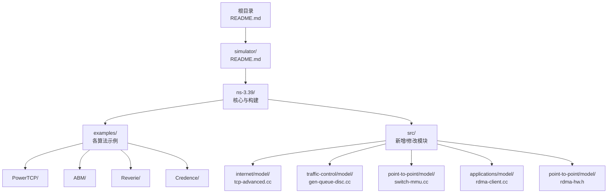
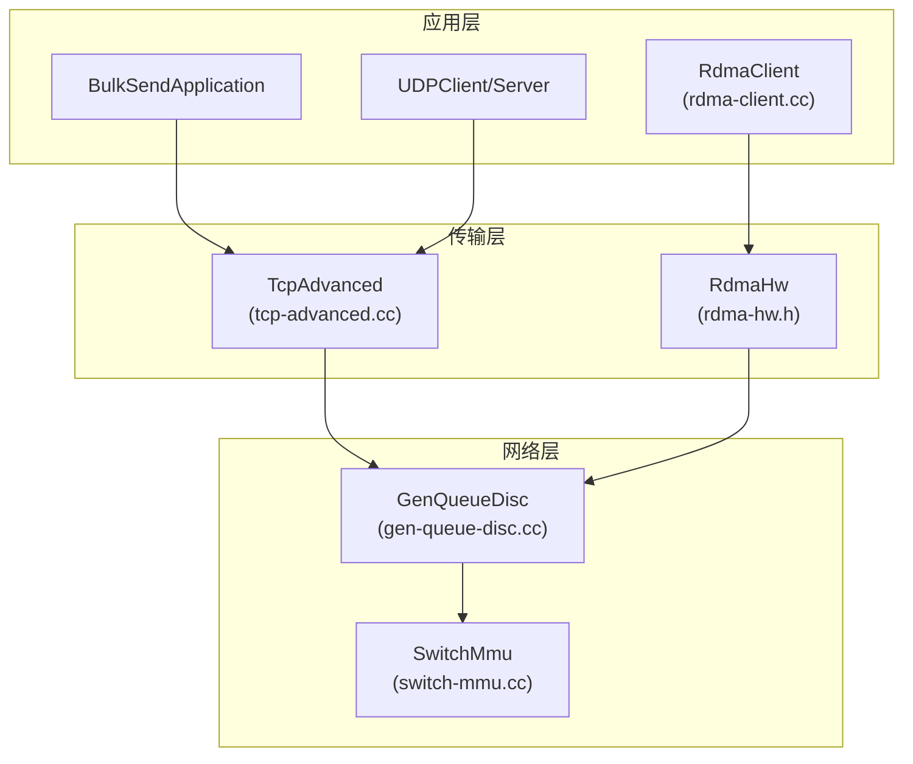
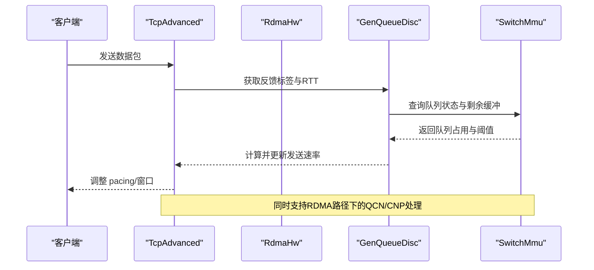
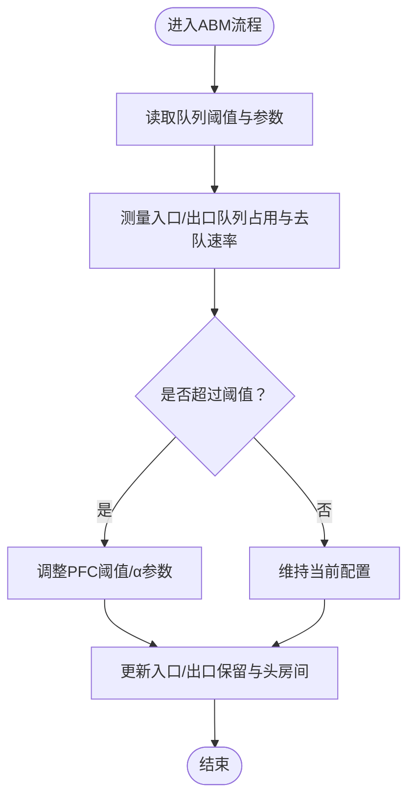
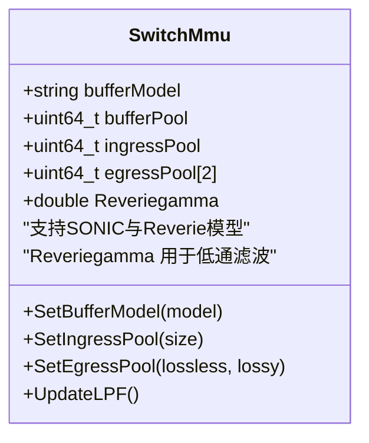
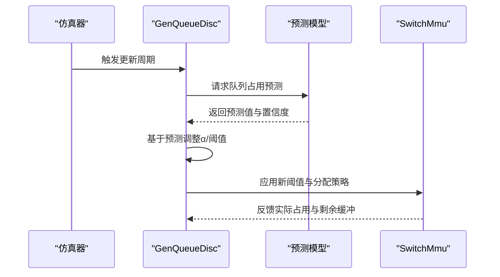
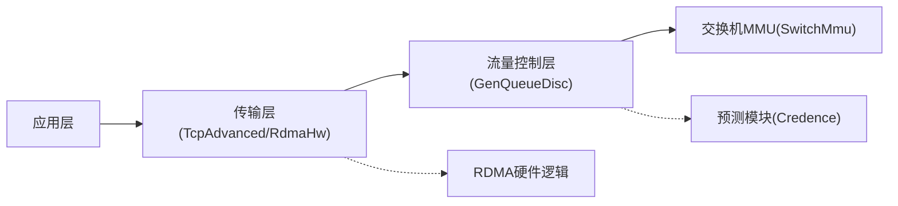

# 项目背景与目标

<cite>
**本文档引用的文件**
- [README.md](file://README.md)
- [simulator/README.md](file://simulator/README.md)
- [simulator/ns-3.39/README.md](file://simulator/ns-3.39/README.md)
- [simulator/ns-3.39/examples/PowerTCP/README.md](file://simulator/ns-3.39/examples/PowerTCP/README.md)
- [simulator/ns-3.39/examples/ABM/README.md](file://simulator/ns-3.39/examples/ABM/README.md)
- [simulator/ns-3.39/src/point-to-point/model/switch-mmu.cc](file://simulator/ns-3.39/src/point-to-point/model/switch-mmu.cc)
- [simulator/ns-3.39/src/internet/model/tcp-advanced.cc](file://simulator/ns-3.39/src/internet/model/tcp-advanced.cc)
- [simulator/ns-3.39/src/traffic-control/model/gen-queue-disc.cc](file://simulator/ns-3.39/src/traffic-control/model/gen-queue-disc.cc)
- [simulator/ns-3.39/src/applications/model/rdma-client.cc](file://simulator/ns-3.39/src/applications/model/rdma-client.cc)
- [simulator/ns-3.39/src/point-to-point/model/rdma-hw.h](file://simulator/ns-3.39/src/point-to-point/model/rdma-hw.h)
- [simulator/ns-3.39/examples/Credence/credence-evaluation.cc](file://simulator/ns-3.39/examples/Credence/credence-evaluation.cc)
</cite>

## 目录
1. [引言](#引言)
2. [项目结构](#项目结构)
3. [核心组件](#核心组件)
4. [架构总览](#架构总览)
5. [详细组件分析](#详细组件分析)
6. [依赖关系分析](#依赖关系分析)
7. [性能考量](#性能考量)
8. [故障排查指南](#故障排查指南)
9. [结论](#结论)
10. [附录](#附录)

## 引言
本项目旨在扩展NS-3.39以支持数据中心网络的最新算法与技术进展，重点聚焦于高吞吐、低时延与高公平性的网络拥塞控制与交换机缓冲管理。项目围绕以下四项代表性工作展开：PowerTCP（NSDI 2022）、ABM（SIGCOMM 2022）、Reverie（NSDI 2024）与Credence（NSDI 2024）。通过在NS-3中实现这些算法，项目既服务于学术研究的可复现性与可比性，也面向工业界对数据中心网络优化的实际需求。

数据中心网络正面临流量多样性、突发性与混合负载（TCP/IP与RDMA共存）带来的挑战。传统拥塞控制与缓冲策略难以兼顾吞吐、延迟与公平性。因此，本项目的目标是：
- 在NS-3中统一支持PowerTCP、ABM、Reverie与Credence等先进算法；
- 提供可配置的交换机MMU模型（SONIC与Reverie），并支持动态阈值与主动缓冲管理；
- 支持TCP/IP与RDMA双栈仿真，覆盖从端系统到交换机的全链路优化；
- 通过Python绑定与机器学习集成，提升仿真效率与预测能力。

## 项目结构
仓库采用分层组织方式：
- 根目录提供总体说明与参考文献；
- simulator子目录包含ns-3.39核心、构建脚本与示例；
- examples目录下按算法划分，提供可直接运行的仿真脚本与结果处理工具；
- src目录下新增或修改了与RDMA、TCP高级拥塞控制、队列调度与交换机MMU相关的模块。

图表来源
- [README.md:1-241](file://README.md#L1-L241)
- [simulator/README.md:1-33](file://simulator/README.md#L1-L33)
- [simulator/ns-3.39/README.md:1-175](file://simulator/ns-3.39/README.md#L1-L175)

章节来源
- [README.md:1-241](file://README.md#L1-L241)
- [simulator/README.md:1-33](file://simulator/README.md#L1-L33)
- [simulator/ns-3.39/README.md:1-175](file://simulator/ns-3.39/README.md#L1-L175)

## 核心组件
- 交换机MMU与缓冲模型
  - 支持SONIC与Reverie两种缓冲模型，具备入口/出口池化、头房间（headroom）与保留区配置能力；
  - 集成动态阈值（DT）、主动缓冲管理（ABM）与低通滤波器（Reverie）等算法。
- 高级TCP拥塞控制
  - 在TCP/IP栈中实现PowerTCP、Theta-PowerTCP、HPCC、TIMELY等算法；
  - 通过自定义拥塞控制类扩展NS-3默认TCP实现。
- RDMA硬件与队列管理
  - 新增RDMA客户端、RDMA硬件逻辑与队列对管理，支持QCN、CNP等RDMA拥塞信号处理；
  - 支持在同一条链路同时承载RDMA与TCP/IP流量。
- 队列调度与多优先级
  - 在流量控制层实现通用队列调度器，支持多优先级、RED队列与预测集成（Credence）。

章节来源
- [README.md:12-16](file://README.md#L12-L16)
- [README.md:97-109](file://README.md#L97-L109)
- [simulator/ns-3.39/src/point-to-point/model/switch-mmu.cc:35-53](file://simulator/ns-3.39/src/point-to-point/model/switch-mmu.cc#L35-L53)
- [simulator/ns-3.39/src/internet/model/tcp-advanced.cc:18-39](file://simulator/ns-3.39/src/internet/model/tcp-advanced.cc#L18-L39)
- [simulator/ns-3.39/src/traffic-control/model/gen-queue-disc.cc:40-47](file://simulator/ns-3.39/src/traffic-control/model/gen-queue-disc.cc#L40-L47)

## 架构总览
下图展示了数据中心网络仿真平台在NS-3中的整体架构：从应用层的BulkSend/UDP/RDMA客户端，到传输层的高级TCP拥塞控制与RDMA硬件逻辑，再到网络层的队列调度与交换机MMU，最终形成可配置的缓冲管理与拥塞控制闭环。

图表来源
- [simulator/ns-3.39/src/applications/model/rdma-client.cc:1-45](file://simulator/ns-3.39/src/applications/model/rdma-client.cc#L1-L45)
- [simulator/ns-3.39/src/internet/model/tcp-advanced.cc:18-39](file://simulator/ns-3.39/src/internet/model/tcp-advanced.cc#L18-L39)
- [simulator/ns-3.39/src/traffic-control/model/gen-queue-disc.cc:55-131](file://simulator/ns-3.39/src/traffic-control/model/gen-queue-disc.cc#L55-L131)
- [simulator/ns-3.39/src/point-to-point/model/switch-mmu.cc:28-33](file://simulator/ns-3.39/src/point-to-point/model/switch-mmu.cc#L28-L33)

## 详细组件分析

### PowerTCP：面向数据中心的高性能拥塞控制
PowerTCP通过利用接收速率与队列梯度之间的关系，实现更精确的拥塞判断与速率调整。在NS-3中，PowerTCP被实现在TCP/IP栈的高级拥塞控制模块中，并可在RDMA栈中使用相应的硬件逻辑。

图表来源
- [simulator/ns-3.39/src/internet/model/tcp-advanced.cc:143-185](file://simulator/ns-3.39/src/internet/model/tcp-advanced.cc#L143-L185)
- [simulator/ns-3.39/src/traffic-control/model/gen-queue-disc.cc:183-199](file://simulator/ns-3.39/src/traffic-control/model/gen-queue-disc.cc#L183-L199)
- [simulator/ns-3.39/src/point-to-point/model/rdma-hw.h:134-137](file://simulator/ns-3.39/src/point-to-point/model/rdma-hw.h#L134-L137)

章节来源
- [README.md:83-85](file://README.md#L83-L85)
- [simulator/ns-3.39/examples/PowerTCP/README.md:1-34](file://simulator/ns-3.39/examples/PowerTCP/README.md#L1-L34)
- [simulator/ns-3.39/src/internet/model/tcp-advanced.cc:189-200](file://simulator/ns-3.39/src/internet/model/tcp-advanced.cc#L189-L200)

### ABM：主动缓冲管理
ABM通过动态调整入口与出口阈值，结合队列去队速率估计，实现更精细的缓冲共享与拥塞响应。项目提供了两套实现：一套位于流量控制层（仅TCP/IP），另一套位于交换机MMU（支持RDMA与混合场景）。

图表来源
- [simulator/ns-3.39/src/traffic-control/model/gen-queue-disc.cc:40-47](file://simulator/ns-3.39/src/traffic-control/model/gen-queue-disc.cc#L40-L47)
- [simulator/ns-3.39/src/point-to-point/model/switch-mmu.cc:113-121](file://simulator/ns-3.39/src/point-to-point/model/switch-mmu.cc#L113-L121)

章节来源
- [README.md:87-90](file://README.md#L87-L90)
- [simulator/ns-3.39/examples/ABM/README.md:1-17](file://simulator/ns-3.39/examples/ABM/README.md#L1-L17)
- [simulator/ns-3.39/src/traffic-control/model/gen-queue-disc.cc:55-131](file://simulator/ns-3.39/src/traffic-control/model/gen-queue-disc.cc#L55-L131)

### Reverie：基于低通滤波的交换机缓冲共享
Reverie提出一种低通滤波器机制，用于平滑队列变化趋势，从而在RDMA与TCP混合场景下实现更稳定的缓冲共享。项目在交换机MMU中实现了Reverie模型，并支持单共享池配置。

图表来源
- [simulator/ns-3.39/src/point-to-point/model/switch-mmu.cc:56-147](file://simulator/ns-3.39/src/point-to-point/model/switch-mmu.cc#L56-L147)

章节来源
- [README.md:94-95](file://README.md#L94-L95)
- [simulator/ns-3.39/src/point-to-point/model/switch-mmu.cc:35-53](file://simulator/ns-3.39/src/point-to-point/model/switch-mmu.cc#L35-L53)

### Credence：基于机器学习预测的缓冲增强
Credence将机器学习预测引入交换机缓冲共享，通过预测未来队列占用，提前调整阈值与分配策略。项目在流量控制层的通用队列调度器中集成了预测开关与误差注入功能，便于与scikit-learn模型对接。

图表来源
- [simulator/ns-3.39/src/traffic-control/model/gen-queue-disc.cc:107-110](file://simulator/ns-3.39/src/traffic-control/model/gen-queue-disc.cc#L107-L110)
- [simulator/ns-3.39/examples/Credence/credence-evaluation.cc:654-674](file://simulator/ns-3.39/examples/Credence/credence-evaluation.cc#L654-L674)

章节来源
- [README.md:91-93](file://README.md#L91-L93)
- [simulator/ns-3.39/src/traffic-control/model/gen-queue-disc.cc:88-92](file://simulator/ns-3.39/src/traffic-control/model/gen-queue-disc.cc#L88-L92)

## 依赖关系分析
项目在NS-3基础上进行了模块化扩展，主要依赖关系如下：
- 应用层依赖传输层提供的Socket类型与RDMA客户端；
- 传输层依赖流量控制层的队列调度与交换机MMU提供的缓冲状态；
- 流量控制层依赖通用队列调度器与RDMA硬件逻辑；
- 交换机MMU依赖队列统计与去队速率估计。

图表来源
- [simulator/ns-3.39/src/applications/model/rdma-client.cc:1-45](file://simulator/ns-3.39/src/applications/model/rdma-client.cc#L1-L45)
- [simulator/ns-3.39/src/internet/model/tcp-advanced.cc:18-39](file://simulator/ns-3.39/src/internet/model/tcp-advanced.cc#L18-L39)
- [simulator/ns-3.39/src/traffic-control/model/gen-queue-disc.cc:55-131](file://simulator/ns-3.39/src/traffic-control/model/gen-queue-disc.cc#L55-L131)
- [simulator/ns-3.39/src/point-to-point/model/switch-mmu.cc:28-33](file://simulator/ns-3.39/src/point-to-point/model/switch-mmu.cc#L28-L33)

章节来源
- [README.md:97-109](file://README.md#L97-L109)

## 性能考量
- 并行化与资源调度
  - 示例脚本普遍采用并行执行多个仿真任务，需根据CPU核心数合理设置并发度，避免I/O与内存瓶颈。
- 缓冲模型选择
  - SONIC适合高带宽长肥管道，Reverie适合混合流量场景；需根据拓扑与流量特征选择合适模型与参数。
- 算法复杂度
  - ABM与Reverie涉及频繁的阈值调整与LPF更新，建议在仿真中设置合理的更新间隔以平衡精度与开销。
- RDMA与TCP共存
  - 需确保端系统与交换机侧的PFC/QCN处理一致，避免因协议差异导致的误判。

## 故障排查指南
- 构建失败
  - 检查ns-3.39的构建环境与依赖项，确保已正确执行配置与编译步骤。
- 仿真耗时过长
  - 调整示例脚本中的并行度参数，避免过多并发任务导致系统资源争用。
- 结果异常
  - 确认使用的算法与缓冲模型配置正确，检查队列阈值、α参数与更新间隔设置是否合理。
- RDMA路径问题
  - 核对RDMA硬件逻辑与队列对状态，确认QCN/CNP处理流程未被忽略。

章节来源
- [README.md:66-81](file://README.md#L66-L81)
- [simulator/ns-3.39/examples/ABM/README.md:3-6](file://simulator/ns-3.39/examples/ABM/README.md#L3-L6)
- [simulator/ns-3.39/examples/PowerTCP/README.md:27-34](file://simulator/ns-3.39/examples/PowerTCP/README.md#L27-L34)

## 结论
本项目通过在NS-3.39中集成PowerTCP、ABM、Reverie与Credence等先进算法，填补了数据中心网络仿真工具在拥塞控制与缓冲管理方面的空白。项目不仅提升了仿真的准确性与可复现性，也为工业界优化数据中心网络提供了可靠的实验平台。随着后续版本迭代与更多算法接入，平台将持续推动数据中心网络技术的研究与落地。

## 附录
- 相关论文引用
  - PowerTCP (NSDI 2022)
  - ABM (SIGCOMM 2022)
  - Reverie (NSDI 2024)
  - Credence (NSDI 2024)

章节来源
- [README.md:22-61](file://README.md#L22-L61)