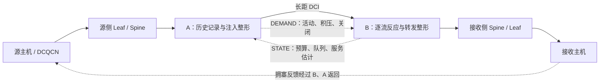

# LonghaulCC R3：跨数据中心 RDMA 的逐流反应与动作时刻队列重建

英文暂定标题：**LonghaulCC: Coordinating Per-Flow Reaction and Action-Time Queue Reconstruction for Cross-Datacenter RDMA**

日期：2026-10-08。性质：中文研究论文初稿，含写作定位、算法描述、已有结果和补证计划。当前源码 HEAD：`b51049b`。名称 LonghaulCC 沿用项目名，R3 表示当前实现版本，不代表新颖性已经成立。

**后续实验更新（2026-10-08）：**已用当前程序完成 35 次新仿真、103 条流及 7 组结果/说明图，见[论文实验与结果图](LonghaulCC_R3_论文实验与结果图_20261008.md)。下文保留初稿阶段的历史证据口径；新实验、精确终点队列核对和最新结论以该实验报告为准。新结果仍未证明 history 稳定收益，并确认示例窗口中 B 反应上限下降尚未改变两流的 49 Gb/s 预算。

证据约定：实现描述来自本轮源码核查；性能数值来自 2026-09-29 保存的实验，本轮重新读取有关 FCT CSV 和最终汇总，但没有重新运行该性能实验。后文明确标注尚待检验的机制假设，不填造性能提升比例或理论保证。

## 一、故事怎么讲

### 1. 推荐的主线

**跨域控制需要同时处理两个问题：不同流的下游拥塞不同，以及反馈到达时状态已经过时。R3 在接收侧按流生成反应预算，在发送侧根据已经实际发出的数据重建控制动作到达时的远端积压，再将聚合限额分配回各条流。**

用一个场景贯穿全文：两条跨域流经过同一 DCI 出口，到达不同接收主机；一条本地流只与其中一条跨域流竞争。接收侧需要保留这种差异，避免单个拥塞信号直接触发全组统一降速。与此同时，发送侧收到接收侧反馈时，一批数据已经进入 WAN，简单使用旧队列可能不能描述新限速动作生效时的积压。论文由此引出“流级反应”和“组级历史重建”的协同。

这条叙事有明确的失败条件：如果历史重建不能在有积压、有实际供给时改善控制，或者逐流状态的代价超过选择性反应的收益，候选贡献就需要收缩。现有实现不能保证同组未拥塞流完全不受影响，因为 A 仍会施加共享组限额。

### 2. 三项候选核心创新

| 候选贡献 | 可用于论文的表述 | 当前依据与缺口 |
|---|---|---|
| C1：跨粒度的反应与供给协调 | 接收侧以流为单位响应路径拥塞并形成预算，发送侧以共享出口组为单位约束输入，再在逐流预算内分配实际发送速率 | 已实现；仍需与统一组级反应及接收侧单独控制作消融，证明减少连带限速 |
| C2：面向动作到达时刻的已知输入重建 | 将真实发送历史映射到远端到达时间，从带时间戳快照推演至新动作到达时刻，减少对已发生输入的猜测 | 已实现；当前常值服务估计存在严重反例，尚无稳定增量收益 |
| C3：需求、暂停与失效约束下的预算执行 | 将逐流预算、实际端口容量、活动需求、PFC 和快照有效性统一接入可执行的整形路径 | 已实现，回归通过；属于系统完整性支撑，不能单独包装成重大算法创新 |

**优先把 C1+C2 的耦合关系作为核心；C3 作为方法可执行性的支撑。**乘法降速、EWMA、最大最小分配、令牌桶、双网关本身都不能单独声称为原创。最终新颖性需要进一步逐项对照 ATC、BiCC、Bifrost 及近期相关工作。

### 3. Algorithm highlights

- **Flow-specific reaction at the receiving gateway.** 接收侧合并反应窗口内同一流的拥塞事件，更新逐流速率上限。
- **Replay what was actually sent.** 历史输入来自真实出队字节，而不是目标速率乘以时间，能够反映发送不足与本端暂停。
- **Predict at action arrival.** 重建终点为 `t + d_f`，对应当前发送动作到达 B 的时刻；不是只估计决策时刻 `t` 的队列。
- **Budget-constrained aggregate draining.** 排空限额同时受逐流预算总和、远端组预算及本端物理端口分配约束。
- **Demand-aware recovery and conservative fallback.** 有真实发送与近期到达才允许恢复，过期状态不授权增加旧组限额。

短版介绍：**R3 让接收侧回答“各条流允许转发多快”，让发送侧回答“在途数据到达后，这组流还应注入多少”。**预算是控制器给出的上限，不是已经测得的真实下游可用带宽。

### 4. 不宜采用的故事

不要写成“首次提出双侧网关”“首次考虑在途数据”“消除了长 RTT”“精确预测未来队列”或“已优于 DCQCN”。ATC 已使用双侧 DCI 控制，Bifrost 已利用在途量信息；本实现仍保留 RNIC DCQCN，端到端反馈没有被完全拆除。历史负结果表明，仅有发送历史并不足以保证预测有用。

本轮发现仓库 STEP 文稿仍有作者占位及 `XX%` 结果，且未核实到正式出版来源。可以作为内部思路材料，不能作为已发表证据，也不应将其“本地流主动退让”机制写进当前 R3。

---

## 二、论文正文初稿

### 摘要

跨数据中心 RDMA 将数据中心内部的短反馈路径与广域长传播路径连接起来。共享 DCI 出口的跨域流可能经历不同的下游竞争，而源端获得的远端状态又滞后于已经进入广域链路的数据。这使得拥塞反应粒度与队列状态时效性成为两个相互关联的控制问题。本文研究一种双侧网关协同方法 LonghaulCC R3：接收侧网关根据逐流拥塞反馈计算转发预算，发送侧网关根据远端快照和真实发送历史，重建当前控制动作到达时刻的远端积压，并在逐流预算和物理端口约束下执行聚合排空控制。该方法保留主机 DCQCN，并通过需求报告、受限探测和失效回退连接各控制环节。我们在 ns-3.39 的层次拓扑中实现了该方法。已有机制实验验证了数据路径和控制动作，同时揭示了聚合服务估计对预测准确性的限制：当前历史重建尚未带来稳定性能收益。本文给出机制、初步证据及其失效条件，为验证跨粒度协同控制提供可复现基础。

关键词：跨数据中心 RDMA；拥塞控制；网关整形；发送历史；队列重建。

### 1. 引言

当 RDMA 流跨越两个数据中心时，一次远端拥塞反馈可能需要经过长距离链路才能影响原始发送主机。在这一间隔内，已经发送的数据仍会到达接收侧。若远端存在本地业务竞争，长短路径流对同一拥塞事件的反应时间也不同。已有研究通过 DCI 网关控制及链路层在途量管理缓解这些问题 [1,2]。

然而，对一个共享出口进行控制仍需回答两个具体问题。首先，同一出口中的流是否应该受到相同的拥塞反应？它们可能在后续路径上分离，一条流收到拥塞反馈并不等价于其他流经历了同样的瓶颈。其次，当源侧收到远端队列报告时，报告中的积压是否仍适合用于下一次发送决策？当前动作还需要一个正向传播间隔才能到达远端，在此之前，已经进入链路的数据会继续改变队列。

本文围绕这两个问题构建 R3。接收側网关保留逐流反馈和速率状态，生成受物理出口约束的预算；发送侧利用真实发送历史重建远端队列，并将队列排空需求转化为组级注入限额。这个分工保留逐流反应的选择性，同时集中管理共享路径的输入总量。

我们不假定真实发送历史能够揭示未来远端竞争。它消除的是已发生发送量的不确定性，远端服务仍需估计。当前实现及实验恰好说明这一边界：一个只依赖快照瞬时积压集合的服务估计，可能在长推演区间内产生过度保守的限速。因而本文现阶段的贡献是提出并实现跨粒度协同机制、明确历史重建的时间语义，以及通过对照暴露其服务建模瓶颈；性能优势仍需后续证据支撑。

### 2. 问题设定与设计目标

#### 2.1 拓扑和控制对象

数据路径为源主机→Leaf→Spine→源网关 A→DCI→接收网关 B→Spine→Leaf→接收主机。A/B 是相对于传输方向的角色，双向业务中同一个网关可同时承担两种角色。

在当前单对 DCI、固定路由实现中，组 `g` 由接收网关、B 的实际向内出口和 PG 确定。它不等同于接收主机，也不等同于最深处的拥塞队列。同组流可以分往不同接收机，拥塞也可能发生在更下游的 Leaf。B 根据经过它的反馈进行反应，并非直接读出所有下游队列。



#### 2.2 目标及非保证

设计目标是：保持不同流的反馈差异；减少陈旧队列状态导致的注入误判；让预算真实作用于数据发送；在暂停、无需求及状态失效时避免无依据增速。

本文不预设全网最大最小公平、严格无损、全局稳定或硬件线速部署已经成立。尤其是对物理端口做带上限的公平分配，不等价于对不同路径上的端到端流实现公平。

### 3. R3 的控制设计

下文速率统一为 byte/s，队列为 byte，时间为 s；日志中的 `_bps` 字段为 bit/s。用 `[x]^+=max(0,x)` 表示非负截断。

#### 3.1 B：逐流反应上限与端口预算

对流 `i`，B 在一个反应窗口内合并拥塞通知，以 `e_i∈{0,1}` 表示该窗口是否观察到事件。它更新平滑状态：

\[
\alpha_i\leftarrow(1-\gamma)\alpha_i+\gamma e_i.
\]

当 `e_i=1` 时，反应上限更新为：

\[
r_i\leftarrow\max\{r_{probe},r_i(1-\alpha_i/2)\}.
\]

多个 CNP 不在同一窗口内逐包连续触发乘法降速。无新 CNP、未暂停且经过恢复等待后，只有观察到实际发送增长和近期数据到达才进行有界加性增加。该逻辑避免将无需求误读为无拥塞。

对 B 端口 `p`，可分配容量估计为：

\[
\widehat C_p^B=\left[\rho C_p^B-\frac{D_{other,p}}{\Delta_c}\right]^+,
\]

其中 `D_other,p` 是上个控制间隔非受控报文实际出队字节。端口上的所有受控流跨 PG 联合分配，避免每个 PG 都获得一整份物理带宽。非活动或暂停流的上限设为零；探测流另受探测量约束。

在这些上限 `c_i` 内，使用等权最大最小分配得到 `b_i=min(c_i,λ)`，并满足 `Σb_i≤Ĉ_p^B`。组预算 `F_g=Σ_{i∈g}b_i`。B 将 `b_i` 直接用于逐流转发整形，因此这是可执行预算，而不是仅用于反馈的建议值。

目前 B 受控总积压超过配置共享缓存的 80% 时进一步缩减容量，低于 50% 后退出保护。这是保守保护规则，不是缓存安全证明。非受控流服务量也是过去一个间隔的估计，不保证下一间隔的可用容量。

#### 3.2 B：快照服务估计

快照包含采样时刻 `t_s`、组队列 `Q_g(t_s)`、逐流预算、总预算、服务估计及状态标志。当前服务估计为：

\[
\widehat S_g(t_s)=
\begin{cases}
0,&\text{PG 暂停},\\
\sum_{i\in g:q_i(t_s)>0}b_i,&Q_g(t_s)>0,\\
\sum_{i\in g}b_i,&Q_g(t_s)=0.
\end{cases}
\]

该规则在积压集中于低速流时避免直接把全部预算视为排空能力；但它也会遗漏快照后进入队列的其他流。将这一瞬时值保持至动作到达时刻，是现有实现最重要的模型局限之一。

#### 3.3 A：把实际发送历史映射到动作到达时刻

设 A 在 `t` 做出决策，A→B 的固定延迟估计为 `d_f`。当前动作最早在

\[
t_a=t+d_f
\]

影响 B。快照采样于 `t_s`，因此需重建 `[t_s,t_a]` 的队列变化；对应的源端已发送区间为 `[t_s-d_f,t]`。这一时间对齐同时覆盖了快照返回期间和新动作前向传播期间的在途输入，不需要知道 A 在 `t` 之后将发送什么。

从 `qhat_0=Q_g(t_s)` 开始，对源端历史时间桶 `j` 计算：

\[
\widehat q_{j+1}=\left[\widehat q_j+D^{actual}_{g,j}
-\widehat S_g(t_s)\Delta_j\right]^+.
\]

`D_actual` 来自 A 的实际出队事件，包含当前仿真报文的 wire 字节，与 B 队列计数一致。每个桶单独截断，不能只对整个区间的累计和截断，因为队列可能在中间排空。边界桶按已观察区间均匀分摊，因此即便固定路径下也是近似重建。

本端令牌不足、无待发数据或 PFC 导致的少发已经体现在历史中。远端未来 PFC、服务份额变化和可变时延仍未知。固定 `d_f` 由传播、接收处理及单帧序列化时间构成，不包含随机排队时延；实际部署还需要解决时间同步和延迟估计。

#### 3.4 A：排空限额与两级分配

对有效状态，先计算组的候选限额：

\[
V_g=\min\left\{
\sum_{i\in g,active}b_i,\ F_g,
\left[\widehat S_g-\frac{[\widehat Q_g(t_a)-Q_{ref}]^+}{\tau}\right]^+
\right\}.
\]

随后在 A 的同一物理端口上，对各组的 `V_g` 做带上限分配，取得组限额 `U_g≤V_g`；再在组内以活动流的 `b_i` 为上限分配 `u_i`。A 和 B 都通过真实队列整形执行这些速率。

该公式的含义是：预测积压高于目标时，将部分估计服务能力留给排空。`τ` 控制排空强度，不能被解释为已经证明的收敛时间。即使 B 只降低一条流，A 的组级排空也可能降低同组其他流，所以选择性反应的端到端收益必须实测。

`PROPOSED_RECONSTRUCT=0` 的 snapshot 对照只将公式中的重建队列换为有效旧快照队列，仍保留历史计算及相同有效性检查。它用于隔离“使用重建值决策”的增量作用，不代表完全移除历史模块的开销对照。

#### 3.5 RNIC、反馈语义和安全回退

RNIC 保留 DCQCN。A 观察原始 CNP 但不因此再次执行网关乘法降速；原始反馈仍可到达 RNIC。因此“源网关不重复反应”不等于“整条链路只存在一个降速控制器”。A 积压超过高水位时对有积压连接发送限频近源 CNP，低水位后停止。

默认 `PROPOSED_SHAPER_ECN=1` 保留整形出口的新 ECN 标记。候选值 `0` 仅省略注册流在对应整形出口新增的标记，不清除已有标记。它不能被称为完整的拥塞域隔离，也不能将 B 观察到的全部 CNP 自动解释为 B 下游拥塞。

STATE/DEMAND 经实际网络传输，分片快照收齐校验后原子应用；连接代次、序号和时间戳用于拒绝无效状态。尚无预算时执行受限探测；已有状态过期或历史不足时，不提高旧组总限额，并受保守端口比例约束。周期控制消息不因数据限额为零停止。

#### 3.6 算法概要

```text
B 每个控制周期：
  按流合并反馈，更新反应上限和有需求的恢复状态
  在真实出口上跨 PG 分配逐流预算，并设置 B 整形器
  汇总队列、预算与服务估计，按报告周期/事件发送 STATE

A 每次数据实际出队：
  把真实 wire 字节加入所属组的历史时间桶

A 每个控制周期：
  检查快照年龄及历史覆盖
  若有效：推演至 t + df，计算候选排空限额
  若从未收到状态：受限探测
  若已有状态失效：保守回退，不提高旧组限额
  按 A 端口分配组限额，再在逐流预算内分配流速率
  设置实际整形器；按水位发送近源 CNP；发送 DEMAND
```

### 4. 实现

原型基于 ns-3.39。主程序创建层次拓扑、主机 RDMA 应用、交换机和公共测量；`longhaul-r3.h` 复用实际路由查找进行路径追踪，并注册跨域流及反馈映射；`DciGatewayNode` 实现 A/B 状态、反应、预算和重建；Qbb 设备与队列完成实际发送、整形和 PFC。

实验使用 82 个节点、64 台主机的双 DC 拓扑，内部链路为 100 Gb/s，DCI 为 200 Gb/s、单向传播 5 ms。默认控制周期、历史桶宽和反应窗口均为 50 μs，周期报告间隔为 200 μs，`Qref=500000 B`，`τ=20 ms`。这些是当前设置，不是最优参数。

原型使用预注册 IP/UDP/PG 身份，不具备硬件 QPN 学习流程；每出口最多注册 120 条受控流，连接状态保留至运行结束。固定单对 DCI 和固定路由是当前范围，不支持一般多网关协调或运行中路径迁移。逐流状态、分片报告和时间桶均有资源开销，尚未测得硬件资源占用或线速能力。

### 5. 初步实验与结果

#### 5.1 实验问题与有效性

本节使用 2026-09-29 保存的实验。本轮重新读取表中对应 `fct.csv`，读取最终 history 的 `r3.summary.json`，并检查预测反例记录；没有声称全部历史证据已逐包重算。历史代码快照不同于当前 HEAD，不能把旧结果写成当前提交的新跑分。

机制场景包含 `0→41`、`0→59` 两条 750 MB 跨域流，10 ms 开始；`42→41` 的 500 MB 本地流在 30 ms 加入。两条跨域流共用接收侧网关出口，本地流仅与其中一条共享接收主机链路。完成实验统一停止于 8 s，瞬态窗口使用预定义的 10–30 ms 和 30–80 ms，不能将完成后的空闲尾段用于美化利用率或预测误差。

验收至少包含预期完成数、唯一 FCT 记录、有效 RX payload、重传、准入丢弃和停止残留。已重读的 final-history 汇总为 3/3 完成，逐流 unique TX、TX payload、RX payload 均等于输入大小，admission drop、剩余交换机队列、MMU 总占用和出口占用均为零。这支持该次运行完整性，不是普遍无损保证。

#### 5.2 性能结果：必须保留负结果

下表 FCT 单位为 ms，均来自保存的原始 FCT CSV。默认 ECN 表示保留整形出口标记，候选 ECN 表示 `PROPOSED_SHAPER_ECN=0`。

| seed | 方案 | 0→41 | 0→59 | 本地 42→41 |
|---|---|---:|---:|---:|
| 1 | R3 默认 ECN / history | 907.166 | 839.561 | 42.106 |
| 1 | R3 默认 ECN / snapshot | 607.867 | 608.376 | 42.090 |
| 1 | R3 候选 ECN / history | 234.227 | 222.116 | 64.860 |
| 1 | R3 候选 ECN / snapshot | 240.202 | 217.301 | 64.976 |
| 1 | DCQCN | 144.728 | 122.875 | 90.985 |
| 2 | R3 候选 ECN / history | 254.998 | 218.068 | 65.578 |
| 2 | R3 候选 ECN / snapshot | 231.601 | 221.696 | 65.557 |

候选 ECN 相对于 R3 默认标记行为显著改善该场景的跨域 FCT，但增加了本地流 FCT。这表明反馈语义能够改变流间资源分配，不能写成所有业务同时受益。候选 R3 的两条跨域流在 seed 1 下仍慢于 DCQCN，而本地流更快；当前结果体现权衡，没有建立整体优势。

history 与 snapshot 的比较同样不是一致改善。seed 1 下受竞争流略好而另一跨域流更差；seed 2 下受竞争流更差。因此目前不能将历史重建列为“已验证的性能提升来源”。两个 seed 也不足以形成普遍统计结论。

#### 5.3 服务估计的预测反例

保存的反例中，A 在 43.7 ms 使用 38.65 ms 的快照，预测终点为 48.715041 ms。重建队列为 28,447,949.56 B，而 B 在相邻 48.75 ms 样本的组队列为 0。该未来样本不是终点的精确事件值，二者约差 35 μs。

快照时两流各有 49 Gb/s 预算，但只有一条流瞬时非空，因此当前公式采用 49 Gb/s 服务估计。保存的区间分析记录 B 后续实际平均出队约 71.492 Gb/s。A 当时仍有 62,880 B 积压，限额约 37.821 Gb/s，下一间隔实际发送约 37.560 Gb/s。该记录说明过大预测不仅存在于日志中，也伴随对有数据可发阶段的限速。

最直接的解释是瞬时服务组成被长时间保持。真实发送历史只改善了输入项，无法自动修复服务项。上述平均服务和区间作用来自已保存分析，仍应在本轮后续复现中按原始出队事件核算，不能据此认定唯一根因已被严格证明。

#### 5.4 本轮基础验证

2026-10-08 在当前工作区执行以下检查：

```bash
cd simulator/ns-3.39
./ns3 build longhaul-convergence longhaul-r3-test -j2
./ns3 run longhaul-r3-test --no-build
python3 examples/LonghaulCC/test-longhaul-analysis.py
```

两个构建目标均成功，构建系统报告无待更新任务；R3 控制器回归通过；分析测试 7/7 通过。本轮未修改算法、参数或正式实验输入，未重新运行性能矩阵。这些检查证明当前基础路径可用，不证明预测模型已经改进。

### 6. 相关工作与差异定位

**ATC。**原论文通过 departure、arrival 和 long-haul 控制连接两侧 DCI；接收侧使用按目的端聚合的调度及 VOQ，并讨论清除拥塞标记以减少干扰 [1]。因此“双网关缩短反馈环路”不是 R3 独有。R3 的候选差异是逐流反应预算与实际发送历史驱动的动作时刻重建；但当前 R3 的反馈域隔离更不完整，不能仅凭粒度更细宣称优于 ATC。

**Bifrost。**它在下游通过暂停决策历史构造虚拟在途量上界，并结合缓存控制长距链路流量 [2]。R3 使用源端真实出队历史和远端快照，目标是预测组积压并生成连续速率限制。两者的信息来源、控制位置及目标不同；R3 没有继承 Bifrost 的无损或缓存界证明。

**近期代理控制。**2026 年发表的 cdcPIM 在 dcPIM 上增加源侧和接收侧 CDC 代理，使用 token、在途限制和目的端 VOQ [3]。它进一步说明“增加代理、拆分控制环”不足以独立构成新颖性。R3 当前保留 DCQCN 且以速率预算与发送历史为核心；正式投稿前应扩大与此类方案的机制比较。

**主机与交换机基线。**当前 runner 支持 DCQCN、HPCC、TIMELY、Bifrost 和 proposed。主程序还包含 FRP/RoCC 入口，但入口存在不代表实现已经逐篇对齐或参数已完成跨域标定。正式性能论文需要增加最接近架构的对照，不能只比较原始 DCQCN。

### 7. 局限与讨论

首先，聚合队列加单个服务标量可能不足以描述异质流的未来排空。逐流服务组成变化、暂停和活跃集合变化都会破坏常值外推。逐流预测是可研究方向，但尚未实现，也会增加状态与报告成本。

其次，反馈归属与串联控制仍未完全解决。B 的路径 ECN 可能来自上游整形，RNIC 和网关又共同调节同一批数据。省略整形出口新标记只处理部分问题；需要专门消融确认各环节作用。

第三，固定时延与同步时钟简化了时间对齐。跨网关时钟偏差、排队造成的可变延迟、路由迁移及多源网关竞争均未验证。最后，当前有限场景无法支撑硬件可部署性、大规模稳定性或广泛性能优势。

### 8. 结论

本文研究接收侧逐流反应和发送侧动作时刻队列重建的协同方法，并在层次 RDMA 拓扑中实现真实预算执行路径。已有结果验证了机制可运行，也表明准确的已知输入不足以弥补失真的服务估计。后续工作需要先解决和验证服务模型及反馈语义，再判断该协同机制能否在跨域混合流量中获得稳定收益。

### 参考文献

[1] Zirui Wan, Jiao Zhang, Yuzhen Su, Haoyu Pan, Mingxuan Yu, Yuan Li, Tao Huang. *Re-Architecting Traffic Control in Cross-Datacenter RDMA Networks*. IEEE Transactions on Networking, 2025. [DOI](https://doi.org/10.1109/TON.2025.3569630)。机制描述核对了仓库保存的[原论文 PDF](旧版本文件/参考文献/ToN2025--Re-Architecting_Traffic_Control_in_Cross-Datacenter_RDMA_Networks.pdf)，重点为第 IV 节。

[2] Peiwen Yu et al. *Bifrost: Extending RoCE for Long Distance Inter-DC Links*. ICNP, 2023. [作者公开原文](https://cs.nju.edu.cn/tianchen/lunwen/2023/icnp23-peiwenyu.pdf)，[DOI](https://doi.org/10.1109/ICNP59255.2023.10355634)。本轮核查了原文的机制说明。

[3] Wenqiang Deng, Junyan Chen, Xuefeng Huang, Mingtao Sun. *cdcPIM: a proactive congestion control scheme for cross-datacenter RDMA networks*. Journal of King Saud University Computer and Information Sciences, 38, 683, 2026. [出版方原文](https://link.springer.com/article/10.1007/s44443-026-01099-2)。本轮核查第 4 节代理设计；该文于 2026-08-19 发表。本文没有复现其性能数字。

以上为本稿已核查的核心参考材料，不是完整文献综述。DCQCN、HPCC、TIMELY、BiCC、Themis 等正式书目信息及逐项比较留待扩充，不能由搜索摘要推定尚未核实的机制差异。

---

## 三、把初稿推进为可投稿论文的最小补证路线

### 1. 先解决决定主线是否成立的问题

| 顺序 | 要回答的问题 | 最小实验/分析 | 支持条件 | 削弱或否定条件 |
|---|---|---|---|---|
| P0 | 服务组成变化是否主导预测误差？ | 固定一条已有发送轨迹，按逐包事件重放，分别使用当前服务估计和离线真实服务；精确对齐 `t+df` | 仅替换服务项即可明显消除主要误差 | 替换后仍大误差，优先检查映射、桶边界或队列口径 |
| P1 | 逐流反应是否有实际选择性？ | 同一出口、不同下游竞争；逐流 B 与统一组级反应对照，其他环节固定 | 拥塞流获适度反应，未拥塞流的实际 RX/FCT 代价更低 | A 聚合限额抹平收益，或资源差异解释全部收益 |
| P2 | 历史重建是否比旧快照更有用？ | history/snapshot 配对，固定 ECN 语义、供给窗口、资源和参数 | 预测误差改善→限额改变→有积压时实际 TX 改变→队列/FCT 收益 | 只改变日志、收益只来自空闲样本，或稳定不如 snapshot |
| P3 | 网关与 RNIC 是否相互过度抑制？ | 单因素比较整形 ECN、近源反馈及控制模块；未实现的开关需单独设计 | 可分离各反馈路径的代价与收益 | 结论随偶然标记来源翻转，且无法解释 |
| P4 | 结论能否推广？ | P0–P3 成立后，再扩展 S0–S5、双向、多 PG、incast、延迟和负载 | 多种条件下完整性合格且存在稳定收益区间 | 只在单一手选场景成立 |

P0 的离线真实服务仅是诊断 oracle，不能进入在线控制器或当作可部署方案。首先做相同轨迹的模型比较，再做闭环性能比较，避免把不同闭环产生的流量差异全部归因于模型精度。

不建议直接把服务估计改成“所有预算求和”：这可能修复快照时暂时空闲流漏计的问题，却重新引入积压集中在低预算流时服务能力高估。下一步应先用 P0 区分这两类情况，再提出最小模型修改。

### 2. 论文应有的关键图

| 图 | 内容 | 要支撑的论点 |
|---|---|---|
| 图 1 | 两条跨域流、一条本地竞争流的真实共享路径及控制点 | 同组不等于同下游拥塞 |
| 图 2 | `ts-df → ts → t → t+df` 的对应时间轴 | 为什么重建终点应为动作到达时刻 |
| 图 3 | B 逐流反馈、预算、实际 TX 与接收端 goodput | 逐流反应是否保留选择性 |
| 图 4 | 精确对齐的真实 B 队列、旧快照、当前重建、诊断 oracle | 输入与服务误差分别来自哪里 |
| 图 5 | 配对消融的跨域/本地 FCT、队列峰值及 PFC | 收益及其代价，避免只报告受益流 |
| 图 6 | 延迟、负载及流数变化下的结果与控制开销 | 适用范围和扩展性 |

尚未完成的图不绘制假数据。已有历史图可以用于讨论，但不能不标配置、版本就放成当前方案最终结果。多 seed 报告样本数和不确定性，未完成流单独列出；不得只对成功流统计均值后声称更优。

### 3. 当前可写和仍需补证的结论

现在可写：R3 已实现逐流预算、组级历史重建及真实整形；基础回归通过；历史机制场景有完成与守恒证据；服务常值外推存在明确反例。

仍需补证：相对于 ATC 等近邻工作的独立贡献；逐流反应相对聚合反应的净收益；历史重建稳定优于 snapshot；与 DCQCN 等基线相比的整体收益；规模、稳定性和硬件实现代价。

如果 P2 持续失败，应将历史重建降为探索性机制或负结果，重新评估论文贡献是否足够，而不是删去 snapshot 对照或仅调参寻找有利结果。

## 四、本轮审阅记录与证据入口

### 源码责任与调用链

```text
run-longhaul.py / run-longhaul-all.py
  → longhaul-convergence.cc：配置、拓扑、算法与测量
  → longhaul-r3.h：TracePath / Setup，真实路径及流注册
  → DciGatewayNode：ObserveFeedback / UpdateReceiver / History::Predict / UpdateSource
  → QbbNetDevice 与 BEgressQueue：实际出队、逐流整形、PG/PFC
  → 公共 CSV 与 summary → analyze-longhaul.py
```

- [R3 接线](../simulator/ns-3.39/examples/LonghaulCC/longhaul-r3.h)：分组、固定路径时延、反馈回程检查。
- [控制核心](../simulator/ns-3.39/src/point-to-point/model/dci-gateway-node.cc)：本文公式及历史输入的直接依据。
- [控制状态与默认参数](../simulator/ns-3.39/src/point-to-point/model/dci-gateway-node.h)。
- [实验配置](../simulator/ns-3.39/examples/LonghaulCC/config-longhaul.txt)：当前默认 reconstruction 和 shaper ECN 均为 1。
- [实现说明](../simulator/ns-3.39/examples/LonghaulCC/PROPOSED_R3_IMPLEMENTATION.md)及[历史实测记录](../simulator/ns-3.39/examples/LonghaulCC/R3_EVALUATION_20260929.md)。
- [源码调用链说明](LonghaulCC_源码阅读与调用链说明_20261006.md)：公共数据路径、指标及主机算法的已有阅读记录。

### 历史结果定位

结果根目录：`simulator/ns-3.39/results/r3-evaluation-20260929-173441/`。

表中各行分别来自 `headroom-history`、`headroom-snapshot`、`no-shaper-history-v2`、`no-shaper-snapshot-v2`、`headroom-dcqcn`、`no-shaper-history-seed2`、`no-shaper-snapshot-seed2` 子树中的 `fct.csv`，换算为 ms。`final-history` 和 `final-snapshot` 的 FCT 与对应 seed 1 候选记录一致；本轮已读取其 FCT。

[最终 history 汇总](../simulator/ns-3.39/results/r3-evaluation-20260929-173441/final-history/r3-mechanism/proposed/seedconfig-run1/r3.summary.json)提供完成、逐流字节及停止残留；[预测反例记录](../simulator/ns-3.39/results/r3-evaluation-20260929-173441/prediction-counterexample.json)保存反例的快照、未来样本和区间统计。结果文件可能被 Git 忽略，分享本稿时需另行携带相应证据。

### 当前状态纠正

2026-10-02 进度文档中“未找到可执行文件”“本机没有结果目录”等是旧环境记录。本轮两个目标已构建检查成功，C++ 回归和 7 项 Python 分析测试通过，历史结果目录实际存在。这里记录最新核验；不覆盖用户已经修改的进度文档和 README，也不将旧性能实验改称本轮重跑。

本轮只新增本文，没有修改算法、实验参数或既有结果；完成标准为公式对应源码、性能数字可定位、历史与当前证据分开，以及贡献主张有可证伪的补证路径。
