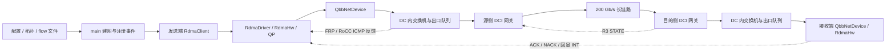

# LonghaulCC 源码阅读与调用链说明

日期：2026-10-06。阅读起点：`simulator/ns-3.39/examples/LonghaulCC/longhaul-convergence.cc`。源码快照：当前工作区，HEAD 为 `1773c92`。

本文的目标是理解程序。只新增说明文档，没有修改程序、算法、正式配置或原有实验结果。阅读顺序是主程序 → 它安装的应用和设备 → 实际收发回调 → 算法反馈 → 统计与分析脚本，没有把仓库中其他实验程序的行为套到这个主程序上。

完成标准是：能解释一条输入 flow 如何成为 QP 和 packet；能指出数据与反馈的真实路径；能从实际赋值/计数/事件调度解释算法状态和每项指标；每个关键结论都有文件与函数定位。另用现有可执行文件做了隔离的短流核验，结果见 B.12。短流验证不证明拥塞场景下的算法性能，也不代替逐篇论文对照。

文中路径以仓库根目录为起点；函数后面的行号是本次工作区行号，后续修改可能使它们移动。常用缩写：`main` = `longhaul-convergence.cc`；`hw` = `src/point-to-point/model/rdma-hw.cc`；`dev` = 同目录 `qbb-net-device.cc`；`sw` = 同目录 `switch-node.cc`。这些源码都在 `simulator/ns-3.39/` 下。C 部分提供文件链接。

## A. 整体架构

### A.1 先用人话理解它在做什么

这个程序先搭出两个数据中心及它们之间的长链路，再按输入文件指定的时刻在发送主机上启动 RDMA 流。每条流有自己的发送状态和速率。主机网卡挑选当前允许发送的流，临时生成一个包，将它送到下一跳。交换机根据自定义路由表选出口，检查缓存是否能容纳该包，再让出口队列等待物理链路发送。

接收主机按字节序号接受数据，生成 ACK 或 NACK。ACK 返回发送主机后推进已确认位置，也可能携带 ECN 导出的 CNP 标志，或回显时间戳/INT。算法用这些反馈调整流速率。FRP/RoCC 还会由交换机周期性发送独立 ICMP 反馈；Proposed R3 则让两端 DCI 网关交换状态并整形。

整个过程由 ns-3 的离散事件推动：程序只在事件时刻运行相应回调，不会每个纳秒循环检查所有流。事件包括启动流、发送完一个包、包传播到下一跳、处理到达包、算法更新、恢复 PFC 暂停、定时采样等。



图中的箭头跨越多次事件，并不表示所有操作处在同一次同步函数调用中。

### A.2 主程序的启动和结束顺序

主入口位于 `main:940`，实际顺序如下。

1. 先解析命令行，再读取 `--conf` 指定的配置；再次解析命令行，使明确传入的命令行选项覆盖配置。
2. `ResolveCcMode()` 将算法名称转成编号；设随机种子、输出文件、Qbb 全局属性和 INT 格式。
3. 读取拓扑头和交换机 ID 列表，创建普通 `Node`、`SwitchNode` 和 `DciGatewayNode`。
4. 安装 InternetStack，分配稳定的节点地址；逐条拓扑链路安装两个 QbbNetDevice 和一个 QbbChannel。
5. 配置交换机 MMU：共享缓存、headroom、DT 阈值、ECN 阈值。
6. 每个 host 安装 `RdmaDriver` 和 `RdmaHw`，接好生成包、收到包、包已发送、QP 完成等回调。
7. 用 BFS 建立自定义静态 RDMA 路由，算每对 host 的路径传播时延、跳数、瓶颈速率、base RTT 和 BDP。
8. 配置交换机算法；FRP/RoCC 在这里启动周期反馈。
9. `LoadFlows()` 读取全部 flow；Bifrost 按需安装；按开始时间 Schedule `StartFlow()`。
10. 接 host TX 观察回调；`Proposed::Setup()` 按需注册 R3；写 metadata 和真实 data/ACK 路径；启动公共测量。
11. Schedule 流速率/RTT 和 DCI 采样，设置仿真停止时刻，`Simulator::Run()`。
12. `LonghaulMeasurements::Finish()` 记录停止时的字节和残留；随后 `Simulator::Destroy()`、关闭输出文件。

**主程序没有一个叫 `SetupNetwork()` 的函数。** 建网主体就在 `main()` 内。也没有统一叫 `CreateFlow()` 的入口，本程序实际用 `LoadFlows()`、`StartFlow()` 和 `RdmaHw::AddQueuePair()`。

### A.3 默认拓扑到底有哪些节点

输入：[topology-longhaul.txt](../simulator/ns-3.39/examples/LonghaulCC/topology-longhaul.txt)。第一行是：

```text
82 18 8 105
节点总数 交换机总数 ToR数 链路数
```

接下来的 18 个 ID 是交换机。**前 8 个列表项**被设成 type 1，其他列表项被设成 type 2；不是“节点 ID 小于 8 就是 ToR”。没有列为交换机的节点是 type 0 的 host。

| 角色 | DC1 | DC2 | 实际类型 |
|---|---|---|---|
| Host，每 DC 32 个 | `0–31` | `41–72` | 普通 `Node`，type 0 |
| ToR，每 DC 4 个 | `32–35` | `73–76` | `SwitchNode`，type 1 |
| 汇聚层交换机，每 DC 4 个 | `36–39` | `77–80` | `SwitchNode`，type 2 |
| DCI 网关 | `40` | `81` | `DciGatewayNode`，type 2，继承 `SwitchNode` |

每个 ToR 下挂 8 个 host：如 `0–7 → 32`，`8–15 → 33`；右侧 `41–48 → 73`。每侧 4 个 ToR 和 4 个汇聚交换机完全互连；4 个汇聚交换机连接该侧 DCI。只有一条跨 DC 链路：`40 ↔ 81`。

```text
DC1                                                DC2
hosts 0–31                                         hosts 41–72
    │ 100 Gb/s                                         │ 100 Gb/s
ToR 32–35                                          ToR 73–76
    │ 四对四互连                                       │ 四对四互连
汇聚 36–39                                         汇聚 77–80
    │                                                  │
DCI 40 ─────────── 200 Gb/s，单向 5 ms ──────────── DCI 81
```

“DCI”在这里既可以指网关节点，也可以指两个网关之间的长链路，阅读时要区分。普通算法模式下，虽然 `40/81` 的 C++ 类型仍是 DciGatewayNode，但 R3 的 `m_enabled` 没有开启，它们按普通 SwitchNode 转发。

节点的稳定地址由 `NodeAddress()` / `AssignNodeAddresses()` 生成，形式为 `11.{dc_id}.0.{node_id+1}`。默认 `0` 是 `11.1.0.1`，`41` 是 `11.2.0.42`。DC 编号依据 `node_id <= min(dci_left,dci_right)`，这是当前节点编号布局的约定，不是通用拓扑发现。链路另配 `10.x.y.0/24` 子网用于接口连接；RDMA 使用稳定的 `11.*` 地址。

### A.4 带宽、时延和队列在哪里设置

| 配置/对象 | 设置位置 | 默认含义 |
|---|---|---|
| 链路 `DataRate` | `main` 读链路后调用 `qbb.SetDeviceAttribute()` | DC 内 100 Gb/s，DCI 200 Gb/s，两个方向分别受各自设备约束 |
| 信道传播 `Delay` | `qbb.SetChannelAttribute("Delay", ...)` | DC 内单向 1.5 μs，DCI 单向 5 ms |
| 接收处理延迟 | `NIC_DELAY → QbbNetDevice::NicDelay` | 每个 Qbb 接收端 15 μs，host 和交换机都生效 |
| 出口真实存包队列 | `QbbHelper::Install()` 创建 `BEgressQueue` | queue 0 优先，其他非空且未暂停队列做 RR |
| Host 待发流 | `RdmaEgressQueue` 中的 QP group | 数据包按需生成，不是提前把整个 flow 分成包塞满队列 |
| Host 控制队列 | `RdmaEgressQueue::m_ackQ` | 存 ACK/NACK 等控制 packet，先于数据 QP 被挑选 |
| 共享缓存 | `main` 的 MMU 配置 | `BUFFER_SIZE=50` 指 50 MiB，即 `50×1024×1024` B |
| 交换机无损出口池 | `SetEgressLosslessPool()` | 50 MiB 加该交换机全部配置 headroom |
| ECN | `KMIN_MAP/KMAX_MAP/PMAX_MAP → SwitchMmu::ConfigEcn()` | map 中阈值乘 1000 转成 B，不是乘 1024 |
| PFC headroom | `ConfiguredHeadroomBytes() → SetHeadroom()` | 每个端口、每个 PG 单独配置 |
| R3 逐流逻辑队列及整形 | `DciGatewayNode::RegisterFlow()` | 仅 proposed 开启，见 B.6 |

`QbbHelper` 内虽然有 `m_queueFactory`，本路径的 `Install()` 实际直接创建 `BEgressQueue`，不要据 factory 的默认名字认定整个交换机只有一个普通 DropTailQueue。BEgressQueue 内部的子队列才是 DropTailQueue。

实际缓存准入主要由 MMU 控制。BEgressQueue 默认总上限是 `1000×1024×1024` B，不能将它当成实验的 50 MiB 共享缓存。MMU 的 ingress/egress 是对同一份缓存的两套记账，**不是让包依次进入两个独立物理缓存**。`totalUsed` 只在 ingress 记一次，避免双计。

当前是 SONiC 风格记账和 DT：入口阈值约为 `α_ingress × 剩余入口共享缓存`，`α_ingress=1/8`；出口 `α_egress=65535`，但仍有池容量及总 bufferPool 的硬约束。只有被 `MyPriorityTag` 标作 lossy 的包才按 lossy 路径处理；本 RDMA 数据默认走 lossless。

Headroom 公式来自 `main:373`：

```text
H(port, PG) = ceil(C_bps × (3 × channel_delay_ns
                         + local_receive_delay_ns
                         + peer_receive_delay_ns) / (8 × 10^9))
```

普通 DC 100G 端口为 431250 B/PG；200G 长链路端口为 375750000 B/PG。主程序对 8 个 PG 都预留并累计；所以 DCI 的实际 `buffer_pool_bytes` 远大于 50 MiB。应读 metadata 的 `buffer_resources`，不能仅看 `BUFFER_SIZE` 推断总资源。

**NIC_DELAY 是每包的延后处理，不是网卡处理带宽。** `Receive()` 每次 Schedule 15 μs 后的 `DoReceive()`，没有一个一次只能处理一个包的忙闲机器。物理链路忙闲与串行化在发送侧 TransmitStart/Complete 中实现。

### A.5 flow 从哪里来，如何创建

默认配置：[config-longhaul.txt](../simulator/ns-3.39/examples/LonghaulCC/config-longhaul.txt) 指向 [flow-longhaul-s0.txt](../simulator/ns-3.39/examples/LonghaulCC/flow-longhaul-s0.txt)。`FLOW_FILE` 和 `--flow-file` 决定实际文件。

```text
1
0 41 3 20000 3000000000 0.01
```

第一行是 flow 数；每条记录依次为：

```text
src_node_id dst_node_id pg dst_port size_bytes start_time_seconds
```

因此默认是一条 `0 → 41`、PG 3、目的端口 20000、大小 3,000,000,000 B、在 0.01 s 启动的流。“3 GB”这里按十进制理解，不是 3 GiB。

`LoadFlows()`（`main:223`）校验端点确实是 host，为每对 `(src,dst)` 分配源端口，从 10000 开始递增；文件中没有源端口字段。

`main` Schedule 在输入的绝对开始时刻执行 `StartFlow(index)`。StartFlow 根据该路径取 BDP/window 和 base RTT，把 IP、端口、PG、大小放到 RdmaClientHelper 属性里，只在发送 host 安装 RdmaClient。接收端没有对应的常规 PacketSink 应用，RxQP 在首包到达时懒创建。

StartFlow 里 `applications.Start(Seconds(0))` 的意思是“从当前事件时刻立即启动”：`Node::AddApplication()` Schedule 当下初始化；`Application::DoInitialize()` 把 m_startTime 当相对延迟 Schedule StartApplication。不是重新回到仿真 t=0。随后 `RdmaClient::StartApplication()` 调用 Driver/Hw 的 AddQueuePair。

### A.6 QP、WQE 和 packet：概念与本代码的边界

可以先这样理解：QP 是一条流长期保留的通信与控制状态；WQE 在真实 RDMA 系统中描述一次待执行的工作；packet 是把数据切成 MTU payload 后在线路上传递的单位。

**本调用链没有显式 WQE 类、Work Queue 或逐 WQE 完成状态机。** 相关 RDMA 应用/point-to-point 源码中的 `WQE/wqe/WorkQueue` 检索没有找到这样的实现。不要把硬件真实 WQE 生命周期直接套进仿真。

这里的模型是：

```text
一条 flow 输入
  → 一个发送 RdmaClient
  → 一个发送 RdmaQueuePair，m_size 是整个 flow 的待发字节
  → 多次 GetNxtPacket()，每次 payload=min(剩余字节, m_mtu)
  → 一个 Packet = PPP + IPv4 + UDP + SeqTs/INT + payload
  → 接收端一个按 wire identity 查找的 RdmaRxQueuePair
```

可以把 `WriteSize → AddQueuePair()` 看作将“一次大写入的工作量”简化注入 QP，但代码没有为它构造 WQE 对象。发送 QP 同时承载可靠传输、窗口、算法速率和统计状态。

## B. 调用链

### B.1 接线：为什么设备会调用 RdmaHw

安装入口是 `RdmaDriver::Init()` → `RdmaHw::Setup()`（`hw:214`）。Hw 将自己的 QP group 与 NIC 的 RdmaEgressQueue 共享，并安装这些回调。

| 回调/共享字段 | 实际目标 | 用途 |
|---|---|---|
| `dev->m_rdmaEQ->m_qpGrp` | `RdmaInterfaceMgr::qpGrp` | host scheduler 与 Hw 看见同一组 QP |
| `m_rdmaGetNxtPkt` | `RdmaHw::GetNxtPacket` | 选中 QP 后临时生成数据包 |
| `m_rdmaPktSent` | `RdmaHw::PktSent` | 计真实发送字节、RTT 时间、下一次 pacing 时刻 |
| `m_rdmaReceiveCb` | `RdmaHw::Receive` | host 收到非 TCP/PFC 的包后分派到 RDMA |
| `m_qpCompleteCallback` | `RdmaDriver::QpComplete` | 触发主程序 `qp_finish` 记录 FCT |
| `m_notifyAppFinish` | `RdmaClient::Finish` | 从节点移除该应用 |

这是自定义模块绕过普通 UDP socket/IP 转发路径的关键。安装 InternetStack 并不意味着这里每个 RDMA 包都经过 UdpSocket 和 Ipv4L3Protocol::Send。

### B.2 正向数据包：从生成到接受

```text
main()
  → LoadFlows()
  → Simulator::Schedule(flow.start_time, StartFlow)

[flow 开始事件]
StartFlow()
  → RdmaClientHelper::Install()
  → Application::Initialize()/DoInitialize()
  → RdmaClient::StartApplication()
  → RdmaDriver::AddQueuePair()
  → RdmaHw::AddQueuePair()
      → 创建/初始化发送 RdmaQueuePair
      → 根据目的 IP 和 QP hash 选 NIC，加入 group 和 m_qpMap
      → QbbNetDevice::NewQp()
      → QbbNetDevice::DequeueAndTransmit()
          → RdmaEgressQueue::GetNextQindex(m_paused)
          → RdmaEgressQueue::DequeueQindex(qp_index)
          → m_rdmaGetNxtPkt = RdmaHw::GetNxtPacket(qp)
          → RdmaQpDequeue trace = ObserveHostTx(packet, qp)
          → QbbNetDevice::TransmitStart(packet)
          → m_rdmaPktSent = RdmaHw::PktSent()

[每一跳的链路]
QbbNetDevice::TransmitStart()
  → 置 BUSY，按物理 DataRate 算 txTime
  → Schedule(txTime + IFG, TransmitComplete)
  → QbbChannel::TransmitStart()
      → ScheduleWithContext(txTime + propagation_delay, peer.Receive)

[下一跳收包事件]
QbbNetDevice::Receive()
  → Schedule(NicDelay, DoReceive)
QbbNetDevice::DoReceive()
  → 错误模型检查、PeekHeader(CustomHeader)
  → 若交换机：加 InterfaceTag(真实入口端口)
      → DciGatewayNode::SwitchReceiveFromDevice() 或 SwitchNode::同名函数
      → SwitchNode::SendToDev()
          → GetOutDev() 查自定义表并 ECMP 选出口
          → 选择 PG/qIndex，检查入口及出口 MMU 准入
          → UpdateIngress/UpdateEgressAdmission，必要时产生 PFC
          → 出口 QbbNetDevice::SwitchSend()
              → QbbEnqueue trace
              → BEgressQueue::Enqueue(packet, logical_or_pg_queue)
              → QbbNetDevice::DequeueAndTransmit()
                  → BEgressQueue::DequeueRR(paused, blocked_by_shaper)
                  → SwitchNode::SwitchNotifyDequeue()
                      → 释放 MMU 记账、更新 PFC RESUME
                      → 必要时标 ECN、写 INT、跟踪活跃流
                  → QbbDequeue trace
                  → TransmitStart()，开始下一跳
  → 若 host：m_rdmaReceiveCb = RdmaHw::Receive()
      → ReceiveUdp()
      → GetRxQp(..., create=true)
      → ReceiverCheckSeq()
      → 仅按序接受时更新 m_recv_bytes
      → 需要时生成 ACK/NACK
```

每个普通 Switch、两个 DCI 网关和目的 DC 内各个 Switch 都重复上述收包/出口队列/下一跳发送流程。长链路本身是 QbbChannel，不是单独的拥塞控制模块。

`SwitchReceiveFromDevice()` 会先调用旧 `m_atcGateway.packetIn()`，但本主程序未启用它；其构造时 `m_gatewayStatus=0`，packetIn 在状态不为 1 时立刻返回 false。旧 VOQ 代码不是本程序 proposed 的实现；真正启用的是 DciGatewayNode。

### B.3 数据究竟走哪条路

`CalculateRoutes()` 对每个 host 作为目的执行 `CalculateRoute()` BFS，按最少跳数建立 `nextHop[node][dest]`。搜索只让交换机成为中间转发节点。`SetRoutingEntries()` 将下一跳接口写进 host 的 RdmaHw 表和交换机的 SwitchNode 表。

Host 用 `GetNicIdxOfQp()`；交换机用 `GetOutDev()` → `EcmpHash()`，hash 输入包含源/目的 IP 和 UDP 或 ACK 的端口，seed 默认是交换机 node ID。**RNG seed/run 不直接替代 ECMP seed。** 相同 flow identity 和拓扑通常保持固定数据路径；更换源端口就可能改变路径。数据和 ACK 的端口/IP 方向不同，回程可以不对称。

本次短流（与 S0 相同端点/端口/PG）的 metadata 输出为：

```text
data: 0 → 32 → 39 → 40 → 81 → 79 → 73 → 41
ACK : 41 → 73 → 78 → 81 → 40 → 39 → 32 → 0
```

这是一次实际运行的 `data_path/ack_path`，不是从拓扑里随便选的示例。其他 flow 应看它自己的 `metadata.json.flow_path_metrics[*]`，不能都套这条路。

所有算法的公共 metadata 由 `LonghaulMeasurements::WriteFlowPath()` 调用 `Proposed::TracePath()` 生成。函数所在命名空间叫 Proposed，但这项路径测量对所有算法执行；它通过实际 `LookupOutputPort()` 的 hash 规则追踪，host 要求单归属。

`pairDelay/pairBw` 在 BFS 第一次发现节点时赋值，等跳数多路径没有进一步按带宽/时延择优。因此在非均匀 ECMP 拓扑中，BFS 存下的路径参数不保证对应 hash 最终路径。当前默认等成本路径的速率/传播参数相同，短流结果相符。

### B.4 ACK/NACK、完成与重传

```text
Receiver RdmaHw::ReceiveUdp()
  → ReceiverCheckSeq(seq, rxQp, payload_size)
  → qbbHeader(seq=下一个期待的字节序号, pg, reversed ports, copied INT)
  → 若当前数据包有 ECN，则 SetCnp()
  → IPv4 protocol = ACK 0xFC 或 NACK 0xFD
  → RdmaEnqueueHighPrioQ()
  → TriggerTransmit()
  → 经回程 Switch/DCI 到 Sender
Sender RdmaHw::Receive()
  → ReceiveAck()
      → 用反馈 SIP / dport / PG 找发送 QP
      → 对推进的普通 ACK 产生 measured RTT 样本
      → Acknowledge(ack_seq)，更新 snd_una
      → 若完成：QpComplete()
          → RdmaDriver::QpComplete() trace
          → main::qp_finish() → FCT、补采样、DeleteRxQp()
          → RdmaClient::Finish()
          → DeleteQueuePair()
      → 若 NACK：RecoverQueue()，snd_nxt=snd_una
      → CNP/INT/TIMELY 算法处理
      → TriggerTransmit()，窗口释放后继续发送
```

序号以 **payload 字节** 为单位。一个 1000 B 的首包序号是 0，后一个是 1000；确认首包后 ACK.seq 是 1000。`snd_una` 表示已累计确认到的位置，也就是第一个未确认字节的位置。头文件的“highest unacked seq”注释不如实际 Acknowledge 的含义准确。

ReceiverCheckSeq 的返回含义：

| 返回值 | 到达情况 | 计入 goodput | 反馈 |
|---|---|---|---|
| 1 | 按序，达到 ACK milestone 或 chunk 边界 | 是 | ACK |
| 5 | 按序，未到反馈条件 | 是 | 无 |
| 2 | 序号大于 expected，允许发 NACK | 否 | NACK |
| 4 | 序号大于 expected，NACK 被时间条件限制 | 否 | 无 |
| 3 | 序号小于 expected，重复包 | 否 | 无 |

乱序包没有进入重排缓存等待拼接，而是丢开其 payload，等重传补洞。NACK 后发送端回退 snd_nxt，用同一套 GetNxtPacket 重发。相关 Hw/QP 调用链没有发现发送端 RTO 重传事件；不能假定丢失最后一个数据包/ACK 一定会自动超时重传。

`L2_ACK_INTERVAL` 在 ReceiverCheckSeq 中与累计 **字节** 序号比较。默认为 1，1000 B payload 每到一个就达到条件，所以看起来是每包 ACK；不要推广为“该配置的单位就是包”。ReceiveUdp 每次把 milestone 重设为该 interval，进一步使默认每包反馈明确成立。若设成4000，达到4000累计字节之后，每次新包又从4000比较，不能推成此后一直每4个1000B包ACK一次；分析脚本的非默认ACK开销参考需注意这点。

### B.5 速率到底在哪里生效

先区分三个量：`qp->m_rate` 是控制器当前允许的速率；发送 CSV 是实际发出的字节率；`dev->m_bps` 是物理接口带宽。

Host 选 QP 必须同时满足（`dev:108`）：

```text
!m_paused[qp.pg]
&& qp.GetBytesLeft() > 0
&& !qp.IsWinBound()
&& qp.m_nextAvail <= Simulator::Now()
```

发送开始后，PktSent → UpdateNextAvail（`hw:724`）计算：

```text
RATE_BOUND=1：nextAvail = now + IFG + wire_packet_bytes × 8 / qp.m_rate_bps
RATE_BOUND=0：nextAvail = now + IFG + wire_packet_bytes × 8 / qp.m_max_rate_bps
```

与此同时 `QbbNetDevice::TransmitStart()` 按设备物理带宽计算串行化时间，置 BUSY。即使两个 QP 都立即可发，同一方向端口也只能串行发送。物理发送时间结束后 TransmitComplete 置 READY 再挑下一包。

所以当前速率的含义是**每 QP、按含头 packet bytes 计算的 pacing 速率**。有窗口限制、PFC、多个 QP 争 NIC、缺少待发数据或网关整形时，实测速率可以低于设定速率。payload 速率还会因包头开销低于相同 wire 速率。

HPCC、FRP/RoCC 用 `ChangeRate()`：调整 m_nextAvail 中上一包的新旧 pacing 时间差，尝试提前重排 NIC 已排的唤醒，再写 m_rate。DCQCN 和 TIMELY 的主体直接赋值 m_rate，没有统一走 ChangeRate；新的速率肯定被后续 PktSent 读取，但已保存的 m_nextAvail 不一定在赋值当刻同步重算。不能画成“所有算法都调用 ChangeRate”。

R3 另有交换机整形：`SetGroupShaperRate(logical_queue, rate_Bps)` → 更新时间与 token → DequeueAndTransmit 根据包大小判是否 blocked → token 不足时 Schedule 唤醒。每发一包扣 wire bytes；物理 TransmitStart 仍按链路速率执行。该层的速率单位是 **B/s**，日志才乘 8 输出 bps。

### B.6 拥塞控制：选择、初始化、反馈、公式、执行

#### B.6.1 模式入口总表

`ResolveCcMode()` 在 `main:928`；配置用 `CC name`，命令行用 `--cc=name`。Hw 属性 `CcMode` 在 `main:1198`，Switch 属性在后续 switch CC 循环设置。

| 名称 | 实验 cc_mode | Host/Switch CcMode | 主反馈 | INT 格式 |
|---|---:|---:|---|---|
| dcqcn | 1 | 1 | ACK-CNP 标志；也支持独立 CNP | NONE |
| hpcc | 3 | 3 | ACK 回显各交换机出口 INT | NORMAL |
| timely | 7 | 7 | ACK 回显发送时间戳 | TS |
| bifrost | 12 | **1** | Host 保留 DCQCN，DCI 入口方向单独跑 Bifrost PFC | NONE |
| frp | 13 | 13 | Switch 周期 ICMP FRP feedback | NONE |
| rocc | 14 | 14 | Switch 周期 ICMP RoCC feedback | NONE |
| proposed | **1** | **1** | DCQCN + DCI R3 的 STATE/DEMAND、近端 CNP、整形 | NONE |

`AlgorithmName()` 特判 proposed，使 CSV 名称是 proposed，虽然 cc_mode=1。Bifrost 和 proposed 都不是“为 host 启动另一套同编号的新 RNIC 算法”。

Python 单/批量 runner 目前只开放 `dcqcn/hpcc/timely/bifrost/proposed`。C++ 支持的 FRP/RoCC 需直接调用主程序或另行配置入口；不能据 runner choices 说底层没实现它们。

#### B.6.2 DCQCN：ECN → ACK 标志 → 三组计时更新

初始化：`RdmaQueuePair` 构造 mlx 状态，alpha=1、first_cnp=true；`AddQueuePair()` 将当前速率/max_rate/targetRate 设为 NIC DataRate。默认这里是 100 Gb/s。主程序把 gain、计时间隔、AI/HAI 等属性注入 Hw。

交换机出队时先减 MMU egress_bytes，再 `ShouldSendCN()` 按剩余 PG 队列标 ECN。接收端 ReceiveUdp 对当前包的 ECN 设置 ACK/NACK 的 CNP 位。发送端 ReceiveAck 检测该位后调用 `cnp_received_mlx()`；ReceiveCnp 也可从独立 `0xFF` 包进入同一函数。**普通 DCQCN 的本接收路径生成的是带 CNP 标志的 ACK/NACK，没有看到周期生成独立 CNP 的接线。** R3 可额外生成独立 CNP。

实际公式（`hw:775–894`），令 `R` 是 m_rate、`Rt` 是 targetRate、`g=0.0625`：

```text
alpha 更新：alpha ← (1-g)×alpha + g×I(本 alpha 周期见过 CNP)
首次 CNP：alpha=1；R=Rt=RateOnFirstCnp×R
减速检查见 CNP：R ← max(MinRate, R×(1-alpha/2))
快速恢复：R ← R/2 + Rt/2
主动增加：Rt ← min(NIC_rate, Rt+RateAI)，R ← R/2+Rt/2
超增加：Rt ← min(NIC_rate, Rt+RateHAI)，R ← R/2+Rt/2
```

target 是否先被夹到当前 R，由 ClampTargetRate 和恢复阶段决定。alpha 的 CNP 标志、减速检查的 CNP 标志是两个独立的周期账本，各自读取后清零。

默认 `RateOnFirstCnp=1.0` 来自 Hw TypeId，主程序没有覆盖；所以首次 CNP 的赋值本身不立即降速。之后 4 μs 左右的减速检查才进行乘性下降。55 μs 更新 alpha，900 μs 恢复事件按 stage 0–4 快速恢复、5 主动增加、其后超增加。它们从首次反馈/减速后开始，不是 flow 一创建就全部启动。

最终这些函数直接改 m_rate，PktSent 再按该值算下一次可发时刻。

#### B.6.3 HPCC：出口 INT 的两次差分与利用率控制

初始化：AddQueuePair 设置 `hp.m_curRate=NIC_rate`，QP 构造设 `hp.u=1`、lastUpdateSeq=0；默认 MULTI_RATE=0、FAST_REACT=1、U_TARGET=0.95、MI_THRESH=5。

交换机在 **UDP 数据包出队**时写入四类数据：当前时间、该出口累计 `m_txBytes`、出队后的出口总 queue bytes、出口 DataRate。`m_txBytes` 此时尚未加当前包，随后才累加。不是 host 的发送速率，也不是交换机入口速率。接收端复制数据 INT 到 ACK，回程交换机不会再次给 ACK 追加 HPCC hop。

反馈入口：ReceiveAck → HandleAckHp。若 ACK.seq > hp.m_lastUpdateSeq，做完整更新；否则 FastReactHp 在 FAST_REACT 开启时用新反馈暂时反应。第一次完整更新只存 hop 和当前 snd_nxt，之后才能对两次 INT 做差分。

默认单速率分支（`hw:966–1019`）的公式：

```text
tau_i = INT_i.time 与上次该 hop 时间之差，处理有限位宽回绕
txRate_i = 8×INT_i.bytes_delta / (tau_i×10^-9)
u_i = txRate_i/C_i + min(q_i_new,q_i_old)×R_max/(C_i×W_config)
U = max_i(u_i)，dt 取产生该最大值的 hop 的 tau
dt ← min(dt, baseRTT)
u_smoothed ← [u_smoothed×(baseRTT-dt)+U×dt]/baseRTT
c = u_smoothed/U_TARGET
若 c>=1 或 incStage>=MI_THRESH：R_new = hp.m_curRate/c + RateAI
否则：R_new = hp.m_curRate + RateAI
R_new 夹到 [MinRate, m_max_rate]
```

注意代码的 queue 项分母是 **配置 m_win**，不是测量 RTT，更不是每 ACK 更新的动态窗口。在默认路径上 `m_win=R_max×baseRTT/8`，因此 queue 项可化成 `8q/(C_i×baseRTT)`；一般异构路径不能未经核对就这样替换。

`ChangeRate()` 总是把有效更新作用到 m_rate；仅完整更新提交 hp.m_curRate、incStage 和 m_lastUpdateSeq，fast react 没有同样提交全部状态。完整周期以字节序号越过上次 snd_nxt 的边界判定，**不是 Schedule 一个固定 RTT 周期**。

MULTI_RATE=1 时维护每 hop 的 u/Rc/stage，取各 hop 允许速率的最小值；当前默认关闭。PowerTCP/HPCC-PINT 在 Hw 里有旁支，当前主程序显式关闭 PowerTCP，且没有开放对应算法名称。

INT 编码不是无限精度：maxHop=6；时间 24 bit；累计 bytes 20 bit，单位 `128×INT_MULTI` B；queue 17 bit，单位 `80×INT_MULTI` B。默认跨域路径正好经过 6 个交换机。PushHop 超过容量会 abort；两次差分只修正一次计数回绕。默认ns时间字段每16.777216 ms回绕，bytes字段每134217728 B回绕；若两个观察点间发生多次回绕，现有差分不能恢复完整增量。

#### B.6.4 TIMELY：RTT 阈值和 RTT 梯度

初始化：AddQueuePair 设置 tmly.m_curRate=NIC_rate；lastRtt=0、rttDiff=0、incStage=0。SeqTsHeader 在构造时写 `ih.ts=Simulator::Now()`，包生成与 host TransmitStart 在本路径的同一事件中进行。ACK 回显该时间戳。

ReceiveAck → HandleAckTimely → UpdateRateTimely（`hw:1227`）。只有 ACK.seq 超过 m_lastUpdateSeq 才完整更新；**FastReactTimely 的函数体为空**。

```text
RTT = now - echoed_ts
d_new = RTT - lastRtt
d_smoothed = (1-alpha)×rttDiff + alpha×d_new
gradient = d_smoothed/TimelyMinRtt
```

第一次完整反馈主要记录 lastRtt 和序号边界，之后按以下条件调整。

| 条件 | 调整 |
|---|---|
| RTT < TLow | 增速 |
| RTT > THigh | `R=Rcur×[1-beta×(1-THigh/RTT)]` |
| TLow ≤ RTT ≤ THigh，gradient ≤ 0 | 增速 |
| 中间区间，gradient > 0 | `R=Rcur×max(0,1-beta×gradient)` |

增速为前 5 个连续增加阶段加 RateAI，之后加 RateHAI；减速重置 incStage。增速上限 NIC rate，减速下限 MinRate。然后更新 tmly.m_curRate、lastRtt/rttDiff、lastUpdateSeq，并直接写 m_rate。

当前配置的值是 alpha=0.875、beta=0.8、TLow=10.3 ms、THigh=11 ms、MinRtt=10.23 ms。全局变量的初始值与配置加载后的值不同，分析当前实验应读 config/metadata。`TimelyMinRtt` 是固定配置的归一化参数，**不是运行中自动求得的最小 RTT**。

#### B.6.5 FRP：交换机算公平速率，host 根据反馈决定是否采用

初始化：主程序令所有交换机 SwitchFeedbackEnabled=true，调用 StartPeriodicFeedbackMechanism，默认每 40 μs 运行。每个物理出口的 FrpPortState 在首次计算时懒初始化；发送 QP 的 frp 状态在构造时初始化，m_rate 仍先为 NIC rate。

反馈链：

```text
SwitchNotifyDequeue(UDP 数据)
  → TrackActiveFlow(出口端口、src/dst/sport/PG)
PeriodicFeedbackLoop(40 μs)
  → ConfigureFeedbackPayload(port)
  → FrpRateCalculator::CalculateFairRate()
  → Icmpv4FrpFeedback(F, qDev, cpId, type, linkRate, flowSport, flowPg)
  → SendControlPacket(data_dst_ip, data_src_ip, ...)
  → queue 0，经反向路由到 host
RdmaHw::Receive(protocol=0x01)
  → ReceiveIcmp()
  → GetQp(feedback.sip, flowSport, flowPg)
  → HandleFrpFeedback()
  → ChangeRate() → pacing
```

活跃流表示 **上一个反馈周期内在该出口真正出队过的数据流**，不是“应用从启动到结束永远在集合里”。每次 PeriodicFeedbackLoop 后清空 activeFlows。FRP 仅对非空活跃集合的出口算本轮 F；RoCC 对已经发现的所有 CP 每轮更新，即使该轮没接收者。

交换机观察的是 `dev->GetQueue()->GetNBytesTotal()`：物理出口所有队列的当前总字节，含控制队列，不是按 flow 拆的 queue。默认参数来自 `g_frpParameters`，不是 config 中提供的一组 `FRP_*` 键；本 ParseConfig 未开放这些键。

令 `q,qref,qold` 都先换成 600 B cell，F 换成 10 Mb/s 单位，T=40 μs，scale=5，alpha=0.2，beta=0：

```text
k = 10^7/(600×8)
若 q-qref > qth：lanbackoff = scale×(q-qref)×T×k - qold
否则：lanbackoff = 0
若上一轮连续计数 >=10：lanbackoff = 0
F_new_units = F_old_units - alpha×(q-qref+lanbackoff) - beta×(q-qold)
F_new_bps = clip(F_new_units×10^7, MinRate=100 Mb/s, 0.95×port_rate)
```

qref 在 100G 为 307200 B，在 200G 为 1048576 B；qth=307200 B。保存 currentFairRateBps 和 qOldBytes，供下一轮使用。名字是“公平速率”，但代码不是直接 `C/N` 分配，而是由队列误差驱动的端口状态量。

线上反馈的 `fairRate/linkRate` 以 10 Mb/s 编码；qDev 是 `(q-qref)/600`，有符号 int16，超范围夹到 `[-32768,32767]` 后截断。host 还原后：

```text
跨 DC flow：候选 R=F
同 DC flow：N=clip(linkRateField/fairRateField,1,100)
  若 qDevBytes < thresholdBytes：R=F-8×qDevBytes/(N×T)
  否则：R=[F_units-(scale/N)×qDev_cells]×10^7
夹到 [minRate, 0.95×min(feedback_link_rate, NIC_rate)]
```

host 是否采用还取决于 `R < 当前速率` 或 `cpId == 已记录瓶颈`。被接受后更新瓶颈并 ChangeRate。**FRP 的 timeout 检查发生在收到但未被采用的反馈时，没有独立 timeout Event**；超时后 WAN 加 200 Mb/s，LAN 翻倍。完全不再收到反馈，不会由这个检查自己醒来。

`cpId=(switch_id<<8)|port_id`。用于识别上次瓶颈 CP，不等于单独的 switch_id。该编码假设节点和端口各不超过 8 bit。

#### B.6.6 RoCC 与 Bifrost 的补充位置

RoCC 的 type=1 分支和 FRP 共用 ICMP 编解码/Hw 入口，但交换机公平速率使用另一段控制公式：队列达到 Qmax 且 F 大于 C/8 时设到 100 Mb/s；队列增长达到 Qmid 时减半；否则按当前 F 所处档位缩放 alpha/beta，做 `F_old-alpha×(q-qref)-beta×(q-qold)`，上限物理线速。100G 默认 qref/Qmid/Qmax=300/600/660 KiB，alpha/beta=0.45/2.25；200G 按带宽倍数放大这些 queue targets，保留 100G gains。这是源码明确的更高速率扩展策略。

Host 收到 RoCC F 后夹到范围，如果速率不高于当前速率或来自同一瓶颈 CP 就采用；每次采用后 ScheduleRoccRecovery，默认无反馈 100 μs 翻倍恢复，直到 NIC max_rate 或 QP 完成。这与 FRP 的“收到反馈时才检查 timeout”不同。

Bifrost 不改 host 算法：SetupBifrost 配置 `40/81` 的长链路接收入口端口和 PG3，普通 DC 内 PFC 保留。它每 10 μs 统计从该 DCI ingress 进入、仍驻留在各种出口的 `m_bytes[ingress][out][PG]`，并用该 ingress 接收增量和 virtual 状态算自定义 pause。暂停包沿长链路反向传给对端的发送口。

```text
Rs=长链路 B/s；T=slot；Delta=Rs×link_RTT
最低 H = Delta+2×Rs×T
virtual 上界 = Rs×(link_RTT+T)
grant=min(Rs×T, H-queued-virtual)
代码按 leak_slots 做 corrected 修正并夹到 [0,Rs×T]
pause_us=ceil(T_us-corrected/Rs×10^6)
virtual←clip(virtual-received+grant,0,virtual_bound)
```

当前 200G、单向 5 ms、T=10 μs 推出最低 H=250500000 B。它不是 egress DCI CSV 中那个单方向发送队列；queued 是按**长链路入口来源**跨所有本地出口汇总的驻留量。

#### B.6.7 Proposed R3：一条额外的网关控制链

Proposed 的 RNIC 是 DCQCN；专门的控制状态属于 DciGatewayNode，不属于旧 atcGateway。`longhaul-r3.h::Setup()` 追踪每条 flow 的真实 hash 路径，找到 source gateway A 和 destination gateway B，按 `(B, B_egress, PG)` 分 group。默认左到右 A=40、B=81；反向 flow 的角色互换。同一个物理网关可同时有不同方向的 A/B group。

两端对每条跨域 flow 注册稳定 `(IP,port,PG)` identity，生成逐流逻辑队列，从 queue index 8 起。队列挂在对应出口的 BEgressQueue 内，沿普通 MMU 路径记账。ConfigureGroupShaper 的 burst 是一个 wire packet 大小；默认 NONE INT、1000 B payload 时为 1048 B。R3 文档里的 flow identity 也不是硬件 QPN。

```text
Proposed::Setup()
  → TracePath() / RegisterFlow(A/B) / DciGatewayNode::Start()
  → 接 QbbEnqueue/Dequeue 观察注册数据；装逻辑队列 classifier
  → Schedule(50 μs, Tick)
Tick()
  → UpdateReceiver()：B 合并 CNP，计算 reaction rate / budget / service
  → UpdateSource()：A 读取快照及实际出队历史，预测 queue，限制 target
  → SendSnapshot()：B→A STATE，A→B DEMAND
  → SetGroupShaperRate()：控制真正数据出队
```

默认周期：control=50 μs；反应窗口=50 μs；普通 report=200 μs，dirty 可至少隔 50 μs 报告；history bin=50 μs；timeout=20 ms。参数里 rate 是 B/s，时间是秒。

B 的队列计数由 Enqueue/Dequeue trace 累加 packet bytes：`queue_i=in_i-tx_i`。ObserveFeedback 看经过 B 的独立 CNP 或 ACK/NACK-CNP，将 event=true；每反应窗口最多一次按是否见过事件更新 alpha 和 `reaction_rate=max(probeRate,rate×(1-alpha/2))`。最近有 CNP 或端口暂停会延后恢复；恢复需存在实际出队和近期供给。

B 在同一物理端口跨 PG 联合分配，容量估计是 `port_Bps×0.98 - 上周期未注册流/控制包出队B/control_period`。这只是估计剩余容量，未保证未来不受本地竞争影响。按 capped max-min Allocate 给各 active flow budget，并写 B 侧逐流 shaper。

`g.service` 主要来自 budget 汇总：若当前有积压，仅累加仍积压 flow 的 budget；无积压时累加所有 flow 的 budget；暂停时置 0。**service_bps 是预算导出的排空能力估计，不是 `Δ真实txBytes/Δt` 实测吞吐。**

A 的历史来自**A 真实数据出队**（不是 host TX），按 bin 存 wire bytes。对于 B 在 t_s 的队列快照和 A→B 延迟 d，History::Predict 从 A 历史区间 `[t_s-d, now]` 重建到 `now+d` 的队列，每段执行：

```text
q_next=max(0, q_current + 本段发送历史推导的到达bytes - snapshot_service_Bps×本段seconds)
```

它以旧快照的 service 固定推演，并按 bin 内时间比例估计到达量，不是逐包精确未来。fresh 时 A 的 group 允许速率为：

```text
cap = min(Σactive_flow_budget, snapshot_group_budget,
          max(0,snapshot_service-max(0,queue_used-qref)/tau))
queue_used = predicted_queue（history）或 snapshot_queue（snapshot 对照）
```

再跨共享物理端口分配并写每 flow shaper。无快照先用 probe 限制，失效旧快照不允许增速并回落到 fallback 上限。source queue 超过高水位则在间隔条件下生成近端独立 CNP，提示 RNIC 放慢供给；低水位清除该状态。

STATE/DEMAND 是真实 packet：protocol=249/0xF9，带 group/epoch/sequence/sample time/queue/service/budget/逐流记录，进入最高优先队列、经历链路传播和 NicDelay。每片最多 24 条记录；接收端验证身份、版本、时效、顺序和完整分片，收齐后原子应用。不是跨节点直接读取对方内存。

所有经过 B 的匹配路径 ECN/CNP 都可影响 B，没有按“ECN 究竟在哪个交换机打上”隔离。默认 `PROPOSED_SHAPER_ECN=1` 仍允许注册整形出口新标记 ECN；为 0 时只抑制这些队列的新 mark，既有 ECN 位和其他队列保留。

### B.7 指标的严格口径总表

令 Δt 为该行 `time_ns-interval_start_ns` 的实际时长；bps 的换算统一是 `8×Δbytes/(Δt_ns×10^-9)`。不能只看名字把不同测量点混在一起。

| 指标 | 原始数据源/生产处 | 计算与统计位置 | 单位 | 采样/触发 | 实际含义 |
|---|---|---|---|---|---|
| 控制器当前 send rate | `RdmaQueuePair::m_rate`；算法赋值 | UpdateNextAvail 用它算下一包 pacing；常规 sender CSV 不导出它 | bit/s | 按算法反馈/计时更新，无固定公共采样 | 允许的逐 QP wire-byte pacing 速率 |
| 实际 sender payload rate | PktSent 累加 `tx_payload_bytes` | SampleFlowRates → WriteSenderRate，`8Δpayload/Δt` | bit/s；增量 B | 默认 100 μs，完成时可能补短区间 | 数据 packet 在 host 开始发送时的 payload，含重传 |
| 实际 sender wire rate | PktSent 累加 `pkt->GetSize()` 到 `tx_wire_bytes` | 同上，`8Δwire/Δt` | bit/s；增量 B | 同上 | 该 QP 数据包含模拟头部的 TX；不含该 host 的独立控制 packet |
| Receiver goodput | ReceiveUdp 在返回 1/5 时累加 RxQP m_recv_bytes | SampleFlowRates → WriteGoodput，`8Δaccepted_payload/Δt` | bit/s；增量 B | 默认 100 μs，完成时可补尾段 | 接收端接受的唯一按序 payload；排除重复/乱序/协议头/控制包 |
| DCI switch egress throughput | DCI QbbNetDevice totalBytesSent | SampleDciLink，`8Δcounter/Δt`，字段 tx_bps | bit/s | RATE_SAMPLE_INTERVAL，默认 100 μs | 从该方向 DCI 出口开始串行发送的所有 packet bytes，含控制 |
| 其他 switch egress throughput | Switch m_txBytes 或设备 totalBytesSent | INT 通过前后差分使用；当前公共 CSV 没为所有交换机输出吞吐列 | bit/s（若差分）；原量 B | INT 随数据出队；无全网统一 throughput CSV 周期 | 指定物理出口供给线路的字节率；不是 receiver goodput |
| Link utilization | dci-link.csv tx_bps + metadata dci_rate_bps | analyze::window_metrics / plot，`tx_bps/C_bps` | 无量纲，乘100才是 % | 基于默认 100 μs DCI samples；窗口再做统计 | 单方向模拟 wire-byte 发送率占物理容量比 |
| Base RTT | BFS pairDelay/hops + NIC_DELAY | main 计算 `2Σpropagation + 2h×receive_delay` | ns | 建网后一次，逐 host pair | 空队列且不含串行化的配置基准，不是测量 RTT |
| Measured RTT | PktSent 的 packet-end-seq→TX time；推进 ACK 到达时间 | ReceiveAck 产生样本；FlushRttSamples→WriteRttSummary | ns | 每个符合条件 ACK 产样；默认100 μs汇总，有样本才写行 | host TX start 到 sender 收到确认该 packet end 的累计 ACK |
| TIMELY RTT | SeqTsHeader ih.ts，ACK 原样回显 | UpdateRateTimely，`now-ts` | timestep，默认 ns | 完整更新 ACK 到来时 | 算法自己的 RTT 输入，没有读取 measured-rtt.csv |
| DCI queue length | DCI出口 BEgressQueue GetNBytesTotal | SampleDciLink 直接取瞬时值 | B（含模拟头） | 默认100 μs | 当前在该出口等待的所有队列；不含已出队发送中/传播中包 |
| 路径 PG queue length | BEgressQueue GetNBytes(pg) | LonghaulMeasurements::Sample → `.queues.csv` | B | 默认100 μs，Finish再取停止值 | data/ACK 路径上已登记 switch 出口/PG驻留，R3逻辑队列按PG汇总 |
| HPCC queue/txRate/u | Switch出口 INT qlen/txBytes/time | UpdateRateHp 做量化差分和队列归一化 | B；bit/s；无量纲 | INT数据出队和ACK，不是100 μs测量循环 | 算法观察的出口状态；u 还含queue项，不等于CSV利用率 |
| FRP queue deviation | 当前出口总队列减 qref | ConfigureFeedbackPayload→host HandleFrpFeedback | 线上600B cell；还原B | 默认40 μs活跃出口 | 有符号 queue error，GetQDepth 的值不是绝对队列长度 |
| ECN events | DCI QbbDequeue trace PeekHeader | CountDciEcn：UDP 且 ECN bits!=0 则累计 | packet 次数 | 每包增计，100 μs输出累计值 | DCI离开时带非零ECN位的数据包数；不能定位新mark发生在哪里 |
| CNP | ReceiveAck CNP位或ReceiveCnp | DCQCN两组 arrived bits；R3 ObserveFeedback累加cnps | bool；R3 packet/event次数 | 每个反馈；按算法窗口合并 | 拥塞反馈；不等于标记次数，也不等于减速次数 |
| PFC events | QbbPfc trace type 0/1/2/3 | get_pfc逐事件csv，主程序累计pause/resume | 次数 | 每次发送/接收控制帧；link.csv带累计 | 全网络控制帧事件数，发送/接收各算一次，不是暂停时长 |
| BDP | pairBaseRtt与pairBw | main：`floor(base_rtt_ns×bottleneck_bps/(8×10^9))` | payload窗口用的B | 建网后一次 | 流路径瓶颈速率乘配置基准RTT的字节数 |
| Configured/effective window | QP m_win；GetWin() | HasWin启用时取BDP，VarWin时乘m_rate/m_max_rate | B | m_win初始设一次；GetWin按需计算 | 允许在途payload字节，不是队列大小或packet个数 |
| FCT | QP startTime；最后累计ACK推进后完成时刻 | qp_finish：`Now-startTime` | ns | 每个QP完成一次 | 从flow开始到发送端获知完成，包含排队/整形/往返反馈 |
| standalone FCT | 路径串行化系数/瓶颈/包数及头部 | qp_finish 的解析公式，见B.8 | ns | 完成时一次 | 无竞争解析参考，非另外运行的单流仿真结果 |

CNP 并没有一个对所有算法统一导出的 `cnp_events` CSV 列。要读普通算法反馈状态或 proposed 网关 cnps，不能把 dci-link 的 ecn_events 改称 CNP 数。非 DCI 交换机的吞吐也不能从 `.queues.csv` 单列直接得到，后者只记瞬时队列与暂停布尔值。

### B.8 指标细节：采样窗口、RTT、BDP 和 FCT

#### B.8.1 四种速率不能混算

```text
Host QP wire TX         → 包生成并开始从host发出
Switch egress wire TX   → 经缓存后开始从该switch出口发出
Receiver goodput        → 到receiver处理完成并按序接受payload
Link utilization        → 该物理方向wire TX / 该方向容量
```

它们的位置、计入字节和时间不同。5 ms 长链路上，同一批数据会明显错开；队列增长时入口供给可以持续大于出口发送；短区间的 goodput=0 也可能只是包仍在路上。

数据包模拟总头部为 `14(PPP)+20(IPv4)+8(UDP)+6(seq/PG)+INT`：NONE=48 B，TIMELY TS=56 B，HPCC NORMAL=98 B（6×8+2 的固定 INT 空间）。因此 1000 B payload 的模拟包长分别是1048/1056/1098 B。ACK 为 `max(60,14+20+12+INT)`，默认 NONE/TS 都60 B，HPCC96 B。这里的 wire 是**模拟 packet bytes**，不自动含真实以太网前导码、FCS、所有线编码开销；IFG 是单独的发送间隔。

若只讨论满 MTU 的无重传数据，在同一测量点有：`payload_bps=wire_data_bps×1000/(1000+header_bytes)`；DCI wire 含控制包时不能这样直接换成所有 flow goodput。

控制器 m_rate 在普通 sender-rate.csv 里没有单独列；观察曲线下降不能直接读出当前 m_rate 的数值。旧 `RdmaHw::SampleTxRate()` 用 snd_nxt 差分，回退时会截成0，口径也不同；本主程序将 TxRateSampleInterval=0，使用 PktSent 计数的结构化 sampler。

#### B.8.2 rx_bps 名称的核查结果

当前 dci-link.csv 表头是 `tx_bps,queue_bytes,...`，**没有 rx_bps**。当前调用链里曾可能用来构造“RX速率”的几种计数实际是：

| 计数 | 实际更新代码 | 正确理解 |
|---|---|---|
| `QbbNetDevice::totalBytesRcvd` | `SwitchNode::SendToDev()` 最后在选定**出口设备**上 `+=packet.size` | 送给该出口的供给字节；不是入口物理收包计数 |
| `BEgressQueue::m_rxBytes` | DoEnqueue `+=packet.size`，出队不减 | 该出口队列累计入队wire bytes；不是receiver有效payload |
| `RdmaRxQueuePair::m_recv_bytes` | ReceiveUdp 只对按序结果 1/5 `+=payload_size` | 本程序receiver goodput的真正累计源 |

totalBytesRcvd 的更新还在 SwitchSend 返回后，而 SwitchSend 可同步触发出队；不宜依赖瞬时 `totalBytesRcvd-totalBytesSent` 当精确队列公式。`getNumRxBytes()` 是 totalBytesRcvd 的差分读出，而且会更新自己的 last counter。要验证任何历史图里的 rx_bps，必须再核对历史生产者；不能由当前名字替历史数据背书。

本文将receiver计数称为唯一按序goodput，依据当前配置 `L2_BACK_TO_ZERO=0`。若开启back-to-zero，ReceiverCheckSeq可把expected回退到chunk边界，但m_recv_bytes未随之回退；先前接受过的字节再次按序到达时可能重复累加。该配置下不能继续无条件沿用metadata的“unique payload”说明。

#### B.8.3 采样不是每行都严格 100 μs

SampleFlowRates 的事件周期是三个配置周期的最小值，各指标达到自己的间隔后才输出。若配置成非整数倍周期，实际行间隔可能向上对齐到 sampler 的事件格点。每行应使用 `interval_start_ns/time_ns`，不要自行假设 Δt。

TX 的第一次窗口起点是 QP.startTime；RX 即使还没有 RxQP，也会从输入 start_time 开始写0。因此接收曲线包含首包传播之前的零速率时段。完成时 RecordCompletionSamples 可能按 last_tx_time 或 last_payload_rx_time 补最后短区间，之后该 flow 不再继续输出长串0。

长流最后发完数据到 ACK 完成之间，TX sampler 仍可能输出0。若最后发包时刻已经早于上一正常采样终点，完成回调不会倒退时间补行。

`LonghaulMeasurements::Finish()` 只保证其 flow-state/summary 和队列停止快照；它没有给所有未完成 flow 的 sender/goodput/RTT sampler 强制补最后非整周期窗口。读取停止时字节闭合应优先用 summary.json，不能保证把速率 CSV 增量求和永远得到停止瞬间总计数。

#### B.8.4 RTT 样本与百分位

PktSent 为每个 packet 的结束字节序号记 `(TX_time, retransmission_ambiguous)`；同一结束序号再次发送将 ambiguous=true。ReceiveAck 仅在普通 ACK、ack_seq>snd_una 时查询**恰好等于 ack_seq 的那项**，非歧义才记录 `now-TX_time`，并删除累计确认覆盖的更早记录。一个累计 ACK 不是为覆盖的每个包都生成独立 RTT 样本。

这个 RTT 包含前向和回向串行化、传播、所有接收处理延迟、排队/整形。不能与 base RTT 或 TIMELY 的状态变量混称一种测量。

WriteRttSummary 将当前窗口样本排序：min/max直接取首尾；mean算术平均；p50索引`(N-1)/2`，偶数N取偏下中位；p95索引`ceil(0.95N)-1`。只有非空窗口写行。Python analyze 的 quantile 用线性插值，两种算法的百分位定义不同。

plot-longhaul 的 RTT 图在相同 time_ns 将**各flow窗口p50取算术平均**，不是把所有packet样本合起来再算全局p50；代码标题也说明了这一点。

#### B.8.5 base RTT、BDP/window 的数值例子

默认跨 DC host 路径7条链路、6个交换机：单向传播为 `5 ms+6×1.5 μs=5.009 ms`。往返每条路径7个接收处理点各15 μs：

```text
baseRTT = 2×5.009 ms + 2×7×15 μs = 10.228 ms
bottleneck = min(100G,...,200G,...,100G) = 100 Gb/s
BDP = 100×10^9×0.010228/8 = 127850000 B
HAS_WIN=1、VAR_WIN=0 → 固定窗口127850000 B
```

它不是200G DCI链路自己的250 MB RTT BDP；前者按整个host路径瓶颈算，后者按长链路线速和长链路RTT算。物理窗口单位仍是payload bytes，因为GetOnTheFly=`snd_nxt-snd_una`。

VAR_WIN=1时，PowerTCP关闭的路径用 `max(1,floor(m_win×m_rate/m_max_rate))`；m_win=0意味着不限制窗口。IsWinBound只检查当前在途≥window，而不是“当前在途+下一包≤window”，允许一次包粒度跨越边界。

FCT/metadata 的 window_bytes 写的是初始配置cap，不是动态 GetWin 的逐时刻值。TIMELY/HPCC可调速，但本文路径里没有因此写新的m_win；动态变化由GetWin按需计算。

#### B.8.6 FCT 的解析参考

`qp_finish` 在发送端获得完整确认时写：

```text
FCT_ns = finish_time_ns - qp.startTime_ns
N = ceil(flow_size/payload_MTU)
wire_total = flow_size + N×data_header_bytes
first_wire = min(flow_size, MTU) + data_header_bytes
S_path = Σ_links(8×10^9/C_link_bps)          [ns/B]
standalone_FCT = baseRTT
                + ceil(first_wire×S_path)
                + ceil((wire_total-first_wire)×8×10^9/C_bottleneck)
                + ceil(ACK_wire×S_path)
```

这是无排队/丢失/竞争的解析参考，不是实验程序又跑了一次单流；不显式模拟窗口节奏或R3控制启动。回程串行化使用同一个路径系数，默认对称参数可用，在参数不对称拓扑中不能保证匹配真实ACK路径。

ns-3每包串行化时间的整数ns舍入与该公式集中ceil不同，因此解析值不必成为严格数学下界。本次10KB DCQCN实际FCT10229312 ns，解析参考10229332 ns，差20 ns；不能据这个微小差值判断程序“超过线速”。

只有完成flow写FCT；到全局Stop时仍未完成不会自动补一行FCT。analyze 输出 `completed_subset_fct_p50_ns/p95_ns` 明确只对完成子集统计，并另记 incomplete；不能把缺行视为FCT=0。

#### B.8.7 queue、ECN、PFC 与利用率的解释边界

queue采样是瞬时驻留，不是本区间平均queue，也不是累计queue。`queue_sample_max_bytes` 是采样点最大值，可能漏掉两个采样点之间的尖峰。MMU egress_bytes 只含准入的非最高优先包，而 BEgressQueue 总量还含控制队列，所以两者不保证相等。

ECN概率（出队后剩余PG队列q）：q>kmax必标记；kmin<q≤kmax时按 `pmax×(q-kmin)/(kmax-kmin)`；q≤kmin不标。默认100G kmin/kmax=400000/1600000 B，200G=800000/3200000 B。在恰好kmax处是pmax而非必标，这是条件使用 `>` 的实际效果。

CountDciEcn统计的是已带非零ECN位的UDP packet经过DCI出队，可能标记来自更前面的交换机；也会把非零ECT位算入计数。当前发送包TOS=0，新标记CE=3，因此通常反映CE packet经过次数。它是累计值，区间新增需要差分，不是每100 μs重新清零。

PFC type：0=收到RESUME，1=收到PAUSE，2=发出PAUSE，3=发出RESUME。两个累计量是**全网**值，两条DCI方向行重复带同一全网累计数；合并两行会双计。接收端因定时器到期Resume不产生一个新的QbbPfc接收帧事件，所以这些计数也不是暂停/恢复状态转换总数。路径queues.csv的paused比例是采样布尔比例，不是精确积分的暂停时长。

DCI tx_bps把整包字节记在传输开始时，短区间跨界会有一个packet粒度的偏差；因此短窗utilization偶尔轻微超过1不能单凭此认定链路越过物理上限。分析窗口按time_ns终点选行，再对比值做算术mean/线性插值percentile，没有按区间覆盖长度加权。

### B.9 关键状态变量：谁产生、谁更新、谁使用

| 状态 | 初始来源 | 更新者 | 使用者/用途 |
|---|---|---|---|
| `QP.m_size` | flow.size → Helper → AddQueuePair | SetSize一次 | GetBytesLeft/IsFinished/FCT |
| `QP.snd_nxt` | QP构造为0 | GetNxtPacket加payload；RecoverQueue回退到snd_una | 生成包seq、剩余量、窗口、算法更新边界 |
| `QP.snd_una` | QP构造为0 | Acknowledge只取推进的ACK最大值 | 在途字节、完成判断、NACK回退 |
| `RxQP.ReceiverNextExpectedSeq` | 懒创建时0 | ReceiverCheckSeq按序加payload；back-to-zero可对齐回退 | 检查按序/重复/乱序，构造累计ACK |
| `QP.m_rate` | AddQueuePair设NIC带宽 | DCQCN/TIMELY直接赋值；HPCC/FRP/RoCC通过ChangeRate | UpdateNextAvail；VarWin缩放；瓶颈候选比较 |
| `QP.m_max_rate` | AddQueuePair设NIC带宽 | 本正常调用链无后续更新 | 算法上限、RateBound=0、动态窗口分母 |
| `mlx.m_targetRate` | DCQCN初始NIC带宽 | 首CNP、减速时clamp、AI/HAI更新 | FastRecovery/Active/Hyper计算当前rate |
| `mlx.m_alpha` | 构造1，首次CNP重置1 | UpdateAlphaMlx周期EWMA | CheckRateDecreaseMlx的乘性下降 |
| 两个 `mlx.*cnp_arrived` | 构造false | cnp_received置true；各自周期读完清零 | alpha更新和减速检查分别使用 |
| `mlx.m_rpTimeStage` | 构造0 | 发生减速清0；恢复事件后++ | 选择恢复/AI/HAI，决定target clamp |
| `m_win/m_var_win` | 主程序BDP及配置 | AddQueuePair初始设置；GetWin计算有效值 | GetNextQindex通过IsWinBound限制发包 |
| `m_baseRtt` | 主程序计算path base RTT | SetBaseRtt一次 | HPCC EWMA时长/queue归一、unscheduled标签；不是持续测量值 |
| `hp.hop[]` | 第一个完整INT反馈 | 每次有效HPCC hop反馈替换 | 前后txBytes/time/qlen差分 |
| `hp.u / hopState.u` | 构造1 | UpdateRateHp按时间权重平滑 | 算rate反馈系数c |
| `hp.m_curRate/m_incStage/m_lastUpdateSeq` | NIC rate/0/0 | 完整HPCC更新提交 | 新候选rate的锚点及完整更新判定 |
| `tmly.lastRtt/rttDiff` | 构造0 | 完整UpdateRateTimely | 梯度、下一轮EWMA；MinRtt另为固定配置 |
| `tx_payload_bytes/tx_wire_bytes` | QP构造0 | PktSent对每次实际数据发送递增 | sender CSV，可包含重复发送 |
| `tx_send_times / measured_rtt_samples` | 初始空 | PktSent记TX；ReceiveAck产样并删已确认记录；sampler清样本 | measured RTT，与TIMELY输入独立 |
| `RxQP.m_recv_bytes` | 构造0 | ReceiveUdp只接受按序payload时递增 | goodput CSV/完成和字节验收 |
| `RxQP.m_ecn_source` | 构造清0 | ReceiveUdp OR ecnbits、增qfb/total | 保留ECN账本；本路径ACK-CNP依据当前包ecnbits，不是累计账本阈值 |
| `Device.m_paused[PG]` | 构造false | DoReceive收到PFC置true；Resume清false | host QP scheduler与switch队列调度阻止该PG出队 |
| `MMU.paused[in][PG]` | 构造false | CheckAndSendPfc/Resume → SetPause/Resume | 记录本交换机是否请求上游暂停，与device收到暂停是不同方向状态 |
| `BEgressQueue.m_bytesInQueue[*]/Total` | 构造0 | DoEnqueue加，DoDequeueRR减 | 真实出口驻留、采样、HPCC/FRP、整形队首选择 |
| `MMU.ingress_bytes/egress_bytes/totalUsed/xoffUsed` | 构造0 | 准入及出队释放函数 | 准入、PFC阈值/headroom、ECN、最终残留 |
| `Switch.m_bytes[in][out][PG]` | 构造0 | SendToDev加；非queue0的SwitchNotifyDequeue减 | 从入口来源到出口PG的驻留账本，Bifrost使用 |
| `Switch.m_txBytes[out]` | 构造0 | SwitchNotifyDequeue末尾对packet.size加 | 出口INT累计TX，不是入口计数 |
| `Device.totalBytesSent` | 字段初始化0 | DequeueAndTransmit各发送分支加 | DCI wire throughput |
| `Device.totalBytesRcvd` | 字段初始化0 | SendToDev在所选出口加 | 出口供给累计，当前主程序未导出rx_bps |
| `FRP.currentFairRateBps/qOldBytes` | 每port第一次CalculateFairRate初始化 | 每次端口公平rate计算保存 | 下一轮queue error反馈控制 |
| `frp.bottleneckCpId/Rate/lastUpdate/timerExpired` | QP构造 | HandleFrpFeedback更新；RoCC独立恢复event | 反馈是否采用、timeout恢复 |
| `FlowInput.unique_sent` | 初始0 | ObserveHostTx取max(seq+payload) | 当前连续顺序发送模型下首次供给终点；不是通用去重集合 |
| `FlowInput.payload_sent/observed_rx/completion_ns` | 初始0 | host TX trace；采样/完成复制Rx；qp_finish | 停止summary、重传估计、完成验收 |

R3 额外状态（`dci-gateway-node.h:72`）要与以上同名字段区分。

| R3 状态 | 来源/更新 | 用途及单位 |
|---|---|---|
| Flow `in/tx` | QbbEnqueue/QbbDequeue对注册packet计数 | wire B，`in-tx`等于逐流逻辑队列 |
| Flow `rate` | 初probeRate；B按反馈/恢复调整 | B的反应能力上限，B/s，不是host m_rate |
| Flow `budget` | B联合Allocate；A从STATE读取 | 逐flow预算B/s |
| Flow `target` | A/B控制后设定 | 实际交给网关shaper的B/s |
| Flow `alpha/event/cnps/decreases` | ObserveFeedback计次数/set event；B窗口合并更新 | 反馈到算法减速的账本；次数彼此不必相等 |
| Flow `window` | B反应时写now | **时间窗口起点，秒；不是RDMA在途字节窗口** |
| Flow `active/demand/closed` | 最近到包、驻留、DEMAND、发送端完成 | 控制预算是否仍需保留 |
| Group `service/budget` | B从逐flow预算/积压/暂停汇总 | B/s，service是估计，不是直接实测 |
| Group `history` | A真实数据出队按bin加wire bytes | 预测远端积压的已发送历史 |
| Group `snapshot/have/fresh` | 收齐合法STATE后原子更新；Tick校验时效 | 避免不完整/过期快照授权增速 |
| Group `predicted/queueUsed` | A历史推演，或snapshot对照 | wire B，预测目标是now+d时刻 |
| Shaper `rate/tokens/burst/updated` | Configure/SetRate及每次调度刷新 | B/s与B；tokens够整包且PG未paused才出队 |

### B.10 事件/定时器地图

以下间隔均是**仿真时间**，不是宿主机实际耗时。

| 谁Schedule/启动 | 回调 | 间隔/首次条件 | 对状态的影响与停止 |
|---|---|---|---|
| main流循环 | StartFlow(index) | 输入start_time，从仿真起点排 | 创建应用/QP；一次 |
| Node::AddApplication / Application初始化 | Application::Initialize / StartApplication | 当前时刻 + app StartTime，本例0 | 将StartFlow里的安装接到QP创建 |
| QbbNetDevice::TransmitStart | TransmitComplete | wire packet串行化+IFG | BUSY→READY，继续挑下一包 |
| QbbChannel::TransmitStart | 对端QbbNetDevice::Receive | wire packet串行化+传播 | 包到下一跳；ScheduleWithContext设置节点context |
| QbbNetDevice::Receive | DoReceive | 默认15 μs | 延后处理所有包，包括PFC/反馈 |
| host DequeueAndTransmit / UpdateNextAvail | DequeueAndTransmit | 下一QP的m_nextAvail；可能提前重排 | pacing唤醒；窗口/PFC仍可让它无包可发 |
| DCQCN首CNP/ScheduleUpdateAlpha | UpdateAlphaMlx | 默认55 μs，自调度 | EWMA，清alpha账本；QpComplete取消 |
| DCQCN首CNP/ScheduleDecreaseRate | CheckRateDecreaseMlx | 首次4 μs+1 ns，其后4 μs | 见反馈则减rate、重置恢复计时；QpComplete取消 |
| DCQCN一次有效减速/恢复自身 | RateIncEventTimerMlx | 默认900 μs | 按stage恢复并自调度；QpComplete取消 |
| SwitchNode::StartPeriodicFeedbackMechanism | PeriodicFeedbackLoop | FRP/RoCC默认40 μs | 活跃flow反馈、F/qold更新、集合清空；直到Stop |
| RoCC接受反馈/ScheduleRoccRecovery | RoccRecoveryTimer | 默认100 μs无反馈 | rate翻倍，未到max继续排；新反馈重排，删QP取消 |
| 普通PFC CheckAndSendPfc/RefreshPfc | RefreshPfc | 默认PauseTime/2=2.5 μs | 重发PAUSE，保持上游暂停；RESUME时取消 |
| 收到PFC的Qbb DoReceive | Resume(PG) | PAUSE携带时间，默认5 μs | 清device paused并试发送；新PAUSE取消旧expiry后重排 |
| SetupBifrost / slot回调自身 | SendBifrostPfcWithCustomTime | 默认10 μs | virtual/grant/received账本更新，必要时发定长pause |
| R3 Start/Tick自身 | DciGatewayNode::Tick | 默认50 μs | B反应/预算、A预测/整形、报告、日志；DoDispose取消 |
| Qbb shaper token不足 | DequeueAndTransmit via m_shapeWake | `缺少token/rate`，至少1 ns | token补足后再尝试；SetRate取消旧wake并立即尝试 |
| main / SampleFlowRates自身 | SampleFlowRates | 三个采样间隔最小值，默认100 μs | 差分输出TX/RX、清RTT样本；到Stop不再排 |
| main / SampleDciLink自身 | SampleDciLink | RATE_SAMPLE_INTERVAL，默认100 μs | 差分DCI bytes，取瞬时queue/累计events |
| StartMeasurements/Sample自身 | LonghaulMeasurements::Sample | RATE_SAMPLE_INTERVAL，默认100 μs | flow字节与路径PG队列采样；Finish再采停止时刻 |
| main | Simulator::Stop | SIMULATOR_STOP_TIME，默认0.38 s | 停全仿真；不等价于完成所有flow |

两种常被误称“Timer”的情况：ReceiverCheckSeq 的 `m_nackTimer=Now+500 μs` 是“下次来乱序包时比较的门限”，没有为它Schedule一个回调；FRP的m_lastBottleneckUpdate/m_timerExpired也主要在新反馈到来时检查。R3 reaction/report/recovery在同一个Tick里判断时间条件，并非每一项各有一个独立EventId。

HPCC/TIMELY的完整更新是ACK序号触发，无固定频率timer。RTT_SAMPLE_INTERVAL只控制测量输出，不控制算法更新。

MMU里有ABM的25 μs updateDequeueRates，但当前main选择DT，未走ActiveBufferManagement启动它；旧atcGateway的VOQ/长链路timer也未由这个主程序启用。不要把源码里所有Schedule都算作本次运行必执行的事件。

### B.11 已确认的名称/注释/实现差异与边界

本轮只标明，不修代码。以下是源码内部可以核实的事实；没有拿注释当成论文已验证结论。

| 项目 | 代码事实与影响 | 定位 |
|---|---|---|
| “rx/received”计数 | totalBytesRcvd是在出口累加，m_rxBytes在出口queue入队累加；两者都不是receiver goodput。当前DCI输出已没有rx_bps | sw:263；broadcom-egress-queue.cc:88 |
| window的“packets”注释 | m_win与on-the-fly实际按payload字节比较 | rdma-queue-pair.h；GetOnTheFly/GetWin |
| L2_ACK_INTERVAL | 与累计字节序号比较；默认1在此模型形成每包ACK，单位不能据名字/现象认作包 | hw:380、558 |
| 非默认ACK间隔与分析参考 | ReceiveUdp每包重置milestone，达到初始门限后通常每包ACK；analyze::path_reference却按每max(payload,interval)字节一个ACK建参考。默认interval=1相符，放大间隔时需核对实际反馈数 | hw:380、562；analyze-longhaul.py:49/58 |
| back-to-zero下的goodput说明 | 当前关闭时按序payload计数排除重复；开启后expected回退而m_recv_bytes不回退，可能重复统计已接受的chunk内字节，metadata的unique说明需附条件 | hw:575–576与386–388 |
| TIMELY fast react | 入口存在，回调体为空；FAST_REACT开关不会给本函数添加行为 | hw:1296 |
| DCQCN调速与ChangeRate | 主体直接写m_rate，未同步走ChangeRate重算已存nextAvail | hw:809、827、862；与758比较 |
| “+1 ns确保在alpha之后” | 首次decrease在4 μs+1 ns，alpha事件在55 μs；默认不是alpha后执行。它使用首次CNP初始化的alpha=1 | hw:805–807及默认配置 |
| FRP“跨域连续识别” | 实际计数条件只有q增长且q>qref+qth，没有检测flow的src/dst DC；到10轮抑制lanbackoff。“WAN独占”不能由此直接得出 | sw:720–759 |
| hasWanFlow参数 | 调用传的是ccMode-13（13时false/14时true），CalculateFairRate内未实际用hasWanFlow判流；源DC集合用于日志，不构成该判断 | sw:742；frp-rate-calculator.cc |
| FRP参数注释 | 注释出现scale=6/12、min=10Gbps等历史说法；当前g_frpParameters是scale=5、min=100Mb/s | frp-rate-calculator.h:19、cc:24/53 |
| FRP“timeout timer” | type=0分支无独立恢复事件，只在未采用反馈时检查；type=1的RoCC才启动独立100 μsEvent | hw:1564、1624 |
| FRP/RoCC链路字段范围 | linkRate低15位且10Mb/s单位，只能无损表示到327.67Gb/s；默认100/200G没问题，不能直接推广400G | icmpv4.cc:605–636 |
| qDepth | 实际线上字段是有符号q_dev=q-qref，并非绝对深度 | sw:766；hw:1433 |
| Bifrost/proposed编号 | Bifrost host mode=1；proposed实验cc_mode也=1，额外逻辑由名称和网关配置启用 | main:928、1198；Proposed::Setup |
| R3 service_bps | 预算及积压集合导出的服务估计，非真实出口差分；预测假定快照service继续适用 | dci-gateway-node.cc:260、290 |
| R3 ECN归属 | 观察经过B的路径反馈，没有ECN生成边界隔离；不能说一定是B下游拥塞 | ObserveFeedback；WriteMetadata |
| baseRTT/FCT解析参考 | 排除串行化的baseRTT；standalone另外加串行化。不能把baseRTT当所有packet实测RTT，也不能说standalone已是实测无竞争FCT | main:467、1250附近 |
| 总资源50MiB解释 | 主程序还为每端口8PG配置并累计headroom，DCI池远大于50MiB | main:1140–1174 |
| ACK_HIGH_PRIO设置范围 | main只设置host RdmaEgressQueue::ack_q_idx，未把SwitchNode::AckHighPrio属性随它设置；默认0相符，改成1时metadata对ACK队列的假设需再核对 | main:1233；sw:43/229；measurements:24 |
| ACK PG访问方式 | switch普通转发用ch.udp.pg读取非TCP包；ACK恰因CustomHeader union的ack.pg/udp.pg在同一偏移而正确读取。不能把ACK说成UDP包 | sw:237；custom-header.h:103/121 |
| packet序号宽度 | QP状态是64bit，但SeqTsHeader和ACK.seq/ReceiverNextExpectedSeq是32bit；不能由m_size支持uint64推断任意大flow序号可用 | GetNxtPacket；seq-ts-header；RxQP |
| 完成与后续算法处理顺序 | ReceiveAck可先QpComplete取消/移除QP，再处理该ACK的CNP/算法；完成ACK带反馈时可能再次触及状态/创建事件，需要单独回归确认影响，本轮未拥塞复现 | hw:509–535 |

另外，普通queue0控制packet绕过非queue0 MMU准入。`m_bytes[in][out][q]`对queue0会累加但出队只在qIndex!=0分支减；所以不能将所有m_bytes槽求和作为真实全switch缓存值。Bifrost读取PG3，不直接使用queue0残量。

与论文的一致性边界：代码标作Mellanox版本的DCQCN，HPCC/TIMELY采用上述具体实现；FRP文件给出了显式公式，RoCC 200G扩展写有源码策略说明。但本轮没有对原论文逐式、逐参数、逐实验设置审阅，也没有把命名当作完整复现证明。已能确认的是以上内部注释/实际行为差异；“是否违背某篇论文”需要明确论文版本与公式后另行核对。

### B.12 本次可运行核验及其边界

使用当前已有 `build/examples/LonghaulCC/ns3.39-longhaul-convergence-optimized`，没有重编译。程序和源码时间戳检查及输出字段与本轮分析吻合，但未据此声称构建内容逐字节等同当前源码。

临时核验目录：`/tmp/longhaul-reading-o202mkej/`。正式topology仍为82节点默认文件；只在临时flow文件中使用：

```text
1
0 41 3 20000 10000 0.01
```

从正式config复制到临时目录，把输出路径和flow路径改为临时绝对路径；六种baseline停止0.03 s，proposed另补0.05 s运行。实际调用形如：

```bash
simulator/ns-3.39/build/examples/LonghaulCC/ns3.39-longhaul-convergence-optimized \
  --conf=/tmp/longhaul-reading-o202mkej/dcqcn/config.txt
```

| 模式 | 完成/期望flow | Header B | QP payload TX/RX B | 发送wire B | FCT ns |
|---|---:|---:|---:|---:|---:|
| DCQCN | 1/1 | 48 | 10000/10000 | 10480 | 10229312 |
| HPCC | 1/1 | 98 | 10000/10000 | 10980 | 10229393 |
| TIMELY | 1/1 | 56 | 10000/10000 | 10560 | 10229328 |
| FRP | 1/1 | 48 | 10000/10000 | 10480 | 10229312 |
| RoCC | 1/1 | 48 | 10000/10000 | 10480 | 10229312 |
| Bifrost | 1/1 | 48 | 10000/10000 | 10480 | 10229312 |
| Proposed，50ms停止 | 1/1 | 48 | 10000/10000 | 10480 | 20562656 |

上述完成运行的summary都为准入丢弃0、停止switch queue/MMU/egress记账残留0。三个基础模式的RTT样本数均10；baseRTT均10228000 ns、BDP127850000 B；实际hash路径见B.3。

proposed最初0.03 s运行时 `rx_payload_bytes=10000` 但completed=0、FCT无行、RTT汇总无行。源码链与packet日志解释了这一现象：A第一包真正出队在20.308384 ms，B第一包出队25.323425 ms，最后一包B出队25.398881 ms，最终累计ACK到发送端30.562656 ms，超出最初Stop。延长至0.05 s后正常记录FCT。这个例子直接说明 **RX已收完、发送端完成、交换机队列清空是不同条件**。

以上10KB流很快从host发完，窗口未成为瓶颈，也没有制造ECN拥塞；不能用六种baseline的接近FCT得出“算法收敛/公平性一样”。R3数值是控制启动与整形路径核验，不是正式3GB性能对照。正式S0、拥塞、多流、重传和论文性能均未在本轮重新评测。

## C. 核心代码地图

### C.1 先读这些文件和函数

| 文件 | 重要类/函数（本次行号） | 为什么重要 |
|---|---|---|
| [longhaul-convergence.cc](../simulator/ns-3.39/examples/LonghaulCC/longhaul-convergence.cc) | main 940；LoadFlows 223；StartFlow 247；CalculateRoute 520；SetRoutingEntries 574；SampleFlowRates 616；SampleDciLink 678；qp_finish 467；ParseConfig 826 | 整个实验的对象、属性、路由、flow、算法、测量的装配中心 |
| [config-longhaul.txt](../simulator/ns-3.39/examples/LonghaulCC/config-longhaul.txt) | CC、NIC_DELAY、HAS_WIN、KMAP、采样与R3参数 | 确认真正运行参数，避免仅看全局默认值 |
| [topology-longhaul.txt](../simulator/ns-3.39/examples/LonghaulCC/topology-longhaul.txt) | 节点头、switch列表、105条links | 能把节点ID和实际路径对应起来 |
| [flow-longhaul-s0.txt](../simulator/ns-3.39/examples/LonghaulCC/flow-longhaul-s0.txt) | 一条src/dst/PG/dport/size/start | 最适合从一个flow理解创建流程 |
| [rdma-client-helper.cc](../simulator/ns-3.39/src/applications/helper/rdma-client-helper.cc) | 构造函数、Install | 输入值如何变成Application属性 |
| [rdma-client.cc](../simulator/ns-3.39/src/applications/model/rdma-client.cc) | RdmaClient::StartApplication 141；Finish 131 | 一条应用如何把工作量交给RDMA模块并结束 |
| [rdma-driver.cc](../simulator/ns-3.39/src/point-to-point/model/rdma-driver.cc) | Init、AddQueuePair、QpComplete | 节点对象、NIC和Hw之间的桥接及完成Trace |
| [rdma-hw.cc](../simulator/ns-3.39/src/point-to-point/model/rdma-hw.cc) | Setup 214；AddQueuePair 262；GetRxQp 327；ReceiveUdp 360；ReceiveAck 467；GetNxtPacket 654；PktSent 705；UpdateNextAvail 724；ChangeRate 758 | RNIC的数据生成/接受、可靠状态、实际发送计数和调速落点 |
| [rdma-hw.h](../simulator/ns-3.39/src/point-to-point/model/rdma-hw.h) | RdmaHw属性、NIC manager、QP map、算法声明 | 读懂Hw共享对象、查找key和控制参数 |
| [rdma-queue-pair.h](../simulator/ns-3.39/src/point-to-point/model/rdma-queue-pair.h)、[.cc](../simulator/ns-3.39/src/point-to-point/model/rdma-queue-pair.cc) | RdmaQueuePair/RxQueuePair；Acknowledge、GetOnTheFly、GetWin、IsFinished | 全部逐flow状态和窗口单位的权威来源 |
| [qbb-helper.cc](../simulator/ns-3.39/src/point-to-point/helper/qbb-helper.cc) | QbbHelper::Install 236 | 每条link真实创建哪些设备、队列和channel |
| [qbb-net-device.cc](../simulator/ns-3.39/src/point-to-point/model/qbb-net-device.cc) | RdmaEgressQueue::GetNextQindex 108；TransmitStart 289；DequeueAndTransmit 348；Receive 533；DoReceive 554；SwitchSend 670；SendPfc 678 | 包怎么开始发送、怎么收、PFC如何暂停；host和switch分支都在这里 |
| [qbb-net-device.h](../simulator/ns-3.39/src/point-to-point/model/qbb-net-device.h) | callbacks、totalBytesSent/Rcvd、shaper、pause状态 | 核对计数范围和回调接口 |
| [qbb-channel.cc](../simulator/ns-3.39/src/point-to-point/model/qbb-channel.cc) | TransmitStart 91 | 串行化+传播时间如何变成下一跳Receive事件 |
| [switch-node.cc](../simulator/ns-3.39/src/point-to-point/model/switch-node.cc) | GetOutDev 124；SendToDev 210；SwitchReceiveFromDevice 334；SwitchNotifyDequeue 346 | 自定义实际转发、MMU准入、出队ECN和INT |
| [switch-mmu.cc](../simulator/ns-3.39/src/point-to-point/model/switch-mmu.cc) | DynamicThreshold 340；CheckIngressAdmission 656；CheckEgressAdmission 742；Update/Remove记账；CheckShouldPause/Resume 1010；ShouldSendCN 1035 | buffer/headroom、PFC/ECN决策的实际来源；不用通读所有旁支 |
| [broadcom-egress-queue.cc](../simulator/ns-3.39/src/network/utils/broadcom-egress-queue.cc) | BEgressQueue::DoEnqueue 73；DoDequeueRR 101；GetNBytes 256；GetNBytesTotal 266 | 队列存在哪、q0优先/RR、queue byte和累计RX的差异 |
| [custom-header.h](../simulator/ns-3.39/src/network/utils/custom-header.h)、[.cc](../simulator/ns-3.39/src/network/utils/custom-header.cc) | UDP/ACK/CNP/PFC union；GetSerializedSize、Deserialize | 协议号、字段布局、payload扣头、ACK PG访问与包长 |
| [seq-ts-header.cc](../simulator/ns-3.39/src/network/utils/seq-ts-header.cc)、[qbb-header.cc](../simulator/ns-3.39/src/point-to-point/model/qbb-header.cc) | 数据seq/PG/TS；ACK seq/PG/flags/INT | 数据头和ACK回显的来源 |
| [int-header.h](../simulator/ns-3.39/src/network/utils/int-header.h)、[.cc](../simulator/ns-3.39/src/network/utils/int-header.cc) | IntHop::Set/GetDelta；IntHeader::PushHop/GetStaticSize | HPCC数据单位、量化、容量、回绕；TIMELY时间戳模式 |
| [ppp-header.cc](../simulator/ns-3.39/src/point-to-point/model/ppp-header.cc) | GetStaticSize 81 | 当前模型L2头为14B，影响所有wire统计 |
| [frp-rate-calculator.h](../simulator/ns-3.39/src/point-to-point/model/frp-rate-calculator.h)、[.cc](../simulator/ns-3.39/src/point-to-point/model/frp-rate-calculator.cc) | FrpParameters；CalculateFairRate | FRP/RoCC端口公平rate与参数/单位 |
| [icmpv4.cc](../simulator/ns-3.39/src/internet/model/icmpv4.cc) | Icmpv4FrpFeedback::Serialize/Deserialize 584以后 | F/qDev/linkRate/flowSport/PG的真实线上编码 |
| [longhaul-r3.h](../simulator/ns-3.39/examples/LonghaulCC/longhaul-r3.h) | TracePath 15；PathDelay 33；Setup 42 | proposed装配、hash路径检查、组定义、两端注册 |
| [dci-gateway-node.h](../simulator/ns-3.39/src/point-to-point/model/dci-gateway-node.h)、[.cc](../simulator/ns-3.39/src/point-to-point/model/dci-gateway-node.cc) | RegisterFlow 74；Start 94；ObserveFeedback 152；History::Predict 189；UpdateReceiver 203；UpdateSource 271；Snapshot 328；Tick 408 | R3完整运行状态、反馈/预测/预算/shaper连接 |
| [longhaul-measurements.h](../simulator/ns-3.39/examples/LonghaulCC/longhaul-measurements.h) | WriteFlowPath 17；Sample 43；StartMeasurements 62；Finish 68 | 所有算法公共真实路径、flow字节、队列和停止验收 |
| [analyze-longhaul.py](../simulator/ns-3.39/examples/LonghaulCC/analyze-longhaul.py) | path_reference 46；window_metrics 122；analyze_run | 利用率/FCT/完成子集/收敛的二次统计定义 |
| [plot-longhaul.py](../simulator/ns-3.39/examples/LonghaulCC/plot-longhaul.py) | main的payload重分bin、RTT/方向util绘图 | 识别图上聚合方式与原始计数的区别 |

### C.2 算法源码的最短定位

| 算法 | RNIC源码入口 | Switch/DCI源码入口 | rate执行处 |
|---|---|---|---|
| DCQCN | hw cnp_received_mlx 795；UpdateAlpha 775；CheckRateDecrease 814；RateIncEvent 842以后 | sw SwitchNotifyDequeue→MMU ShouldSendCN | Hw直接写m_rate→PktSent→UpdateNextAvail |
| HPCC | hw HandleAckHp 903；UpdateRateHp 920；FastReactHp 1094 | sw SwitchNotifyDequeue 395→IntHeader::PushHop | ChangeRate→host调度 |
| TIMELY | hw HandleAckTimely 1227；UpdateRateTimely 1236 | switch仅按普通路径转发，TS由host生成/receiver回显 | 直接写m_rate→后续PktSent |
| FRP | hw ReceiveIcmp 1414；HandleFrpFeedback 1455 | sw TrackActiveFlow 545；PeriodicFeedbackLoop 615；ConfigureFeedbackPayload 694→FrpRateCalculator | ChangeRate→host调度 |
| RoCC | 同ICMP入口的type=true分支；RoccRecoveryTimer 1634 | 同反馈入口，CalculateFairRate的ccMode=14分支 | ChangeRate，另有timeout恢复事件 |
| Bifrost | host仍为DCQCN | main SetupBifrost 416；sw ConfigureBifrost 933；slot 956；pause计算974 | PFC改变对端device paused，不直接写host算法rate |
| Proposed R3 | host仍为DCQCN，近端CNP到ReceiveCnp | R3 Tick/UpdateReceiver/UpdateSource/History/Snapshot | QbbNetDevice逐逻辑队列token shaper |

### C.3 当前不必先读的部分

旧 atcGateway 的VOQ及其长链路反馈：先读构造和packetIn的早返回，足以确认当前未启用；不要先钻进全部旧VOQ定时器。PowerTCP、DCTCP、HPCC-PINT和MMU ABM等分支：仅在主程序明确选择时再读，当前不会因为代码存在就自动执行。OpenFlow、Wi-Fi和标准traffic-control的queue-disc代码也不是当前Qbb路径。

运行脚本是外层工具链：`run-longhaul-all.py → run-longhaul.py → 主程序二进制`，前者逐算法调用后者，后者处理输入/输出路径、构建和runner metadata。当前runner不替代主程序计数，也不自动调用完整分析/绘图流程；要理解packet先读C++，之后再读脚本。

## D. 建议阅读顺序

### D.1 第一轮：先能讲清“一条flow的一生”

1. **主程序main和默认三个输入文件。** 只标出创建Node、建link、安装Driver、安装routes、Schedule flow和Run/Stop这几段。读完能手画82节点的层次，不必先记完所有算法参数。
2. **LoadFlows、StartFlow、RdmaClientHelper、RdmaClient::StartApplication。** 用S0那一行逐项追踪src/dst/端口/PG/size/time去了哪里，确认没有接收PacketSink/WQE实现。
3. **RdmaDriver::Init、RdmaHw::Setup和AddQueuePair。** 画出三条核心callback：GetNxtPacket、PktSent、Receive，确认哪一份QP group被共享。
4. **RdmaQueuePair构造、GetBytesLeft、Acknowledge、GetOnTheFly、GetWin、IsFinished。** 用1000B packet演算snd_nxt/ack与在途字节，先不要进算法大函数。
5. **Host Qbb调度：GetNextQindex→DequeueQindex→GetNxtPacket→TransmitStart→PktSent。** 能说明“为什么这时允许发”以及“哪个时刻真的计了发送量”。
6. **QbbChannel::TransmitStart和QbbNetDevice::Receive/DoReceive。** 将串行化、传播、15μs处理画为三个时间段；明确不同事件的跳转。
7. **CalculateRoute/SetRoutingEntries和Switch GetOutDev/SendToDev。** 对照metadata真实data_path、ack_path，确认ECMP和回程不对称，区别自定义routes与Ipv4GlobalRouting。
8. **BEgressQueue Enqueue/DequeueRR，再读SwitchNotifyDequeue。** 把真实packet队列与MMU记账分开理解；跟踪包什么时候被mark、INT什么时候写入。
9. **ReceiveUdp/ReceiverCheckSeq/ReceiveAck/QpComplete/qp_finish。** 完整闭合正向、反馈、窗口释放、NACK重传和最终FCT；能解释RX收完仍可无FCT。

### D.2 第二轮：按反馈复杂度读算法

10. **DCQCN。** 先读cnp_received_mlx，再按EventId读alpha、decrease、recovery三组回调。给每个CNP标志画独立“置位→周期读取→清零”的过程，再核对配置周期。
11. **TIMELY。** 从SeqTsHeader时间戳到ReceiveAck回显，手算一次RTT梯度和阈值分支；注意FastReact空实现。
12. **HPCC。** 先读IntHop编码，再读Switch写INT和Receiver复制INT，最后读UpdateRateHp默认单速率分支。用两份INT手算txRate/u，区分完整更新与fast react。
13. **FRP。** 先读switch活跃集合的更新/清空和PeriodicFeedbackLoop，再读CalculateFairRate、ICMP字段、host HandleFrpFeedback。特别看qDev单位、CP识别及timeout没有独立事件。
14. **RoCC/Bifrost。** RoCC围绕FRP共用链的差异读；Bifrost围绕长链路ingress记账、virtual、pause和PFC expiry读，不要把它误当一个新RNIC mode。
15. **Proposed R3。** 从longhaul-r3.h的真实路径注册开始，顺序为Enqueue/Dequeue→ObserveFeedback→UpdateReceiver→Snapshot→History::Predict→UpdateSource→Qbb shaper。始终把B/s、bps、byte queue和时间window分开。

### D.3 第三轮：读测量并检验自己的理解

16. **PktSent与ReceiveUdp的实际计数代码 → SampleFlowRates/RecordCompletionSamples。** 取一条CSV行用真实起止时刻手算bps，验证重传、包头和首包到达前0值口径。
17. **SampleDciLink、CountDciEcn、get_pfc和LonghaulMeasurements。** 查清全网累计事件、单方向TX、PG/总队列和Stop快照，核对summary中TX/RX/残留。
18. **analyze-longhaul.py、plot-longhaul.py。** 理解路径容量参考含data/ACK开销、但排除control/retransmission/window；收敛是指定窗口内的采样条件；FCT只取完成子集；RTT图是各flow中位数均值。
19. **最后才回到runner与既有设计/进度文档。** 确认effective config、正式场景和实际二进制，区分本轮源码事实、历史实验记录和论文目标。2026-10-02进度文档记录当时未找到binary；本轮已找到并使用binary，这是时间点差异，不能据旧快照判断今天不可运行。

每一轮都可用同一条flow回答这些自检问题：

- 当前包的seq、payload bytes、wire bytes分别是多少？是谁写入？
- 它现在在host pacing、switch真实queue、传播途中，还是receiver处理事件中？
- 调低host m_rate、调低网关target、收到PFC分别阻断哪一层？
- 某次ACK只改变snd_una，还是也改变了算法rate？为什么？
- 这条CSV记录的是哪一个节点、哪一个方向、哪种字节、哪段真实时间？
- flow完成依据是“全部packet已生成”“RX已接收”还是“Sender已得到完整ACK”？

能逐项指向实际更新/调用处，而不是仅回答变量名含义，就已经建立了继续读这个项目的可靠基础。
