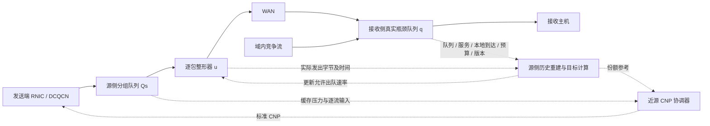

# Proposed 拥塞控制推荐改进方案

**版本：设计稿 R1；日期：2026-09-24。**

**推荐方向：接收侧状态反馈、源侧发送历史重建、按组实际整形与近源 CNP 协调。**

本稿基于《Proposed 拥塞控制方案详细设计.md》（2026-09-22）以及参考文献目录中的 PBC、RiCE、THEMIS、MLCC、LRCC、PACC。它是一份可进入 ns-3 实现的研究设计，不是已实现版本，也不是性能验证报告。原初稿与仿真代码未被本次工作改写。

## 1. 结论状态与阅读约定

全文使用四种标记，允许同一机制同时具有两种标记。

| 标记 | 含义 |
|---|---|
| 【已有论文依据】 | 论文中明确给出相关机制或实验；只支持相应条件下的结论，不表示本文组合方案已经成立 |
| 【根据当前实现推导】 | 依据 2026-09-22 初稿记述的实现、测量位置或结果推导；本次未找到本地对应源码，未重新运行仿真 |
| 【建议】 | 本稿选择的设计、接口或实现顺序，可据此制作原型 |
| 【需要实验验证】 | 参数、性能、硬件代价或条件变化下的性质尚无本方案证据 |

**可以确定的机制事实：**CNP 不携带本方案的精确聚合目标；仅更新虚拟队列服务率不能直接约束 WAN 出口；源侧刚发出的数据不会被接收侧立即知道；已进入 WAN 的数据不能靠随后发出的 CNP撤回。上述事实决定了控制器和执行器必须分开建模。

**可以确定的文献判断：**PBC 的实际方案采用源侧按目的主机真实 VOQ 和容量约束；MLCC 已有未来队列与历史建议速率模型；RiCE 和 THEMIS 都在接收侧边界设置本地反应机制。因此，“预测未来队列”“近源反馈”“DCI 双侧部署”本身不足以证明新颖性。

**尚不能确定的结论：**本方案是否优于原 Proposed、PBC、MLCC 或 RiCE；是否在混合 RTT、多源 DCI 和一般拓扑下稳定公平；是否能完全解决商用 DCQCN 的恢复慢。下面给出可证伪的设计与实验，不预设这些结果。

## 2. 六篇论文应借鉴什么

页码均指本地 PDF 的物理页码，从 1 开始；括号内给出章节、公式或图号，方便不同排版版本定位。

| 文献 | 机制与实现依据 | 论文报告的代表效果 | 本方案的取舍 |
|---|---|---|---|
| PBC [P1] | PDF 第 3–4 页，§III、图 3–5：源侧按目的主机分 VOQ，调度上限对应接收末跳容量；用近源反馈使 RNIC 适应 | 第 5–6 页：400 Gbps WAN、400 μs 单向延迟；加入 PBC 后双流约 1 ms 收敛；相对 BiCC，两种负载下整体 PFC 暂停比例降低 56%/59% | 借鉴实际注入约束。将静态容量上限扩展为带版本的动态预算；静态 PBC 风格整形必须成为基线 |
| MLCC [P2] | 第 4–7 页，§3：接收侧逐流队列、credit 出队控制；DQM 由历史建议速率估计未来入队，式(3)预测队列 | 第 8–9 页：示例队列由约 40 MB 降至约 5 MB；XDP 测试床平均 FCT 相对 DCQCN 降低 19.3%；大跨域流的尾 FCT 可略增 | 借鉴分时段队列预测和排队排空时间。采用实际出口字节历史；不把建议速率视为已执行速率 |
| RiCE [P3] | 第 4–6 页，算法1：接收侧按路径代理、聚合调速、流数缩放；缓存吸收瞬态，持续拥塞才向源转发 CNP | 第 8–9 页：长流消融中有过滤器相对无过滤器的平均/P99 FCT 降低 25.6%/34.9%；DPDK 测试床将注入限制为 60 Gbps | 借鉴反馈归属、缓存边界和聚合状态。首版直接观测接收出口，避免再叠加独立接收代理控制器 |
| THEMIS [P4] | 第 5–7 页，§IV–VI：QP 映射、CNP 间隔、ECN 协调；接收侧回环临时减速，并处理恢复乱序 | 第 8–9 页：所测负载下 PFC 暂停相对 DCQCN 减少 93%–96%；消融表明重复 CNP 和不匹配通知间隔会恶化跨域流 | 借鉴 CNP 正确性及单一拥塞事件的反馈协调。首版不采用回环减速；不照搬其关闭 ICRC 的测试设置 |
| LRCC [P5] | 第 5–10 页：端口公平速率、INT/FCNP、ACK/PSN 协调、主动恢复；Tofino2 与 400 Gbps FPGA NIC 原型 | 第 10 页：640 km 场景，尾时延相对所测 DCQCN 降低 45%–49% | 借鉴降速与恢复分离、反馈版本和输入速率观测。其新增 NIC 能力不能当作标准 DCQCN 已有能力 |
| PACC [P6] | 第 4–5 页，§III、算法1：队列偏差/变化驱动 CNP 数量，按拥塞贡献分配，微突发过滤，通知节奏控制 | 第 7–8 页：数据中心仿真，WebSearch 平均 FCT 相对 DCQCN 最多降低 23% | 借鉴 CNP 对象、数量与持续性控制；不直接迁移域内 PI 参数和 4 μs 通知间隔 |

【已有论文依据】这些效果来自不同实验条件，不能横向比较百分比。THEMIS 对 Annulus/BiCC 的模拟有其文中说明的实现约定；RiCE 的网关 ASIC 实现属于后续计划；MLCC 使用 XDP 原型；PACC 的主要验证为 ns-3。不能由此推出本方案在目标 FPGA/交换芯片上已具备可部署性。

【建议】主要吸收五项：实际整形、发送历史重建、反馈协调、流生命周期、恢复分层。RiCE/THEMIS 式接收侧代理保留为将来下游多跳扩展，不将六篇论文的全部控制器叠加进首版。

## 3. 当前问题与设计目标

### 3.1 当前实现的主要缺口

【根据当前实现推导】原 Proposed 在接收侧计算目标，以固定权重外推未来队列；目标返回后只改变源侧虚拟队列的服务速率。实际注入仍由 DCQCN、原有拥塞反馈与 PFC 共同决定。

因此存在四个误差来源：遥测速率本身已滞后；预测时间没有对齐完整生效过程；配置容量不一定等于可服务容量；目标变化不一定引起相应的实际注入变化。

原初稿报告 8→1 场景开启预测 FCT 中位数 43.577 ms，关闭预测 43.542 ms；两者不能支持预测有独立收益。动态减流后的约 17.78 Gbps goodput 表明需要区分网关限制与 RNIC 恢复限制。这些数值仅作为原报告中的问题线索，本次未复测。

### 3.2 设计目标

【建议】【需要实验验证】按优先级确定以下目标：

1. **目标可执行。**在源侧有积压且未被物理端口/PFC限制时，实际 WAN 注入在可测的网关执行延迟内跟随聚合预算。
2. **降低不可撤回数据造成的队列超调。**利用本地已发送字节与远端队列快照，估计新动作影响远端之前的积压。
3. **限制总缓存成本。**同时约束源侧、接收侧和其他交换机缓存；不能只降低一个队列而隐藏另一个队列。
4. **减少无效持续降速。**在来源可辨认的受控队列上协调反馈，并停止向已经低于份额的流持续发送近源 CNP。
5. **可解释的恢复。**分别量化网关放宽限制的时间和 RNIC 提速时间，定位最终恢复瓶颈。
6. **评价流间与跨域/域内公平性。**首版不声称严格 max-min 公平或无饥饿保证。

## 4. 推荐方案与研究边界

### 4.1 推荐主线

【建议】推荐名称为“Proposed-R1：基于实际发送历史的源侧预测与聚合整形”。名称仅用于区分实验版本。

接收侧 DCI 周期上报真实瓶颈队列、服务状态和分配上限；源侧 DCI 保存自己实际送入 WAN 的历史，把旧快照向前重建至当前新动作的远端生效时刻，计算下一段聚合注入速率，并通过分组队列的出队整形执行。近源 CNP 的职责是控制源侧缓存积压，使 RNIC 输入逐步适应网关允许的输出。

原来“接收侧算完整目标、源侧只发 CNP”改为“接收侧给状态与预算约束、源侧算执行目标并直接限制注入”。这是本稿最主要的架构变化。

### 4.2 首版明确覆盖的范围

【建议】首版采用一个源侧 DCI、一个接收侧 DCI、一个直接可观测的接收出口、固定单路径。可有多个 QP；接收主机仍直连接收侧 DCI。先复用当前小拓扑，加入域内竞争流时也使其经过同一个可观测接收出口。

组定义为：

\[
g=(\text{receiver DCI},\text{egress port},\text{traffic class},\text{path epoch}).
\]

组表示同一受控物理瓶颈，不以发送主机物理入口端口分组。不同目的主机只有在确实共享同一受控队列时才能归为同组。

【需要实验验证】多源 DCI 同时进入同一瓶颈需要接收侧统一分预算；一般 Clos 路径还需要确认瓶颈归属。RiCE 的 next-hop+DIP 分组依赖其拓扑路径假设，不能直接推广到任意 ECMP 网络。

### 4.3 本版的取舍

| 组件 | 推荐决策及原因 |
|---|---|
| 源侧真实分组队列与整形 | 主线必需；使聚合目标直接成为实际 WAN 出口约束 |
| 源侧发送历史预测 | 主线必需；解决接收侧无法及时知道源侧最近发送量的问题 |
| 接收侧快照和异常通知 | 主线必需；校正源侧镜像与检测不可预见的本地竞争/PFC |
| 近源 CNP | 主线保留；调节 RNIC 输入，控制源侧缓存 |
| 原虚拟队列 z | 保留为诊断/对照，不与真实源队列重复作为两个独立积分控制器 |
| 接收侧第二套代理速率控制器 | 首版关闭；当前直接出口已有真实队列和物理服务，额外限速不会增加服务能力 |
| 修改 RNIC 主动提速 | 首版关闭；仅作为带明确能力要求的增强分支，不混入兼容模式结果 |
| PFC | 保留兜底，并完整记录；不能用其掩盖预算或缓存设计失效 |

## 5. 网络架构与三种时间尺度

【建议】数据与控制路径如下。



1. **逐包执行：**整形在数据包出队资格判断处执行，不能每 50 μs 集中释放一批数据。
2. **源侧控制周期 \(\delta\)：**更新镜像、目标、流状态与 CNP 候选。
3. **接收侧报告周期 \(T_r\)：**发送完整状态快照；危险水位触发额外事件报告。

【根据当前实现推导】原 \(\delta=50\,\mu s\)、\(T=200\,\mu s\) 可以作为第一轮对照参数。它们不是逐包出队粒度，也不是稳定性结论。

## 6. DCI 状态、测量方法与可见性

所有控制公式用 B、s、B/s；日志 `_bps` 用 bit/s。定义 \(M\) 为控制计数中一帧实际占用的最大字节数，必须统一报头与序列化口径。

### 6.1 源侧按组维护的状态

| 状态 | 单位 | 如何测量或维护 | 属性 |
|---|---|---|---|
| \(Q_s\) | B | 分组真实队列入队加、实际发出/明确丢弃减；维护守恒计数 | 【建议】新增执行队列 |
| \(B_{in},B_{tx},B_{drop}\) | B | 组入口、WAN 实际发送起点、丢弃点的单调累计计数 | 【根据当前实现推导】可复用入口/出口观测思路 |
| \(\mathcal H_{tx}\) | 每 bin 的 B | 将实际 WAN 出口包长按时间写入环形历史；重传也占容量，必须计入 | 【建议】新增 |
| \(u,u_{prev}\) | B/s | 当前整形目标与上一目标，不冒充 RNIC 实际速率 | 【建议】 |
| tokens、last_update | B、s | 小桶逐包整形状态；最大信用不超过配置的 burst cap | 【建议】 |
| latest_snapshot | 结构 | 组版本、报告序号、接收测量时刻、q、服务、竞争流量、预算等 | 【建议】 |
| \(\hat q_{act},\hat q_{peak}\) | B | 用已知发送历史逐段重建；分别记录生效点与之前区间峰值 | 【建议】 |
| \(E\) | B | 预测与随后到达的对应真实快照比较，维护低估误差裕量 | 【建议】【需要实验验证】 |
| \(d_f,d_b,d_{gate}\) | s | 分别测正向数据传播、反向控制传递、目标到实际网关出队约束的延迟 | 【建议】 |
| mode、report_age | 状态、s | INIT/TRACK/DRAIN/RECOVER/STALE/EMERGENCY；记录转换原因 | 【建议】 |
| \(N_s\)、组内活跃集合 | 条 | 数据面观测、局部排队信息、生命周期提示、超时联合判断 | 【建议】不再只有单一超时计数 |

### 6.2 源侧按 QP 维护的状态

【建议】维护 QP 标识映射、group_id、最近输入/输出时刻、周期输入字节、周期输出字节、源侧排队字节、消息边界提示、active/idle/suspect/closed 状态、最近近源/透传 CNP 时刻、最后一次降速可见时刻、份额参考 \(f_i\)。

首版是每组共享 FIFO 加逐流元数据，不要求每 QP 一个硬件 VOQ。因此，\(f_i\) 用于通知选择，不构成严格逐流调度保证。若后续需要严格隔离，应单独实现共享内存中的逐流逻辑队列与 DRR/WFQ，并计算状态和调度代价。

【需要实验验证】生产 RNIC 无法仅由网关观察精确知道“主机尚有多少待发送数据”。实验中的剩余流大小只准用于评价和理想上界；不能直接喂给在线控制器。可选应用/主机注册提示需要列为部署接口。

### 6.3 接收侧按受控出口维护的状态

| 状态 | 如何测量 | 作用及注意事项 |
|---|---|---|
| \(q\)、周期最大队列 | 同一受控出口的入队/出队事件读取 | q 是该队列全部数据的占用，包括可见域内竞争流 |
| WAN 到达量 \(\Delta B_w\) | 按已配置组与入接口识别，接收出口入队处计数 | 与源侧 WAN 出口历史用同一字节口径 |
| 域内到达量 \(\Delta B_l\) | 同一出口中非该 WAN 组的数据量 | 不能把域内流当成不存在；首版可由受控拓扑入口识别 |
| 出队量 \(\Delta B_d\) | 实际序列化出口计数 | 用于队列守恒和服务校核 |
| busy_time / pause_time / scheduler grant | 记录有可发包且实际获得服务机会的区间、暂停区间和调度份额 | 空队列低出队率不能被解释为容量下降 |
| \(\hat C\)、\(C^-\) | 配置速率与忙时服务、暂停/调度状态联合估计 | \(C^-\) 是模型使用的保守服务估计，不是无条件下界 |
| \(\hat x_l,x_l^+\) | \(\Delta B_l/T_r\) 及其波动统计 | 分别为本地竞争到达估计及偏保守预测 |
| \(F_g\) | 依据服务容量、可见需求和配置权重计算 WAN 分配上限 | 不是保证已执行的速率 |
| seq、epoch、snapshot_time | 本地单调序号、路径/配置版本、实际采样时刻 | 丢失可由后续完整快照恢复，旧序号不得回写 |
| 阈值越界持续时间 | 由队列事件累计 | 事件报告与滞回；不能只在 200 μs 采样点检测危险峰值 |

### 6.4 服务估计规则

【建议】若整个周期无暂停、无竞争调度且队列可工作，则以配置服务能力校准 \(\hat C\)；若队列长期非空，可用忙时出队量/忙时长核对；若发生 PFC 或其他调度限额，则记录实际不可用时间并折算服务。接收侧 q 为空而吞吐低时，保持已知服务能力，不将低吞吐反馈成更低预算，否则会形成自我压低。

已收到 PFC、服务故障等明确信号时应立即降低服务估计；恢复则按真实服务重现更新。对未来暂停不可给出确定保证；连续暂停超过模型有效期应进入异常状态。

## 7. 源侧历史重建与延迟补偿

### 7.1 为什么将主要预测移到源侧

【根据当前实现推导】在接收侧计算时，最新可用源侧遥测已经经历正向传输延迟，其无法包含源侧刚发生的发送变化。源侧则完整知道自己已经发出的字节，只缺远端最新队列与服务情况。因此将“实际发送历史”与“延迟远端快照”在源侧合并，能消除一部分可避免的信息缺失。

【建议】接收侧保留状态测量与预算分配；源侧完成镜像重建和目标执行。该改变与 MLCC 的历史建议速率模型比较时，核心问题是实际发送偏离建议值后，预测和控制是否仍更准确。

### 7.2 固定单路径模型

设源侧当前时刻为 \(t\)，最近快照的接收侧测量时刻为 \(t_r\)，其中记录队列 \(q(t_r)\)。设 \(a_s(v)\) 为源侧实际 WAN 出口速率；数据从该测量点到远端队列入队的时延为 \(d_f\)。忽略丢失和路径变化时：

\[
a_w(v)=a_s(v-d_f).
\]

新目标在网关完成执行切换后到达远端的时刻为：

\[
t_{act}=t+d_{gate}+d_f.
\]

从 \(t_r\) 到 \(t+d_f\) 的 WAN 到达对应源侧 \((t_r-d_f,t]\) 的实际发送，均已发生且可在本地查到。\(d_{gate}\) 内尚未发出的旧配置数据按可测执行延迟和旧整形上限估计，并计入误差。这里不需要把 RNIC 的完整收敛时间直接加入网关执行时延，因为主执行器已经改为网关整形。

**可辨识边界：**这一重建不能提前知道快照之后接收侧突然出现的域内 incast、服务暂停、其他源 DCI 注入、随机丢包或路径变化。它们必须由新增快照、异常报告、估计裕量及缓冲余量处理。

### 7.3 按时间段递推，保留区间峰值

【建议】从快照队列出发，以 bin 宽度 \(\Delta\) 重建：

\[
\hat q_{j+1}=\max\{0,\hat q_j+D^{hist}_{w,j}+\hat D_{l,j}-\hat S_j\}.
\]

其中 \(D^{hist}_{w,j}\) 来自对应时段的实际出口历史；\(\hat D_{l,j}\) 是域内竞争流的到达预测；\(\hat S_j\) 是该段预测服务字节。\(\hat q_0=q(t_r)\)。保留：

\[
\hat q_{act}=\hat q(t_{act}),\qquad
\hat q_{peak}=\max_{v\in[t_r,t_{act}]}\hat q(v).
\]

首版采用较小分箱，边界不足整 bin 时按部分区间处理。每一步都截断到非负，不能只在总和末尾取 max，因为中途空队列后的闲置服务不能储存下来抵扣未来突发。分箱平均仍可能漏掉 bin 内微突发，应以逐包回放离线检查误差，并降低 \(\Delta\) 或增加对应误差项。

**不能将 \(q(t_r)\) 再加上“源端总发送量减接收端总交付量”的全部差值。**后者可能已包含 q、不同测量区间、丢包和重传，会重复计数。正常 BIF 与排队量也不同；\(C d_f\) 量级的传播在途字节不应全部被当成拥塞。

### 7.4 预测误差校准

【建议】【需要实验验证】保存预测发布时刻、预测目标时刻和所用快照序号。后续真实快照达到该目标时刻后计算：

\[
e_j=q_{real}(t_j)-\hat q(t_j).
\]

只用过去已到达的样本更新低估裕量：

\[
E_j=(1-\beta_E)E_{j-1}+\beta_E\max(0,e_j).
\]

用于控制的队列为 \(q_{ctrl}=\hat q_{act}+E_j+E_{bin}\)。\(E_{bin}\) 表示分箱/时间误差的校核裕量。EWMA 不是置信上界，不可宣称能覆盖 99% 情况。必须另外报告误差分位数和最大低估。

首轮取 \(E=0\)，先证明模型正确再开启校准，避免裕量掩盖计数错误。预测目标优先选在接收报告时间网格内、且不晚于本地历史能覆盖的最远时刻；若目标不对齐，按明确插值规则配对，并在突变附近单独评估。不能事后挑选更有利的时间点。

### 7.5 时钟、时延与历史保存

【建议】首版 ns-3 使用仿真时钟，但报文延迟必须真实模拟，控制器不得直接读取未到达的远端状态。固定单向时延从拓扑配置取得，并记录其假设。

硬件版本需要时钟偏移/单向时延估计，或以网关数据序列和回执水位建立对应关系。仅由 RTT/2 得到单向时延在非对称路径下可能有偏差。上报时间戳必须代表采样时刻，不是报文收到时刻。

历史长度至少覆盖最大允许报告年龄加 \(d_f\) 和执行裕量。过旧快照已经超出环形历史时必须降级，不得把缺失 bin 当零。路线变更、序号 epoch 改变后重置历史映射，重新暖机。

## 8. 拥塞检测与工作状态

【建议】源侧预测用于提前限制可控注入；远端真实队列用于发现模型遗漏。两类信号并存。

| 状态 | 进入条件 | 行为 | 退出条件 |
|---|---|---|---|
| INIT | 无有效快照/历史 | 使用已配置的单组容量上限；若没有可信容量则保留原 DCQCN 路径，镜像只旁路记录 | 快照有效且历史覆盖完整 |
| TRACK | q 与镜像在目标附近 | 按预算整形，周期校准，源队列无压力时不发近源 CNP | 预测/真实队列越界或服务变化 |
| DRAIN | \(q_{ctrl}>q_{ref}+h_q\) | 用排空项降低注入；源缓存持续上涨时触发 CNP | 队列回落且新报告确认 |
| RECOVER | 队列低、预算允许增加 | 受速率斜坡约束恢复整形上限，记录 RNIC 是否供给不足 | 达到目标或再次越界 |
| STALE | 报告过龄、历史缺口、路径版本不符 | 禁止根据旧镜像提速，退出托管反馈并使用兼容降级 | 收到可重建的新版本快照 |
| EMERGENCY | 实际队列接近明确配置的危险水位，或暂停/丢包/预测已承诺峰值越界 | 立即限制新注入、事件报告、保留原反馈和 PFC；记录已不可避免的在途压力 | 最新真实状态降至退出阈值 |

普通拥塞采用高低阈值和持续时间；危险水位事件不等待持续时间。\(q_{peak}\) 越界表示已有发送历史可能导致超调，当前降速能减少后续积累，却不能保证消除已承诺的峰值。

微突发不按消息大小自动忽略。只有预测和真实缓存余量足以容纳、且压力不持续时，才推迟近源 CNP；实际整形一直生效。

## 9. 聚合目标与 fair rate

### 9.1 接收侧预算上限

【建议】单组、无域内竞争时：

\[
F_g=\min(C_{path},\rho\hat C),\qquad 0<\rho\le1.
\]

其中 \(C_{path}\) 包含源 WAN 端口和受控接收出口的适用容量上限。其他中间瓶颈尚不在首版保证范围。

混合流实验首先采用明确的流数参考分配：全部为持续有需求的等权流时，令 \(N_w\)、\(N_l\) 为 WAN 与域内活跃流数：

\[
F_g=\rho\hat C\frac{N_w}{N_w+N_l}.
\]

【需要实验验证】这只是给 WAN 侧的预算参考。未修改的域内 DCQCN 是否达到其余份额，需要竞争实验验证；不能由这一算式推出严格 RTT 公平。

可确认流为需求受限时，可按 \(f_i=\min(d_i,\omega_i\lambda)\)、\(\sum_i f_i\le\rho\hat C\) 做水位分配，将未用预算归还有积压流。**低发送率本身不是低需求证明**：如果 RNIC 被降速或 PFC 暂停，不能令 \(d_i\) 直接等于近期实际速率。首轮只对明确结束/空闲且本地无积压的流回收份额，其余视作潜在有需求。

### 9.2 源侧可用服务预测与排空控制

【建议】【需要实验验证】源侧根据最近快照估计 WAN 可用服务：

\[
V_g=\max(0,C^- -x_l^+),\qquad U_g=\min(F_g,V_g,C_{source}).
\]

无竞争、无暂停的首轮令 \(C^-=\hat C\)、\(x_l^+=0\)。混合流中的 \(V_g\) 是保护队列的约束，\(F_g\) 是公平预算参考，二者不能相加。若域内流持续占满容量，\(V_g\) 可能使 WAN 饥饿；这是混合流验证必须暴露的问题，不能通过隐蔽的带宽下限粉饰。

推荐排空规则：

\[
u_{raw}=\operatorname{clip}\left(U_g-\frac{[q_{ctrl}-q_{ref}-h_q]^+}{\tau_q},0,U_g\right).
\]

\(\tau_q\) 是希望排除额外积压的时间，不与报告周期或原 H 混为一谈。以 \(h_q\) 形成小范围死区；低于目标时回到可用预算，不额外“补偿”一段高速突发。

随后施加上升斜坡：

\[
u_{new}=\min\left(u_{raw},u_{prev}+U_g\frac{\delta}{\tau_{up}}\right).
\]

降速直接执行新的较低上限；危险事件可令新注入目标为零。零目标需要后续周期探测/报告触发恢复，不能永久锁死。该式把增长速度与时间尺度关联，避免原 \(0.1C\) 每周期增长在改变采样周期时悄悄改变控制强度。

### 9.3 每流参考份额

等权、有需求的 WAN 活跃流取：

\[
f_i=u_{new}/N_s.
\]

若组内权重已配置，则按权重归一化。\(N_s=0\) 时不做除法，保留已确认的组预算供下次流到达；日志另设 `target_valid`，不再用 0 同时表示“无更新”和“要求停发”。

本版去除原公式中可能超过上限的 \(N_r r_{min}\) 硬下界。若需要最低服务，只能在 \(\sum r_{min,i}\le U_g\) 的可行预算内分配；否则必须报告预算不足并按预定规则缩放，不允许下界突破物理上限。

## 10. 源侧实际整形与缓存管理

### 10.1 整形执行点

【建议】使用每组真实队列和小容量 token bucket。数据包长度为 \(\ell\)，积累信用 \(b\) 满足 \(b\ge\ell\)、物理端口可用且未暂停时，才允许该包实际进入 WAN 发送。按连续经过时间更新 \(b\leftarrow\min(B_{burst},b+u\Delta t)\)，发送后减去实际包长。

首轮 \(B_{burst}=M\)，仅允许一帧量级突发。速率更新不能重新赠送一桶信用；PFC 恢复也不能积累整个暂停时段的信用后瞬间倾倒。控制周期仍可为 50 μs，但数据出队必须逐包定时或由细粒度调度执行。

【根据当前实现推导】现有 `QbbEnqueue/QbbDequeue` trace 只能观测。挂接一个回调并更新统计不等于完成整形；必须在实际出队资格判断/调度处接入，不能在包已发出后补记“限速”。

### 10.2 源侧缓存约束

源侧队列按守恒更新：

\[
Q_s(t)=Q_s(0)+B_{in}(t)-B_{tx}(t)-B_{drop}(t).
\]

【建议】使用独立的 \(Q_{s,low}\)、\(Q_{s,high}\)、\(Q_{s,emg}\)，不再与远端 \(q_{ref}\) 共用一个参数。门限应由局部反应时间和过量输入估算：

\[
Q_{s,emg}-Q_{s,high}\ \gtrsim\ (R_{in,max}-u)^+L_{local}+B_{burst,arrival}.
\]

这只是容量规划检查式，成立需要有效的输入/反应时间上界。超过实际缓存则按原设备规则产生 PFC/丢包并记为设计失败样本，不增加无限缓存使实验好看。

发生流退出时不清空真实队列，也不清除仍在等待发送的包。原 z 不再作为另一条强反馈积分器；可仅用于记录“若仍采用旧算法会如何触发”，或单独作为消融版本。

## 11. 反馈协议与 CNP 协调

### 11.1 DCI 间状态消息

【建议】至少实现三类消息：`GROUP_STATE`、`APPLY_STATUS`、`ALARM`。前者由接收侧发送完整快照；第二类由源侧报告当前目标、实际输出、源队列和最新已使用序号；第三类报告真实队列危险、暂停或配置变化。

必要字段包括：protocol_version、group_id、path_epoch、seq、sample_start/end、q、queue_peak、WAN/local/departure bytes、服务/暂停状态、预算 F、报告有效期。`APPLY_STATUS` 的“已执行”指整形上限已切换；另报实际输出，不能把空队列时没有输出视作执行失败。

报告按组单调序号接收，低序号、旧 epoch 不回写状态；使用累计计数/完整快照让丢一帧不会永久丢失差分。事件消息受限频率保护，但不与普通数据共用一个可能无限排队的发送策略。高优先级也占链路容量，需记录报文实际大小和开销。

首个性能结论必须至少包含一个真实控制报文经过链路排队的版本；固定延迟 `Schedule()` 事件仅用作算法单元对照，不能代表控制协议开销为零。

### 11.2 标准 CNP 的职责和对象

【建议】近源 CNP 只在源真实队列持续积压或危险时生成。每流输入率 \(r_i\) 从源队列入口测量，候选条件为：

\[
r_i>(1+\epsilon)f_i.
\]

普通状态还要求源队列超过高水位且持续不少于 \(T_{persist}\)，并且周期内仍增长或总输入持续大于允许输出。队列已明显下降且输入已低于目标时，停止继续加码。危险水位不等待持续性判定。

【建议】【需要实验验证】第一版每个 eligible QP、每个已核验通知间隔最多一枚 CNP；按超额字节排序，防止一轮对所有流重复通知。若需要限制组级总数量，可按水位压力

\[
m_g=\left\lceil M_{eligible}\operatorname{clip}\left(\frac{Q_s-Q_{s,low}}{Q_{s,high}-Q_{s,low}},0,1\right)\right\rceil
\]

选择本轮最多 m_g 个候选，并使用轮转/欠账避免固定顺序偏置。这里借鉴 PACC 的受控数量与分配思想，没有声称复制其 PI 控制器。该组级预算默认作为第二步开关，先保留每流间隔限制以减少调参自由度。

### 11.3 反馈归属与重复通知

【已有论文依据】THEMIS 的 ECN 清理与 CNP 间隔协调、RiCE 的本地代理/过滤表明，多条控制路径必须说明同一事件由谁处理。

【建议】首版采用两种清晰模式，推荐结果必须分别报告：

- **兼容透传模式：**原反馈照常转发；近源模块记录同一 QP 最近透传 CNP，在有效局部通知间隔内不再补发一枚合成 CNP。它只能减少近同时重复，不能保证跨 RTT 的反馈去重。
- **受控出口托管模式：**仅当瓶颈出口就是本方案直接控制的已登记出口、group epoch 有效、源整形报告正常时，由网关状态消息承担该出口的持续拥塞反馈。该出口普通 ECN 标记的生成可由受控逻辑接管；危险状态仍恢复原有 ECN/CNP 与 PFC。不删除其他节点已有的 CE 标记，不吞掉未知来源 CNP。

推荐先验收透传模式，再在受控小拓扑启用托管模式作为主方案配置。报告必须说明哪个出口被托管。不同来源的标准 CNP 无法凭格式可靠区分时，不实现“猜来源后删除”的过滤。失去控制消息或组版本失效立即恢复原反馈路径。

### 11.4 QP 映射与报文正确性

【已有论文依据】THEMIS 使用主机事件辅助 QP 映射；RiCE 原型利用其支持的连接管理报文获取映射，适用条件并不相同。

【建议】ns-3 可从仿真建立连接事件登记映射，但标记为仿真接口，禁止读预知完成时间。实机应选择已支持的 CM 观察或主机注册方式。校验 CNP 的 QPN、地址、端口/优先级、路由、checksum/ICRC；不沿用“假定目标接收地址能匹配”作为通用部署证明，也不依赖关闭 ICRC。

## 12. 发送端调速与恢复算法

### 12.1 推荐兼容模式

【建议】RNIC 保留当前 DCQCN 速率状态、降速和恢复定时器；发送算法的新增执行部分位于源 DCI。标准 RNIC 并不读取 \(f_i\)。每次有效 CNP 按已有 DCQCN 路径更新拥塞状态并进行其原有降速；没有 CNP 时由既有恢复逻辑增加速率。具体定时器/alpha 更新语义应以实际 ns-3 版本核查，不能用一个简化公式替换整个 DCQCN。

源侧算法如下：

```text
数据包到达：
    识别 QP 和组；更新生命周期、逐流输入字节及源队列
    调度器只在信用足够、端口可用时准许真正发送

每 δ：
    读取最新已收到的快照；检查版本、年龄和历史覆盖
    从真实 WAN 出口历史重建 q_act 与 q_peak
    计算服务/公平上限 U，再计算排空目标和上升限幅
    原子更新整形器；记录目标序号和实际生效时刻
    根据源缓存压力、逐流超额及最近有效反馈选择 CNP
    若网关目标高而 RNIC 持续供给不足，记 sender_limited

实际发出一个包：
    扣除信用和源队列字节；写入实际发送历史；更新逐流输出
```

### 12.2 减流恢复

【建议】检测到一个流结束后，先保留其尚在源队列内的包，更新份额而非简单清 z。剩余流获得更高 f；低于新份额的流不再收到近源 CNP。网关目标在远端队列低、快照新鲜且预算允许时按斜坡放宽，有源积压则立即利用已允许的服务。

必须分别测量：`budget_recover`、`gate_recover`、`RNIC_recover`、`goodput_recover`。若前两者已恢复而源队列空、RNIC 发包仍低，继续增大网关目标不会创造数据。

**确定边界：兼容模式不能保证完全消除 RNIC 主动提速不足。**有限源缓存可短暂平滑输入，但不能无限补足慢速 RNIC。不能将“关闭 CNP”描述为“主动加速”。

### 12.3 可选端侧增强，不计入兼容模式

【建议】【需要实验验证】如果实验 E1 证实 RNIC 恢复主导损失，才启用独立 `proposed-r1-host` 版本：新增带 group_epoch/seq、绝对速率上限和有效期的近源 RATE_GRANT，由可编程 NIC 或端侧模型支持。降速取所有有效上限的最小值；提速以 \(r_i\leftarrow\min(f_i,r_i+a_{up}\Delta t,R_{line})\) 受控增加，并保留真实其他瓶颈上限。

增强版必须与“相同端侧能力、关闭预测”的控制组比较；不能把增强版的收益计为兼容版本收益，也不能宣称普通 CNP 已实现该接口。首轮仅把理想端侧跟踪作为诊断上界，不提前决定 a_up 最优值。

## 13. 新流、长流、短流与生命周期

### 13.1 统一生命周期

【建议】按 QP/发送方向识别流，维护 ACTIVE、IDLE、SUSPECT、CLOSED。看见包即进入 ACTIVE；一个短暂静默仅进入 SUSPECT；仍有源侧排队、已知未完成消息或暂停证据时不从有需求集合移除。

RiCE 的 FIRST/LAST Opcode 可以借鉴为消息边界提示，但 RDMA 消息不等于 QP 生命周期，单包消息、多个连续消息、READ response、重传都需要处理。不能每看到一个 LAST 就永久删除 QP，也不能把每个 FIRST 都当成无重叠新流数增加。

确定终止可由登记的连接结束/应用提示确认；只有数据面时使用带滞回的超时并做误判实验。实验文件中已知的 flow end 不得作为线上可见消息。

### 13.2 新流

【建议】新流立即可以进入源组队列，服从共享聚合门限；不为每个新流额外赠送一个独立的大突发信用。首次有包时更新 Ns 和份额；本地计数变化不会自动增加组总上限。这样 N 个同步新流不会使预算变成 N 倍。

映射未建立时走明确的兼容路径或等待有限注册过程，不能发送可能命中错误 QP 的 CNP。需要记录首包前注册时延和首个有效反馈时延。

### 13.3 短流

【建议】首版不使用预知消息总大小做特殊加速；短流共享同一小突发预算。若短流在一轮局部反馈之前已全部进入队列，则之后没有实际新输入，不应再对它发无效降速通知。

短流会受到源 FIFO 中长流积压影响，这是主线的代价。先报告短流尾 FCT；如果明显恶化，再比较逐流逻辑队列/公平调度，而不先加入高优先级捷径，避免捷径使 incast 绕开组预算。

### 13.4 长流

【建议】长期保留映射和统计，持续执行镜像、整形及 CNP 协调。长流不能因一个 400 μs 的静默就直接退出；当其他流结束后仍应保留其恢复资格。组总预算与逐流份额分开更新。

## 14. incast 与突发处理

【建议】同一源 DCI 可见的 N→1 incast 由同一聚合门限制约，因此 WAN 注入不随 N 线性膨胀；多出的数据首先留在源侧，源 CNP 将输入压回预算附近。源侧缓存压力随 N 增加，仍须验证能否承受局部反应前的超额数据。

接收侧新出现的域内 incast 不能被源侧预知。接收侧通过事件报告、原有 ECN/PFC和可用缓冲承受反馈返回及数据再传播期间的积压。所需余量约为：

\[
B_{headroom}\ \gtrsim\int_{t_0}^{t_0+d_b+d_{gate}+d_f}[a_w(v)+a_l(v)-C(v)]^+dv.
\]

这是工作负载与时延相关的规划量，不是常数“一个 BDP”即可保证。如果突发最坏上界不存在，不能承诺无丢包。多源 DCI 同时 incast 的新竞争也无法由单一源历史预测，需进入多源版本另行验证。

本稿不推荐在直连接收主机的唯一瓶颈出口前再叠加一套独立限速器：额外限速只会移动/增加存储。若将来瓶颈位于接收域更深处，则可引入 RiCE 类接收侧代理，并单独控制代理队列与下游队列；这会扩展测量对象和模型，不能直接宣称首版覆盖。

## 15. 稳定性与防振荡

【已有论文依据】PACC 与 LRCC 的稳定性分析各自依赖相应模型。其条件不能直接迁移到本方案的延迟快照、真实整形、CNP、PFC组合。

【建议】本稿采用以下可落实约束：聚合速率有界；预测按实际出队更新；上升斜坡按时间归一化；微小队列偏差设死区；报告带版本；正常/危险阈值分开；逐包小桶避免周期释放；源侧真实队列和虚拟队列不同时驱动两个积分控制器；原反馈与托管反馈明确分工。

【建议】降低服务估计后，不因源侧低出队而继续自我降预算；失效报告不允许增加速率；恢复时不释放停顿期间累计的大信用。参数切换、组迁移和队列重置都写事件日志。

可分析的理想情形为：单瓶颈、服务恒定、源侧持续有积压、预测准确、无公平上限变化、无 PFC、排空项未触发速率饱和。在延迟被准确补偿后的生效时间轴上，若 \(\rho=1,h_q=0\)，超额队列误差可以近似写成：

\[
e_{k+1}\approx(1-\delta/\tau_q)e_k.
\]

当 \(0<\delta/\tau_q\le1\) 时，该理想局部模型呈单调衰减。这只是选择初始排空时间的直觉依据；它没有包含模型误差、报告丢失、域内竞争、CNP 与边界饱和，**不构成完整系统稳定性证明**。

【需要实验验证】至少检查多个 RTT 下是否出现持续队列极限环、多个周期的开关振荡、PFC 周期性同步、恢复过冲和低吞吐稳态。任何一种出现，都不能仅凭平均 FCT 较低宣称稳定。

## 16. 参数与推荐起点

以下数字是开发/首轮实验起点，不是论文已经验证的最优值。保持少量扫描变量，其他取基准固定。

定义 \(L=d_f+d_b+d_{gate}\)，\(L_{local}\) 是源侧 CNP 发出至源入口流量明显变化的测量时间。所有阈值最终必须小于相应真实缓冲危险水位，并预留余量。

| 参数 | 推荐首轮值或规则 | 依据与验证要求 |
|---|---|---|
| \(T_r\) 报告周期 | 200 μs | 【根据当前实现推导】沿用原周期便于对照；【需要实验验证】开销、检测时延 |
| \(\delta\) 源控制周期 | 50 μs | 【根据当前实现推导】沿用原值；不作为逐包节奏 |
| \(\Delta\) 历史 bin | 初始 50 μs；离线对比逐包真值 | 【建议】【需要实验验证】若 bin 内峰值误差明显，再缩小 |
| 历史时间窗口 | 至少 `max_report_age + d_f + d_gate + 2Δ` | 【建议】由实际覆盖计算；不能固定为几百微秒 |
| \(d_f,d_b\) | ns-3 由拓扑分别赋值；硬件分别测量 | 【根据当前实现推导】禁止默认所有路径对称 |
| \(d_{gate}\) | 仿真记录实测，不先设成 RNIC 15 μs | 【建议】它是新执行器延迟，和 RNIC 收敛不同 |
| \(\rho\) | 0.98 | 【根据当前实现推导】原初值；【需要实验验证】稳态利用率代价 |
| \(q_{ref}\) | 用排队时间定义 \(\tau_{ref}=40\,\mu s\)，\(q_{ref}=C_{nom}\tau_{ref}\) | 【建议】对应原 50 Gbps 下 250000 B；100 Gbps 下为 500000 B，属于新缩放，不是原默认 |
| \(h_q\) | 首轮 \(\max(M,0.1q_{ref})\) | 【建议】【需要实验验证】只为抑制小幅噪声，不能超过实际缓冲余量 |
| \(\tau_q\) 排空时间 | 初始 \(\max(2L,4T_r)\) | 【建议】【需要实验验证】优先扫描相对 L 的倍数 |
| \(\tau_{up}\) 上升时间 | 初始 \(\max(L,4\delta)\) | 【建议】【需要实验验证】避免每周期固定增量随周期改变强度 |
| \(B_{burst}\) | 一帧 M | 【建议】硬件粒度若不支持则报告实际值，不以 50 μs 数据批替代 |
| \(Q_{s,high}\) | 先沿用 250000 B 作复现点，再按输入超额×局部响应时间校核 | 【根据当前实现推导】【需要实验验证】不认为对任意链路速度可用 |
| \(Q_{s,low}\) | \(Q_{s,high}/4\) | 【根据当前实现推导】沿用原滞回比例，作用对象改为真实队列 |
| \(Q_{s,emg},q_{emg}\) | 从现有缓冲配置/PFC危险水位与所需 headroom 确定，暂不给固定 MB 数 | 【需要实验验证】先读设备实际缓冲和动态阈值实现 |
| 每流 CNP 最小间隔 | 初始不小于原 50 μs，并核对 RNIC 生效间隔 | 【根据当前实现推导】不能直接复制 PACC 的 4 μs |
| \(T_{persist}\) | 初始 \(\max(2\delta,L_{local})\)，危险状态跳过 | 【建议】【需要实验验证】Llocal 未测时 100 μs 仅作暂定点 |
| \(\epsilon\) | 0.05 | 【根据当前实现推导】原超额裕量；检查低速流量量化误差 |
| 报告 stale 判据 | 采样年龄超过 \(d_b+3T_r+J_{budget}\) | 【建议】Jbudget 从控制路径延迟分位数估计；事件版无抖动时可置 0 |
| active→suspect | 初始静默 \(\max(3\delta,2T_r)\) | 【根据当前实现推导】仅变为怀疑空闲，不立刻删流 |
| suspect→idle | 无排队、无暂停/未完成证据，再静默 \(\max(2L,4T_r)\) | 【建议】【需要实验验证】易影响公平性，后续扫描 |
| \(\beta_E\) | 首轮校准关闭；开启试验以 1/8 作候选 | 【建议】【需要实验验证】不能称为已验证置信系数 |
| 原预测权重 w | R1 主线不使用；旧算法保留 0.5 用作对照 | 【建议】显式误差与分段服务替代无差别缩小增长/下降 |
| 原每流 100 Mbps 下界 | R1 不作可突破总上限的硬约束 | 【建议】最低速率只能在可行总预算内分配 |

**最先扫描的三个参数：**\(\tau_q/L\)、\(\tau_{up}/L\)、\(Q_{s,high}\) 相对测得的局部超额字节量。预测分箱和 CNP 间隔在正确性检查中先固定；只有误差/执行频率证据要求时才扩展扫描。

## 17. 两个可计算例子

以下均为理想流体检查：无竞争、无暂停、固定单向时延 1 ms、控制反向时延 1 ms、网关切换延迟忽略；十进制 MB；只校验公式，不代表 ns-3 性能。

### 17.1 新动作无法消除已经进入 WAN 的积压

【建议：公式校核】接收快照时刻为 0，q=0.25 MB。源侧在 t=1 ms 收到该快照。服务 C=50 Gbps；相关历史发送为 75 Gbps，持续覆盖远端 0–2 ms 的到达。

远端在 2 ms 才能看到源侧现在改变的发送行为。期间净增长：

\[
(75-50)\ \mathrm{Gbps}\times2\ \mathrm{ms}/8=6.25\ \mathrm{MB}.
\]

所以 \(\hat q_{act}=6.5\) MB。若演示取 \(\rho=1,h_q=E=0\)、\(q_{ref}=0.25\) MB、\(\tau_q=4\) ms，则本次计算的新注入率为 37.5 Gbps。**只有将这个速率固定保持 4 ms**，恒定服务的流体模型才会在这段时间排除 6.25 MB 超额。实际控制器每 δ 重算，队列下降后会提高目标，因此 τq 是排空响应的时间尺度，不是精确清空期限；理想连续反馈近似呈指数衰减，实际还受斜坡和延迟误差影响。

若物理队列危险水位低于 6.5 MB，该次操作已经无法保证峰值不越界。正确动作是记录不可避免的已承诺超调、立即限制后续发送，并检查启动预算/headroom；不能把预测准确等同于能避免峰值。

### 17.2 只看预测终点会遗漏中途峰值

同样从 0.25 MB 开始，未来第一毫秒到达 75 Gbps，第二毫秒到达 25 Gbps，服务 50 Gbps。第一毫秒队列升到 3.375 MB，第二毫秒回到 0.25 MB。

只看末点会认为队列正常；保留全过程峰值才能发现 3.375 MB 的瞬态。初版固定速率外推和单次末尾截断都需要以此类轨迹检查。

## 18. 实现映射与代码修改范围

【根据当前实现推导】本次检查到提供的本地论文目录只有方案文档和论文材料，未找到文档列出的 `simulator/ns-3.39/...` 源码。因此下表以初稿给出的文件/函数名定位，新增模块名为建议，不声称已核对当前仓库的真实类接口或行号。获取实际仓库后先查其 AGENTS.md 和现有调度器，再落实现有版本适配。

| 修改位置 | 具体工作 | 不能省略的核验 |
|---|---|---|
| `examples/LonghaulCC/longhaul-research.h` 中 ResearchSetup | 将单组全局变量改为 group state 表；绑定源输入/实际输出、接收总队列与流类统计 | 状态按 group/epoch 隔离，不能靠预知流完成时间 |
| ResearchSourceEnqueue / ResearchSource | 写累计字节、逐流源排队计数、实际发送环形历史 | 在真实发送点记账，重传与丢弃分别记 |
| ResearchEnqueue / ResearchDequeue | 区分 WAN/local，记录 busy/pause 与队列峰值 | 空队列低吞吐不被误判为容量下降 |
| ResearchTelemetry / ResearchTarget | 改成完整状态快照与执行状态；加入 seq/epoch/年龄与异常消息 | 旧报文不得覆盖新状态；延迟消息不访问当前远端全局变量 |
| ResearchPredict / ResearchSample | 接收侧改报告采样；源侧新增分段回放、q_act/q_peak 与误差对齐 | 预测输入只能来自已收到快照及已发生本地发送 |
| ResearchNearSource / ResearchCnp | 真实源队列触发、超额候选、间隔与透传协调、QP 映射 | CNP 生成/收到/生效三者分开记录 |
| 新增 `proposed-gateway.h/.cc`（建议名）及底层交换机出口调度接点 | 按组 FIFO、小桶、逐包 eligibility、有限缓存与 PFC 配合 | trace 回调不是整形器；测试实际 WAN 注入曲线 |
| 实际 RNIC/CNP 处理文件，文件名待查 | 只加事件跟踪，兼容模式不改 DCQCN；诊断理想端侧跟踪独立开关 | 每种算法的 DCQCN 参数一致；不无意改变基线 |
| `longhaul-convergence.cc` | 新算法版本及 CLI、全部参数/模式写 metadata | 区分 old、gate-only、reactive、mirror、host-enhanced |
| `run-research.py` | 透传参数、生成加入/退出/突发场景、种子与唯一输出目录 | 相同拓扑/流序列/缓存预算，未完成流统计 |

【建议】主要日志分四类：`remote-state.csv`、`source-control.csv`、`flow-feedback.csv`、`events.csv`。周期日志之外记录危险越界、组版本改变、实际目标切换和每次有效降速事件，以免 200 μs 采样漏掉瞬态。

## 19. 降级、一般拓扑和实现成本

### 19.1 报文过旧或控制异常

【建议】STALE 时停止由旧镜像驱动的提速，暂时保持最后安全上限并恢复原反馈；超过第二级存活超时仍无报告，则退出托管，回退到已配置静态出口上限和原 DCQCN。这个回退保证控制链路不会永久锁死，但不保证未知新瓶颈的队列安全，必须计为降级运行。

持续服务为零时不使用除以服务率的排队时延公式；目标可降为零，但继续独立发送探测/状态报文。控制报文本身不能被该数据组的零令牌锁死。

### 19.2 多源 DCI 扩展

【建议】【需要实验验证】多源共享接收出口时，接收侧分配 \(F_{s,g}\)，满足 \(\sum_sF_{s,g}\le F_g\)。预算减少/转移须有 epoch、生效或回收确认；旧份额尚在执行时不能把同一份额立刻完整授给另一源。即便新预算总和满足上限，传播中的旧数据仍会超调，需要另计。

本稿首版不声称已完成跨源历史合并、时钟对齐与分布式公平。多源实验应作为后续门槛，不在前三组中一起扩张。

### 19.3 硬件状态成本

【建议】历史存储近似为 \(G\lceil W/\Delta\rceil b_{bin}\)。例如 W=4 ms、Δ=50 μs、每 bin 8 B，仅字节历史就是每组 640 B；10000 组约 6.4 MB，未含索引、状态和元数据。W 更长时线性增长，不能笼统称“轻量”。

实际包缓存通常大于计数状态。首版 ns-3 可先验证算法，FPGA/深缓存网关评估需给出内存带宽、队列数、定时器精度、除法/乘法实现和控制报文速率。Tofino 上任意逐包速率整形并非仅写 P4 即可，应核对 traffic manager 接口。

## 20. 三组优先实验

所有实验先固定一个主拓扑：复用原 8→1、50 Gbps 接收瓶颈、1 ms 单向 WAN 场景，并从旧实验配置中继承其余链路、缓存、ECN/PFC和 DCQCN参数。初稿另一个 4×100 MB、100 Gbps 接收出口场景只做接入验证，不能混入主结果。每个实验保留原始 metadata、种子、配置与未完成流数量。

### E1：先验证整形、反馈协调和恢复链路

**要验证什么。**目标能否成为实际 WAN 上限；近源/原反馈是否过度抑制；减流后剩余损失来自网关还是 RNIC。先不启用镜像，以免同时改太多因素。

**场景。**持续饱和流按 1→4→8→4→1 变化，阶段长度覆盖至少数个 WAN RTT 并足以观测恢复；保留原 incast 有限流场景用于 FCT。额外做暂停后重新发包，检查流未被误删。

**对照。**①DCQCN；②旧 Proposed；③静态 PBC 风格按目的主机整形+相同近源 CNP；④R1 网关执行/反馈协调但镜像关闭。③只能称 PBC-inspired，除非已复现其完整拓扑和控制机制。一次诊断使用理想 RNIC 跟踪上界，不计为可部署算法结果。

**代码。**先做真实出口调度、源缓存、CNP 跟踪和间隔协调、flow state；runner 加入阶梯流场景。旧算法实现和参数固定，不能为衬托新方案改坏旧基线。

**记录。**目标/实际出队、源入口速率、Ns、每流参考份额、Q_s/q/全网缓存峰值和面积、CNP生成/收到/生效、PFC、丢包/重传、goodput、所有流FCT和未完成数。恢复时间用达到并持续保持“该阶段可实现目标的95%”定义；阈值是预先固定的评价标准，不是理论保证。

**有效证据。**有积压且无PFC时出队服从门限；降速执行延迟可解释；减流后 CNP停止位置与恢复一致；总排队成本没有在源侧隐蔽增长。若理想 RNIC 跟踪显著改善、兼容版却仍低吞吐，应明确识别端侧能力瓶颈，暂停宣称恢复问题已解决。

### E2：单独证明实际历史镜像有价值

**要验证什么。**相比相同执行器下的反应控制和旧固定速率外推，镜像是否降低预测误差与远端峰值，且收益不是静态整形单独提供。

**场景。**先保持域内竞争为零，制造两个可重放轨迹：持续过载，以及“先高后低、终点相同但中途峰值不同”的突发；再把 WAN 单向延迟设为 0.1/1/5 ms。只改变时延，其他参数按已声明规则缩放。

**对照。**使用同一整形、CNP、缓冲和公平上限：①仅最新真实队列反应；②原固定权重外推；③实际历史镜像；④真实未来轨迹离线 oracle，仅作误差下界，不能线上使用。另保留 E1 的静态整形对照。

**代码。**环形发送历史、分段递推、预测目标配对、镜像模式开关；逐包离线回放仅属于评价程序。控制器不能读取 oracle。

**记录。**q_act 与未来真值误差、q_peak误差、危险峰值漏报、限幅比例、实际动作差异、q和Qs峰值/面积、goodput、FCT。不能只报告平均预测误差：重点看低估分位数及超调。

**参数扫描。**先只扫 \(\tau_q/L\in\{1,2,4\}\)；选出不持续振荡的区域后，再扫 \(\tau_{up}/L\in\{0.5,1,2\}\)。先单因素，之后只对候选点做少量交叉验证。

**有效证据。**镜像比另外两种预测更准确，差异传到实际动作，并在相同缓存预算下减少超调/排队代价，同时完成率不下降、吞吐和 FCT 不发生不可接受退化。若有误差改善但无系统收益，不能将其写为性能贡献；若静态整形已获得全部收益，则收缩预测主张。

### E3：接收侧不可预见突发、混合流与协议鲁棒性

**要验证什么。**接收侧局部突发/PFC使服务估计失效时，方案是否能恢复；WAN 流是否保护了域内流但饿死自己；控制丢失是否造成错误提速。

**场景。**已有长 WAN 流时，在接收侧增加域内 incast，再撤去；另做一次短暂服务暂停。先在正常控制报文下运行，再分别加入控制丢包或延迟抖动，不第一轮把所有扰动叠加。随机工作负载采用相同种子配对，首轮建议 5 个种子并报告区间；这是开发样本量，不代替后续统计功效判断。

**对照。**DCQCN、旧 Proposed、通过 E2 的 R1、同执行器关闭镜像。外部机制对照优先 RiCE；若现有仓库有可靠实现可加入，否则先复现局部代理和过滤消融，并明确标作 RiCE-inspired。PBC 静态门限沿用 E1；MLCC/LRCC 涉及不同端侧能力，后续作为条件匹配的完整基线，不要求一次全复现。

**代码。**真实 GROUP_STATE/ALARM 报文、控制链路排队与丢失、过龄降级、域内流分类、服务暂停日志及共享容量预算。

**记录。**域内/跨域各自平均和P99 FCT、饱和阶段逐流 Jain 指数、最差流吞吐、连续低服务时长、未完成数、全部缓存成本、PFC、控制开销、错误版本/过龄次数、危险队列下持续时间。混合异长短流不能用单一总吞吐或总体 Jain 掩盖某类流受损。

**参数扫描。**只在 E1/E2 已通过后，围绕测得的局部超额字节量扫描源队列高水位，例如 0.5/1/2 倍所测超额量，但必须满足实际缓冲约束。CNP间隔只有在有效CNP频率证据异常时再扫描；不同时扫十几个阈值。

**有效证据。**局部突发结束后两类流恢复；没有长期饥饿或持续振荡；真实控制报文开销下优势仍存在；丢一份快照不会让旧预算回写或永久停发。若同样容量下 RiCE 类本地代理明显更适合不可预见下游拥塞，应把本方案适用范围限定为源侧可观测的聚合注入场景。

## 21. 推荐执行顺序与完成标准

【建议】先实现 E1 所需的真实执行和反馈记录，再实现源侧历史镜像。E2 明确证明预测有独立收益后，再开启误差校准和混合流预算。接收侧独立代理、复杂短流优先级、多源 DCI 和端侧主动提速不作为第一版同时上线内容。

第一版推荐配置为：**单源 DCI、直接受控接收出口；源组真实 FIFO 与小桶逐包整形；接收真实状态/预算报告；源侧实际发送历史重建；按排空时间计算动态上限；有边界的近源 CNP；标准 DCQCN；独立记录网关恢复与 RNIC 恢复。**

完成标准不是“能编译、生成了 CNP”，而是：实际出队门限已验证；历史和队列计数守恒；无未来信息泄漏；控制报文有序生效；镜像相对相同执行器有独立作用；源/远端总成本可接受；恢复瓶颈有明确归因。

【需要实验验证】如果镜像没有独立收益、缓存搬移代价过大或标准 RNIC 恢复仍主导，结论应相应收缩。本文推荐的是最值得制作和证伪的下一版原型，不预先承诺形成稳定性、公平性或性能优势的完整证明。

## 22. 本地依据与版本记录

- [P0] 原初稿：[Proposed拥塞控制方案详细设计.md](<D:/鹏城科研/论文与记录/论文260811/方案设计/Proposed拥塞控制方案详细设计.md>)，2026-09-22。代码函数/路径及旧实验数据来自该文档；本次未复测。
- [P1] PBC，*Handling Future Congestion in Cross-Datacenter RDMA Networks*，§III–V。:codex-file-citation{path="D:\鹏城科研\论文与记录\论文260811\参考文献\PBC Handling_Future_Congestion_in_Cross-Datacenter_RDMA_Networks.pdf" purpose="source"}
- [P2] MLCC，*Efficient Cross-Datacenter Congestion Control with Fast Control Loops*，§3–4。:codex-file-citation{path="D:\鹏城科研\论文与记录\记录2609\网络控制分析\论文资料\09_MLCC_ICPP2025.pdf" purpose="source"}
- [P3] RiCE，*Precise Remote In-Network Congestion Elimination in Inter-Datacenter RDMA Networks*，§IV–VII。:codex-file-citation{path="D:\鹏城科研\论文与记录\论文260811\参考文献\RiCE_Precise_Remote_In-Network_Congestion_Elimination_in_Inter-Datacenter_RDMA_Networks.pdf" purpose="source"}
- [P4] THEMIS，*Addressing Congestion-Induced Unfairness in Long-Haul RDMA Networks*，§IV–VII。:codex-file-citation{path="D:\鹏城科研\论文与记录\论文260811\参考文献\ICNP2025-Themis.pdf" purpose="source"}
- [P5] LRCC，*Long-haul RDMA Congestion Control for Cross-Datacenter Networks*，§3–4。:codex-file-citation{path="D:\鹏城科研\论文与记录\论文260825\LRCC Long-haul RDMA congestion control for cross-datacenter networks.pdf" purpose="source"}
- [P6] PACC，*Proactive and Accurate Congestion Feedback for RDMA Congestion Control*，§III–V。:codex-file-citation{path="D:\鹏城科研\论文与记录\论文260825\PACC Proactive_and_Accurate_Congestion_Feedback_for_RDMA_Congestion_Control.pdf" purpose="source"}

本稿对六篇论文的机制、实现条件及代表实验做了对应阅读，并对关键算法/公式页进行了图像核对。没有把论文建议、摘要宣传或未核实硬件能力直接作为新方案的确定保证。
