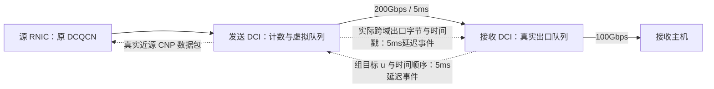

# 拥塞控制方案 v0.5：接收预测与近源执行的最小实验草案

日期：2026-09-17。输入：v0.4 构想。本文描述本次已实现子集与尚未成立的设计主张，不能当作完整协议或已证明的创新性结论。

## 1. 研究问题与目前判断

跨 DC 竞争中，远端瓶颈的拥塞反馈到达源端之前，旧流量仍持续进入长链路。源端降速后，接收端还要等待在途数据到达。数据队列、PFC、ECN、重传和网卡恢复共同决定最终表现。

优先切入点是：**分开“允许发送多少”和“实际已经发送多少”，用近源控制缩短执行反馈环路，并让远端控制器避免把目标当成事实。**

本轮实验支持近源执行减少过载，尚不支持当前预测器具有独立收益。控制目标发生变化，不代表 CNP 序列或真实发送行为发生变化。不能将整套系统相对 DCQCN 的收益自动归因于预测。

## 2. 最小系统架构

- 接收 DCI：采集出口真实队列、已知链路容量和延迟到达的发送 DCI 出口字节统计，每 1ms 算一次组目标。
- 发送 DCI：每 100µs 更新一个面向目标接收出口的组虚拟队列，按源侧观测的活跃流和实测速率选择 CNP 对象。
- RNIC：接收近源 CNP，复用现有 DCQCN `cnp_received_mlx` 以及原有下降、恢复计时器；原远端 ACK/ECN 路径也保留。
- 本轮是单组、单接收出口、源主机直连发送 DCI。多出口映射和跨组公平性尚未实现。

跨域反馈/遥测用仿真延迟事件，而非真正协议包；近源 CNP 是实际序列化、排队、传输和接收的包。反馈丢失、重排、带宽占用与硬件部署开销未模拟。跨域固定延迟保证事件按时间顺序生效；尚无面向乱序网络的显式版本号检查。

## 3. 单位与状态

所有控制公式的队列为字节、速率为字节/秒、时间为秒；CSV 中速率转换成 bit/s。

| 状态 | 所在位置 | 来源 |
|---|---|---|
| q | 接收 DCI | 指定接收出口实际队列 |
| C | 接收 DCI | 该出口物理链路速率 / 8 |
| u | 两侧 DCI | 接收侧计算、5ms 后源侧登记 |
| Din | 发送 DCI | 一个快速周期中进入跨域出口的数据包字节 |
| z | 发送 DCI | 虚拟积压 |
| ΔDsent、时间戳 | 发送 DCI → 接收 DCI | 真正离开跨域出口的数据包字节差分 |
| 活跃流集合、每流到达率 | 发送 DCI | 到达数据包识别；不读取未来流量开始时间 |

接收侧另通过收到的数据包学习成员；两侧暂用 2H 的无包超时。静态流清单只用于把已观测包映射到端点，不以未来流数提前分配。

## 4. 近源执行器

δs = 100µs：

`z(t+δs) = max(0, z(t) + Din(t,t+δs) − u_source(t)·δs)`

z 超过 1 MB 后进入标记状态，低于 0.25 MB 后退出。为防历史虚拟积压反复惩罚已降速流，仅当某流在此周期的实测进入速率大于 `1.05 × u_source/Nactive` 时，为它产生一个 CNP。每流最多每周期一个。

初始组目标设置为已知出口容量 100Gbps；之后受远端目标控制。这种预配置本身提供了近源过载保护，是额外机制，不能解释为接收预测的收益。

CNP 降速不保证达到 u；升速完全依赖现有 DCQCN 恢复。门控阈值使执行器存在死区；接收目标小幅变化可能不会改变实际 CNP 序列。本轮流加入消融已出现这种情况。

## 5. 接收预测控制器与消融

T = 1ms。源端在每个 T 采集跨域出口实际发送字节，经过 df=5ms 后送达接收控制器。以它估计当前接收速率 a；最新一个采样周期内的到达率保持不变是假设，不是未来已知信息。

名义 H = 2df + 2×NIC处理延迟 + 3µs = 10.033ms。

`q_hat(t+H) = max(0, q(t) + (a(t) − C)·H)`

`u(t) = clip(C − (q_control − q_ref)/H, Nactive×100Mb/s÷8, 0.98C)`

其中 q_ref=1 MB。预测版 q_control=q_hat；反应式消融 q_control=q。目标经过 5ms 后登记到源侧。两者有相同的 CNP 执行器、初值、门控、参数和底层 DCQCN。

H 只是实验使用的名义值，不是已经辨识的完整 L。真实生效时间还包括近源周期相位、CNP 排队、DCQCN 定时器和源队列/PFC。当前代码没有推断 d0，也没有把未来多个已发目标的执行轨迹可靠地重放。

## 6. 对 v0.4 的直接修正

1. `Din-u` 量纲不一致，必须使用 `Din-u·δ`。
2. 一个时刻的真实队列与历史预测残差 E 不能不加区分地相加，可能重复纠偏。当前每周期从实测 q 重置，不额外加 E。
3. 接收出口空闲时，观测的离开速率不等于服务能力下降。本轮使用已知 C；没有实现未知可用带宽估计。
4. 当前发送统计经过 df 才到达接收侧，近似反映“现在到达了什么”，不天然透露“未来 H 会到达什么”。没有执行状态模型，不能仅凭计数就宣称精确预测。
5. 首次未知突发进入长链路后，接收控制无法撤回在途数据。减小第一次过冲主要依赖事先约束或近源执行，而非因果上不可能的提前远端反馈。
6. 目标组到接收出口的映射在复杂 ECMP 拓扑中并非天然存在；本轮采用直连小拓扑验证单组。
7. 实际 CNP 接收入口原先不调用 DCQCN 降速，已补齐；否则只有“发包”，没有执行闭环。

## 7. 预期效果与本轮边界

期望近源模块减少持续过载；预测模块在执行滞后可估计时避免控制器对旧流量误判。实测前者成立，后者未证实。当前组合仍有明显的吞吐空洞，未达到公平满速收敛要求。

下一阶段最值得做的是给执行器加可观测状态，而非先堆复杂预测公式：记录目标登记时刻、首次实际降速时刻、CNP 次数、实际出口速率和预测误差。再判断目标变化是否真的改变执行结果；之后才比较加入/去掉执行滞后模型。接收侧本地竞争导致可用容量变化，是后续区分远端预测价值的更合适场景。

今天不声称该方案优于已有文献的成熟实现，也不声称已证明稳定性、跨 RTT 公平性或独创性。
