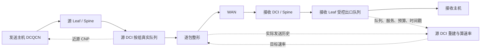

# Proposed 拥塞控制方案 R2：接收端反馈、源端重建与整形

版本日期：2026-09-24；实现核对：2026-09-24。本文按两端分工说明当前 R2 原型，并保留尚待验证的研究假设。

**推荐主线：接收端实际受控出口周期反馈真实队列和容量预算；源端 DCI 将反馈与自身实际发送历史结合，预测当前动作生效时的远端积压，用一个公式计算发送速率，再通过逐包整形执行。**

当前 `--cc=proposed` 运行 R2，核心代码为 [`longhaul-proposed.h`](../../../simulator/ns-3.39/examples/LonghaulCC/longhaul-proposed.h)，实际出队整形位于 `QbbNetDevice`。旧 Proposed/R1 控制实现及入口已移除，历史设计文档保留。已有短时功能回归和故障检查记录，尚无足以证明预测独立收益、稳定性或公平性的完整性能结果；测试细节见 [R2 实现与验证](../../../simulator/ns-3.39/examples/LonghaulCC/PROPOSED_R2_IMPLEMENTATION.md)。本文区分当前源码行为与后续实验建议。

## 1. 先确定首版做什么

### 1.1 四个核心环节

| 环节 | 位置 | 具体职责 |
|---|---|---|
| 测量与反馈 | 接收主机前的 Leaf 出口 | 测量真实队列、服务状态，返回容量预算 |
| 历史重建 | 源端 DCI | 用已经实际发出的数据重建远端队列 |
| 速率计算 | 源端 DCI | 根据预测积压，在容量预算内决定当前发送速率 |
| 逐包执行 | 源端 DCI | 用真实队列和小令牌桶控制 WAN 注入 |

【已实现】RNIC 沿用 DCQCN。源端近源 CNP 用于抑制源队列持续积压，使主机输入逐步适应网关输出；精确约束 WAN 注入的是 DCI 出口整形器。

首版不加入独立的接收端代理控制器、短流优先队列、主动提速协议、在线误差学习、多级预测模型或多源分布式预算协议。需要这些能力时，依据实验暴露的问题逐项扩展。

### 1.2 范围与结论标记

【已实现】当前原型使用两个 DCI 和固定路由，支持主机经 Leaf、Spine 到 DCI 的多跳路径。控制组按源 WAN 方向、接收主机出口和 PG 建立；一组可含多个 QP，也可同时存在多组及双向流量。接收观测点是主机前的 Leaf 出口。不支持多网卡主机、多个源 WAN 的协同预算或运行中路径切换。缩小流量的 S0–S5 已做功能回归，不能据此推断原规模性能。

| 标记 | 含义 |
|---|---|
| 【已有论文依据】 | 原论文支持相应机制或局部结论，不代表本组合已得到验证 |
| 【已实现】 | 已与当前源码核对的原型行为，不代表性能成立 |
| 【已有测试记录】 | 实现说明中记录的既往功能检查；本次文档更新未重新运行 |
| 【建议】 | 尚未实现或仍需按实验结果决定的设计 |
| 【需要实验验证】 | 尚缺充分的参数扫描、性能或异常场景证据 |

**确定的设计边界：**源端知道自己的实际发送，但不知道远端在最近快照之后发生的所有变化；普通 CNP 不携带精确速率；已经进入 WAN 的数据无法由后来的降速撤回。

**尚未确定：**该设计相比静态整形是否具有足够收益、最佳参数是多少、混合流公平性如何，以及标准 DCQCN 能否满足恢复要求。

## 2. 核心机制、可选增强与创新定位

### 2.1 核心机制：四个环节构成一个闭环

【已实现】当前原型包含以下四项，合在一起构成待评价的闭环。

| 核心机制 | 输入与输出 | 解决的关键问题 |
|---|---|---|
| 接收端状态反馈与容量分配 | 真实 q、服务与竞争观测 → 状态快照和预算 F | 真实瓶颈信息只能由接收端直接获得；明确源端能使用的容量边界 |
| 源端实际历史重建 | 延迟快照 + 实际 WAN 发送历史 → 动作生效时的队列 | 反馈回来时已经过时，而最近发出的在途数据还没有体现在快照中 |
| 源端单公式决策 | 预计积压、可用服务、预算 → 当前目标 u | 将公平/容量授权与短期排空决策分开，避免重复减速 |
| 源端实际整形 | u → 受约束的实际 WAN 注入；实际发送再写回历史 | 消除“建议速率就是已执行速率”的假设，让预测与真实执行闭环 |

近源 CNP、QP 映射、快照序号、过龄判断、有限缓存是使核心机制正常运行的配套条件，尽量复用现有实现；不单独作为创新点。

**核心不是两个完整控制器串联。**接收端输出观测与约束，源端只有一个动态发送决策和一个执行器。接收端不先按预测队列算一遍降速，源端也不重复执行同一排空控制。

### 2.2 可选增强：按实验失败原因启用

【建议】【需要实验验证】以下项目不影响核心机制的定义，也不默认计入核心版本性能。每次加入均与同一核心基线比较。

| 可选增强 | 何时值得加入 | 增加的代价与必须验证的结果 |
|---|---|---|
| 服务突变事件反馈 | 周期采样延迟明显主导突发损失 | 增加事件阈值和限频；验证收益来自更及时的信息，并记录额外报文 |
| 上升速率限幅 | 时间对齐正确、τ 已合理设置，仍存在目标反复过冲 | 增加一个上升时间参数；验证减少振荡的收益大于恢复变慢的损失 |
| 简单预测裕量 | 不可避免的分箱/时延误差持续造成低估 | 增加一个可解释裕量；验证不是通过长期少发获得表面低队列 |
| 明确归属的反馈协调 | 日志证实同一拥塞产生多次有效降速并主导恢复损失 | 需要识别受控出口和失效回退；禁止过滤未知来源 CNP |
| 逐流公平调度 | 源 FIFO 导致明显短流阻塞或流间不公平 | 增加逐流逻辑队列/调度状态；验证短流改善及长流代价 |
| 接收侧动态公平预算、多源分配 | 研究范围扩展到域内混合或多个源 DCI | 当前仅有源 WAN 方向的本地组间份额；接收侧动态公平还需可靠需求/流数和预算协调 |
| 端侧主动恢复 | 网关目标已恢复、源队列已空，但 RNIC 持续供给不足 | 修改端侧协议/模型；作为不同能力版本，不宣称标准 DCQCN 已支持 |

前四项是可能的实现增强，后三项会明显扩大研究范围。当前原型未实现表中增强；应先用现有消融回答“实际历史重建是否有独立价值”。

### 2.3 创新点应如何表述

【建议】将研究贡献集中成**一个控制架构主张和两个关键问题**，不要把模块数量当贡献数量。

**架构主张：基于两端信息位置的分工，将瓶颈观测与容量分配放在接收端，将延迟状态重建、动态决策和实际注入控制放在源端。**

这个架构使源端可以同时利用“远端实际发生了什么”和“本端已经把什么送进 WAN”。接收端负责可信的起点与资源约束，源端负责把起点推进到本次动作影响瓶颈的时刻。分工围绕信息可见性和执行位置确定，而不是人为增加控制层数。

**关键问题一：反馈状态过时，但近期在途输入可以从本地历史恢复。**源端不只对滞后速率做趋势外推，而是将远端快照与对应时间段的实际发送字节对齐，重建不可撤回数据造成的积压。它减少的是可避免的输入不确定性，不声称预测接收端未来突发。

**关键问题二：传统目标与真实发送之间存在执行偏差。**网关直接整形 WAN 注入，并将真正发出的字节用于下一轮重建。这样即使 RNIC 因 CNP、PFC 或应用供给而没有跟随建议速率，历史输入仍按事实更新。其价值需要与“用目标速率代替实际发送”的版本比较。

一种适合论文方案节的候选表述是：

> 本文设计一种接收端观测、源端重建与执行的 DCI 拥塞控制架构。接收端反馈真实瓶颈状态与容量预算，源端利用本地实际发送历史重建控制动作生效时的远端积压，并在预算内直接约束 WAN 注入。该设计面向长反馈延迟下的状态过时和目标执行偏差，使队列预测依赖已发生发送而非理想化目标跟随。

【需要实验验证】这是拟研究的贡献表述，不是已经成立的原创性或性能结论。“两端协同”“预测队列”“网关整形”均已有相关研究，不能单独宣称首次提出；是否构成相对于更广泛文献的独立贡献，还需进一步查重与审稿视角比较。

### 2.4 与已有机制的区别及证明责任

| 参照 | 已有机制提供什么 | 本方案拟强调的区别 | 什么结果才能支持该区别有价值 |
|---|---|---|---|
| PBC | 源侧真实队列、按目的端容量整形 | 接收状态持续校准，源侧重建后动态选择预算内速率 | 相同整形器和缓存下优于静态容量控制；否则主要收益应归于整形 |
| MLCC | 接收侧队列预测和基于历史建议的到达估计，结合 credit 控制 | 将重建放在实际发送历史所在的源端，显式处理建议与实际的偏差 | 出现发送跟随偏差时预测低估更小，并改善队列/FCT；不能只比较不同端侧能力 |
| RiCE / THEMIS | 接收边界本地反应、代理或临时减速与反馈协调 | 核心面向源侧可解释的在途注入，预测与执行位于同一网关 | 可预测源侧变化下有收益；面对不可预见下游拥塞，不预设比本地代理更优 |
| 原 Proposed（历史设计，当前无独立入口） | 接收端预测目标，源端虚拟队列/CNP间接调速 | 移动动态决策位置，以实际历史和真实整形完成闭环 | 优先使用当前同执行器消融检验预测输入；若需对比原控制器，须单独恢复并验证其可运行版本 |

最重要的否证条件：如果 R2 不比相同执行器下的静态整形或旧快照反应控制好，就不能声称历史重建闭环已成为主要性能贡献。当前没有可直接运行的旧 Proposed 对照。

## 3. 设计目标与论文借鉴

### 3.1 设计目标

【建议】按以下顺序评价：

1. 源端算出的目标能约束实际 WAN 注入，不只改变一个统计变量。
2. 减少发送变化与长反馈延迟造成的远端队列超调。
3. 尽量保持接收瓶颈利用率，同时控制源、接收两端的总排队代价。
4. 复用现有 DCQCN、QP 映射和近源 CNP，减少端侧修改。
5. 用少量状态和参数完成可归因的实验。

### 3.2 六篇论文的取舍

| 论文 | 本文借鉴的机制 | 首版不引入的部分 |
|---|---|---|
| PBC | 源侧真实队列与实际注入约束 | 不将静态出口容量当成适合所有竞争场景的动态预算 |
| MLCC | 根据到达、服务和现有积压预测未来队列 | 不新增完整 credit-driven 端侧协议；预测输入改用实际发送历史 |
| RiCE | 网关可以承担聚合控制；短暂积压与持续压力应有所区分 | 不叠加独立的接收侧代理速率控制器 |
| THEMIS | 正确 QP 映射、CNP 间隔与反馈协调 | 不采用回环临时减速，不依赖关闭 ICRC |
| LRCC | 区分降速与恢复，明确主动提速对端侧能力的要求 | 不引入自定义 RNIC 主动提速协议 |
| PACC | 控制 CNP 通知对象和通知频率 | 不叠加一套新的 PI 通知数量控制器 |

【已有论文依据】这些机制分别见 PBC §III、MLCC §3、RiCE 的代理与过滤算法、THEMIS 的反馈协调设计、LRCC 的端网协同调速、PACC 的反馈控制。论文效果和实现条件已在 R1 对照表中列出，不能把不同实验中的改善百分比直接作为 R2 的预期收益。

【建议】本方案的研究问题收敛为：**在相同实际整形器下，实际发送历史能否比滞后速率外推更准确地预测积压，并转化为系统性能收益。**“用了预测”或“部署双侧 DCI”本身不构成新颖性证明。

## 4. 网络架构和闭环



【已实现】接收端每个报告周期发送一份完整 STATE，源端每个控制周期更新一次目标；数据包逐包调度，不为每次目标计算向接收端请求确认。

控制组定义为 `g = 源 WAN 出口（方向）+ 接收主机出口 + PG`。同一接收主机、同一 PG、同一 WAN 方向的流共享一组；不同接收主机分组，双向 WAN 分别控制。组不以源主机连接 DCI 的物理输入端口定义。当前配置固定 epoch=1，运行中路径切换及 epoch 更新尚未实现。

### 4.1 分层拓扑中的部署位置与报文路径

不要求主机与 DCI 直连。对 `主机0 → Leaf32 → Spine36 → DCI40 → DCI81 → Spine77 → Leaf73 → 主机41`：

- DCI40 的 WAN 出口维护该组真实队列、发送历史和令牌桶。
- Leaf73 的主机41出口、对应 PG 测量 q、Ceff、x、F。DCI81 的出口队列不能代替这个观测点。
- STATE 从 Leaf73 经 Spine、DCI81、WAN 返回 DCI40，经过真实排队、序列化和传播，不用跨节点即时读数更新控制器。
- 近源 CNP 从 DCI40 经源侧 Spine、Leaf 路由至主机0，继续由 RNIC/DCQCN 处理。

Spine 编号按现有 ECMP 散列决定，示例不是硬编码路径。仿真登记流的地址、端口和 PG 后，按实际转发表确定路径与组，输出路径日志。当前支持固定路由、单网卡主机、两 DCI 间单条 WAN 链路；同一组覆盖的源主机可位于不同 Leaf。S0–S5 的多接收主机、S4 双向流量均属于实现范围。

### 4.2 共享 WAN 的多组执行

每组有独立 FIFO、令牌桶、快照、历史和目标速率；组内 FIFO。逻辑队列共用原有物理 PG、PFC 和有限 MMU 预算，不增加无限缓存。某组因零速率无资格发送时，调度器可选择其他有资格的组；物理 PG 的暂停仍作用于其全部逻辑组。

每个 WAN 方向在本地活动组之间进行有容量上限的最大最小分配。活动依据实际入队、尚未出队的数据及最近活动超时，不读取未来开始/结束时间或流大小。将得到的组份额记作 `Csource,g`，代入第8节公式；本地份额计算以该方向的 WAN 物理容量为总上限。STARTUP、静态消融及长时间丢反馈回退也受这个份额限制。短过龄只允许因份额下降而进一步减速，不因份额上升主动提速。逐包发送还要与 ACK/STATE 等同端口流量竞争，因此份额是发送上限，不是保底吞吐。

接收出口的 x 包括同 PG 的域内数据，以及双向场景下走该出口的反向 ACK 等非受控流量。不得忽略 ACK 后又将整个物理队列 q 用作组内数据队列。这里实现组间资源分配，未实现组内逐流公平调度。

### 4.3 多跳时间模型的边界

`df` 从源 WAN 实际发送起点算到接收 Leaf 的受控出口入队，累加沿途各段传播、序列化和设备接收处理延迟；`db` 按 STATE 的真实返回路径推导。组内采用最大帧的最大名义 df，并记录最小/最大值。当前对称 fat-tree 的等长 ECMP 路径具有相同名义 df。

中间 DCI/Spine 的动态排队、尾包长度差异、丢包重传仍会产生映射误差；实际接收 q 通过周期 STATE 重新校正，但不能保证任意多瓶颈下预测准确。本实现没有用远端队列的即时全局读数消除误差，也不声称接收 Leaf 代表沿途所有瓶颈。逐包日志中的到达时刻是名义预计值，真实队列事件用于离线检验。

**三个不同量必须分开：**

- `F`：接收端授予该组的容量上限，单位 B/s。
- `u`：源端本轮选择的实际整形速率，满足 `0 ≤ u ≤ F`。
- `Btx`：实际已经进入 WAN 的累计字节，由发送事件计数。

F 不是当前实际发送率；u 也不是已经执行的发送量。预测只能用 Btx 历史，不能用 `u × 时间` 替代实际发送。

## 5. 最少需要维护哪些状态

全文公式使用字节、秒、字节/秒；展示 Gbps 时再乘 8。统计应统一报头、分片与重传的字节口径。

### 5.1 接收端：按受控出口维护

| 状态 | 测量方法 | 用途 |
|---|---|---|
| `q` | 在受控出口记录实际队列占用 | 快照重建的起点 |
| `Ceff` | 正常取出口链路容量；按采样周期内 PFC 暂停时间折减，采样时仍暂停则为 0 | 预测可提供的服务 |
| `x` | 同 PG 中不属于本 WAN 组的已入队字节/采样周期 | 估计域内流量和反向 ACK 等外部竞争 |
| `F` | 源 WAN 容量、接收出口容量与配置 WAN 份额确定的静态上限 | 源端不可突破的预算 |
| `seq, epoch, tr` | 单调序号、配置版本、实际采样时刻 | 防止旧反馈覆盖、对齐时间 |

【建议】`q` 是整个受控物理队列的占用。如果其中包含域内数据，预测中必须包含 x；不能把整个队列当成只由 WAN 组产生。

服务估计优先保持简单：无暂停、无额外调度限制时使用已知端口服务能力；有实际暂停时记录不可用时间。**空队列导致的低出队速率不等于服务能力下降。**未来暂停无法提前知道，其影响属于预测误差和异常测试内容。

队列峰值、入出队累计量、PFC 时长可作为实验统计，不必全部进入在线控制报文。不要为了记录更多指标而增加控制器参数。

### 5.2 源端：按组维护

| 状态 | 测量方法 | 用途 |
|---|---|---|
| `Qs` | 源 WAN 出口已准入的组数据累计入队减去累计出队；准入丢包另行统计 | 缓存压力及近源反馈 |
| `Htx` | WAN 实际发送事件按时间写入环形计数 | 重建未来到达 |
| 最近有效快照 | 保存完整反馈及其中的采样时刻；接收事件另写日志 | 重建与预算约束 |
| `qhat, qpeak` | 从快照与 Htx 计算 | 生效时刻积压与区间峰值 |
| `u, tokens, last_update` | 速率公式及令牌桶维护 | 实际执行 |
| 活跃 QP 表 | 复用现有映射、输入字节、最近活动、最近 CNP 时间 | 参考份额和通知选择 |

【已实现】一个组对应源 WAN 出口的一个逻辑 FIFO，组间仍共享原物理 PG、PFC 和 MMU 有限缓存。每 QP 保留映射、输入量、活动与反馈时间等元数据；不再用旧虚拟队列 z 驱动另一套控制。

## 6. 接收端测量、分配和反馈

### 6.1 预算怎么分

【已实现】当前每组的接收预算在初始化时固定为：

\[
F=\min(C_{WAN},\rho C_{nom}w).
\]

`C_WAN` 是源 DCI 的 WAN 出口速率，`Cnom` 是接收 Leaf 受控出口速率，`ρ` 为容量利用系数，`w` 为配置的 WAN 份额；默认 `ρ=0.98`、`w=1`。代码没有逐跳取整条数据路径的最小容量：若中间链路更窄，不能把这个 F 当作严格的路径容量上限。

这里的 F 主要表达容量授权；暂时 PFC 或其他服务变化通过 Ceff 告知源端。不要把队列偏差先在接收端减一次速率，再由源端按同一队列偏差减第二次。

【已实现】域内竞争时可通过配置 `w` 给 WAN 组固定份额；同一源 WAN 出口的活动组另做有上限的最大最小份额分配，得到公式中的 `Csource,g`。这只约束源 WAN 组间注入。若以后研究接收侧 WAN 与域内流的动态公平，可再评估等权饱和流参考分配：

\[
F=\rho C_{nom}\frac{N_w}{N_w+N_l}.
\]

这需要可靠活跃流计数，也只能表示 WAN 的公平预算参考。源端限制 WAN 流并不能迫使未修改的域内 DCQCN 留出相应容量，不能据此宣称严格公平或无饥饿。

### 6.2 最小反馈报文

【已实现】新增一种周期快照报文；当前序列化字段为：

```text
STATE(version, group_id, epoch, seq, sample_time, q, Ceff, x, F, WAN_RATE)
```

每个字段为 8 B，共 80 B 状态头；`WAN_RATE` 仅供接收测得速率外推消融使用，所有 R2 预测模式发送相同大小的 STATE。`Ceff`、`x`、`WAN_RATE` 是最近报告区间的估计值，`sample_time` 是 q 的采样时刻。每份报文包含完整状态，丢失一份后下一份仍可独立使用。

源端检查版本、组、固定 epoch=1、递增序号、时间戳及采样年龄；历史是否完整在控制周期判断。无效报文不重置历史、目标或令牌。当前没有逐份确认或单独的执行确认协议，执行效果从日志检查。

【已实现】STATE 从接收 Leaf 经真实网络路径返回源 DCI，并计入控制字节；控制流量不经本组数据整形，即使本组速率为零仍可通行。

首版保留原有 ECN/PFC 保护，不新增普通队列越界的事件报文。若实验显示 200 μs 周期漏掉重要服务变化，再单独比较事件触发，不能预先加入一套复杂事件协议。

## 7. 源端如何把反馈与发送历史结合

### 7.1 时间关系

设源端当前时刻 t，最近已收到快照采样时刻为 tr，正向时延 df。源端目标切换的实际延迟为 dg，则新动作影响远端的时刻为：

\[
t_a=t+d_g+d_f.
\]

【已实现】目标更新在当前仿真时刻写入出队资格，模型取 `dg=0`，因此重建到 `t+df`。已开始串行化的包不能撤回；中间动态排队和名义传播时延误差仍需离线核对。

固定时延、无丢失条件下，远端时刻 v 的 WAN 到达对应源端 `v−df` 的实际发送。因此，区间 `[tr,t+df]` 的 WAN 到达对应源端 `[tr−df,t]`，在计算时已经发生。

若以后引入不可忽略的目标切换延迟 `dg`，`(t,t+dg]` 的发送尚未发生，需另行估计，不能算作已知历史；当前代码没有这段预测逻辑。

### 7.2 分箱递推

【已实现】在线控制用固定小时间片保存实际 WAN 发送字节，不保存每包完整信息；离线分析另写逐包 CSV。从快照出发：

\[
\hat q_0=q(t_r),
\]

\[
\hat q_{j+1}=\max\{0,\hat q_j+D_{w,j}^{actual}+\hat x\Delta_j-\hat C\Delta_j\}.
\]

- `Dactual`：映射到该远端区间的实际源端发送字节。
- `xhat`：最近快照给出的外部竞争速率，首版保持常值外推。
- `Chat`：最近快照给出的服务能力，首版保持常值外推。
- `Δj`：当前分箱或边界部分区间的时长。

得到 `qhat = qhat(ta)`，同时取区间内最大值 qpeak。每个分箱都截断到非负，不能把空队列时闲置的服务累计起来抵消之后的突发。

**每轮从有效真实快照重建。**不把上一轮的 qhat 当作无限延伸的唯一状态；新快照一到就重新校准。即使没有新快照，本轮新增的实际发送历史仍会改变重建结果。

【已实现】每次重建遍历固定长度环形字节数组，边界分箱按已观测区间均匀分配；缺失或未来历史不能当作零。组数增多后若要优化，仍须保持逐箱非负截断语义。

### 7.3 为什么不会把同一份在途数据重复计算

快照 q(tr) 已经包含 tr 前进入远端队列且未出队的数据。只回放 tr 之后的到达与服务，不另加一个笼统的“总发送量−总接收量”。实际发送事件只在它对应的到达区间内计一次。

正常传播中的数据也不全部等于拥塞：持续按 C 发送时，到达与服务相抵，镜像不会仅因为 WAN BDP 很大就认为队列很大。

重传数据也占用容量，必须计入实际发送。随机丢失、可变路径时延会破坏精确映射，首版先使用无随机丢失的固定路径，然后单独检查这些偏差。

### 7.4 预测的能力边界

【需要实验验证】常值服务和竞争预测无法提前知道远端突然出现的域内 incast、PFC 或其他源注入。这些变化通过后续快照修正，期间仍依赖有限缓冲与现有保护。

分箱会遗漏箱内峰值。当前记录源端逐包名义到达时间与接收端真实队列事件，可供离线比较；常规流程中的独立预测评估脚本已删除，尚无完整误差统计。若误差明显，优先缩小分箱或明确适用范围。

## 8. 一个目标速率公式

### 8.1 区分容量预算和可用服务

【已实现】源端先估计该 WAN 组当前可用的远端服务：

\[
V=\max(0,\hat C-\hat x).
\]

定义希望排除的超额队列为：

\[
e=[\hat q-q_{ref}]^+.
\]

源端本轮目标为：

\[
\boxed{u=\min\{F,C_{source},\max(0,V-e/\tau)\}.}
\]

其中 τ 是唯一新增的主要控制强度参数，表示排空响应的时间尺度。

含义很直接：预计没有多余积压时，在可用服务与接收预算内发送；预计积压过多时，少发 `e/τ`，给远端留下消化积压的空间。

【建议】排空项从可用服务 V 上扣，再受 F 限制。F 已经较小时，预算本身可能足以排空队列，不必再次从 F 扣除同样的排空需求。例如 V=50 Gbps、F=30 Gbps、排空项=10 Gbps，则选 30 Gbps，实际已有 20 Gbps 排空空间；不必再把目标降为 20 Gbps。

### 8.2 第一版不再叠加哪些项

【建议】第一版不加独立预测权重 w、误差 EWMA、第二套 PI、每流硬最低速率、短流额外带宽池，也不额外设置恢复斜坡。先让 qref 和 τ 决定队列响应，用真实逐包整形限制发送突发。

目标跳变可能带来振荡，属于必测项。如果发现周期性过冲，先增大 τ，并检查服务估计和时延对齐；只有确有必要时，再增加“上升限幅”一个开关，并与无该开关版本比较。

τ 不是精确清空期限。每周期重算时，队列下降会使发送速率提高；在理想连续模型中超额队列近似指数衰减。

### 8.3 fair rate 的实际含义

【已实现】组内 Ns 条按最近输入、尚有源积压或 PFC 暂停判为活跃的流，使用 `fi=u/Ns` 作为近源 CNP 选择的参考值，Ns=0 时不做除法。

fi 不写入标准 RNIC 的速率寄存器，也不是 FIFO 中的严格逐流调度份额。实际流间公平性仍受 DCQCN、流到达时刻和反馈影响，必须实测。首版不承诺精确 max-min 公平。

混合流中如果 x 长期占满容量，V 会趋近零，单靠这个 WAN 控制器无法同时保证队列受控和 WAN 不饥饿。若该问题出现，需要接收侧真实服务隔离或更完整的混合流协调，不能用任意最小发送率掩盖。

## 9. 如何实际执行“能发多少”

### 9.1 源端真实队列与令牌桶

【已实现】数据先进入源端组队列，以速率 u 积累令牌；只有令牌足够、物理端口可发送且未受 PFC 暂停时，才能发出一包。

\[
b\leftarrow\min(B_{burst},b+u\Delta t),\qquad
b\leftarrow b-\ell\quad\text{when a packet of length }\ell\text{ is sent}.
\]

当前 `Bburst` 按配置的 `PACKET_PAYLOAD_SIZE` 加受控数据包的 `CustomHeader` 长度设置，意图覆盖最大受控帧；若队首包大于桶容量，程序会报错停止。更新目标不重新发一桶令牌；长期暂停最多留下一个桶。若 u=0，代码清除剩余信用；已经开始物理串行化的包无法撤回。

“每 50 μs 算一次速率”不等于“每 50 μs 一次性释放所有额度”。出队应逐包定时。任何区间内的发送字节受令牌桶速率积分加有限桶信用约束；包级边界误差按统一序列化口径记录。

【已实现】出入队 trace 用于记账，令牌和 PFC 判断接入 `QbbNetDevice::DequeueAndTransmit()` 的实际出队资格路径；因此目标速率会限制数据包发送，而非只改变统计变量。

### 9.2 近源 CNP 沿用简单规则

【已实现】当 Qs 超过高水位时开启近源通知；回落到低水位时关闭。对近期输入速率超过 `(1+ε)fi` 的活跃 QP，按最小通知间隔发送 CNP。同 QP 最近收到匹配的原生 CNP/ACK 时，本轮不补发合成 CNP；原生反馈仍透传。

不再加一层组级 CNP 数量 PI 或复杂排序。复用原有每流统计和 QP 映射；逐流通知仍需最小间隔。

原有 ECN/CNP/PFC 第一版保留，不过滤未知来源 CNP，也不接管接收出口 ECN。这个选择保留简单兼容性，但不能保证消除跨 RTT 的重复降速。日志必须检查是否因此影响恢复；若确实成为主因，再单独做反馈协调扩展。

真实源队列和接收队列都需要有限容量。若远端队列降低而源端缓存无限增长，这不是成功。

## 10. 新流、长短流与 incast

### 10.1 新流

【建议】新流加入现有组，共享同一个聚合速率和一个小突发桶。新流数增加不直接增加 F，也不为每条新流发放额外突发信用。这样同源 DCI 可见的 N→1 流量不会因 N 增大而绕过总上限。

新流映射沿用现有连接建立方式。ns-3 的连接登记只提供身份，不允许给控制器预知流完成时刻或未来大小。

### 10.2 长流与短流

【建议】第一版组内统一 FIFO，组间调度，不特殊识别短流。短流可能被长流源队列阻塞，应单独统计其 P99 FCT；若损失明显，再讨论逐流调度，不先引入优先级机制。

长流按正常周期维护。流暂时无包不能立即认定结束：还有源队列积压或处于暂停状态时保留。消息 FIRST/LAST 可作为提示，但消息结束不等于 QP 结束。

活跃计数采用一个保守超时即可，初始候选为 `max(2×WAN RTT, 2×反馈周期)`，并保留有源排队的 QP。这个设置可能暂时高估 Ns，属于待测折中；不扩展成多级生命周期状态机。

### 10.3 incast 和突发

【建议】源端可见的 incast 由聚合整形吸收，超额先进入 Qs，再通过近源 CNP 使 RNIC 收敛。源缓存必须覆盖局部反馈生效前的超额输入，至少做以下容量检查：

\[
B_{source,headroom}\gtrsim(R_{in}-u)^+L_{local}+B_{arrival,burst}.
\]

这些量需要实测或明确上界，不能直接宣称有限缓存一定足够。

接收端突然出现的域内 incast 无法由源端历史预知。远端缓冲需承受从变化发生、到被采样、反馈返回、再到源端动作传到远端的积压；周期报告下还包含最多一个采样周期的等待。首版不承诺消除这种不可预见突发造成的 PFC 或丢包。

qpeak 记录已有发送造成的区间风险，但不增加第二套比例控制公式。已有在途峰值高于缓冲时，即使现在停发，也不能保证消除它。

## 11. 恢复、稳定性与异常处理

### 11.1 恢复由同一个公式完成

【建议】远端预计积压下降后，`e/τ` 变小，u 自然向 `min(F,V,Csource)` 回升，无需单独设计恢复状态机。

有源积压时，整形器可以利用增大的速率；源队列空且 RNIC 发得慢时，提高 u 不能创造新的数据。必须分别记录网关允许速率与主机实际输入。

**确定边界：普通 CNP 主要表达拥塞，停止 CNP 不等于主动提速。**首版保留 DCQCN 原有恢复，不声称解决了所有减流恢复问题。

### 11.2 有条件的稳定性直觉

【建议】【需要实验验证】单瓶颈、恒定服务、准确预测、持续有源积压且未触发限幅时，在动作生效的时间轴上近似有：

\[
e_{k+1}\approx(1-\delta/\tau)e_k.
\]

当 `0<δ/τ<1`，这个理想离散模型呈单调衰减。但真实系统还有采样、PFC、源供给不足、服务预测误差和 CNP 回路，因此这不是整体稳定性证明。

简化版的防振荡措施只有：τ 不取太小、逐包小桶、实际发送记账、旧快照拒绝、真实快照持续校准。没有证据前不继续增加滤波器和调节参数。

### 11.3 只保留一个反馈有效性判断

【已实现】`STARTUP`、`VALID`、`STALE`、`FALLBACK` 是反馈有效性日志标签，不是另一套拥塞或恢复状态机。快照需通过版本、组、epoch、序号和时间检查，控制时还需历史覆盖完整。

- 启动时：按已配置静态容量上限运行原 DCQCN 与整形；历史齐全后启用预测。
- 反馈短暂过旧：停止依据旧预测提高速率，保留现有原生反馈。
- 长时间无有效反馈：退出预测，回退到已配置静态上限与原 DCQCN，记录降级；该回退不是未知拥塞下的安全保证。
- 收到新鲜完整快照：重新重建后恢复预测，不承接失效镜像。

当服务为零使 u=0 时，控制报文仍必须能通行，服务恢复快照可重新打开数据发送。丢一份报告不应导致永久停发。

## 12. 参数：先固定大部分，只扫描少量

定义 `L=df+db+dg`；当前代码取 `dg=0`。δ 为源计算周期，Tr 为接收报告周期。下表区分源码默认值与后续待扫参数，均不代表最优值。

| 参数 | 当前默认或规则 | 状态与边界 |
|---|---|---|
| Tr、δ、Δ | 200 μs、50 μs、50 μs | 【已实现】分别由 `PROPOSED_REPORT_PERIOD`、`PROPOSED_CONTROL_PERIOD`、`PROPOSED_BIN_WIDTH` 配置 |
| ρ、w | 0.98、1 | 【已实现】分别为 `PROPOSED_UTILIZATION`、`PROPOSED_WAN_FRACTION`；w 是静态 WAN 份额 |
| qref | 配置值为 0 时取 `Cnom×40 μs` | 【已实现】50 Gbps 对应 250000 B，100 Gbps 对应 500000 B；效果待验证 |
| τ | 配置值为 0 时取 `max(2(df+db),4Tr)` | 【已实现】控制强度仍需扫描 |
| 桶大小 | `PACKET_PAYLOAD_SIZE` 加受控数据包的 `CustomHeader` 长度 | 【已实现】队首包超出桶容量会终止运行 |
| Qs 高/低水位 | 250000/62500 B | 【已实现】【需要实验验证】真实缓存 headroom 尚需校核 |
| CNP 间隔、ε | 50 μs、0.05 | 【已实现】分别为最小间隔与输入超额比例 |
| 活跃超时 | `max(2(df+db),2Tr)` | 【已实现】源积压、最近输入或出口暂停可保留活跃状态 |
| 快照过龄门限 | `db+3Tr+Bburst/CWAN` | 【已实现】按采样年龄判断；最后一项是一帧源 WAN 发送裕量 |
| 退出预测的长超时 | 过龄门限再加 3Tr | 【已实现】超时后回退静态上限 |
| 历史长度 W | 覆盖过龄门限 + df + 2Δ，并多留边界箱 | 【已实现】缺失或未来区间不按零填充 |
| 实际危险水位 | 读取真实缓存/PFC 配置后确定 | 【需要实验验证】不凭空指定固定 MB |

首轮重点扫描 **τ/L={1,2,4}**。第二优先才是源队列高水位相对实测局部超额字节量的比例。Δ 只在预测误差显示分箱不够细时扫描；不同时调十几个参数。

## 13. 数值例子与实现流程

### 13.1 计算例子

条件：50 Gbps 服务、无域内竞争、双向各 1 ms、忽略 dg、qref=0.25 MB。接收端在 0 ms 采得 q=0.25 MB，源端在 1 ms 收到。

若对应远端 0～2 ms 的实际发送历史为 60 Gbps，则净积压增加：

\[
(60-50)\times10^9\times0.002/8=2.5\ \mathrm{MB}.
\]

于是 qhat=2.75 MB。取 F=49 Gbps、τ=4 ms，排空项为 5 Gbps，目标为：

\[
u=\min(49,50-5)=45\ \mathrm{Gbps}.
\]

下一轮依据新的实际发送历史重算，不能直接假定已经完整执行 45 Gbps。该例只校验单位和因果关系，不是性能结果，也不代表队列会在 4 ms 精确清空。

### 13.2 最小伪代码

```text
接收端，每 Tr：
    读取真实 q，估计 Ceff 和外部输入 x
    计算或读取预算 F
    发送完整 STATE，递增 seq

源端，收到 STATE：
    检查 group、epoch、seq、时间有效性
    保存最新完整快照

源端，每 δ：
    若快照有效且历史完整：
        从快照逐箱重建到 t + df + dg
        V = max(0, Ceff - x)
        u = min(F, Csource, max(0, V - max(0,qhat-qref)/τ))
        更新整形目标，不重新赠送信用
    否则执行简单过龄/回退规则
    根据真实 Qs、参考份额、每 QP 通知间隔执行近源 CNP

源端，逐包发送：
    只有令牌足够且端口可用时才发送
    更新 Qs、令牌和实际发送历史
```

## 14. ns-3 当前实现与工程边界

【已实现】R2 已接入本仓库。旧 `longhaul-research.h`、`RESEARCH_*` 和 R1 控制入口已删除；`--cc=proposed` 直接选择 R2。核心路径如下：

| 位置 | 当前职责 |
|---|---|
| `examples/LonghaulCC/longhaul-proposed.h` | 按流的实际路径建组，采接收出口 q/Ceff/x/F，发送 STATE；在源侧保存实际发送历史、重建队列、计算 u、生成近源 CNP |
| `src/point-to-point/model/qbb-net-device.cc` | 在实际出队调度中检查各组令牌、PFC 和端口状态，逐包执行目标速率 |
| `src/network/utils/broadcom-egress-queue.cc` | 将组映射到逻辑 FIFO，仍共享原物理 PG 和有限 MMU |
| `examples/LonghaulCC/longhaul-convergence.cc` | `proposed` 使用 DCQCN 模式并调用 R2 模块；`PROPOSED_*` 参数由配置文件读取 |
| 输出日志 | 控制 CSV 记录快照、预测、预算、目标、实际输入/输出、源队列和降级状态；接收事件与源逐包日志可供离线对齐，PFC/FCT 等沿用主程序日志 |

当前 `PROPOSED_PREDICTOR` 提供同一整形器和近源 CNP 下的四种模式：0 为实际历史重建，1 为旧快照反应，2 为静态上限，3 为接收测得 WAN 速率的常值外推。模式 3 仍在源端计算外推，只是不使用本地发送历史；它不等于已复现旧 Proposed 或其他论文算法。未配置控制输出的普通基线不进入 R2 控制路径。

当前限制包括：单网卡主机、固定路由、两 DCI 间一条 WAN 链路、固定 epoch=1、最多 120 个逻辑控制组；接收预算没有逐跳求路径最小容量。`qhat` 与接收真实队列分属源端控制日志和接收事件日志，需离线按时间对齐；常规流程没有现成的完整预测误差评估脚本。

【已有测试记录】直接拓扑的 4×100 MB 有限流检查中，四个 R2 模式和 DCQCN 均完成，但四个 R2 模式的 FCT 相同，不能据此证明历史重建的独立收益。8×100 MB 压力检查出现 1626 次准入丢包；正式分层拓扑缩小流量的 S0–S5 功能回归均完成，其中双向 S4 出现 7921 次准入丢包。这些数字取自实现说明，本次未复跑；缩小流量回归及已准入字节守恒均不能替代原规模无损和性能验收。

在线复杂度：接收端常数量统计；源端每组保存 `ceil(W/Δ)` 个字节计数。若 W=4 ms、Δ=50 μs，每箱 8 B，仅历史计数约 640 B/组。组数很多时，存储和遍历成本不能忽略；真实包缓存往往更大。

FPGA/交换机落地仍需核对队列容量、调度粒度与整形接口。ns-3 可实现不等于现有芯片只改配置即可实现。

## 15. 只做三组优先实验

### 实验一：实际整形是否有效，队列是否只是搬了位置

**验证问题：**算出的 u 是否成为实际 WAN 注入约束；同源 incast 的接收队列下降是否以过大的源缓存为代价。

**已有实现：**真实组队列、逐包整形、实际发送计数和近源 CNP 均已接入；`PROPOSED_PREDICTOR=2` 可关闭预测，形成相同执行器下的静态上限消融。

**对比：**DCQCN、静态容量整形加相同近源反馈、R2。旧 Proposed 当前无独立运行入口，不列为现成可复现基线；静态整形可称 PBC-inspired，不能称为 PBC 原论文复现。

**场景与指标：**原 8→1/50 Gbps/单向 1 ms 场景；记录实际速率对 u 的跟随、源与接收峰值/队列面积、goodput、FCT、未完成流、PFC和重传。所有版本使用相同有限缓存预算。

**有效判据：**有积压时速率符合整形约束；总缓存成本可接受；不能只用接收队列下降证明成功。若无源积压，不将出队低于 u 当执行失败。

### 实验二：源端历史预测是否有独立收益

**验证问题：**在同一执行器下，实际历史是否比接收测得速率的外推、旧快照反应更准确，并改善系统指标。

**已有实现：**环形历史、名义时间映射、逐箱队列递推、源端公式和模式开关均已接入；控制、逐包预计到达和真实接收队列事件已有日志。预测与未来真值的对齐及误差统计仍需离线完成。

**对比：**同一整形/CNP 下的静态上限、旧快照反应、接收测得速率的常值外推、R2 实际历史重建。当前四种模式使用相同的 STATE 报文大小和周期；常值外推在源端计算，并非独立接收端控制器。

**场景：**流数加入/退出以及先高后低的突发；WAN 单向时延 0.1/1/5 ms。先固定无域内竞争。

**指标：**预测低估分位数和区间峰值误差、队列超调、实际速率动作、goodput、平均/P99 FCT、源/远端总队列。优先扫 τ/L={1,2,4}。

**有效判据：**误差改善确实改变控制行为，在相同缓存下减少超调而未显著损害完成率、吞吐或尾 FCT。若静态整形已获得全部收益，则不能把预测写成已证实的性能贡献。

### 实验三：恢复和不可预见变化能否承受

**验证问题：**减流后是网关还是 RNIC 限制恢复；域内突发与反馈丢失是否造成持续振荡、饥饿或永久停发。

**已有实现：**真实 STATE 控制包、过龄回退、域内竞争分类和服务暂停日志已接入。既往故障注入检查使用的独立测试程序已从常规流程删除；连续丢 STATE 等故障场景需重新建立可复现的注入方法。

**场景：**先做 8→1 减流；再分别做接收侧域内突发、短暂服务暂停、丢失连续快照。一次只引入一种扰动。随机负载采用相同种子配对，首轮 5 个种子用于发现趋势，再按变异程度决定是否增加样本。

**对比：**DCQCN、静态整形、R2。若需要旧 Proposed 或 RiCE 对照，应先取得可运行、同条件的实现并单独验证，不能将当前消融模式当作完整复现。

**指标：**u 恢复、源输入恢复、goodput 恢复分别计时；源/远端队列、各类流 FCT、饱和阶段最差流吞吐与 Jain 指数、控制开销、降级时长。达到并持续保持阶段可实现吞吐的 95% 可作为统一恢复判据。

**有效判据：**真实控制路径下仍有收益；丢反馈不会永久锁死；局部突发结束后恢复且没有某类流长期失去服务。若源队列空而 RNIC 持续低速，明确报告端侧恢复限制，不继续靠提高 u 解释问题。

## 16. 当前结论与下一步

【已实现】当前 R2 原型的控制路径是：

> 接收端只反馈真实状态和容量上限；源端依据实际发送历史重建远端队列，用“可用服务减去排空需求、再受预算约束”的公式计算速率；真实小桶整形负责执行，现有近源 CNP 与 DCQCN 负责源缓存收敛。

原型的主要新增内容是：**一种状态反馈、一个发送历史数组、一个目标速率公式、一个真实整形器。**近源 CNP 沿用简单规则，RNIC 使用 DCQCN，没有独立端侧提速协议或第二套动态队列控制器。

下一步重点是按第15节完成同执行器消融、离线预测误差对齐、恢复与异常场景的可复现实验，并同时检查源端缓存、准入丢包和真实 WAN 发送。已有短时回归只能支持功能可运行，不能代替这些性能判据。

【需要实验验证】这套简化设计能否满足目标场景，取决于可预测在途流量占拥塞成因的比例、实际缓存代价和 DCQCN 恢复。若实验要求增加机制，应先指出哪项可观测失败必须被解决，再增加对应模块。

## 17. 依据与版本关系

- 用户初稿：《Proposed拥塞控制方案详细设计.md》，2026-09-22。原有基础周期和近源通知参数来自该稿；本次以当前源码为实现事实依据，未重新运行仿真。
- 前一版：[R1 详细分析与文献对照](Proposed拥塞控制方案_20260924.md)。R2 收敛主机制，当前 `proposed` 入口仅运行 R2；R1 中的复杂扩展不默认进入当前原型。
- 本地论文：PBC、MLCC、RiCE、THEMIS、LRCC、PACC。原文件位置及物理页码定位见 R1 第 2、22 节。
- 当前实现依据：[`longhaul-proposed.h`](../../../simulator/ns-3.39/examples/LonghaulCC/longhaul-proposed.h)、[`longhaul-convergence.cc`](../../../simulator/ns-3.39/examples/LonghaulCC/longhaul-convergence.cc) 和 [R2 实现与验证](../../../simulator/ns-3.39/examples/LonghaulCC/PROPOSED_R2_IMPLEMENTATION.md)。其中既往测试数值属于实现记录，本次未复跑。
- 本稿独立推导：源端时序对齐、V 与 F 分离的控制公式及研究评价标准。代码接入并不证明这些机制相对基线有独立性能收益。

本文更新的是 R2 文档中的实现状态和实验边界；稳定性、公平性和性能优势仍须按第15节验证。


> 归档说明（2026-09-29）：本文保留旧版本设计与实验记录；文中的“当前”、TODO 和结果均对应原记录时期，不代表现行 R3。部分旧源码、结果及文献路径可能已失效。现行入口见 [文档索引](../../README.md)。
