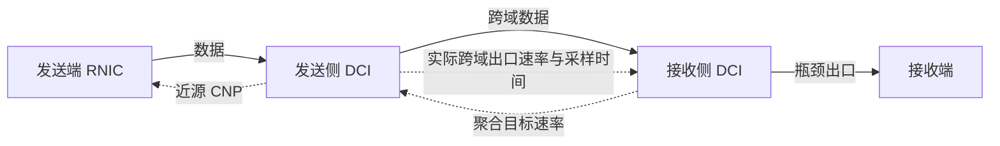

# Proposed 拥塞控制方案详细设计

版本日期：2026 年 9 月 22 日。

本文说明接收侧预测控制与近源虚拟队列/CNP 方案的设计和当前实现。方案基于[拥塞控制方案 v0.4](拥塞控制方案v0.4.md)，当前运行入口为 `LonghaulCC/longhaul-convergence.cc`。本文以 `--cc=proposed` 启用的版本为准。已有实验分析见[初步实验报告](拥塞控制方案与初步实验报告-20260917.md)。

## 1. 研究问题

跨数据中心拥塞控制面临较长的反馈时延。接收侧发现队列增长后，控制信息需要返回发送侧，RNIC 再根据反馈调整速率，调整后的数据流经过跨域链路才能到达接收侧。因此，控制器发出降速目标后，接收侧仍可能在一段时间内收到按旧速率发送的数据。

这一过程可以表示为：

$$L=d_b+d_0+d_f,$$

其中，d_b 是目标反馈的返回时延，d_0 是发送侧收到目标到实际发送行为开始变化的时间，d_f 是数据从发送侧到接收侧的传播时延。RNIC 的调整通常是渐进的，d_0 也不足以单独描述整个调速过程。

如果控制器直接把目标速率当作已经实现的速率，就可能低估后续到达量。另一方面，拥塞缓解后，如果发送端恢复较慢，即使队列已经排空，链路也可能持续利用不足。

本方案希望解决的具体问题是：根据实际发送观测估计短期队列变化，同时通过近源反馈推动发送端执行目标，减少跨域反馈滞后带来的过量发送。对于减流后的恢复问题，当前实现仍依赖端侧算法，尚未形成完整解决方案。

## 2. 总体设计

### 2.1 模块分工

接收侧 DCI 负责计算聚合目标速率，发送侧 DCI 负责根据目标产生近源 CNP，RNIC 负责实际调速。两侧 DCI 使用不同的控制周期：接收侧每 T 更新目标，发送侧每 δ 检查一次注入流量，且 δ < T。



| 模块 | 主要职责 |
|---|---|
| 发送端 RNIC | 接收近源 CNP 和原有拥塞反馈，通过 DCQCN 调速 |
| 发送侧 DCI | 统计进入跨域出口队列的数据量、实际跨域发送量和近期活跃流；维护虚拟队列，选择需要通知的流 |
| 接收侧 DCI | 测量瓶颈出口队列，接收发送侧遥测，预测队列变化并计算目标速率 |
| 接收端 | 保持原有数据接收及 ACK 行为，不执行新增控制算法 |

Proposed 在现有 DCQCN 路径上增加控制机制，没有替换 RNIC 的完整拥塞控制实现。原有 ECN/ACK 反馈、近源 CNP 和 PFC 可以同时影响发送行为。

### 2.2 流组的含义

共享同一个受控瓶颈的流被视为一个控制组，目标 u 表示这组流的聚合速率，而不是单条流的速率。当前实现只处理一个接收主机对应的流组，要求所有实验流都发往该接收主机。

例如，8 个发送端向同一个接收端发送数据，接收侧出口带宽为 50 Gbps，则这 8 条流共用一个聚合目标。目标为 40 Gbps、源侧判断有 8 条活跃流时，近源通知以每流 5 Gbps 为参考份额。该份额用于选择 CNP 接收者，不直接写入 RNIC 速率寄存器，也不构成严格的公平带宽分配。

### 2.3 当前拓扑约束

发送主机必须直接连接源侧 DCI，接收主机必须直接连接接收侧 DCI，两侧 DCI 之间有直接跨域链路。当前 CNP 发送代码通过源侧 DCI 到源主机的直接接口发包，尚未实现多跳路由选择。

`LonghaulCC` 默认的多层 `topology-longhaul.txt` 不满足上述要求。验证 proposed 应使用 `run-research.py` 生成的小拓扑，或提供符合条件的自定义配置。多端口、多流组与多跳拓扑需要后续扩展。

## 3. 状态与测量位置

### 3.1 符号及单位

控制公式统一使用字节和秒，速率为字节/秒。输出字段以 `_bps` 结尾时，单位转换为 bit/s。

| 符号 | 含义 | 单位 |
|---|---|---|
| q(t) | 接收侧瓶颈出口的真实队列长度 | B |
| z_k | 源侧第 k 次更新前的虚拟队列长度 | B |
| D_in,k | 近源周期内进入受控跨域出口队列的流组数据量 | B |
| a_s | 发送侧 DCI 实际跨域出口速率 | B/s |
| ã_s(t) | 接收侧最近获得的 a_s 观测值 | B/s |
| C | 接收侧瓶颈出口的配置链路速率 | B/s |
| u_k | 源侧已经收到、当前用于虚拟队列的聚合目标 | B/s |
| T、δ | 接收侧与近源控制周期 | s |
| H | 预测时间长度 | s |
| q_ref、z_ref | 真实队列参考值、虚拟队列通知阈值 | B |
| N_r、N_s | 接收侧、发送侧各自估计的活跃流数 | 条 |
| w | 预测变化量权重 | 无量纲 |

### 3.2 三种不同的发送观测

当前实现区分以下测量位置：

1. **RNIC 实际发包**：通过 `RdmaQpDequeue` 统计，表示主机实际发出的字节量。
2. **进入源侧跨域出口队列**：通过源侧跨域设备的 `QbbEnqueue` 统计，用于虚拟队列和逐流发送量估计。
3. **离开源侧跨域出口队列**：通过同一设备的 `QbbDequeue` 统计，表示实际进入长链路的字节量，用于接收侧预测。

这里的“进入发送侧 DCI 的数据量”在代码中具体指第 2 个位置，而非网卡发送量或交换机所有入口字节之和。由于源侧可能排队或暂停，这三种速率不一定相等。

上述控制观测统计数据包在 trace 处的实际大小，包含相应报头和重传流量。有效载荷 goodput 则由接收侧按序接收计数另行统计。

### 3.3 接收侧观测

接收侧在通往目标接收主机的出口设备上统计队列长度、入队字节和出队字节。近期流成员由该出口收到的数据包识别。

当前控制公式使用链路配置容量 C，而不是测得的实际出队速率。入队、出队速率主要用于记录和分析。若出口因 PFC 等原因暂停，配置容量与实际服务能力会出现差异，这是当前预测模型的一项限制。

## 4. 近源虚拟队列

### 4.1 更新公式

每隔 δ，源侧更新：

$$z_{k+1}=\max\{0,z_k+D_{in,k}-u_k\delta\}.$$

z 是一个以字节计的状态变量，不存放数据包。D_in,k 是本周期实际进入的数据量，u_kδ 是按目标速率允许通过的虚拟服务量。两者之差积累为虚拟积压。

例如，当前 z 为 100 KB，本周期进入 500 KB，而目标允许 400 KB，则更新后 z 为 200 KB。如果后续输入低于目标，虚拟积压逐渐下降。它反映的是累计超额程度，不等同于源侧或接收侧的真实队列。

### 4.2 开启和停止通知

虚拟队列使用两个阈值：

- z > z_ref：开启近源 CNP 通知。
- z < z_ref/4：关闭通知。
- 两个阈值之间：保持先前的通知状态。

采用不同的开启和关闭阈值，可以减少阈值附近反复切换。当前 q_ref 和 z_ref 共用 `research_qref`，默认均为 250000 B，关闭通知阈值因此为 62500 B。

### 4.3 选择通知对象

源侧用一个 δ 周期内某流进入跨域出口队列的字节差分估计该流速率 r_i。当通知已开启且 N_s > 0 时，仅对满足下式的流发送 CNP：

$$r_i>(1+\epsilon)\frac{u_k}{N_s},\qquad \epsilon=0.05.$$

每个近源周期，每条满足条件的流最多生成一个 CNP。设置 5% 裕量是为了减少目标份额附近的反复通知。已低于参考份额的流不再因历史虚拟积压而持续收到近源 CNP。

当前 N_s 根据最近一次观测到该流的时间判断，活跃超时为：

$$\tau_s=\max(3\delta,2T).$$

默认参数下 τ_s=400 µs。当 N_s 比上次减少时，程序执行 z←min(z,z_ref)，减轻退出流留下的虚拟积压。该操作属于启发式处理；暂停或低速流也可能因暂时没有数据而被误判为退出。

### 4.4 CNP 如何调节 RNIC

源侧 DCI 构造协议号为 `0xff` 的 CNP，带上源流端口和优先级信息，通过直连源主机的接口发送。当前用目标接收主机地址作为 CNP 的源地址，以匹配已有 RNIC 处理路径。

RNIC 收到 CNP 后进入原有 DCQCN 降速逻辑。CNP 不携带精确目标速率，也不会直接把 RNIC 设为 u/N_s。停止发送近源 CNP 后，提速依赖 DCQCN 自身的恢复过程。因此，该执行方式能产生降速作用，但不能保证实际速率准确或及时跟随目标。

## 5. 接收侧预测与目标速率

### 5.1 发送侧遥测

发送侧实际跨域出口速率按接收侧控制周期 T 采样：

$$a_s(t)=\frac{B_s(t)-B_s(t-T)}{T}.$$

B_s 是源侧跨域出口累计发出的数据字节数。采样值和时间戳经过 d_f 延迟后交给接收侧。当前这一步通过仿真事件实现，源侧采样与接收侧计算在同一个 `ResearchSample()` 回调中安排，但接收侧预测只读取已到达的遥测状态，不直接读取刚采样的 source 值。

时间戳标记采样区间的结束时刻，所以它代表的是过去 T 内的平均速率，不是某个瞬间的精确速率。

### 5.2 队列预测

预测采用固定速率外推：

$$\hat q(t+H)=\max\{0,q(t)+w[\tilde a_s(t)-C]H\},\qquad w=0.5.$$

其含义是：以当前真实队列为起点，假设未来 H 内的到达速率接近最近获得的源侧实际出口速率。到达高于服务时，队列增长；到达低于服务时，队列下降。乘以 w 后，预测只采用净变化量的一部分。

例如 q=2 MB，ã_s=60 Gbps，C=50 Gbps，H=2 ms，则不加权的净积压为 2.5 MB。取 w=0.5，预测队列为 3.25 MB。

w 是固定权重，不是预测可信度。它同时缩小增长和下降幅度：可以减少激进外推，也可能在持续过载时低估积压。该模型尚未描述流加入、退出、PFC 和 RNIC 调速在预测区间内造成的变化。

### 5.3 预测时间 H

当前程序设置：

$$H=2d_f+2d_{NIC}+3\ \mu s.$$

当跨域单向传播时延为 1 ms、NIC delay 为 15 µs 时，H=2.033 ms。公式中的 3 µs 是当前实现保留的固定近端时延项，并非在线测量结果。

该 H 只是名义预测时间，并没有在线估计执行延迟 d₀，也没有显式加入控制周期相位和完整的 RNIC 收敛时间。因此不能将它理解为控制指令实际生效时间的准确测量。

### 5.4 目标速率计算

接收侧活跃流数 N_r 使用最近 2H 内在瓶颈出口观察到的数据流估计。N_r 与源侧 N_s 使用不同位置和超时，不保证相等。

有活跃流时，先计算：

$$u_{raw}=\max\left\{N_r r_{min},\min\left[\rho C,C-\frac{q_{ctrl}-q_{ref}}{H}\right]\right\},$$

其中，ρ=0.98，r_min=100 Mbps（计算前转换为 B/s）。预测模式取 q_ctrl=q̂，关闭预测时取 q_ctrl=q。

当 q_ctrl 高于参考值，目标降低，为队列排空留出服务能力；当队列较低，目标上升，但通常不超过 ρC。当前小规模实验满足 N_r r_min < ρC；若扩展到大量流，上下界可能冲突，需另行处理，不能直接把当前公式当作任意规模下的严格限幅。

然后限制目标上升幅度：

$$u_{new}=\min(u_{raw},u_{prev}+\eta C),\qquad \eta=0.1.$$

u_prev 是接收侧上次计算的目标，不是源侧已经执行的目标。该限制仅作用于目标的上升，目标下降没有对应的变化幅度限制。

计算出的目标经过 d_f 延迟交给源侧。这里假设返回路径时延与正向跨域传播时延相同。源侧收到后更新虚拟队列的服务速率，不直接改写 RNIC 速率。

### 5.5 旧遥测处理

如果当前时刻与最近遥测时间戳的差超过 d_f+2T，则不再使用预测队列计算目标，改用当前真实队列 q。之后仍执行相同的速率上下界和上升限幅。

这只处理遥测明显过旧的情况，不能消除正常传播延迟内的信息滞后。当前目标反馈不携带可用于乱序检查的序号或时间戳；仿真采用固定延迟，因此没有模拟控制报文乱序。

## 6. 初始化与执行顺序

初始化时，虚拟队列 z=0，近源通知关闭，源侧目标及接收侧上次目标均设置为瓶颈容量 C。第一次远端目标返回前，源侧已经可以按 C 更新虚拟队列。因此，本原型假设源侧预先知道初始瓶颈容量，并非完全依赖远端反馈启动。

接收侧尚未观察到活跃流时，不发送新目标，源侧保留已有目标。此时日志 `target_bps` 写为 0，表示该周期没有生成目标，不能理解为源侧被要求停发。

接收侧每 T 执行：

```text
统计本周期入队、出队、RNIC 发包和源侧跨域出口字节
安排源侧出口速率与时间戳在 d_f 后交给接收侧
读取当前真实队列与已经收到的遥测
计算预测队列，并识别接收侧活跃流
若存在活跃流：
    选择预测队列或真实队列；遥测过旧则使用真实队列
    计算目标上下界，并限制目标上升幅度
    安排目标在 d_f 后交给源侧
记录状态与计数，安排下次采样
```

发送侧每 δ 执行：

```text
统计本周期进入跨域出口队列的逐流字节量
识别源侧活跃流数 N_s
按当前已收到的目标更新虚拟队列
若活跃流数减少，将虚拟队列限制到不超过 z_ref
按高低阈值更新通知状态
若通知开启且 N_s > 0：
    对速率超过 1.05 × 目标 / N_s 的流发送 CNP
保存计数，安排下次检查
```

两侧周期定时器独立运行。日志在接收侧采样时读取源侧最近状态，因此 `virtual_queue_bytes` 等字段并不包含每一次近源更新。

## 7. 代码位置与参数

### 7.1 文件与函数

| 文件或函数 | 作用 |
|---|---|
| [longhaul-convergence.cc](../../../simulator/ns-3.39/examples/LonghaulCC/longhaul-convergence.cc) | 读取配置、选择算法、建立拓扑、加载流、调用 ResearchSetup，并记录实验元数据 |
| [longhaul-research.h](../../../simulator/ns-3.39/examples/LonghaulCC/longhaul-research.h) | 控制状态、采样、预测、目标反馈、虚拟队列和 CNP 实现 |
| ResearchSetup | 绑定 trace，检查拓扑，初始化并启动定时器 |
| ResearchSourceEnqueue / ResearchSource | 分别统计源侧跨域队列入队与出队字节 |
| ResearchEnqueue / ResearchDequeue | 统计接收侧出口入队、出队及 ECN 标记观测 |
| ResearchTelemetry / ResearchTarget | 接收延迟遥测或目标，更新对应状态 |
| ResearchPredict / ResearchSample | 预测队列、计算目标并记录状态 |
| ResearchNearSource / ResearchCnp | 更新虚拟队列、选择流并构造 CNP |
| [run-research.py](../../../simulator/ns-3.39/examples/LonghaulCC/run-research.py) | 为同一 longhaul 程序生成小规模拓扑、配置和运行目录 |

头文件被入口程序包含，不是独立的 ns-3 模块。当前组状态采用全局变量保存，流识别依赖已加载的实验流列表，不是通用的动态流发现实现。

### 7.2 Proposed 默认参数

| 参数 | 默认值 | 配置方式 |
|---|---:|---|
| 接收侧周期 T | 200 µs | `--proposedPeriod`，单位秒 |
| 近源周期 δ | 50 µs | `--proposedNearPeriod`，单位秒 |
| q_ref 与 z_ref | 250000 B | `--proposedQref`，同时影响两者 |
| 预测权重 w | 0.5 | `--proposedWeight` |
| 利用率上限 ρ | 0.98 | `research_target_util` |
| 超额通知裕量 ε | 0.05 | `research_deadband` |
| 每周期目标最大增量 ηC | 0.1C | `research_increase_fraction` |
| 每流最小目标参考 | 100 Mbps | 当前公式中的常量 |
| 接收侧活跃超时 | 2H | 根据 H 计算 |
| 源侧活跃超时 | max(3δ,2T) | 默认 400 µs |
| 预测/反应模式 | 2 / 1 | `--researchControl` |

只有表中列出命令行选项的参数可直接通过 CLI 修改，其余目前在源码中配置。使用 `--cc=proposed` 会启用保护逻辑和上述报告版本默认值；旧 `predictive-cnp` 入口保留早期参数，不是同一个配置。

## 8. 运行与结果检查

从仓库根目录执行：

```bash
./simulator/ns-3.39/ns3 build longhaul-convergence -j2
python3 simulator/ns-3.39/examples/LonghaulCC/run-research.py \
  --variants proposed dcqcn --scenarios finite --stop 0.08 \
  --wan-delay-us 1000 --no-window --jobs 1 \
  --output results/proposed-design-check
```

输出目录应使用新路径。该命令运行 4 条同时开始的 100 MB 流：开始时间 10 ms，主机链路 100 Gbps，跨域链路 200 Gbps，跨域单向时延 1 ms，接收出口 100 Gbps，仿真时长 80 ms。这是接入验证场景，与此前报告中的 8→1、50 Gbps 瓶颈场景不同，不能直接混合比较数值。

如需直接调用程序，可在 ns-3 目录中使用：

```bash
./ns3 run 'longhaul-convergence --conf=/绝对路径/config.txt --cc=proposed --researchReceiver=4 --researchOutput=/绝对路径/control.csv'
```

其中配置和输出目录需事先准备，接收主机编号应与拓扑一致。关闭预测时追加 `--researchControl=1`，仍保留近源 CNP 和保护逻辑。`run-research.py` 当前不直接透传这一选项；消融可使用它生成的配置，再为所有输出指定新路径后调用程序。

### 8.1 输出含义

| 文件或字段 | 含义及注意事项 |
|---|---|
| metadata.json | `algorithm=proposed`，底层 `cc_mode=1`；记录实际控制参数 |
| sender-rate.csv / receiver-goodput.csv | 主程序输出的逐流速率与有效接收速率 |
| fct.csv | 已完成流的完成时间 |
| dci-link.csv | 跨域链路状态，不等于接收侧瓶颈出口队列 |
| bottleneck.csv | runner 指定的控制日志文件；直接运行可用 researchOutput 改名 |
| queue_bytes / predicted_queue_bytes | 当前真实队列与本次预测队列 |
| target_bps | 本周期计算的接收侧目标；没有活跃流时为 0，未发送目标 |
| source_target_bps | 已经到达源侧、正在用于虚拟队列的目标 |
| virtual_queue_bytes | 源侧最近的虚拟队列状态 |
| telemetry_bps / telemetry_timestamp_s | 接收侧已收到的历史速率及采样区间结束时刻 |
| source_dci_bps / sender_wire_bps | 源侧跨域出口速率 / RNIC 实际发包速率 |
| arrival_bps / departure_bps | 接收侧出口入队 / 出队速率 |
| observed_flows | 接收侧活跃流数 N_r；当前未单独输出 N_s |
| cnp_sent | 源侧累计生成的 CNP 数量；不等于已接收或已执行数量 |
| ecn_packets | 在接收出口出队时观察到 ECN 位非零的数据包累计数 |
| admission_drop_packets | 所有交换机的累计准入丢包事件，可能包含重传包重复丢弃 |

验证控制是否生效，应检查：实际参数是否正确、目标是否变化、源侧目标是否延迟更新、CNP 计数是否增加，以及实际发送量是否随之变化。仅检查程序退出码或算法名称还不够。

## 9. 已有验证与结论

2026 年 9 月 22 日的 LonghaulCC 接入测试已完成编译和运行。上述 4 流场景中，proposed 与 DCQCN 均完成 4/4 条流；proposed 生成 91 个近源 CNP，元数据中的周期、阈值及预测权重符合预期。结果位于 [longhaul-proposed-20260922](../../../results/longhaul-proposed-20260922/finite)。这次测试证明代码已接入并执行，不作为性能优势的完整验证。

此前统一实验中，8→1 incast 下 proposed 相比当时的 DCQCN 配置，FCT 中位数从 66.455 ms 降至 43.577 ms，但队列峰值从 21.380 MB 略增至 21.749 MB。关闭预测后的 FCT 为 43.542 ms，说明当前收益在没有预测项时也存在。动态减流实验还出现末段 goodput 仅约 17.78 Gbps 的恢复不足问题。

因此，当前方案已经具备可运行的接收侧控制和近源执行流程，但固定速率外推尚未显示独立优势。性能改善不能全部归因于预测，减流后的恢复能力也需要进一步研究。

## 10. 局限与下一步设计

### 10.1 当前尚未实现的部分

- **执行延迟辨识**：没有测量目标发出、源侧接收、实际发送变化和接收变化之间的完整关系。
- **预测误差校准**：没有保存与未来时刻对齐的预测误差 E，也没有据此修正预测或目标。
- **在途数据建模**：没有维护跨域链路中数据的发送历史队列，当前依靠延迟速率值外推。
- **实际服务能力估计**：没有把暂停等因素造成的容量下降纳入预测。
- **主动恢复机制**：近源 CNP 只负责降速，目标上升不能直接推动 RNIC 提速。
- **控制协议实现**：跨域目标与遥测由固定延迟事件传递，未计报文开销、丢失、乱序和排队。
- **一般拓扑与多流组**：尚未实现多跳 CNP 路由、瓶颈发现和按组状态隔离。

当前也没有正式的启动/稳态/拥塞状态机，只有近源通知的开启与关闭状态；未给出稳定性或公平性保证。

### 10.2 优先开展的工作

第一步，对齐现有日志，检查减流后目标是否已经恢复、CNP 是否仍在产生、RNIC 实际速率是否滞后。先确定限制来自控制器、活跃流判断还是 DCQCN 恢复过程。

第二步，比较开启与关闭预测时的 q̂、目标和 CNP。如果预测值差异没有传递到实际动作，应先检查限幅与执行器；如果动作不同但结果没有改善，则分析预测偏差和时域选择。

第三步，记录预测发布时刻及对应的未来真实队列，计算按 H 对齐的误差。由于 H 可能不与采样周期整除，需明确插值或匹配规则，再考虑用平滑误差修正预测。该校准属于后续设计，当前公式中没有误差补偿项。

在上述问题解释清楚后，再评估实际执行延迟估计、恢复机制及多流组扩展。近期实验应围绕这些具体假设开展，避免先增加大量参数或扩大拓扑。


> 归档说明（2026-09-29）：本文保留旧版本设计与实验记录；文中的“当前”、TODO 和结果均对应原记录时期，不代表现行 R3。部分旧源码、结果及文献路径可能已失效。现行入口见 [文档索引](../../README.md)。
