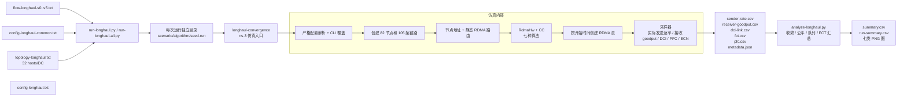

# LonghaulCC 使用手册

本文档对应精简后的 `longhaul-convergence` 版本。它是一套独立的 ns-3
长距 RDMA 实验，不修改 `crossDC-evaluation.cc` 的实验流程。

## 1. 实验范围

程序接受以下七种算法；其中 DCQCN、HPCC、TIMELY 是原来的三种基线：

| 算法 | `CC` |
| --- | ---: |
| DCQCN | `dcqcn` |
| HPCC | `hpcc` |
| TIMELY | `timely` |
| Bifrost | `bifrost` |
| FRP | `frp` |
| RoCC | `rocc` |
| Proposed R2 | `proposed` |

所有算法共用同一拓扑、流文件、包大小、PFC/ECN、buffer、采样周期和
`RngSeed/RngRun`。HPCC 使用 INT，TIMELY 使用 RTT 时间戳，这是算法本身的反馈机制。

## 2. 精简内容

这版代码保留“仿真必须具备”的部分，移除了旧程序中与本实验无关的内容：

| 原来的复杂点 | 现在的处理 |
| --- | --- |
| 旧队列分布监控、ToR Power 打印 | 删除；队列统一由 `dci-link.csv` 采样 |
| 链路故障注入和动态重路由 | 删除；本阶段拓扑是固定基线 |
| 默认运行算法 | DCQCN/HPCC/TIMELY/Bifrost/FRP/RoCC/Proposed |
| 先临时分配 IP、再 BFS 划分 DC、最后回填 | 节点创建后一次性按 node ID 分配唯一地址 |
| 逐条读取并递归调度流文件 | 一次性读入流清单，再按 `start_time` 调度 |
| 配置项静默忽略 | 只接受 longhaul 支持的配置键，未知键直接失败 |
| 用 stdout 解析指标 | stdout 只做诊断，指标全部写结构化文件 |

仿真启动时会打开 longhaul 的静默开关，屏蔽底层模型历史性的逐 ACK/逐速率
`printf`；这不会关闭 CSV 采样，也不会影响其他实验，因为默认开关仍为关闭。

IP 地址只用于 RDMA 节点寻址和路由；网络节点与链路关系由拓扑文件提供。

## 3. 架构图



可单独查看图源：[longhaul-architecture.mmd](longhaul-architecture.mmd)。

## 4. 快速开始

以下命令从 `simulator/ns-3.39` 目录执行：

```bash
./ns3 build longhaul-convergence -j2
python3 examples/LonghaulCC/run-longhaul-all.py
python3 examples/LonghaulCC/analyze-longhaul.py --root ../../results/longhaul
```

默认运行配置文件中的 S0，每种算法 1 个 `RngRun`。短时启动通过不代表算法完成
和收敛。完整矩阵需要
通过命令行显式传入 S0--S5 的 flow 文件和停止时间：

```bash
python3 examples/LonghaulCC/run-longhaul-all.py \
  --flow-files examples/LonghaulCC/flow-longhaul-s0.txt \
              examples/LonghaulCC/flow-longhaul-s1.txt \
              examples/LonghaulCC/flow-longhaul-s2.txt \
              examples/LonghaulCC/flow-longhaul-s3.txt \
              examples/LonghaulCC/flow-longhaul-s4.txt \
              examples/LonghaulCC/flow-longhaul-s5.txt \
  --stop-times 0.38 1.50 1.50 0.60 1.50 1.50 \
  --runs 5
python3 examples/LonghaulCC/analyze-longhaul.py --root ../../results/longhaul
```

只跑指定组合：

```bash
python3 examples/LonghaulCC/run-longhaul.py \
  --algorithm dcqcn \
  --config examples/LonghaulCC/config-longhaul-common.txt \
  --flow-files examples/LonghaulCC/flow-longhaul-s0.txt examples/LonghaulCC/flow-longhaul-s2.txt \
  --stop-times 0.38 1.50 \
  --runs 1 \
  --output-root /tmp/longhaulconfig-longhaul.txt
```

`--stop-times 0.03` 仅适合检查启动、文件输出和崩溃，不适合做收敛结论：

```bash
python3 examples/LonghaulCC/run-longhaul.py \
  --algorithm dcqcn \
  --config examples/LonghaulCC/config-longhaul-common.txt \
  --flow-files examples/LonghaulCC/flow-longhaul-s0.txt \
  --stop-times 0.03 --skip-build --output-root /tmp/longhaul-smoke
```
config-longhaul.txt
runner 会编译（除非 `--skip-build`）、创建输出目录、保存配置快照和记录 git
commit。仿真失败或超时会使 runner 最终返回非零状态。

## 5. 输入文件

### 5.1 拓扑

当前使用 `topology-longhaul.txt`，拓扑口径为：

- 82 个节点，其中 18 个交换机、64 个 host；
- 每个 DC 有 4 个 leaf、4 个 spine 和 1 个 gateway；
- 每个 leaf 连接 8 个 host，两个 DC 各有 32 个 host；
- 105 条链路，leaf-spine 全连接，spine-gateway 全连接；
- DCI 为 `40 <-> 81`，200 Gbps，单向 channel delay 为 5 ms；
- 跨 DC RTT 约 10 ms 加内部链路传播/传输延迟。

修改拓扑后必须先运行校验器。校验器检查节点数量、交换机角色、host 度数、
leaf 挂载数量、leaf-spine/gateway 连接、连通性、唯一 DCI 和跨 DC 路径约束。

### 5.2 流文件

每个流文件第一行是流数，之后每行是：

```text
src dst pg dport size_bytes start_time_seconds
```

固定场景如下：

| 场景 | 内容 | 主要观察点 |
| --- | --- | --- |
| S0 | 1 条 DC0→DC1 长流 | 无竞争爬升和路径瓶颈 |
| S1 | 8 条同向长流同步启动 | 初始收敛和公平性 |
| S2 | 1 条先启动，20 RTT 后加入 7 条 | 降速与新公平点收敛 |
| S3 | 8 条启动，7 条有限流退出 | 带宽再获取 |
| S4 | 两个方向各 8 条长流 | 双向反馈和对称性 |
| S5 | 长流上叠加有限大小 probe 流 | FCT 与长流稳定性 |

### 5.3 公共配置

`config-longhaul-common.txt` 保留程序的完整实验参数，便于审阅和复现；C++ 默认值
只作为配置文件缺省项。切换场景时通过 `--flow-file` 读取不同流文件、通过
`--stop-time` 设置对应的停止时间，不再创建每个场景的三行配置文件。程序根据
flow 文件名自动生成场景名，例如 `flow-longhaul-s0.txt` 对应 `S0`。runner 不修改原始
配置文件，而是为每次运行生成 `config.txt` 写入输出路径；flow、停止时间、算法、seed
和config-longhaul.txt

参数优先级为：C++ 默认值 < 配置文件 < 显式命令行参数。

命令行只保留 `conf`、`cc`、`flow-file`、`stop-time`、`seed` 和 `run` 六个实验入口；
输出路径由 runner 写入每次运行的 `config.txt`；
包大小、速率、窗口、buffer、采样周期和 ECN map 等普通参数只在配置文件中设置。
研究 runner 使用的拓扑和研究控制参数属于单独的研究入口。

常用配置分为四组：

1. 仿真：`TOPOLOGY_FILE`、`FLOW_FILE`、`SIMULATOR_STOP_TIME`、
   `PACKET_PAYLOAD_SIZE`、`NIC_DELAY`、`BUFFER_SIZE`；
2. 拥塞控制：`CC`、`EWMA_GAIN`、`U_TARGET`、`MI_THRESH`、
   `TIMELY_*`、`RATE_*`；
3. 窗口和反馈：`HAS_WIN`、`VAR_WIN`、`FAST_REACT`、
   `INT_MULTI`、`ENABLE_QCN`、`ACK_HIGH_PRIO`；
4. 观测与复现：`RNG_SEED`、`RNG_RUN`、采样间隔和各输出文件路径，以及
   `DCI_LEFT/DCI_RIGHT`。

配置格式是空白分隔的 `KEY VALUE`。本程序对未知 key 直接报错；不要把旧实验
中的 `TRACE_*`、`QLEN_*`、`LINK_DOWN`、`PINT_*` 或 PowerTCP 选项复制进来。

## 6. 输出目录和字段

一次运行的目录结构为：

```text
results/longhaul/
└── s0/dcqcn/seed1-run1/
    ├── config.txt
    ├── config.snapshot.txt
    ├── runner-metadata.json
    ├── metadata.json
    ├── stdout.log
    ├── sender-rate.csv
    ├── receiver-goodput.csv
    ├── dci-link.csv
    ├── measured-rtt.csv
    ├── fct.csv
    └── pfc.csv
```

- `sender-rate.csv`：每条 QP 在发送设备开始发送数据包时累计的 payload 和 packet bytes。
`tx_payload_bps` 包含重传 payload；`tx_wire_bps` 包含 14 字节模型链路头、IPv4、UDP、序号和活动 INT 头，
  与该 QP 实际交给 `QbbNetDevice` 序列化的字节一致；速率是 `[interval_start_ns,time_ns]` 的均值；
- `receiver-goodput.csv`：由接收 RDMA QP 接受的按序、非重复 payload 增量计算；不含协议头、ACK/CNP
  或重复包，完成时补齐尾窗；
- `dci-link.csv`：两个方向的 DCI 端口 packet TX 速率、出口队列字节、累计 ECN 与全网 PFC 事件；
  `tx_bps` 是 `totalBytesSent` 的区间增量，含数据包头；文件不输出 `rx_bps`；
- `measured-rtt.csv`：发送端开始发送某个数据包到收到推进累计 ACK 的 RTT，按 100 us 窗口汇总；
  因重传无法区分原始发送时刻的样本会排除；
- `fct.csv`：实际完成时间以及无排队、无丢包、无竞争的 `standalone_fct_ns`。后者按该流路径
  的 base RTT、数据和最终 ACK 的逐跳序列化、路径瓶颈速率计算；短时 smoke 中长流没有完成是正常的；
- `pfc.csv`：逐事件 PFC 记录；
- `metadata.json`：算法、拓扑规模、DCI、NIC、采样周期、算法参数，以及每条 flow 的跳数、base RTT、
  路径瓶颈、BDP 和窗口；
- `config.txt`：该 run 实际交给 C++ 程序读取的完整配置文件，包含输出路径等由
  runner 设置的普通参数；
- `config.snapshot.txt`：runner 使用的原始完整配置文件。`cc`、flow、停止时间、
  seed/run 等六个命令行入口记录在 `runner-metadata.json` 的 `command` 中，同时记录
  hash、git commit 和 wall-clock 时间。

## 7. 分析口径

`analyze-longhaul.py` 从 `metadata.json` 指向的拓扑、流文件、仿真停止时间和 FCT
结果推导活跃流阶段，不维护 S0--S5 的第二份场景表。目标速率为：

```text
R_target = min(DCI_rate / 活跃流数, host_NIC_rate)
```

跨 DC 流的目标 payload 速率为：

```text
min(DCI_rate, flow_path_bottleneck) / 活跃流数
    × payload_bytes / (payload_bytes + data_header_bytes)
```

本地 flow 使用自身路径瓶颈替代 DCI 容量，再按同一头部比例换算。
`base_RTT` 对每条 flow 单独计算：正反向链路传播时延之和，加上正反向每跳的
`QbbNetDevice::NicDelay`；不含序列化和排队。窗口 BDP 为 `路径瓶颈速率 × 该 flow base_RTT / 8`，
`HAS_WIN=0` 时 `window_bytes=0` 表示不设窗口上限。`standalone_fct` 使用相同的 flow 路径，
加上首个数据包逐跳序列化、剩余 packet wire bytes 在瓶颈链路上的序列化，以及最终 ACK 的
反向逐跳序列化；链路 packet bytes 与 ns-3 的 packet 口径一致，其中 `PppHeader::GetStaticSize()` 按 14 字节计入。

收敛判定是首次进入目标 ±5%、±10% 或 ±20%，并连续保持
`max(3 × base_RTT, 20 ms)`。输出中 `not_converged` 表示阶段结束前没有满足
判据，不能把阶段结束时间当作收敛时间。

分析结果：

- `summary.csv`：每个 run、每条流、每个阶段一行；
- `run-summary.csv`：每个 run 一行，包含 DCI 利用率、队列、ECN/PFC、FCT、Jain
  fairness 和 wall-clock 指标。

绘图脚本生成七类图：发送 payload 速率、接收 goodput、收敛时间、DCI 利用率/队列、
公平性、RTT 时间序列和汇总指标；汇总图还比较按新 `standalone_fct` 归一化的完成时间。
绘图只读取 CSV 和 `summary.csv`，不解析 stdout。

## 8. 常见问题

### 找不到拓扑文件

推荐从 `simulator/ns-3.39` 根目录运行命令。校验器的默认拓扑路径已经改为
相对脚本目录解析；也可以显式传入拓扑路径。

### `unknown config key`

说明配置中混入了旧实验选项或 key 拼写错误。删除该行，或只使用本手册第 5.3
节列出的选项。

### CSV 只有表头

这通常表示仿真停止时间太短，或者流尚未开始/完成。先检查 `metadata.json`、
`stdout.log` 和 `runner-metadata.json`；长流在 30 ms smoke 中没有 FCT 是预期行为。

### 收敛时间是 `not_converged`

这不是脚本补值，而是说明该阶段剩余时间不足以满足保持窗口，或速率确实没有在
指定容差内稳定。请使用正式场景停止时间，不要用 `--stop-time` smoke 参数做结论。

## 9. 验收命令

```bash
python3 -m py_compile \
  examples/LonghaulCC/run-longhaul.py \
  examples/LonghaulCC/run-longhaul-all.py \
  examples/LonghaulCC/analyze-longhaul.py \
  examples/LonghaulCC/plot-longhaul.py

./ns3 build longhaul-convergence -j2
```

完成代码修改后，先用 S0 做短时启动检查，再按正式停止时间运行所需场景。
