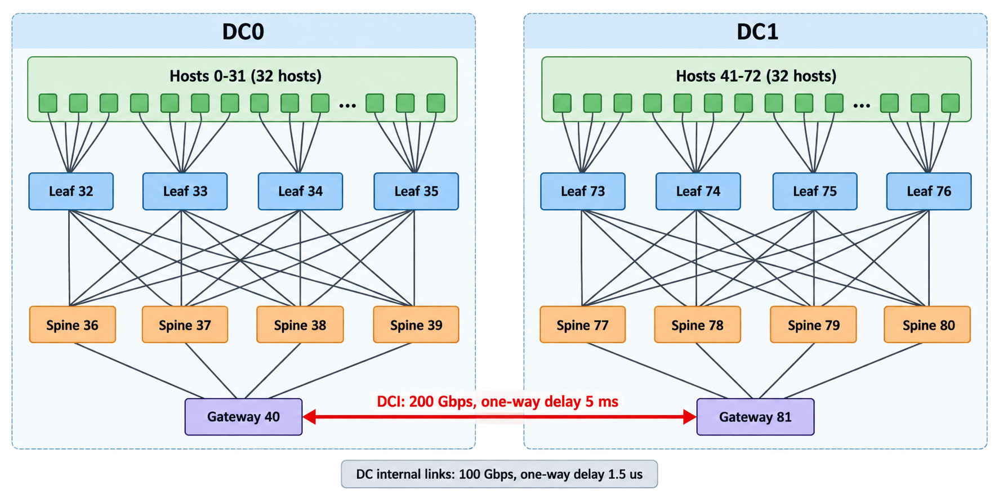

# LonghaulCC

## 1. 程序简介

本目录包含基于 ns-3.39 的跨数据中心 RDMA 长距离拥塞控制实验。主程序是
`longhaul-convergence.cc`，目前用于运行和比较以下算法：

- DCQCN：`dcqcn`
- HPCC：`hpcc`
- TIMELY：`timely`
- Bifrost：`bifrost`
- FRP：`frp`
- RoCC：`rocc`
- Proposed R3：`proposed`

RoCC 在 40/100 Gbps 链路上使用论文参数。论文未给出 200 Gbps 参数；当前实现按
带宽比例放大 `Qref/Qmid/Qmax`，并保留 100 Gbps 的 PI 基础增益，该策略会写入运行元数据。

程序读取拓扑、公共配置和流量场景文件，创建 Qbb/RDMA 网络，配置路由和流，
最后将吞吐率、FCT、DCI 链路等结果写入结果目录。

所有命令默认在 ns-3.39 根目录执行：

```bash
cd /home/smp/Code/ns3-datacenter-FRP/simulator/ns-3.39
```

### 本机路径适配

`run-longhaul.py` 根据脚本所在位置自动定位 ns-3 和项目根目录，项目移动后无需修改
脚本中的绝对路径。`run-longhaul-all.py` 逐个调用它，并为所有算法使用同一个结果根目录。

| 路径 | 解析规则及本机位置 |
|---|---|
| ns-3 根目录 | 自动定位为 `/home/smp/Code/ns3-datacenter-FRP/simulator/ns-3.39` |
| 默认配置 | 自动定位脚本同目录的 `config-longhaul.txt` |
| 配置中的 `TOPOLOGY_FILE` / `FLOW_FILE` | 相对 ns-3 根目录；当前 `examples/LonghaulCC/...` 无需修改 |
| 命令行 `--config` / `--flow-files` | 绝对路径直接使用；相对路径先查启动目录，再查 ns-3 根目录 |
| runner 默认结果目录 | 项目根目录下的 `results/longhaul-YYMMDD-HHMM/` |
| 命令行 `--output-root` | 自定义结果目录；相对路径以启动目录为基准 |
| 配置中的各项 `*_OUTPUT_FILE` / `SUMMARY_META_FILE` / `PROPOSED_OUTPUT` | runner 自动改写为本次运行目录下的绝对路径 |

也可从项目根目录启动，例如：

```bash
python3 simulator/ns-3.39/examples/LonghaulCC/run-longhaul.py --algorithm dcqcn \
  --flow-files examples/LonghaulCC/flow-longhaul-s0.txt --stop-times 0.03
```

直接使用 `./ns3 run` 时，配置中的相对输入和输出路径以 ns-3 根目录为基准，
输出目录需预先创建：`mkdir -p results/longhaul`。这里的结果位于
`simulator/ns-3.39/results/longhaul/`，与 runner 的项目级结果目录不同。

仓库 `run_scripts/` 中还有旧程序的绝对路径，但它们不参与 LonghaulCC 运行链。

## 2. 网络拓扑

拓扑文件为：

```text
examples/LonghaulCC/topology-longhaul.txt
```

当前拓扑每个数据中心有 32 个 host。



节点编号如下：

| 设备 | DC0 | DC1 |
|---|---:|---:|
| Host | 0--31 | 41--72 |
| Leaf | 32--35 | 73--76 |
| Spine | 36--39 | 77--80 |
| Gateway | 40 | 81 |

拓扑特征：

- 每个 DC 有 32 个 host、4 个 leaf、4 个 spine 和 1 个 gateway；
- 每个 leaf 连接 8 个 host；
- leaf 与 spine 采用全互联；
- 4 个 spine 均连接到本 DC 的 gateway；
- 两个 gateway 通过 DCI 互联，带宽为 200 Gbps，单向传播时延为 5 ms；
- DC 内链路带宽为 100 Gbps，单向传播时延为 1.5 us；
- 总规模为 82 个节点、64 个 host、18 个交换机和 105 条链路。

例如 `0 → Leaf32 → Spine36 → DCI40 → DCI81 → Spine77 → Leaf73 → 41` 是一条跨数据中心路径。

流量场景文件为 `flow-longhaul-s0.txt` 到 `flow-longhaul-s5.txt`。每行第 5 列是
以字节为单位的流大小；当前大流使用 3,000,000,000 B。流量文件中的 host 编号必须与拓扑文件中的编号一致。

## 3. 编译

首次下载后，先配置为 runner 使用的 optimized 构建，再编译主程序：

```bash
./ns3 configure --build-profile=optimized --enable-examples --disable-tests \
  --disable-python-bindings --disable-werror
./ns3 build longhaul-convergence -j2
```

需要 CMake 3.10 或以上、C/C++ 编译器及 Make 或 Ninja。LonghaulCC 是 C++ 程序，
无需开启 ns-3 Python bindings；Python runner 已兼容本机 Python 3.10 的文件哈希计算。
若提示 `CMake not found`，Ubuntu 可通过 `sudo apt install cmake` 安装后重试。

另有 `longhaul-r3-test` 确定性控制器回归目标。

## 4. 运行用途与场景

默认配置为 **S0、DCQCN、0.38 s 瞬态观察**。`run-longhaul-all.py` 默认依次运行
DCQCN、HPCC、TIMELY、Bifrost、Proposed，每种一次；这不是完整 FCT 验收或已标定的比较矩阵。
S2 后加入的七条 3 GB 流只剩 0.17 s，物理上不足以全部完成。

批量执行链：`run-longhaul-all.py` → `run-longhaul.py` → `longhaul-convergence.cc` →
路径注册/网关控制/公共测量 → `analyze-longhaul.py` → `plot-longhaul.py`。
单算法直接从 `run-longhaul.py` 开始。批量运行首次调用默认构建，后续调用自动使用
`--skip-build` 跳过编译并复用现有程序；显式指定 `--skip-build` 时，首次调用也跳过编译。
批量入口的其他实验参数转交单算法入口，完整说明见 `run-longhaul.py --help`。
不迁移到仓库 `run_scripts/run_single_*` 旧入口。

```bash
# 启动检查，结果不用于完整 FCT 比较；每次使用新目录。
python3 examples/LonghaulCC/run-longhaul.py --algorithm dcqcn \
  --flow-files examples/LonghaulCC/flow-longhaul-s0.txt \
  --purpose transient --stop-times 0.03 --output-root /tmp/longhaul-s0-smoke

# 完成实验：1.50 s 只是候选，runner 会检查完成数、FCT 唯一性及 RX payload。
python3 examples/LonghaulCC/run-longhaul-all.py --algorithms dcqcn proposed \
  --flow-files examples/LonghaulCC/flow-longhaul-s2.txt \
  --purpose completion --stop-times 1.50 --output-root /tmp/longhaul-s2-completion
```

`--purpose` 默认为 `transient`，记录固定停止规则；`completion` 必须显式指定
`--stop-times`，未全部完成时 runner 返回非零。进程 `status=ok` 与
`completion_valid` 是两个不同字段，瞬态实验允许未完成，但分析必须显示未完成数量。
算法间使用相同输入和停止时刻，不能按效果分别选择时长。

S0–S5 正式输入未改动。新增输入及预先定义的窗口见 `experiment-scenarios.json`：

| 输入 | 设置与目的 |
|---|---|
| `flow-longhaul-s2-scaled.txt` | 首流 750 MB，10 ms 启动；七条 150 MB 于 20 ms 加入；观察 20–60 ms |
| `flow-longhaul-s3-scaled.txt` | 七条 1 MB、一条 1 GB，同在 10 ms 启动；退出时间保守取七条全部完成与实际 TX 停止，之后检查至少一个保持窗口 |
| `flow-longhaul-s5-scaled.txt` | 八条 500 MB 背景，四条 5 MB 探测于 20/22/24/26 ms 加入；观察 20–75 ms |
| `flow-longhaul-r3-mechanism.txt` | `0→41`、`0→59` 各 750 MB；30 ms 加入 `42→41` 的 500 MB 本地竞争 |
| `flow-longhaul-r3-mechanism-control.txt` | 相同两条跨域流，不加本地竞争 |

缩小输入用于事件关系验收，不是按统一比例缩放的正式负载。
特别是 S3 的原 4.8:1 比例未用于此事件测试；保留七条先退出、一条仍供给的关系，
正式 `flow-longhaul-s3.txt` 仍为 625 MB/3 GB。首版候选及失败记录保存在验证目录，不能与修订输入混用。
默认保持判据仍为 ±10%、`max(3×base RTT,20 ms)`，跨域约 30.7 ms；不足窗口单列。

```bash
python3 examples/LonghaulCC/run-longhaul-all.py --algorithms dcqcn proposed \
  --flow-files examples/LonghaulCC/flow-longhaul-s2-scaled.txt \
               examples/LonghaulCC/flow-longhaul-s3-scaled.txt \
               examples/LonghaulCC/flow-longhaul-s5-scaled.txt \
  --purpose transient --stop-times 0.18 --output-root /tmp/longhaul-scaled

# 完整 R3，以及无本地竞争对照
python3 examples/LonghaulCC/run-longhaul.py --algorithm proposed \
  --flow-files examples/LonghaulCC/flow-longhaul-r3-mechanism-control.txt \
               examples/LonghaulCC/flow-longhaul-r3-mechanism.txt \
  --r3-queue-mode history --stop-times 0.18 --output-root /tmp/r3-history

# 只替换为旧快照队列；B 反应、预算、整形、失效条件完全相同
python3 examples/LonghaulCC/run-longhaul.py --algorithm proposed \
  --flow-files examples/LonghaulCC/flow-longhaul-r3-mechanism.txt \
  --r3-queue-mode snapshot --stop-times 0.18 --output-root /tmp/r3-snapshot
```

已按实际 ECMP 验证机制路径共同经过 `81→79`，随后分别到 Leaf73/Leaf75；
本地流只与 `0→41` 共享 `73→41`。仍可能通过共享源端、上游队列或 PFC 相互影响。
不能把 B 看到的 CNP 自动归因于 B 内部。

runner 默认构建；`--skip-build` 仅跳过编译并使用现有程序，修改 C++ 代码后需重新构建。
每次运行保留有效 `config.txt`、输入文件路径及哈希、命令、用途和窗口；不覆盖历史结果。
生成的配置直接引用原始流量和拓扑文件，不复制输入，也不记录 Git 信息或检查源码/构建产物哈希。
输出仍为 `results/longhaul-YYMMDD-HHMM/<scenario>/<algorithm>/seedconfig-runN/`。
相同 seed/run 的重复不自动等于独立样本；本轮不进行大规模扫描或全面性能矩阵。

C++ CLI 保持 `--conf`、`--cc`、`--flow-file`、`--stop-time`、`--seed`、`--run`。
旧快照开关为配置项 `PROPOSED_RECONSTRUCT 0`，默认 `1`，runner 的模式参数写入有效配置。
另有实验候选 `PROPOSED_SHAPER_ECN 0`：只省略已注册 A/B 整形队列的新增 ECN，
保留已有标记、普通交换机 ECN、近源 CNP、STATE 和 PFC。默认 `1` 保留原标记行为。
该候选在两个机制场景 seed 改善跨域 FCT，但历史重建未显示稳定增量收益，
且 seed 1 仍慢于 DCQCN；配置、对照和负结果见 [R3 实测改进记录](R3_EVALUATION_20260929.md)。

## 5. 公共测量与分析

```bash
python3 examples/LonghaulCC/analyze-longhaul.py --root /tmp/longhaul-scaled
python3 examples/LonghaulCC/plot-longhaul.py --root /tmp/longhaul-scaled --all-scenarios
```

所有算法新增相同的公共记录，由 `longhaul-measurements.h` 实现：

- `metadata.json` 的 `flow_path_metrics` 包含实际有向 data/ACK 路径及容量，包括本地流。
- `metadata.json.flow-state.csv`：实际发送序号高水位、TX payload、唯一 RX payload、首次供给结束及完成时刻。
  TX 包含重传；供给结束取真实发送事件，不能用 ACK 尚未返回代替持续需求。
- `metadata.json.queues.csv`：路径端口/PG 的队列与暂停采样；WAN、B 向内及其他端口有独立坐标。
- `metadata.json.summary.json`：所有算法的预期/完成流数、逐流最终字节、全网准入丢弃及停止残留。
  `remaining_mmu_bytes`、`remaining_mmu_egress_bytes` 额外检查 MMU 总量与出口记账是否清空。
  R3 另保留 `r3.summary.json` 同口径副本。
- `buffer_resources`：每交换机共享池、逐端口每 PG headroom 及合计池大小。

分析输出：

| 文件 | 口径 |
|---|---|
| `flow-summary.csv` | 每条流均保留，含未完成、重复 FCT、RX 残留及重传 payload |
| `summary.csv` | 持续供给集合变化后的逐流阶段，参考目标、收敛/未收敛/不足窗口/不足样本 |
| `run-summary.csv` | 未完成数量、资源门槛、可评估阶段数、未收敛比例；收敛中位数仅为已收敛子集 |
| `direction-summary.csv` | A→B/B→A 分开，整段及预先定义窗口；队列最大值明确为采样最大值 |
| 每运行的 `queue-window-summary.csv` | 按节点/端口/PG 分开，不合并 WAN、网关内向与其他队列 |
| `scenario-validation.json` | 加入/退出/背景重叠与机制路径关系，失败明确保留 |
| `r3-evidence.csv` | 按组去重预测值、A 组积压、最终/端口分配前限额、暂停及实际发送；按 `t+df` 对齐未来 B 队列 |

公平参考采用有向链路约束下等权 max-min **payload** 速率，计入数据头和反向 ACK 的
平均 wire 消耗；不包含重传、PFC/CNP/STATE 开销或窗口限制，不声称协议必然达到该参考。
缺少路径时标记 `unavailable_reference`，不退回同向均分。
供给结束后不再把该流作为持续需求流；此前已进入网络的在途/积压属于排空阶段。
旧数据缺少公共最终计数时，不自动认证其完成或持续供给状态。

预测误差只在有效快照下评估。未来 B 取首个不早于模型终点的样本，并保留实际采样时刻，
因此误差包含采样偏差；不能拿 A 在 t 的预测直接与 B 在 t 的队列比较。
对比模式必须检查 A 当时有积压、实际出队确有变化及其他限制；无收益或效果变差也应保留。

## 6. 验收边界

构建与小型确定性校验：

```bash
./ns3 build longhaul-convergence longhaul-r3-test -j2
./ns3 run longhaul-r3-test --no-build
python3 examples/LonghaulCC/test-longhaul-analysis.py
```

`BUFFER_SIZE 50` 不是全系统总缓存：共享 50 MiB 之外还加入逐端口、逐 PG headroom。
当前 headroom 保留 `3×传播时延` 裕量并加入两端实际接收处理延迟；默认 WAN 每 PG
375,750,000 B、100 Gb/s 内部端口每 PG 431,250 B。总池和无损出口池均包含 headroom，
共享 ingress 池仍为 50 MiB。普通 PFC 在 MMU 要求暂停期间每半个暂停周期续发，
显式恢复时停止；Bifrost 专属端口/PG 沿用自身周期逻辑。
这些修改来自实测丢弃定位，不构成普遍无损保证。历史资源设置和逐轮失败/对照记录见
[R3 实测改进记录](R3_EVALUATION_20260929.md)，其他负载和 baseline 须在新资源条件下重新验收。

1.50 s 等停止时间只作候选，必须依完成与残留检查；不能只排名完成子集。
HPCC/TIMELY/Bifrost 还需各自在对应拥塞负载下验收，TIMELY 阈值不视作已标定。
功能通过、场景关系成立、计算触发、实际执行差异和性能收益是不同层次的证据。
本轮实测记录见 [场景修改验证记录](EXPERIMENT_VALIDATION.md)。

## Proposed R3（2026-09-29）

`--cc=proposed` 运行 R3，RNIC 保留 DCQCN。两个 DCI 创建为 `DciGatewayNode`，
普通 Leaf/Spine 仍为 `SwitchNode`。网关复用交换机转发、ECN、MMU 和 PFC；
专属逐流状态、CNP 反应、预算分配、消息与预测放在 `dci-gateway-node.{h,cc}`。
`longhaul-r3.h` 只负责路径验证、连接注册、配置及实验输出接线。

B 按实际向内出口和 PG 分组，合并同一反应窗口内的逐流 CNP，以有界加性方式恢复，
对同一物理端口的各组联合分配预算。B 反馈自己的跨域队列及逐流预算。
A 用 WAN 出口实际出队字节分箱重建远端积压，仅在 A 执行排空扣减，并分配逐流限额。
两端均使用共享有限缓存内的逐流逻辑队列；限速流不会阻塞其他可发送流，物理 PG 暂停仍有效。

当前 RNIC 主要通过 ACK/NACK 的 CNP 标志反馈；网关同时识别该标志和独立 CNP，
原报文继续转发。未隔离上游 ECN，因此这些事件属于**路径拥塞反馈**，不代表精确定位 B 内部瓶颈。
快照和需求消息经过真实路由，超过 24 条流记录时分片，接收端校验序号和注册代次后完整应用。

默认 runner 将 R3 输出前缀隔离为每次运行目录下的 `r3`：

- `r3.gateway-<node>.csv`：逐流队列、预算、实际字节、预测值、反馈及拒绝计数。
- `r3.gateway-<node>.events.csv`：快照、反应、恢复、水位和近源 CNP 事件。
- `r3.gateway-<node>.packets.csv`：两端实际发送记录，仅用于离线核验。
- `r3.paths.csv`：流、组和真实数据路径。
- `r3.summary.json`：完成数、全网 admission drops、停止时交换机剩余队列。

`metadata.json` 中 `proposed_parameters.version=3`，记录参数、网关角色及分组。
直接运行 C++ 而未指定 `PROPOSED_OUTPUT` 时，前缀为 `metadata.json.control.csv`。
原有 FCT、goodput、RTT、发送率和 PFC 输出继续保留，CLI 仍只有原六项。

R2 控制器及 `PROPOSED_PREDICTOR`、`PROPOSED_WAN_FRACTION`、`PROPOSED_EPSILON`
已删除，旧配置键会报错。历史研究文档及历史实验结果不改写为 R3 结果。
实现边界、参数单位与验证命令见 [R3 实现说明](PROPOSED_R3_IMPLEMENTATION.md)。
