# Long-haul baseline 使用手册

本文档对应精简后的 `longhaul-convergence` 版本。它是一套独立的 ns-3
长距 RDMA 基线实验，不修改 `crossDC-evaluation.cc` 的实验流程。

## 1. 实验范围

程序只比较三种拥塞控制：

| 算法 | `CC_MODE` |
| --- | ---: |
| DCQCN | 1 |
| HPCC | 3 |
| TIMELY | 7 |

所有算法共用同一拓扑、流文件、包大小、PFC/ECN、buffer、采样周期和
`RngSeed/RngRun`。longhaul 基线不启用 FRP、Bifrost、PowerTCP 或 PINT
分支；HPCC 使用 INT，TIMELY 使用 RTT 时间戳，这是算法本身的反馈机制。

## 2. 精简内容

这版代码保留“仿真必须具备”的部分，移除了旧程序中与本实验无关的内容：

| 原来的复杂点 | 现在的处理 |
| --- | --- |
| 旧队列分布监控、ToR Power 打印 | 删除；队列统一由 `dci-link.csv` 采样 |
| 链路故障注入和动态重路由 | 删除；本阶段拓扑是固定基线 |
| PINT、trace 文件和 PowerTCP/FRP 分支 | 删除；只保留 DCQCN/HPCC/TIMELY |
| 先临时分配 IP、再 BFS 划分 DC、最后回填 | 节点创建后一次性按 node ID 分配唯一地址 |
| 逐条读取并递归调度流文件 | 一次性读入流清单，再按 `start_time` 调度 |
| 配置项静默忽略 | 只接受 longhaul 支持的配置键，未知键直接失败 |
| 用 stdout 解析指标 | stdout 只做诊断，指标全部写结构化文件 |

仿真启动时会打开 longhaul 的静默开关，屏蔽底层模型历史性的逐 ACK/逐速率
`printf`；这不会关闭 CSV 采样，也不会影响其他实验，因为默认开关仍为关闭。

IP 地址只用于 RDMA 节点寻址和路由，DC 归属仍由拓扑校验器验证，程序不再
通过 IP 地址推断数据中心。

## 3. 架构图

```mermaid
flowchart LR
    T[topology-longhaul-2dc-64h.txt] --> V[拓扑校验器]
    F[flow-longhaul-s0..s5.txt] --> R[run-longhaul-baseline.py]
    C[config-longhaul-common.txt] --> R
    T --> R
    V --> R

    R --> D[每次运行独立目录<br/>scenario/algorithm/seed-run]
    D --> S[longhaul-convergence<br/>ns-3 仿真入口]

    subgraph SIM[仿真内部]
        P[严格配置解析 + CLI 覆盖]
        N[创建 170 节点和 233 条链路]
        I[节点地址 + 静态 RDMA 路由]
        Q[RdmaHw + CC_MODE<br/>DCQCN / HPCC / TIMELY]
        W[按开始时间创建 RDMA 流]
        M[采样器<br/>实际发送速率 / 接收 goodput / DCI / PFC / ECN]
        P --> N --> I --> Q --> W --> M
    end
    S --> P
    M --> O[sender-rate.csv<br/>receiver-goodput.csv<br/>dci-link.csv<br/>fct.csv<br/>pfc.csv<br/>metadata.json]
    O --> A[analyze-longhaul.py<br/>收敛 / 公平 / 队列 / FCT 汇总]
    A --> U[summary.csv<br/>run-summary.csv]
    U --> G[plot-longhaul.py<br/>六类 PNG 图]
```



可单独查看图源：[longhaul-architecture.mmd](longhaul-architecture.mmd)。

## 4. 快速开始

以下命令从 `simulator/ns-3.39` 目录执行：

```bash
./ns3 build longhaul-convergence -j2
python3 examples/PowerTCP/validate_longhaul_topology.py
python3 examples/PowerTCP/run-longhaul-baseline.py
python3 examples/PowerTCP/analyze-longhaul.py
python3 examples/PowerTCP/plot-longhaul.py
```

默认只运行 S0、S2，每种算法 1 个 `RngRun`，用于 smoke test。完整矩阵为
S0--S5 × 3 种算法 × 5 个 run：

```bash
python3 examples/PowerTCP/run-longhaul-baseline.py --full
python3 examples/PowerTCP/analyze-longhaul.py
python3 examples/PowerTCP/plot-longhaul.py --all-scenarios
```

只跑指定组合：

```bash
python3 examples/PowerTCP/run-longhaul-baseline.py \
  --scenarios s0 s2 \
  --algorithms dcqcn hpcc timely \
  --runs 1 \
  --output-root /tmp/longhaul
```

`--stop-time 0.03` 仅适合检查启动、文件输出和崩溃，不适合做收敛结论：

```bash
python3 examples/PowerTCP/run-longhaul-baseline.py \
  --scenarios s0 --algorithms dcqcn hpcc timely \
  --stop-time 0.03 --skip-build --output-root /tmp/longhaul-smoke
```

runner 会自动完成拓扑校验、编译（除非 `--skip-build`）、创建输出目录、保存
配置快照和记录 git commit。仿真失败或超时会使 runner 最终返回非零状态。

## 5. 输入文件

### 5.1 拓扑

`topology-longhaul-2dc-64h.txt` 的固定口径为：

- 170 个节点，其中 42 个交换机、128 个 host；
- 16 个 ToR，每个 ToR 连接 8 个 host；
- 233 条链路；
- DCI 为 `52 <-> 105`，200 Gbps，单向 channel delay 为 5 ms；
- 两侧各 64 个 host，跨 DC RTT 约 10 ms 加内部链路传播/传输延迟。

修改拓扑后必须先运行校验器。校验器检查节点数量、交换机列表、host 度数、
ToR 挂载数量、连通性、唯一 DCI 和跨 DC 路径约束。

### 5.2 流文件

每个流文件第一行是流数，之后每行是：

```text
src dst pg dport size_bytes start_time_seconds
```

固定场景如下：

| 场景 | 内容 | 主要观察点 |
| --- | --- | --- |
| S0 | 1 条 DC0→DC1 长流 | 无竞争爬升和路径瓶颈 |
| S1 | 8 条同向长流同步启动 | 初始收敛和公平性 |
| S2 | 1 条先启动，20 RTT 后加入 7 条 | 降速与新公平点收敛 |
| S3 | 8 条启动，7 条有限流退出 | 带宽再获取 |
| S4 | 两个方向各 8 条长流 | 双向反馈和对称性 |
| S5 | 长流上叠加有限大小 probe 流 | FCT 与长流稳定性 |

### 5.3 公共配置

`config-longhaul-common.txt` 是唯一公共模板。runner 每次只覆盖拓扑、流
文件、算法、停止时间、seed/run 和输出路径，因此算法之间的公共配置保持一致。

常用配置分为四组：

1. 仿真：`TOPOLOGY_FILE`、`FLOW_FILE`、`SIMULATOR_STOP_TIME`、
   `PACKET_PAYLOAD_SIZE`、`NIC_DELAY`、`BUFFER_SIZE`；
2. 拥塞控制：`CC_MODE`、`EWMA_GAIN`、`U_TARGET`、`MI_THRESH`、
   `TIMELY_*`、`RATE_*`；
3. 窗口和反馈：`HAS_WIN`、`GLOBAL_T`、`VAR_WIN`、`FAST_REACT`、
   `INT_MULTI`、`ENABLE_QCN`、`ACK_HIGH_PRIO`；
4. 观测与复现：`RNG_SEED`、`RNG_RUN`、采样间隔、五个输出文件路径以及
   `DCI_LEFT/DCI_RIGHT`。

配置格式是空白分隔的 `KEY VALUE`。本程序对未知 key 直接报错；不要把旧实验
中的 `TRACE_*`、`QLEN_*`、`LINK_DOWN`、`PINT_*` 或 PowerTCP 选项复制进来。

## 6. 输出目录和字段

一次运行的目录结构为：

```text
results/longhaul/
└── s0/dcqcn/seed1-run1/
    ├── config.snapshot.txt
    ├── runner-metadata.json
    ├── metadata.json
    ├── stdout.log
    ├── sender-rate.csv
    ├── receiver-goodput.csv
    ├── dci-link.csv
    ├── fct.csv
    └── pfc.csv
```

- `sender-rate.csv`：由 `snd_nxt` 增量计算的实际发送 payload rate；
- `receiver-goodput.csv`：由 `m_recv_bytes` 增量计算的接收 goodput；
- `dci-link.csv`：两个方向的 tx/rx、队列字节、累计 ECN 和 PFC 事件；
- `fct.csv`：完成流的 FCT 与无竞争理论 FCT；短时 smoke 中长流没有完成是正常的；
- `pfc.csv`：逐事件 PFC 记录；
- `metadata.json`：算法、拓扑规模、DCI、NIC、RTT、采样周期和算法参数；
- `config.snapshot.txt`：该 run 的有效配置，`runner-metadata.json` 还记录 hash、
  git commit、命令和 wall-clock 时间。

## 7. 分析口径

`analyze-longhaul.py` 使用固定场景清单计算每条流的阶段指标，不从结果反推
阶段。目标速率为：

```text
R_target = min(DCI_rate / 活跃流数, host_NIC_rate)
```

收敛判定是首次进入目标 ±5%、±10% 或 ±20%，并连续保持
`max(3 × base_RTT, 20 ms)`。输出中 `not_converged` 表示阶段结束前没有满足
判据，不能把阶段结束时间当作收敛时间。

分析结果：

- `summary.csv`：每个 run、每条流、每个阶段一行；
- `run-summary.csv`：每个 run 一行，包含 DCI 利用率、队列、ECN/PFC、FCT、Jain
  fairness 和 wall-clock 指标。

绘图脚本生成六类图：发送速率、接收 goodput、收敛时间、DCI 链路/队列、公平性、
汇总指标。绘图只读取 CSV 和 `summary.csv`，不解析 stdout。

## 8. 常见问题

### 找不到拓扑文件

推荐从 `simulator/ns-3.39` 根目录运行命令。校验器的默认拓扑路径已经改为
相对脚本目录解析；也可以显式传入拓扑路径。

### `unknown config key`

说明配置中混入了旧实验选项或 key 拼写错误。删除该行，或只使用本手册第 5.3
节列出的选项。

### CSV 只有表头

这通常表示仿真停止时间太短，或者流尚未开始/完成。先检查 `metadata.json`、
`stdout.log` 和 `runner-metadata.json`；长流在 30 ms smoke 中没有 FCT 是预期行为。

### 收敛时间是 `not_converged`

这不是脚本补值，而是说明该阶段剩余时间不足以满足保持窗口，或速率确实没有在
指定容差内稳定。请使用正式场景停止时间，不要用 `--stop-time` smoke 参数做结论。

## 9. 验收命令

```bash
python3 -m py_compile \
  examples/PowerTCP/validate_longhaul_topology.py \
  examples/PowerTCP/run-longhaul-baseline.py \
  examples/PowerTCP/analyze-longhaul.py \
  examples/PowerTCP/plot-longhaul.py

./ns3 build longhaul-convergence -j2
python3 examples/PowerTCP/validate_longhaul_topology.py
```

完成代码修改后，至少用 S0 对三种算法各跑一次短 smoke，再进行完整矩阵。
